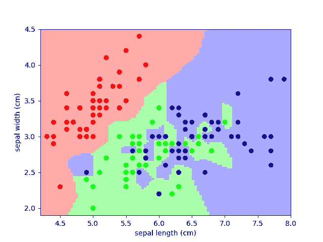
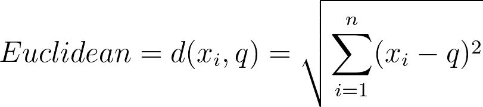
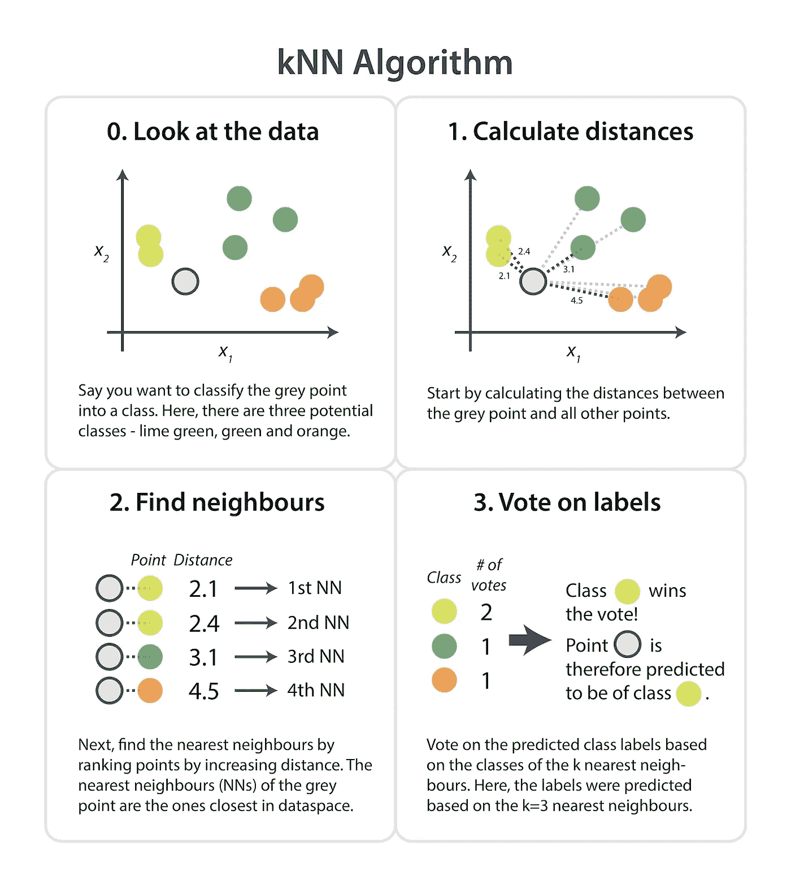
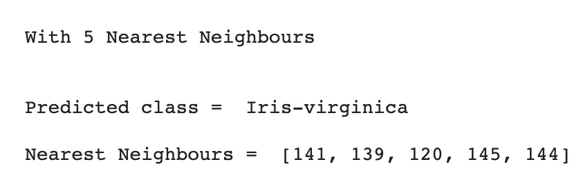
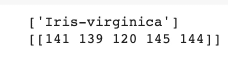
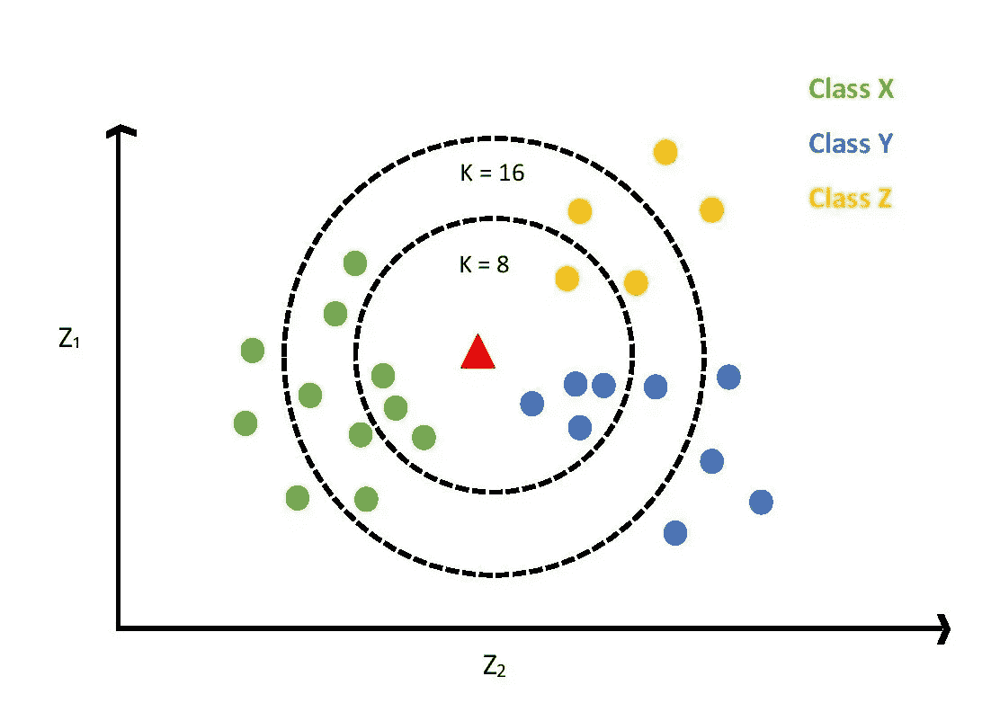

# 机器学习基础:K 近邻 Python 实现

> 原文：<https://medium.com/mlearning-ai/machine-learning-basics-k-nearest-neighbours-python-implementation-b2f836d5ee96?source=collection_archive---------2----------------------->

k-最近邻(KNN)算法是一种简单、易于实现但功能强大的监督机器学习算法，可用于解决分类问题，并可扩展到回归问题。

## KNN 是如何在幕后工作的？

k-最近邻(KNN)算法使用“特征相似性”来预测新数据点的值，这意味着新数据点将根据其与训练集中的点的匹配程度来分配值。

KNN 算法假设相似的事物存在于附近。换句话说，相似的事物彼此靠近。

Source: [https://scipy-lectures.org/packages/scikit-learn/auto_examples/plot_iris_knn.html](https://scipy-lectures.org/packages/scikit-learn/auto_examples/plot_iris_knn.html)

注意在上面的图中，大多数相似的数据点是如何彼此接近的。KNN 算法基于这样一个假设，即该假设足够真实，使得该算法在进行预测时非常有用。

**让我们从 KNN 的实施开始，只需 3 个步骤:**

1.  计算查询数据点`q`与每个训练数据点 xᵢ.之间的距离`d`欧几里得距离是 KNN 最常用的距离度量(也是 scikit learn library 提供的默认距离)，但 Manhattan、Minkowski 或 Hamming 距离也同样适用。

2.将距离按升序排列成一个数组，并从该数组中选择`K`最近的距离(第一个`K`条目)。这些将是与您给定的查询数据点`q`最近的`K`邻居。

3.获取所选 k 个邻域的分类标签(yᵢ值)。最常见的标签(多数投票的标签)将是我们的查询数据点`q`的预测标签。

*即预测的类标签无非是* `*k*` *条目的模式。(额外提示——如果您正在为回归问题实现 KNN，相同的* `*k*` *条目的中值将是您的类标签)*

对测试集中的所有测试数据点重复上面的一切。

Source: [Cambridge Coding](https://cambridgecoding.wordpress.com/2016/01/16/machine-learning-under-the-hood-writing-your-own-k-nearest-neighbour-algorithm/)

## 不使用 scikit 的 Python 实现-学习:

我将使用可靠的虹膜数据集和谷歌 colab。虹膜数据集可以从[这里](https://archive.ics.uci.edu/ml/machine-learning-databases/iris/)下载。

当 k=5 时，上述代码的结果如下:

让我们将这段代码与 sklearn 实现进行比较:

当 k=5 时，使用 sklearn 的结果将完全相同。在这两种情况下，预测值为 Iris-virginica，相邻值为[141，139，120，145，144]。

## 如何找到最优的`K`值？

在实现 KNN 算法时要记住的最重要的事情之一是如何选择`k`值&不同的`k`值如何影响模型的性能。

Source: [https://morioh.com/p/39a8acaae3ce](https://morioh.com/p/39a8acaae3ce)

在上图中，当`k=16`预测的班级标签是`X`，同时当`k=8`预测的班级标签是`Y`。因此，我们现在可以得出结论，`k`值对模型性能有显著影响。

> k 值小意味着噪声对结果的影响更大，而 k 值大则计算量大。

数据科学家通常选择:

1.  二进制分类问题中的奇数。

2.另一种选择`k`的简单方法是设置`k=sqrt(n)`。其中 n =训练数据中数据点的数量。

这里有一篇由[叶达鑫乐队](https://medium.com/u/1d1372f34524?source=post_page-----b2f836d5ee96--------------------------------)撰写的关于如何选择最佳 k 值的精彩文章，如果你想深潜的话:

 [## 如何找到 KNN K 的最优值？

### 可视化误差率与 K 的关系图，找出最合适的 K 值。

towardsdatascience.com](https://towardsdatascience.com/how-to-find-the-optimal-value-of-k-in-knn-35d936e554eb) 

今天到此为止。我将在我的下一篇文章中看到你。

你可以在我的 GitHub [这里](https://github.com/sindhuseelam/knn-implementation)找到本教程的代码和数据。

参考资料:

[1][https://towards data science . com/how-to-find-the-optimal-value-of-k-in-KNN-35d 936 e 554 EB](https://towardsdatascience.com/how-to-find-the-optimal-value-of-k-in-knn-35d936e554eb)

[2][https://www . analyticsvidhya . com/blog/2018/03/introduction-k-neighbors-algorithm-clustering/](https://www.analyticsvidhya.com/blog/2018/03/introduction-k-neighbours-algorithm-clustering/)

我学习并写下我在机器学习、统计和深度学习方面的学习。跟随我进入人工智能世界 [Twitter](https://twitter.com/SindhuSeelam_) ， [LinkedIn](https://www.linkedin.com/in/sindhuseelam/) ， [Medium](https://sindhuseelam.medium.com/) 。