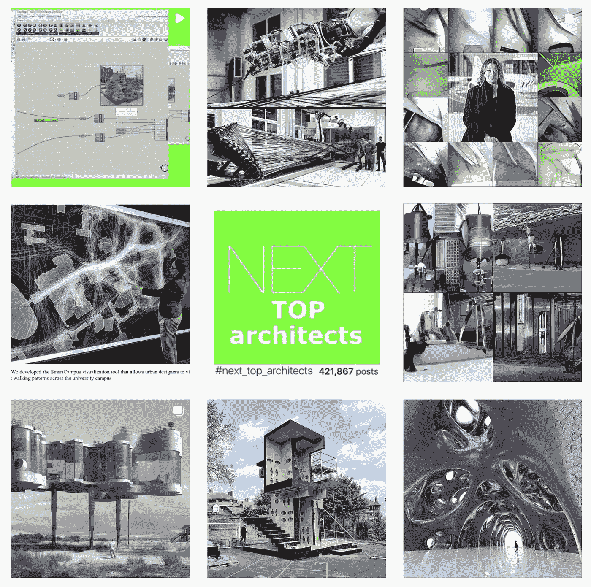

# 机器学习改变了架构

> 原文：<https://medium.com/mlearning-ai/machine-learning-change-the-architecture-ee37e12287f0?source=collection_archive---------4----------------------->

## 架构& [机器学习](/mlearning-ai/what-is-machine-learning-2ec9cacb986c)

## #next_top_architects 的 12 个人工智能解决方案

[instagram.com/next_top_architects](https://www.instagram.com/next_top_architects/)

对建筑的需求比以往任何时候都更大。预计未来 15 年城市人口将增长 70%,这将需要大量新建筑。尽管欧盟预计这种需求将会出现，但建筑商仍然…