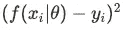
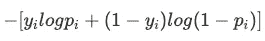
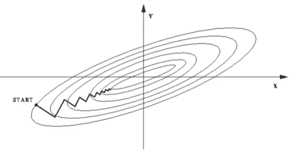
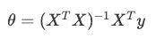
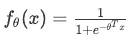
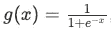
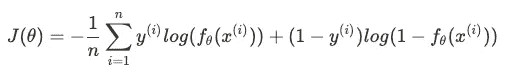

# 数据科学家面试的机器学习备忘单:线性回归常见问题第 1 部分

> 原文：<https://medium.com/mlearning-ai/machine-learning-cheat-sheet-for-data-scientist-interview-linear-regression-frequently-asked-998d99920993?source=collection_archive---------4----------------------->

> 这里总结了在数据科学家面试中经常被问到的 ML 问题。我已经尽可能保持备忘单的简洁。所有的内容都是必须记住的关键知识。希望可以作为你 DS 面试前的准备指南！

# **损失函数**

定义:衡量预测结果和实际结果之间的差距。

**常见的损失函数类型**

线性回归:平方损失(误差平方和)

sum of squared errors’s formula

分类(如逻辑回归、决策树):对数损失/交叉熵损失

cross-entropy loss’s formula

软边缘 SVM:铰链损失

hinge loss’s formula

# 梯度下降

*   优化目标函数(最小化损失函数)。
*   寻找局部最优，只有当目标函数是凸的时才能找到全局最优。

步骤:

1.从初步猜测开始。

2.每次使用梯度的负方向(偏导数)减少一点目标函数。

3.停止直到收敛到局部最优。

**学习速率**:控制我们在梯度下降中的步长。

*   如果学习率太小:收敛慢
*   如果学习率太大:超过最优值，无法收敛
*   选择自适应学习速率:在接近局部最小值时采取较小的步长
*   **同时**更新所有参数

注意:线性回归的成本函数总是一个**凸函数**——总是有一个最小值。

**梯度下降、随机梯度下降和小批量梯度下降**

梯度下降:在一次迭代中使用所有数据点，并计算其梯度以更新参数。

*   特别适用于凸函数

随机梯度下降:在一次迭代中使用一个随机数据点

*   收敛更快
*   降低陷入局部最优的可能性

小批量 GD:在一次迭代中使用小批量的数据点

*   比 SGD 更有效，因为我们可以使用矢量化实现

**梯度下降的特征缩放**

*   特征缩放加速了梯度下降法的收敛。
*   几何解释:梯度下降方向垂直于等高线。当我们在梯度下降之前不实施特征缩放时，轮廓线的形状是椭圆形的。它不一定指向最优，因此导致收敛较慢。

# 正规方程

线性回归的封闭形式解(矩阵形式)

# 梯度下降与正常方程

*   当样本大小 n 非常大时，梯度下降效果很好。
*   正规方程需要计算(XᵀX)⁻，时间复杂度为 O(n))。当矩阵不可逆时会出现一个问题。如果不可逆→没有唯一解，用梯度下降代替。
*   不可逆性的原因:共线性。要素的数量大于数据点的数量(改用正则化)

# 逻辑回归

广义线性模型。目标变量是一个二元变量。

f(x) is the estimated probability of y=1 given x

**s 形函数**

The function crosses 0.5 at the origin and then flattens out, between 0 and 1

**系数解释**

当某个变量增加一个单位，而其他变量保持不变时，出现结果的概率对数的预期变化。

**损失函数**

如果我们使用传统的平方损失，由于增加了 sigmoid 函数，它是非凸函数。因此我们可能找不到全局最优解。

二元逻辑回归的损失函数(凸函数)

*   它可以使用最大似然估计(MLE)来导出。
*   没有封闭形式的解。我们需要使用梯度下降法来寻找最优解。
*   梯度下降中的高级优化:BFGS 算法，通常比传统的梯度下降更快。

**多类分类问题**

使用一个对所有分类，建立多个二元分类模型。

 [## Mlearning.ai 提交建议

### 如何成为 Mlearning.ai 上的作家

medium.com](/mlearning-ai/mlearning-ai-submission-suggestions-b51e2b130bfb)