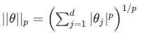
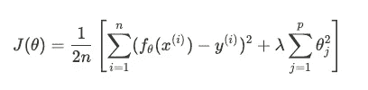
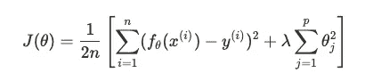
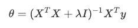
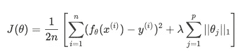
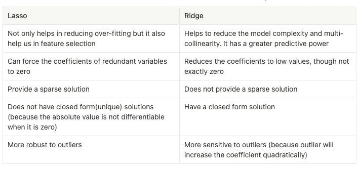
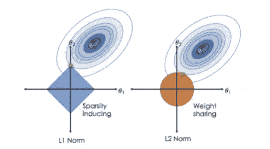

# 数据科学家面试的机器学习备忘单:规范化常见问题

> 原文：<https://medium.com/mlearning-ai/machine-learning-cheat-sheet-for-data-scientist-interview-regularization-frequently-asked-e6007e89ae58?source=collection_archive---------2----------------------->

> 这里总结了在数据科学家面试中经常被问到的 ML 问题。我已经尽可能保持备忘单的简洁。所有的内容都是必须记住的关键知识，并且不断更新。希望可以作为你 DS 面试前的准备指南！

# 基本解释

向损失函数添加正则项。它缩小了每个参数，有助于解决过拟合问题。

# p-范数定义

当 p = 1 时:套索回归；当 p = 2 时:岭回归

# 正则化成本函数

注:等价于在∑θ ⱼ

# How does regularization shrink the parameter?

When updating θ using gradient descent, we can derive that the shrinkage term is less than 1, which means it shrinks the parameter a little bit for every update.

# Choosing λ

λ is the regularization parameter. It controls the trade-off between model complexity and model fitting.

*   If λ is too small: there is almost no regularization. It doesn’t shrink the parameter too much → prone to be overfitting
*   If λ is too large: it will shrink the parameters too much, all the parameters will be close to zero → prone to be underfitting
*   Usually we use cross-validation to choose the best λ.

# Ridge regression (L2 norm)

**损失函数**的条件下最小化代价函数

它通过变量权重的平方和来惩罚参数。注意:它不惩罚θ₀的偏见术语

**岭回归的正规方程**

增加一个λI 项，帮助解决矩阵的可逆性。

# **拉索回归(L1 范数)**

**损失函数**

它通过变量权重的绝对值之和来惩罚参数。

# Lasso 和岭回归的比较

**为什么 Lasso 能把系数缩小到正好为零？**

我们可以用几何解释来解释它:

*   不同的正则项导致不同的约束区域形状。考虑具有两个变量的模型，那么对于约束区域，套索具有菱形形状，而脊具有圆形形状。
*   等高线代表具有不同θⱼ.值的损失函数值
*   当损失函数的轮廓线与约束边界相切时，找到最优点。
*   对于套索回归，最优点很可能在拐角上，这意味着一些参数将为 0。
*   对于岭回归，最优点可以位于约束边界的任何地方，因此最优点不可能包含 0 值。

# 弹性网

套索和山脊的混合，包括 L1 和 L2 正则化的加权组合。

 [## Mlearning.ai 提交建议

### 如何成为 Mlearning.ai 上的作家

medium.com](/mlearning-ai/mlearning-ai-submission-suggestions-b51e2b130bfb) 

[**成为作家**](/mlearning-ai/mlearning-ai-submission-suggestions-b51e2b130bfb)