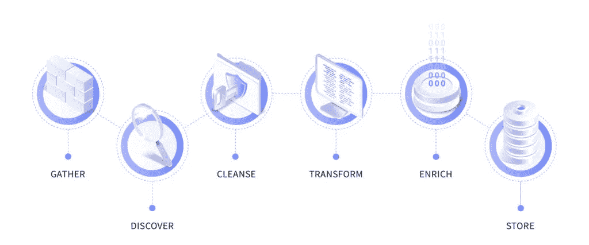
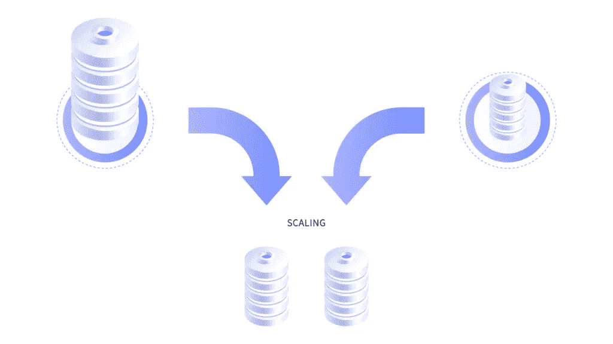

# 机器学习数据准备:如何规划正确的策略— NIX United

> 原文：<https://medium.com/mlearning-ai/machine-learning-data-preparation-how-to-plan-the-right-strategy-nix-united-879a0e74bd1?source=collection_archive---------4----------------------->

每个机器学习项目在其选择的数据集、任务、算法和目标方面都是独特的。除非数据科学家正在练习他们的技能并应用标准数据集，否则他们将不得不经历一个所谓的应用机器学习过程。这从定义一个问题开始，该问题涉及预测任务的框架，如回归或分类，以及探索可用的数据。第二步是数据准备或数据预处理，这是本文的重点，需要将原始数据转换成建模中使用的数据集。该过程以评估和最终确定模型结束。在本文中，我们将探索机器学习的数据准备，及其主要挑战和技术。

数据科学家或其他人工智能工程师为了转换数据而承担的最常见任务包括数据清理，分析师通过数据清理识别数据中的错误并消除它们，以及特征选择以检测与项目最相关的变量。变量和需求取决于项目的目标和细节。数据科学家调整变量的比例和分布以适应模型，并从他们可用的数据中探索其他变量。最后，他们根据数据创建预测，并进入下一步评估和最终确定模型。

为机器学习准备数据更像是一种艺术，而不是一步一步的具体活动，并且密切依赖于数据、项目、需求等。在某些情况下，变量只需要从字符串转换成数字，而在其他项目中，数据科学家的任务是缩放数据。换句话说，主要目标是找出最合适的方式向学习算法揭示问题的结构，以便它们可以做出有意义的预测并获得洞察力。

由于我们不知道问题的结构，并且正在建立模型来识别它，所以发现未知的过程显然是困难的。这个过程变成了一个发现、尝试和犯错的旅程，并通过实践来学习，而不是一个简单的行动计划。数据科学家研究变量，以找到改进模型的方法，并确定最佳预测值表示来微调算法。

总体而言，机器学习的数据准备可能看起来势不可挡，令人沮丧，因为它需要针对不同变量的不同方法。考虑到大量的方法和技术，数据科学家年复一年地打造他们的技能。

# 为什么数据准备很重要？

如果没有数据预处理，您一定会得到不准确和误导性的输出，这可能会导致错误的决策。尽管机器学习数据准备可能很复杂，但它是构建产生有价值结果的有意义算法的关键一步。使用无效或不完整的数据集可能会危及整个项目，并产生错误的结果。

# 机器学习数据准备过程的挑战与解决方案

如上所述，机器学习数据准备活动是复杂的，并且需要高水平的专业知识。在启动这一步骤时，数据科学家通常会遇到一些障碍和挑战，我们将在这一部分对此进行研究。我们将回顾主要的技术、策略和最佳实践，这些技术、策略和实践将简化和简化流程，并为机器学习模型准备数据。

# 定义问题并探索数据

第一步依赖于全面的问题定义，允许数据科学家选择相应的数据集来构建算法。在制定确切的问题时，使用以下框架来优化机器学习数据准备过程:

*   **分类**包括只有两个答案的二元问题，如是或否，以及多类选择，如是、否或不确定。
*   **聚类**类似于分类，但没有预定义的划分原则和类别，如客户细分。
*   **回归**用于识别某个数值，例如通常取决于许多不同因素的产品价格。
*   **排名**根据各种因素将对象按一定顺序排列，可用于对视频流媒体平台上的电影进行排名。

使用这些框架将为您提供数据探索方面的指导，并防止设置算法无法处理的过于复杂的问题。

# 探索数据收集选项

为了正确地为机器学习准备数据，首先需要有正确的渠道来收集和存储信息。企业面临的最大挑战是数据碎片化，数据从多个来源收集并存储在不同的部门。因此，数据没有得到充分利用，工程师们更难建立预测模型。

例如，酒店员工通常会囤积大量与客户相关的信息，从地址和信用卡数据到他们点的饮料和食物。然而，当人们在线预订时，网站大多不知道这些细节，无法提供真正的定制体验。在教育行业也可以看到同样的模式，那里的机构存储了大量的个人数据。同时，每当学生注册一门课程时，这些数据大多不被用来提供个性化体验。从一个来源提取数据允许数据科学家和业务分析师在教育部门和其他行业应用[机器学习，利用洞察力并提供最佳解决方案。](https://nix-united.com/blog/introductory-guide-to-machine-learning-in-education/)

有两种数据仓库最常用于公司:数据仓库和数据湖。前者处理符合标准格式的结构化数据。后者是非结构化数据的存储，可保存任何类型的记录，如图像、文本、视频等。数据湖更适合机器学习，而数据仓库主要由数据分析师使用。

# 验证数据的质量

为机器学习准备数据需要确保数据质量不受影响，并允许数据科学家构建有意义的算法。如果你的数据有太多的错误、不一致或重复，算法可能无法产生任何可信的结果。

首先，检查数据是否由人类收集和标记，在这种情况下，人为错误的几率很高。检查数据子集以估计错误发生的频率。其次，检查技术障碍，如服务器错误、存储崩溃或网络攻击，并确定这些事件的影响。此外，查找遗漏值和重复值，并评估这些数据是否适合您的任务。例如，如果您的数据属于美国的客户数据，而您正在扩展到欧洲，这些数据会有帮助吗？最后，在启动机器学习模型之前，评估您的数据属性的平衡程度。例如，在评估不可靠供应商的风险时，确保可靠和不可靠供应商的数量不会出现差异。

# 确保数据格式的一致性

虽然这不是一个困难的任务，它可能是乏味和平凡的，但它是非常重要的。除了不难实现的文件格式一致性，还要确保记录本身保持一致。由于数据是从各种来源提取的，因此您可能会以不同的方式输入相同的变量。例如，日期格式、地址、金额、姓名等。整个数据集中的格式必须相同，否则，算法可能会忽略某个记录。

# 减少数据

大数据分析的可能性允许我们处理大量数据，以做出预测或产生某些值。然而，使用太多的数据可能会模糊结果，使它们不太准确和中肯。要为机器学习准备数据，请找出哪些数据集对您的策略至关重要，哪些只是增加了复杂性，而没有产生任何价值。

数据归约的方法之一称为属性抽样，它要求在排除预测因素时使用常识。例如，在确定哪些客户更有可能购买某种产品的分析中，您可以使用他们的位置、职业和/或年龄，但不包括他们的信用卡号等数据。当我们处理医疗保健或太阳能等更复杂的领域时，领域专业知识变得非常重要。没有关于癫痫及其并发症的原因、人口统计学、药物治疗、相关病症等的专业知识。，数据科学家将无法选择合适的预测器。

另一种方法被称为记录抽样，包括消除任何不完整、错误或质量差的记录。最后，您可以将整个数据集分成多个组，从而将记录分成更大的类别。例如，您可以将每天的销售数据汇总到每周或每月的组中，这样可以减少记录数量和计算时间，而不会丢失有价值的数据。

# 清理您的数据

当谈到机器学习算法时，有近似值比没有更好的计划。这促使数据清理过程需要数据科学家假设哪个值是不完整的。根据您的项目和领域，有不同的数据清理方法。

您可以用虚拟值(如不适用或零)或平均值来替换缺失的数字。另一种方法需要使用最常见的值或项目来填充空白。对于已经利用指定平台的公司，可以优化和自动化清理和准备机器学习的数据，以减轻员工的负担。

# 确定具体的预测因素

与数据简化方法相反，这种方法要求您从现有数据中创造额外的价值，以获得更相关的结果。例如，如果您的销售额在一周的某一天上升，您可以将这一天隔离在单独的数据集中。因此，你将会有你的每周得分，以及像周五或周六这样的单独一天的高销售额。这种策略可以帮助您识别运营中更具体的关系和相关性。

# 统一利用事务数据和属性数据

统一事务和属性数据可以帮助您的业务产生更好、更精确的结果。交易数据捕获特定的事件，例如特定用户在跟随您博客上的链接后添加到他们购物车中的产品的具体价格。属性数据不太具体，指的是用户人口统计、设备型号、商店位置等信息。

通过串联使用这两种类型的数据来为机器学习准备数据，可以释放更多的预测能力。结合我们的例子中的信息可以帮助企业识别客户属性和客户行为之间的依赖关系。此外，您可以稍后使用客户属性，如研究员(平均访问更多页面但很少购买的人)、即时买家、评论读者等。，以改进您的营销活动，更直接地锁定用户，并预测客户终身价值。

# 重新调整数据

数据重定尺度听起来可能很复杂，但是通过正确的方法可以相对容易地实现。该策略旨在通过平衡值来规范化数据并提高数据集的整体质量。例如，如果您的数据集包括几个具有一到两位数的值和一个高达五位数的值，这将创建一个不平衡的数据集。一个更具体的例子是一个汽车经销商数据集，它包含汽车型号、样式和使用年限的信息，这是一个一位数或两位数的数字。如果你把四位数甚至五位数的价格加进去，它们将会超过其他的。

解决方案是所谓的最小-最大归一化，它涉及将值转换到 0.0 到 1.0 的范围内，以恢复平衡。另一种选择是向任一方向移动小数点以达到适当的值。

# 离散化数据

这听起来可能违反直觉，但有时数据科学家会将数值转换成分类值。如果您正在处理各种数字并希望减轻负担，这可能会有所帮助。通过将年龄值分成几个年龄组，可以将数据离散化应用于年龄数据。在这种情况下，利用分类值将使算法更简单，并提供更相关的预测。

# 如何选择合适的数据准备技术

这不是一个简单的答案，因为这个过程本身是复杂的，需要很多领域的专业知识和技术敏锐度。更详细地定义问题可以帮助您识别有价值的见解。例如，这一步包括收集问题领域数据、与专家交流、变量选择以及数据汇总和可视化。在这些任务中，您可以更深入地了解主题和问题，这将有助于您为机器学习选择合适的数据准备方法。

还有一些更先进的技术可以帮助数据科学家选择数据预处理方法。例如，构建数据图(显示两个或多个变量之间关系的图形)可以指示是否需要数据清理。描述性统计可以帮助确定数据缩放的需求，而成对图可以帮助数据分析人员识别重复或不相关的值，并帮助减少数据。

此外，您对算法的选择可能会为您指明某种机器学习数据准备方法。根据选定的算法，您的变量可能需要具有特定的概率分布，或者排除不相关的特定输入变量。这同样适用于您对性能指标的选择，这也可能会增加新的需求。

# 如果没有数据，如何选择合适的数据

乍一看，没有数据可以处理，意味着你将无法为机器学习准备数据，也无法构建任何算法。虽然缺乏数据是一个缺点，但你仍然可以利用其他方法进行预测。例如，您可以应用开源数据集来启动机器学习模型。

任何感兴趣的人都可以使用公共数据集，公共数据集由共享其数据的组织提供。很明显，这些数据集不能用来确定依赖性和对您的业务产生有意义的见解，但它们将帮助您探索整个行业，包括客户行为。你可以发现大量与医疗保健、教育、能源和其他行业的[机器学习相关的记录，这些行业可以从预测分析中受益匪浅。你的数据科学家可以利用这些发现来获得更多的市场理解，并在真实数据上测试你的机器学习算法。](https://nix-united.com/blog/machine-learning-in-healthcare-12-real-world-use-cases-to-know/)

创业还有一个好处，就是没有数据需要处理:现在你有机会以正确的方式计划、收集和存储数据。利用机器学习平台和应用最佳实践将帮助您以一种有组织、有帮助、机器学习友好的方式存储数据。特别是如果你知道你想用机器学习模型解决哪些问题，你可以从第一天起就定制你的数据和收集机制来适应这些目标。

虽然收集数据是数据分析的关键步骤，但需要正确设置。简单地积累大量数据只会使分析过程复杂化。大数据不是关于 zettabytes，而是关于以最有意义和最合适的方式收集、存储和处理它。如果您希望在进入大数据时代和有目的地利用您的信息方面获得支持，[请联系 NIX United](https://nix-united.com/blog/how-to-properly-prepare-your-dataset-for-machine-learning/#contact-us) 。我们的数据专家团队可以帮助您利用先进的技术，而无需过于复杂的流程和不堪重负的员工。与我们联系，了解有关机器学习的数据准备的更多信息，释放您的数据的力量。

*原载于 2022 年 8 月 12 日*[*【https://nix-united.com】*](https://nix-united.com/blog/how-to-properly-prepare-your-dataset-for-machine-learning/)*。*

 [## Mlearning.ai 提交建议

### 如何成为 Mlearning.ai 上的作家

medium.com](/mlearning-ai/mlearning-ai-submission-suggestions-b51e2b130bfb)