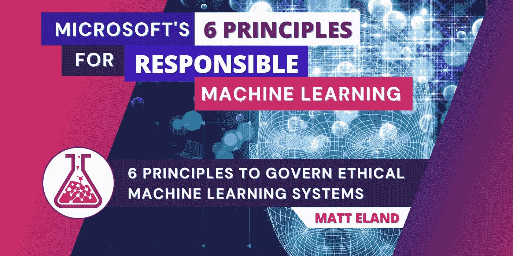

# 机器学习伦理与负责任的人工智能

> 原文：<https://medium.com/mlearning-ai/machine-learning-ethics-with-responsible-ai-bd848834a438?source=collection_archive---------4----------------------->

## 帮助管理机器学习系统的道德设计和操作的 6 个原则

Image by author

我最近在学习 [Azure 人工智能基础认证](https://accessibleai.dev/post/ai900/)时发现了微软的[负责任的人工智能原则](https://www.microsoft.com/en-us/ai/responsible-ai)。我发现微软在我的研究中强调的第一件事是负责任的重要性，这让我非常放心