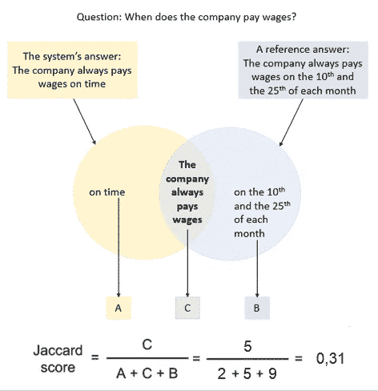

# HR 的机器学习:企业聊天机器人开发的 5 个步骤

> 原文：<https://medium.com/mlearning-ai/machine-learning-for-hr-5-steps-to-corporate-chatbot-development-db67e16e735?source=collection_archive---------8----------------------->

创建对话系统或聊天机器人是自然语言处理(NLP)领域中的典型任务。几乎所有解决它的现代方法都是基于使用各种架构的神经网络的深度学习技术。聊天机器人通常被认为是辅助营销工具，帮助网站或社交网络用户选择产品或服务。然而，它们的应用范围要广得多。

本文分享了我们开发企业聊天机器人的经验。聊天机器人是为一家大型科技公司的人力资源部门从零开始开发的，没有使用任何开箱即用的解决方案。聊天机器人的主要目的是优化人力资源团队的时间和精力，在某种程度上，用一个可以回答常见问题的人工智能“人”来取代真正的人力资源经理。下面，我们描述了创建原型的基本步骤，您可以通过原型构建一个生产就绪的系统。

**第一步。收集要求**

聊天机器人的目标受众是公司员工。该系统预计将回答常见问题，帮助新人入职，并就各种企业话题进行交流。

在机器学习中，准确定义系统的业务需求非常重要。通常，编写用户故事就足够了，当涉及到聊天机器人时，最有效的方法是编写不同类型的对话。它们可以是对所提问题的一次性回答，也可以是深入的对话，考虑到上下文:以前的短语、最后 3-4 句话或完整的交流历史，包括与该用户以前的会话。

*Fig. 1\. Example of contextless dialogue of two pairs of phrases*

因此，在收集了足够多的不同对话类型的例子之后，我们可以准确地定义要开发的系统的需求。

**第二步。选择指标**

第二个重要步骤是与产品所有者讨论验收标准。使用两个级别的对话系统评估是合理的:外部业务指标和内部技术指标。前者可以从最终用户的角度来衡量系统质量。

在我们的项目中，我们准备了一组 100 个“问答”对，并要求评估员(几十名员工)从 0 到 10 对聊天机器人的回答质量进行评分。之后，对他们的评估进行平均，并计算业务度量的值。

然而，这种方法相当耗时。因此，使用自动计算的额外内部技术指标是很方便的。有几种流行的技术指标用于评估 NLP 系统的性能(困惑度、BLEU、F1、Jaccard 分数等)。).

在我们的项目中，我们使用了 Jaccard 评分。要计算这一指标，您需要将系统对副本的实际响应与数据集中指定的理想响应进行比较。Jaccard 分数的计算方法是，将两个答案中的匹配单词数除以匹配单词数之和+系统响应中的不匹配单词数+理想答案中的不匹配单词数。图 2 显示了 Jaccard 得分度量的计算，使用了一个对用户问题的单短语系统响应的示例。

*Fig. 2\. Example calculation of Jaccard score metric comparing system’s answer and reference answer to question “When does the company pay wages?”*

内部指标有助于跟踪任务进度，并选择质量提升最大的解决方案。然后，可以将最佳选择的解决方案提交给评估人员，以计算最终的业务指标，并计划进一步的改进，以达到令人满意的验收标准。

**第三步。准备训练集**

下一步是准备数据集来训练系统。对于聊天机器人训练，需要一组问答对。集合大小很大程度上取决于所选择的神经网络架构，并且可以从数千个到数百万个示例。这种关系是直接的:训练集越大，整个系统的质量就越高。例如，一个众所周知的集合，open SQuAD 数据集，包含超过 100，000 个问答对。

除了通用数据集之外，还需要准备一个与聊天机器人用途相关的特殊数据集。这个附加集的大小由可用的资源决定。

在我们的项目中，主要数据集是一个开放数据集，由 200 万个关于一般主题的问答对组成。此外，我们还根据公司信息准备了自己的数据集，其中包含关于一个狭窄主题的大约 1，000 对问答。这两对数据是由三位专家独立汇编的。由于每个问题都有三个参考答案，这使得我们获得的指标更加稳定。

因此，这一步产生了两个训练集:关于一般主题的问答对的大型数据集和关于特定聊天机器人主题的小型专门数据集。

**第四步。选择架构**

历史上，有各种各样的方法来开发聊天机器人。随着 2016 年神经网络使用的第二波浪潮，这一领域出现了重大突破。当时，递归神经网络(GRU，LSTM)通常用于 NLP 任务。然而，自 2018 年以来，重点转向了使用“注意力”机制的非递归架构。特别是，目前主要的方法之一是“变压器”架构。图 3 以上述小队任务(搜索文中某个问题的答案)为例，展示了过去两年最先进的模型。

*Fig. 3\. Progress of neural networks of various architectures on SQuAD problem since 2018\. The vertical axis is the EM (exact match) quality metric showing the approximate percentage of correspondence between the neural network’s response and the set of experts’ reference responses.*

从图表中可以看出，在 2019 年初，系统的质量超过了评估员在相同任务中达到的人类水平。

因此，现在强烈推荐的创建聊天机器人的方法是使用“变形金刚”架构。对于我们的项目，我们选择了基于 BERT 架构的预训练模型。

**第五步。培训**

因此，我们现在准备训练选定的模型。现代 NLP 模型具有非常高的复杂度和大量的层。因此，培训需要大量资源。例如，在一组 8 亿字上训练 BERT-Large 模型需要大约 100 GPU *天，这在商业级项目中实现起来相当慢和/或昂贵。这就是为什么在现实场景中，开发人员使用预先训练好的 NLP 模型作为基础，这些模型可以在许多语言中免费获得。然而，这种预先训练的模型不是现成的解决方案，它们需要针对选定的任务进行修改，即所谓的模型微调。这意味着应该将新的输出层添加到预训练模型中，并且应该对步骤 3 中讨论的问答配对集执行额外的训练。

额外培训期间的质量监控至关重要，因此我们建议使用交叉验证和自动内部指标。在内部指标达到可接受的结果后，建议将结果系统发送给评估人员进行审查，以重新计算业务指标并验证是否达到了验收标准。

最后，我们得到一个经过训练的模型，它可以内置到聊天机器人基础设施中，并在生产之前在焦点小组中开始最终系统的 beta 测试。

**结论**

在这里，我们仅仅描述了构建聊天机器人系统的关键阶段:明确任务、定义质量标准、收集数据、搜索相关模型以及训练模型。显然，这份清单绝非详尽无遗。您的聊天机器人项目可能会面临各种相关的问题，例如，搜索所需语言的预训练模型，设置训练模型的设备，与评估者交互等。此外，每个聊天机器人都有自己与手头任务和预期目标受众相关的细节。无论如何，最好的指导方针是来自最终用户的反馈。

 [## Mlearning.ai 提交建议

### 如何成为 Mlearning.ai 上的作家

medium.com](/mlearning-ai/mlearning-ai-submission-suggestions-b51e2b130bfb)