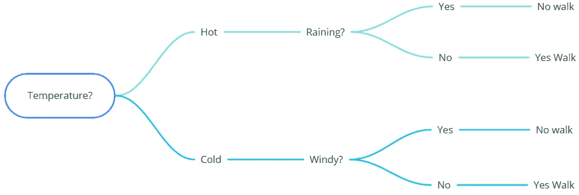

# 面向儿童的机器学习—决策树

> 原文：<https://medium.com/mlearning-ai/machine-learning-for-kids-decision-trees-db9853dca27d?source=collection_archive---------4----------------------->

在机器学习领域，决策树通常用于分类(是狗还是猫？)和回归问题(这个房子该卖多少钱？)

Photo by [Vladislav Babienko](https://unsplash.com/@garri?utm_source=unsplash&utm_medium=referral&utm_content=creditCopyText) on [Unsplash](https://unsplash.com/s/photos/decision-trees?utm_source=unsplash&utm_medium=referral&utm_content=creditCopyText)

顾名思义，决策树是用来做决策的，或者至少是帮助你做决策的。所以你可能会问自己，这些树能帮我做什么样的决定？

*   这房子我应该卖多少钱？
*   我今天应该打高尔夫球吗？
*   这个病人需要做这个手术吗？

这个列表可以列出很多，但是希望您能够理解这种技术的使用范围几乎是无限的，并且不局限于某个特定的领域。

## 你想去散步吗？

请不要马上去散步，留下来读完这篇文章的其余部分，如果天气好的话再去。

当你决定去散步时，你会想些什么？

*   外面是热还是冷？
*   下雨了吗？
*   风有多大？

现在，这些只是可能影响你去散步的欲望的几个因素。还可以有许多其他的，但现在我们只谈这三个。下表显示了每个因素的所有组合，以及这个人最终是否去散步。

通过使用决策树，计算机会查看这个，并首先检查温度将会是多少。天气是热还是冷？

假设天气很热。接下来，电脑会检查是否下雨。如果是的话，链条就会停下来，对散步说不。如果没有下雨，它会回答“是”,因为它的信息表明，即使刮风，人们也会在这种情况下散步。

Image by Author

这是一个非常基本的例子，说明了如何使用决策树来帮助根据过去的事件或经验做出决策。决策树可以处理的因素数量巨大，与其他机器学习模型相比，很容易看出计算机是如何做出最终决策的。

下面的视频很好地介绍了决策树是如何创建的，如果你愿意，也可以使用 Python 代码来构建自己的决策树。

如果你想要更多决策树及其用法的例子，我推荐下面的 GitHub 资源库，它有一些精彩的例子，展示了已经提出的一系列问题。

 [## 白银决策/白银决策

### 欢迎用户提交建议，在这里发布他们的树。如果你想让你的树出版，请…

github.com](https://github.com/SilverDecisions/SilverDecisions/wiki/Gallery) 

决策树是最容易理解的机器学习模型之一，因此是一个很好的开始来介绍一个孩子(或成人！)到机器学习的世界。

如果您正在寻找决策树的更实用的介绍，同时也让您的孩子做一些编码，那么可以在这里找到一些使用 Scratch 和 Python 的精彩教程:

 [## 儿童机器学习

### 一种教育工具，通过让孩子们训练计算机识别文本来教他们机器学习…

machinelearningforkids.co.uk](https://machinelearningforkids.co.uk/) 

儿童机器学习网站为教师和家长提供了一系列课程计划，以帮助他们以有趣和有趣的方式教他们的孩子机器学习领域。

我期待着很快就这一主题和其他主题写更多的文章，并希望你也能从中有所收获。

如果你想阅读更多关于教你的孩子计算机编程和数据科学的内容，那么你可以在下面的链接中阅读我的一些帖子。

 [## 使用《我的世界》教儿童编程

### 学习编码几乎是我们的孩子的一个要求，随着劳动力从传统角色转向…

allanbond.medium.com](https://allanbond.medium.com/teaching-children-programming-using-minecraft-6a537d38f4dd)  [## 面向儿童的数据科学——如何让他们入门

### 机器学习领域在最近几年有了爆炸性的发展，所以为什么不教你的孩子使用简单的工具呢…

allanbond.medium.com](https://allanbond.medium.com/machine-learning-for-kids-1f47d656bee0) 

如果你喜欢这篇文章，请通过 [LinkedIn](http://linkedin.com/in/allanbond) 或 [Twitter](https://twitter.com/AllanJBond) 与我联系。