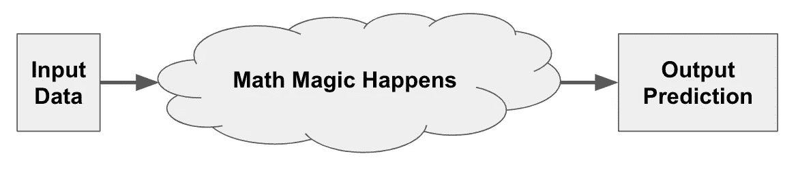
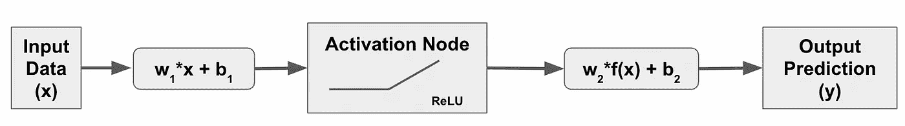
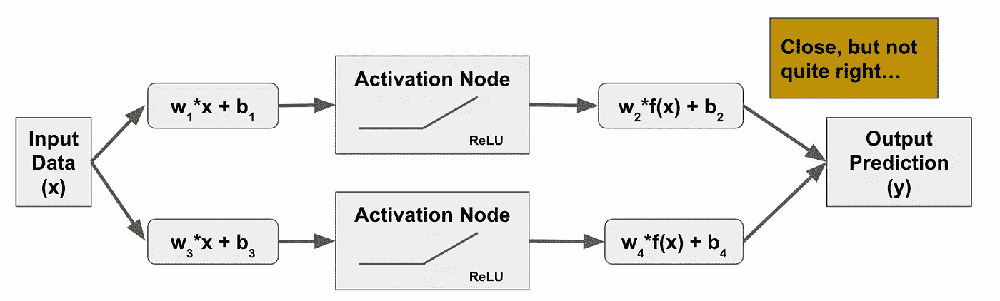
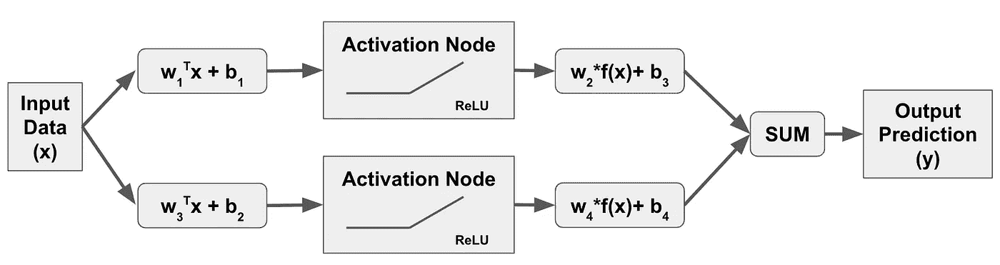
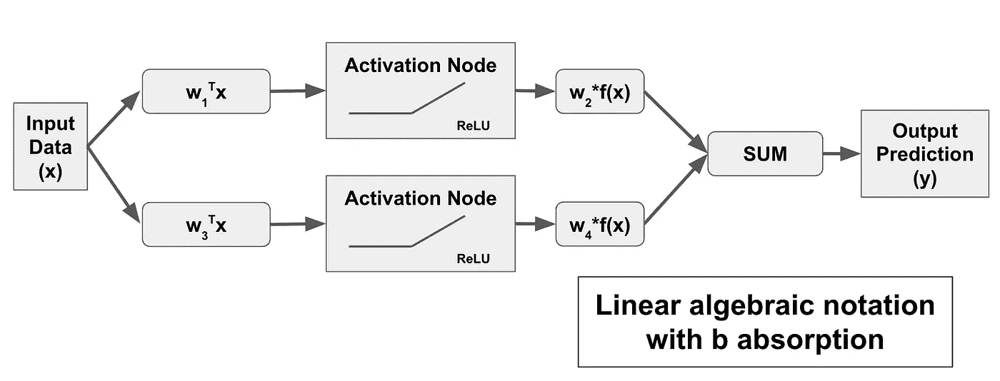
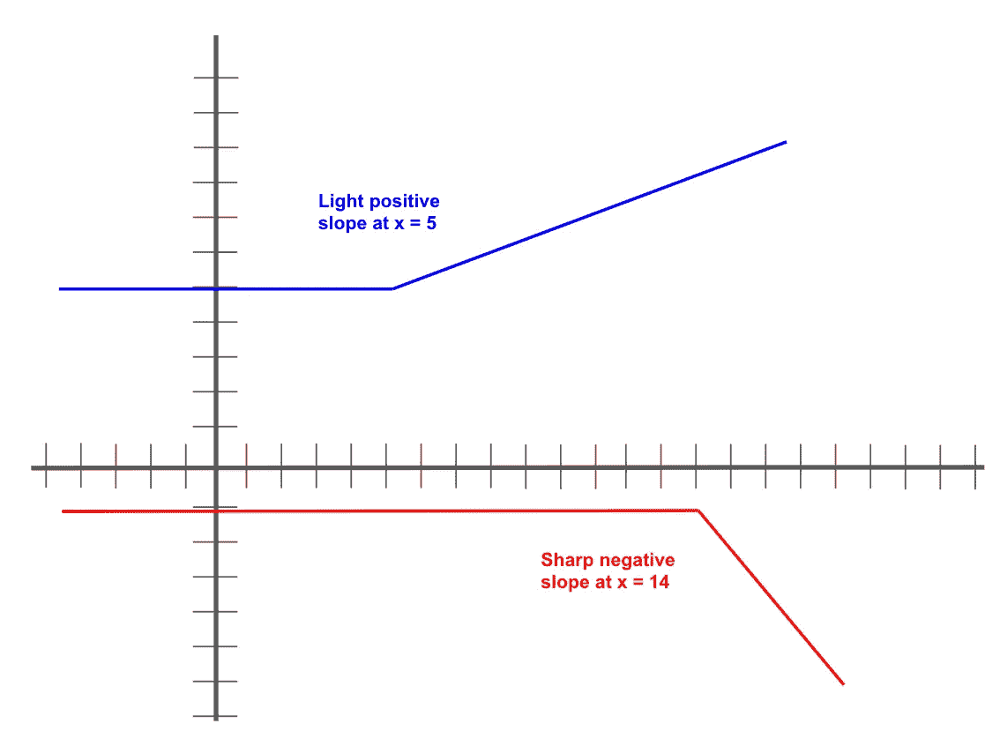
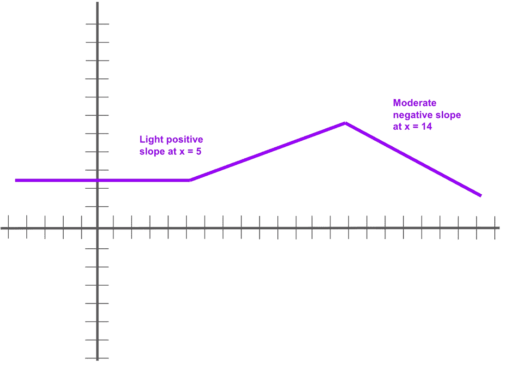

# 僵尸的机器学习

> 原文：<https://medium.com/mlearning-ai/machine-learning-for-zombies-be707e02712c?source=collection_archive---------8----------------------->

一口大小的神经网络——开始

I should get royalties for a character that basically mimics the noises I make first thing in the morning.

神经网络，又名多层感知器(MLP)，是一种复杂的算法，需要大量的计算能力和大量的数据，才能在合理的时间范围内产生令人满意的结果。也就是说，当正确实施并给出足够多的正确类型的数据时，它们可以产生迄今为止其他机器学习技术无法比拟的结果(对于表格数据，可以使用[梯度提升树](https://jasondeden.medium.com/create-the-problem-sell-the-cure-ee0ec1b228fb))

# 你以前看过这部电影

那么它们是什么呢？

让我们从它们不是什么开始:神经网络，尽管你可能到目前为止已经读过它的名字、每篇博客文章和机器学习教科书介绍，但它们不是人脑的类似物。抱歉。有一些表面上的相似之处，但是神经网络的实际功能与神经元几乎没有任何共同之处，神经元组成了位于两耳之间的大约三磅重的肉，并定义了你做的一切以及你如何体验现实。

在高层次上，它们就像任何其他机器学习算法一样:

This Machine Learning Approach Copyright 2021, Jason Eden, All Rights Reserved

就像许多其他机器学习算法一样，他们使用公式“标签等于权重乘以数据值加上偏移量”(或 y = w*x + b)来定义他们在哪里绘制线/超平面以进行预测。(注:你可能更熟悉 y = mx + b，其中 m 定义为直线的斜率。在机器学习中，这个斜率被称为权重。)就像许多其他机器学习算法一样，它们使用梯度下降来找到 w 和 b 的最佳值，以便在整个数据集中最接近地匹配训练标签 y。如果你已经理解了线性分类器，如[感知器](https://jasondeden.medium.com/perceptron-more-than-meets-the-i-86516ef15c45)和逻辑回归，那么你已经对神经网络的概念有了一个很好的开始。

神经网络和逻辑回归也有一些其他的共同点。[逻辑回归](https://jasondeden.medium.com/marble-in-a-steel-bowl-part-2-28495a2a4c85)从关于决策边界凸形的假设(Sigmoid 函数)开始。如果神经网络足够复杂，它可以创建几乎任何形状的决策边界。他们通过修改超平面来做到这一点，使它不再是“平的”(如果你从二维或三维的角度来考虑的话。)Sigmoid 函数可用于弯曲超平面，但您也可以使用 Softplus(生成曲线)或 ReLU(使用铰链公式，类似于支持向量机使用的铰链损失计算，为 0 或某个正值)。在今天的实践中，ReLU，或校正线性单位，通常是首选的方法，所以我将使用它作为我对标签的假设。

## …但这并不完全相同…

神经网络和其他机器学习算法之间的第一个区别是关于权重的初始假设。虽然大多数机器学习算法从 0 的权重假设开始并从那里修改，但神经网络从通常随机生成的非零权重开始。对于寻找直线或超平面的线性分类器，或者如果您假设训练数据的最佳决策边界形成凸形，初始权重实际上并不重要。从 0 开始只是一个简单的默认。然而，如果[你在决策边界中允许曲线](https://jasondeden.medium.com/when-getting-it-right-gets-it-wrong-86052e31cb41)而不是直线，你就不会总是想从同一个位置开始。事实上，您可能希望使用不同的初始权重多次运行该算法，以确定您可以找到的最佳预测能力存在于何处。神经网络的偏差(偏移量或 b)值可以从 1 开始，或者如果您的数据值被缩放，则 1 是一个很大的数字(稍后将详细介绍)，也可以是较小的数字。

# 术语和图表

神经网络数据处理的各个阶段被称为“节点”您有一个输入节点和一个输出节点，输入节点是数据开始的地方，输出节点是预测结束的地方。另外，中间的激活层也被认为是一个节点。这些节点通过我们对原始数据或原始数据上的激活节点函数的结果应用的数学公式(w*x + b)来连接，在下面表示为 f(x ):

The core of a neural network. My zombie is starting to take notice.

激活节点被称为“隐藏层”你可以有一个以上的隐藏层，为什么你要这样做将是另一篇文章的主题。上图通常被称为“神经元”(再次强调，部分原因是表面的相似性…)，但它实际上并没有完成。为了成为一个“网络”,你必须连接到一些东西上，事实证明，神经网络至少需要两个神经元。所以你可能会认为神经网络可能是这样的:

My zombie totally lost interest.

但实际上，我们通过对所有 w*x 值求和来稍微简化最后一个阶段，并且只添加一个偏移来获得我们的预测，因此真正的神经网络应该是这样的:

A real neural network! Murrh!

请注意，上述神经网络方法是一种代数方法，其中我们通过将多个 b 值合并为一个值来优化一个步骤。对于这种计算，如果你有很多神经元，这可能会有一些收益。另一种方法是保持每个神经元的 b 值，这在数学上是相同的，你只是计算，然后最后把所有的 b 值相加。

Toe-may-toe, toe-mah-toh

能够显著提高性能的是采用线性代数方法，这允许我们将偏差计算(和调整)吸收到数据矩阵和权重向量中，并且实际上使这变得更加简单和清晰。

A significantly more efficient neural network approach

# 他们做什么

在以后的文章中，我们实际上会创建一些数据并进行一些计算，但在这篇文章中，让我们假设我们已经完成了所有这些工作，我们最终会得到几条类似这样的线(注意:负权重会翻转线的方向)。蓝线代表第一个神经元的独立结果，红线代表第二个神经元的独立输出。y 轴值是给定 x 值时每个神经元的预测值:

Can’t we all just get along?

这些线条是使用 ReLU 激活函数以及权重和偏移的随机值的结果，为了便于说明，我们假装在最后没有进行简化。请注意，这两条线以不同的偏移值(蓝色+5，红色-1)开始，代表神经元的默认预测，直到 ReLU 激活开始。ReLU 激活意味着所有预测值将保持在这些偏移量，直到 x 值达到某个点。在蓝线的情况下，由于选择了随机权重，这种激活会导致略微正的预测斜率，该斜率在 x = 5 时开始。对于红线，值为 0，直到 x = 14，在这一点上，预测急剧倾斜为负。

现在，为了得到“最终”输出(现在)，我们需要将这两行加在一起。因此，我们的最终失调值将是+5 和-1 之间的中点，即 2.5，这将成为我们的预测值，直到我们到达一个转折点。两条线的斜率都是 0，直到 x = 5，所以这不会改变。当 x = 5 时，只有蓝线有影响(增加了红线斜率，但仍等于零)，因此在 5 到 14 之间，预测函数的斜率与蓝线完全匹配。然而，当 x = 14 时，红线的急剧负预测斜率被加到蓝线的轻微正预测斜率上，导致 x = 14 和更高的中等负预测斜率。该函数将如下所示:

I’d like to teach the world to sing…

所以在很高的层面上，这就是神经网络，以及它最初的作用。就通过神经网络节点的这种“向前传播”的实际数学而言，我们仍有许多内容要介绍，包括添加额外的输入节点、隐藏层和多个输出。我们还需要了解神经网络如何使用梯度下降和链规则来“向后传播”，并为每个神经元找到最佳权重，以最小化训练损失。确定神经网络的规模——选择神经元和隐藏层的数量以及每个隐藏层的节点数量——将是一个重要的考虑因素。然后过度拟合——哦，天哪，这种方法**惊人地* *过度拟合你的训练数据——也需要解决。这只是为了让我们能够完成一个神经网络的相对简单的实现。所以，准备好，系好安全带，或者无论你选择什么样的比喻。这将是一个旅程。

 [## Mlearning.ai 提交建议

### 如何成为 Mlearning.ai 上的作家

medium.com](/mlearning-ai/mlearning-ai-submission-suggestions-b51e2b130bfb)