# 机器学习前沿:建模基础

> 原文：<https://medium.com/mlearning-ai/machine-learning-frontiers-modelling-basics-7269ae6f0729?source=collection_archive---------1----------------------->

[Artificial Intelligence (2001) — copyrights of Warner Bros. Pictures - source](https://www.imdb.com/title/tt0212720/mediaviewer/rm2180580864/)

如果世界今天重新启动，你必须知道哪些建模概念才能让机器学习重新启动？

尽管有科学的努力，也不可能理解作用于一个物理或社会现象的每一种力。这是由于三类限制造成的:

*   **理论无知**:对给定现象的关系和理论规则并不完全了解
*   **实践无知**:缺乏完整的观察，如事实、测量和实验读数
*   **懒惰**:作用于一个特定现象的所有力量是如此之大，以至于不可能列出它们或者精确计算它们的结果

机器学习使用**函数逼近**来处理这样的场景。这些函数近似值被称为**模型**。

**造型**

在机器学习的背景下，建模是通过**训练过程找到**有用的**模型的过程。**

当一个模型对**看不见的数据**表现良好时，即**在其构建**期间未被使用的数据，该模型被认为是有用的。简而言之:

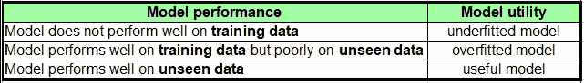

当然，我们想摆脱**装备不足的**和**装备过度的**车型。让我们考虑下面的合成场景，以便理解如何。

## 合成数据拯救世界

**合成数据**是一种宝贵的资源。在将模型和算法应用于真实数据之前，更容易理解它们的行为。在这里和之后，我们将使用合成数据来了解机器学习建模的主要关注点。

让我们假设我们以某种方式知道支配所研究现象的生成源:

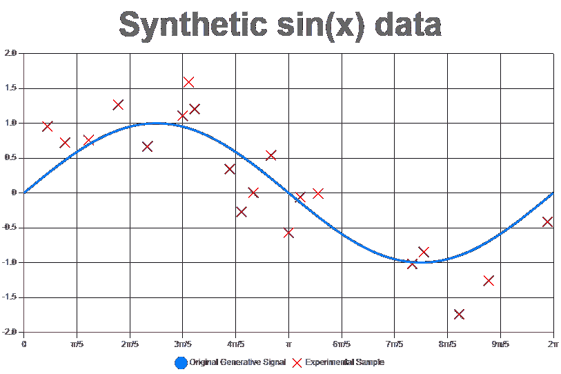

蓝线代表我们已经神奇地知道的源函数。这个特殊的函数就是周期性的**正弦波**函数 *f(x) = sin(x)* 。生成正弦数据的 JavaScript 代码如下:

图表中的红叉是通过实验程序从真实现象中获得的测量值。注意，由于不同的噪声源，这些实验读数与源生成正弦函数并不完全共线。

>**正态分布**很好地代表了这类噪声。的确，**中心极限定理**陈述了独立随机变量的和近似正态分布。

在真实场景中，我们甚至不知道生成源信号的形状。通常我们只能获得实验数据:

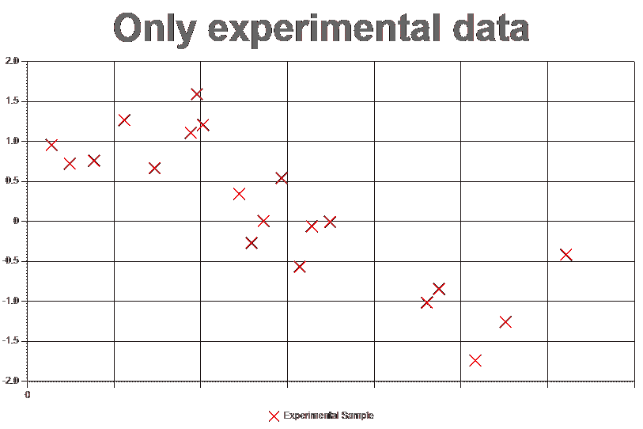

在本文的其余部分，我们将找到获得源生成信号的良好近似的方法，假设我们既不知道它的形状也不知道它的公式。

## 近似函数

粗略地说，训练算法旨在找到给定训练数据的近似函数(或模型)。为了检查它的运行情况，让我们将训练数据设置为原始实验数据的 67%，将剩余的 33%留在一边以备将来的**验证**:

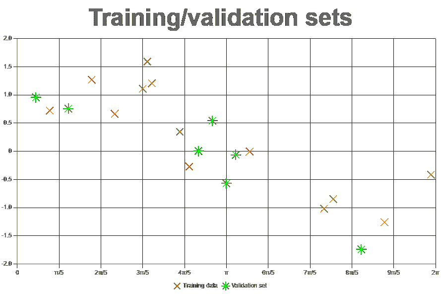

>分割训练集和验证集中的数据称为**保持**。常见的拆分百分比有 67%、80%、90%和 99%。

为了让事情尽可能简单，在这个实验中，我们将使用简单的基本教科书模型:直线(也称为一次多项式)，三次多项式(三次曲线)等等。因此，使用**最小二乘法**，我们可以找到以下近似值:

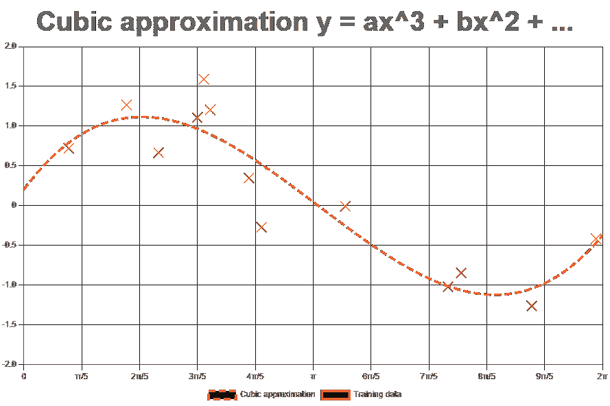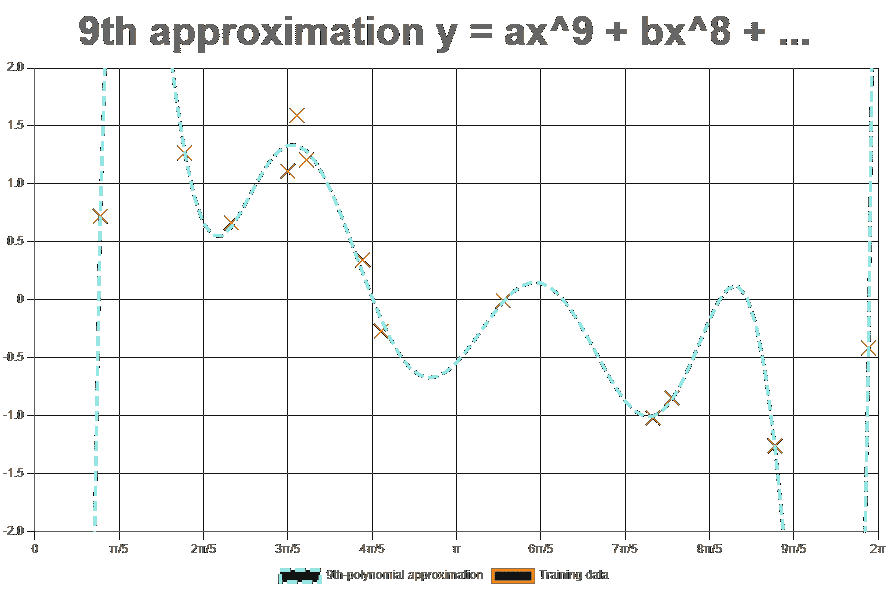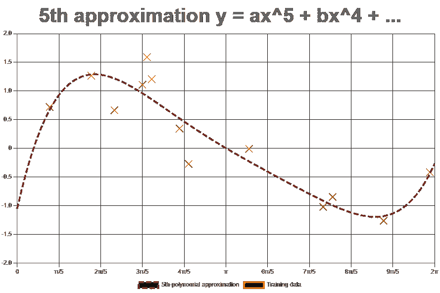

哪个模型更接近训练数据？检查图像，我们可以发现 9 次多项式曲线通过几乎每个训练点，而其他曲线或多或少更接近。但是，如何量化这种接近程度呢？

回答这个问题的一个很好的替代方法是**均方误差**或 **mse** :

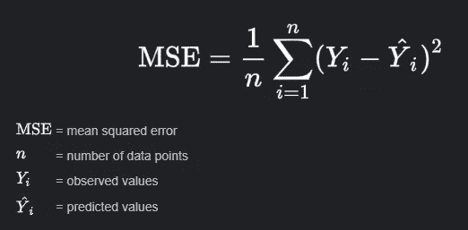

mse 是**预测值***ŷ*和**观测值** *Y* 的平方差的平均值。预测值是模型猜测的值，而观察值是数据集*中的原始值。*对于我们特定的一维数据，mse 的实现非常简单:

对于 mse 这样的误差指标，越小越好。对训练数据应用 mse 会导致:

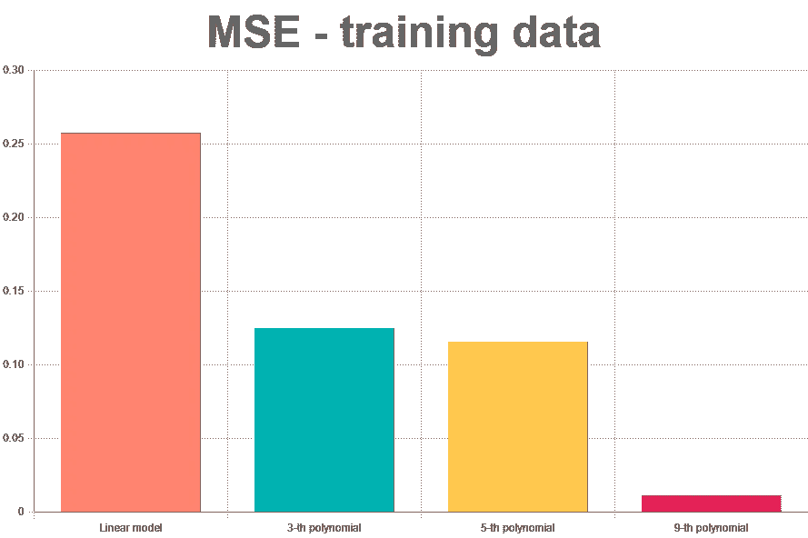

基于这种性能，我们可以认为最佳模型是 9 次多项式逼近。当然，这是一个错误的发现:将 mse 应用于验证数据提供了实际模型性能的一个相当好的视图:

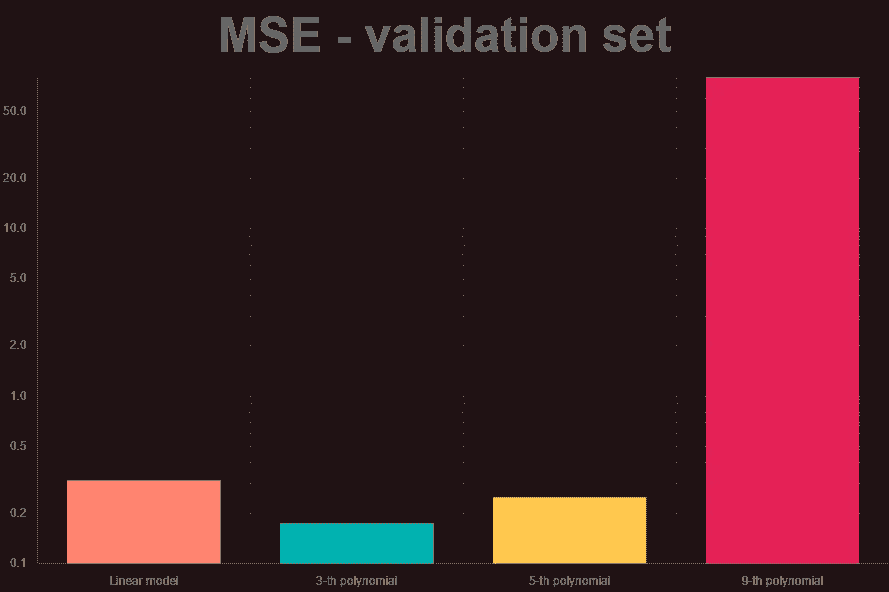

上图用的是对数刻度！它清楚地表明，9 次多项式模型在验证数据上表现不佳，尽管它在训练数据上实现了高性能。换句话说，这个图表显示的是 9 次多项式模型遭受过拟合。

另一方面，线性模型在训练集和验证集中的性能都很低。这被称为欠拟合。在真实的实验中，线性模型和 9 阶模型都应该被丢弃。

Famous picture of someone deploying an overfitted model in production

这里最重要的教训是:**模型是用在训练中没有用到的数据来评估的**。

现在，我们知道如何检测过度拟合的模型。但是，是什么让一个模型过度拟合呢？如何避免？

## **过配合和欠配合的原因**

过度拟合的常见原因是**模型复杂性**。我们可以将模型的复杂性恢复为模型中自由参数**的数量**。在 9 次多项式的情况下，有 10 个自由参数来拟合数据。自由参数越多，越容易过拟合。

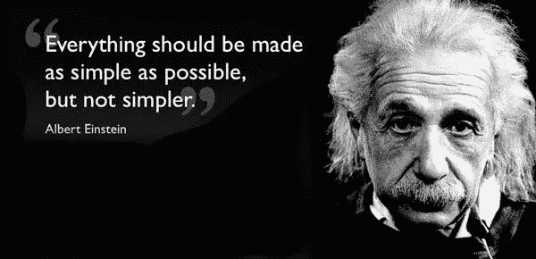

[Einsten citation investigation here](https://quoteinvestigator.com/2011/05/13/einstein-simple/)

反之，参数少的模型容易欠拟合。这是使用线性模型来近似(非线性)正弦波函数的情况。

模型复杂性的选择是建模阶段要做的最重要的决定之一。在训练算法中自动做出这种决定是机器学习的一个活跃研究来源。

>减少自由参数的数量或影响通常被称为 r **均衡**。我们将在另一篇文章中详细讨论正则化。

## 过度装配和装配不足的其他来源

拟合不足和过度还有其他原因，通常与数据质量有关。特别是，小数据是一个大问题，对欠拟合和过拟合都有很大影响。

>数据采集和准备过程是建模成功的关键。我们将在下一篇文章中讨论它。

过度/欠拟合的另一个原因是训练**超参数**的选择。培训过程将在本系列的下一篇文章中介绍。

## 最后，什么使得模型有用？

在我们之前的实验中，具有中等复杂度(第三和第五)的模型显示了训练和验证性能之间的最佳平衡。这种平衡是**选型**中的主要指标。

但是，在这种情况下，当两个或更多不同的模型具有大致相同的性能时，会发生什么呢？很简单！选择最简单的！

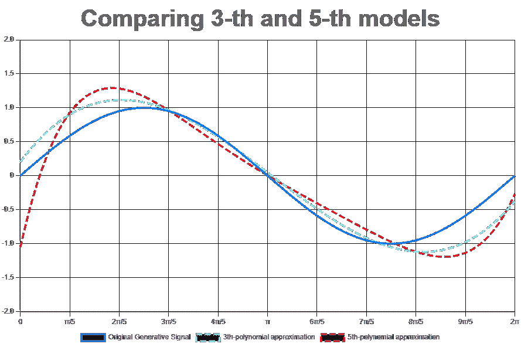

使用不太复杂的模型而不是更复杂的模型的论点被称为**奥卡姆剃刀原理**。检查我们之前的示例，我们发现 3 次和 5 次多项式模型与原始源信号(蓝线)的形状非常相似。因此，根据奥卡姆剃刀原理，我们将选择第三个作为最终选择的模型。

>在实时应用中，最简单的模型也是最快的模型。因此，对于两个性能相同的模型，最简单的总是被选中的。

## 结论

在本文中，我们讨论了机器学习环境中建模的基本主题。

使用一个合成场景和简单的学校级多项式函数说明了欠拟合和过拟合等概念。

在真实的场景中，更复杂的模型取代了位置，并且使用了适当的迭代训练算法。无论如何，这里讨论的核心建模主题，如训练和验证集、过拟合/欠拟合和模型复杂性，也同样有效。

## 密码

本文中使用的代码是用 JavaScript 编写的。你可以在这个[要点](https://gist.github.com/doleron/742028d2dd2c02f476d7623977585b0d)中找到它，或者使用下面的小提琴:

如果 JavaScript 不是您的首选语言，不用担心。将这些代码移植到不同的语言上并不困难，比如 Python、Java 或 C++。如有任何问题，请不要犹豫，请发邮件至:doleron gmail com

 [## Mlearning.ai 提交建议

### 如何成为 Mlearning.ai 上的作家

medium.com](/mlearning-ai/mlearning-ai-submission-suggestions-b51e2b130bfb)