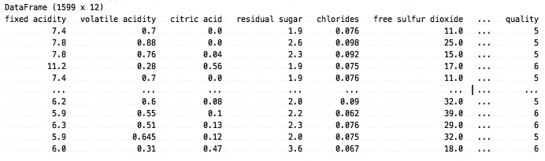

# Dart 编程语言中的机器学习

> 原文：<https://medium.com/mlearning-ai/machine-learning-in-dart-programming-language-fbfffd7deb18?source=collection_archive---------1----------------------->

大家好！

我叫伊利亚，是一名软件工程师。我的主要活动是前端开发。JavaScript 之后我遇到的第一个“严肃”的编程语言是 Dart——有一次，我的团队用这种语言开发了我们项目的前端。

几年前，我对机器学习产生了兴趣，研究机器学习算法成了我的爱好。有一天我想，为什么不把我的爱好和 Dart 的发展结合起来呢？在检查了 [GitHub](https://github.com/) 上的库和 [pub.dev](https://pub.dev/) 上的包之后，我确信还没有人用这种语言在机器学习领域创造过任何东西，所以我决定用 Dart 创建一个包含一组流行的机器学习算法的库。所以才诞生了 [ml_algo](https://github.com/gyrdym/ml_algo) 库和几个相关的库，形成了整个生态系统。在本文中，我将向您介绍上面提到的库，重点介绍 [ml_algo](https://github.com/gyrdym/ml_algo) 。

# **生态系统由以下库组成:**

*   [ml_algo](https://github.com/gyrdym/ml_algo) —机器学习算法的实现
*   [ml_dataframe](https://github.com/gyrdym/ml_dataframe) —可包含已处理数据和原始数据的数据存储器。库的中心实体是类似于熊猫数据帧的`DataFrame`类。
*   [ml _ 预处理](https://github.com/gyrdym/ml_preprocessing) —数据预处理算法的实现
*   [ml_linalg](https://github.com/gyrdym/ml_linalg) 。该库包含用于高效数学计算的向量和矩阵类。本库使用作为 [ml_algo](https://github.com/gyrdym/ml_algo) lib 中数据的内部表示。

# **ml _ algo 库包括以下算法:**

**线性回归:**

*   [套索回归](https://pub.dev/documentation/ml_algo/latest/ml_algo/LinearRegressor/LinearRegressor.lasso.html)
*   [基于随机梯度下降的回归](https://pub.dev/documentation/ml_algo/latest/ml_algo/LinearRegressor/LinearRegressor.SGD.html)
*   [线性回归的封闭解](https://pub.dev/documentation/ml_algo/latest/ml_algo/LinearRegressor/LinearRegressor.html)

**非线性回归:**

*   [KNN 回归](https://pub.dev/documentation/ml_algo/latest/ml_algo/KnnRegressor-class.html)

**线性分类:**

*   [基于随机梯度下降的逻辑回归](https://pub.dev/documentation/ml_algo/latest/ml_algo/LogisticRegressor/LogisticRegressor.SGD.html)
*   [基于批量梯度下降的逻辑回归](https://pub.dev/documentation/ml_algo/latest/ml_algo/LogisticRegressor/LogisticRegressor.BGD.html)
*   [基于牛顿-拉夫森方法的逻辑回归](https://pub.dev/documentation/ml_algo/latest/ml_algo/LogisticRegressor/LogisticRegressor.newton.html)
*   [Softmax 回归](https://pub.dev/documentation/ml_algo/latest/ml_algo/SoftmaxRegressor-class.html)

**非线性分类:**

*   [决策树分类](https://pub.dev/documentation/ml_algo/latest/ml_algo/DecisionTreeClassifier-class.html)
*   [KNN 分类](https://pub.dev/documentation/ml_algo/latest/ml_algo/KnnClassifier-class.html)

**聚类和检索:**

*   [KDTree 检索](https://pub.dev/documentation/ml_algo/latest/kd_tree/KDTree-class.html)
*   [基于随机二进制投影的局部敏感散列法](https://pub.dev/documentation/ml_algo/latest/ml_algo/RandomBinaryProjectionSearcher-class.html)

让我们看一个使用库的简单例子。

假设我们要训练一个线性回归模型(你可以在这里阅读什么是线性回归[)。例如，我们可以使用所谓的玩具数据集，其中包含来自](/mlearning-ai/a-gentle-introduction-to-linear-regression-the-dart-way-9750214e6fa2?source=friends_link&sk=e199d8f5b0bb71c97525be2ee7f5819b)[葡萄酒质量数据集](https://www.kaggle.com/datasets/uciml/red-wine-quality-cortez-et-al-2009)的数据，这是 ml_dataframe 库出于演示目的而提供的。

首先，让我们向 pubspec.yaml 添加必要的依赖项:

```
ml_algo: ^16.15.1
ml_dataframe: ^1.5.0
```

然后我们加载数据来训练模型:

`data`变量是一个[数据帧](https://pub.dev/documentation/ml_dataframe/latest/ml_dataframe/DataFrame-class.html)实例。让我们打印变量来理解数据的结构:

它输出以下内容:



数据由 11 个自变量和一个因变量组成，这 11 个自变量称为特征，一个因变量是我们的目标，我们必须能够预测“质量”列的值。

接下来，让我们将数据分成训练集和测试集。第一组将训练模型，第二组将评估模型的质量。我们可以使用 [ml_algo](https://github.com/gyrdym/ml_algo) 库中的 [splitData](https://pub.dev/documentation/ml_algo/latest/ml_algo/splitData.html) 函数来拆分数据:

正如你所注意到的，我们用参数`[0.7]`调用了`splitData`函数——这意味着我们想要使用 70%的源数据来训练模型。

接下来，我们通过调用[线性回归器](https://pub.dev/documentation/ml_algo/latest/ml_algo/LinearRegressor/LinearRegressor.html)构造函数来训练模型:

构造函数接受训练数据作为第一个参数，目标列名作为第二个参数。默认情况下，封闭形式的解决方案使用来定型模型。

让我们评估一下这个模型。为此，我们需要找到一个合适的度量标准。平均绝对百分比误差(MAPE)是回归问题的一个很好的度量。让我们使用它:

为了评估模型，我们调用了`assess`方法，并将选择的度量类型和测试数据一起传递到那里。最后一条指令打印如下内容:

```
0.07042532225989101
```

人们可以将其解释为“平均而言，我们以 7%的误差预测了目标值”。让我们比较一下预测值和实际值:

首先，我们通过从 [DataFrame](https://pub.dev/documentation/ml_dataframe/latest/ml_dataframe/DataFrame-class.html) 类调用`dropSeries`方法，从`testData`中删除了“质量”列。通过这样做，我们模拟了未标记的数据。最后，我们从两组值中选取一些任意的范围来比较它们。

最后两条指令输出以下内容:

```
Actual values: (7, 6, 7, 5, 5)
Predicted values: (6.18, 5.82, 6.49, 5.36, 5.36)
```

这看起来很合理。

如果我们对我们的模型满意，我们可以将它保存到一个 JSON 文件中，以便下次跳过重新训练:

要恢复模型，我们可以执行以下操作:

差不多就是这样！

所以，是时候搞清楚什么是[线性回归](/mlearning-ai/a-gentle-introduction-to-linear-regression-the-dart-way-9750214e6fa2?source=friends_link&sk=e199d8f5b0bb71c97525be2ee7f5819b)了。

如果你有任何问题，你可以通过[推特](https://twitter.com/ilgyrd)联系我。

干杯:)

[](/mlearning-ai/mlearning-ai-submission-suggestions-b51e2b130bfb) [## Mlearning.ai 提交建议

### 如何成为 Mlearning.ai 上的作家

medium.com](/mlearning-ai/mlearning-ai-submission-suggestions-b51e2b130bfb)