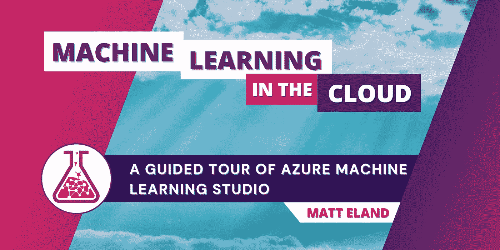

# Azure 云中的机器学习

> 原文：<https://medium.com/mlearning-ai/machine-learning-in-the-azure-cloud-ac6aa833ac9f?source=collection_archive---------3----------------------->

## Azure 机器学习工作室的导览

Banner image. Image by author.

Azure 机器学习工作室(通常简称为 ML Studio 或 AMLS)是微软首要的数据科学门户网站。

以下是 ML Studio 允许您做的一些事情的示例:

*   训练机器学习模型
*   评估已训练模型的性能