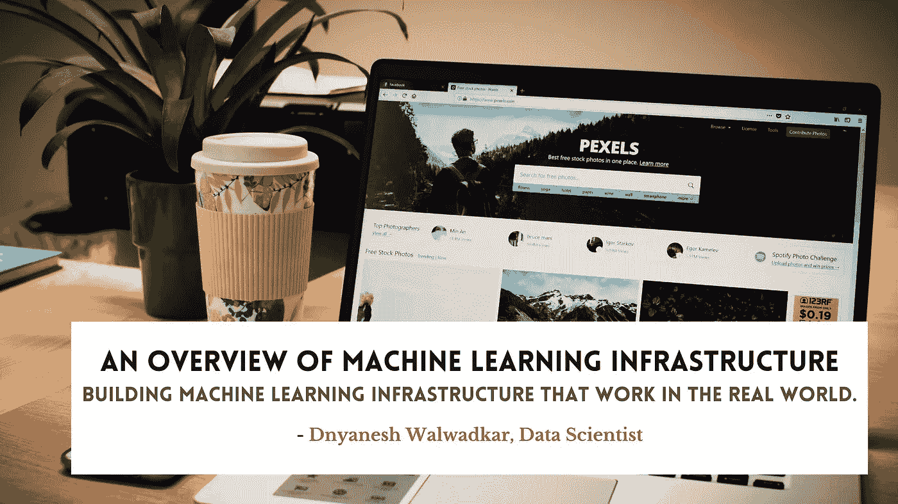
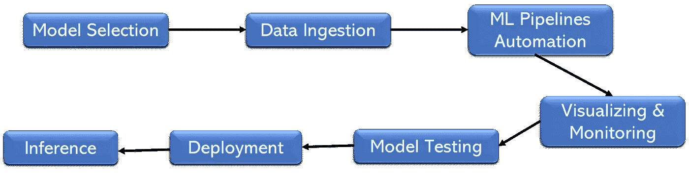

# 机器学习基础设施概述

> 原文：<https://medium.com/mlearning-ai/machine-learning-infrastructure-the-ultimate-guide-cd14ae4568b6?source=collection_archive---------3----------------------->

## 构建在现实世界中工作的机器学习基础设施。

您可能不会感到惊讶，有许多工具可用于基于脚本和事件触发器自动化机器学习工作流。在管道中，处理数据，训练模型，执行监控任务，最后部署结果。有了这些工具，团队就能够专注于更复杂的任务，同时确保流程的标准化并提高效率。

能够开发和实现机器学习模型的基础设施被称为机器学习基础设施。根据项目的性质，有各种实现机器学习基础设施的方法。它是用于开发、训练和部署机器学习模型的基础设施，包括支持机器学习模型的开发、训练和操作的系统、资源和工具。

它促进了所有阶段的机器学习工作流。借助该工具，数据科学家、工程师和 DevOps 团队能够控制和管理构建和部署神经网络模型所需的所有资源和流程。

随着机器学习变得越来越复杂，今天的数据科学团队对他们的机器学习基础设施有着更多的期望。今天，机器学习正在推动商业发展，而不是主要用于研究。由于机器学习平台的基础保持不变(管理、监控、跟踪实验和模型)，因此在设计支持可扩展性和弹性的基础架构时，需要考虑一些事情。今天的机器学习基础设施必须尽可能高效地构建，尽可能减少技术债务，以提高其开发速度。本博客的目的是概述现代机器学习基础设施的外观，以及如何按比例构建它们。

# 如何以最具扩展性的方式构建机器学习基础设施？

要开始 MLOps 模型的生命周期，您应该始终确定您试图解决的业务问题。最后，如果你不知道你在做什么，你怎么能到达那里？

MLOps 团队的成员在整个组织的不同部门工作以开发模型。为每个模型建立业务目标——您的团队将保持一致并按计划进行，因为他们有明确的方向。

遵循问“你的目标是什么？”在每个模型生命周期的开始，还可以防止开发对组织没有好处的模型。例如，如果我们事先知道我们需要从视频数据中识别什么，那么 MLOps 团队就更容易为组织提供真正的价值。

构建机器学习的基础设施需要几个关键组件。为了在您现有的机器学习堆栈上建立计划，您的机器学习基础架构需要针对可扩展性和可见性进行构建。首先，我们将讨论由计算资源、编排平台(如 Kubernetes 或 OpenShift)组成的 AI 结构，以及该结构如何与您的机器学习工作流集成。ML 基础设施还应该集成数据管理、数据版本控制的解决方案，并为数据科学家提供机器学习工作台，以简化培训模型、从事研究和优化模型。

提供一种简单直观的方式将机器学习模型部署到生产中，是可扩展机器学习基础设施的最后一个组成部分。当今世界面临着一个巨大的挑战，由于隐藏的技术债务，许多模型无法投入生产。为了让机器学习取得成功，它必须是不可知的，并提供与现有和未来技术堆栈的轻松集成。如果它是便携式的，并且使用容器进行简单的部署，您的数据科学家应该能够一键运行实验和工作负载。我们将在以下几节中研究构建可扩展机器学习基础设施的主要组件。

# 机器学习基础设施在哪些方面面临最大的挑战？

今天，人工智能和机器学习正面临着大规模进行数据科学的最大挑战，因为数据科学家做得不多。你会发现数据科学家一天的大部分时间都花在配置硬件、配置 GPU、配置 CPU、配置 Kubernetes 和 OpenShift 等编排工具来实现机器学习，以及配置容器上。此外，混合云基础设施在扩展人工智能方面也越来越受欢迎。混合云基础设施增加了您的机器学习堆栈的复杂性，因为您需要管理跨多个云、多个云、混合云和其他复杂配置的许多资源。

资源管理现在是数据科学家职责的一部分。为一个由五名数据科学家组成的团队配备一台本地 GPU 服务器是很困难的。找出如何高效和有效地共享这些 GPU 需要大量的时间。数据科学受到为机器学习分配计算资源的困难的影响。此外，管理机器学习创建的模型可能具有挑战性。诸如版本控制数据和模型、管理模型、部署模型以及利用开源工具和框架之类的任务。

AI 和 ML 的结果可能会受到装备不良的机器学习基础设施的阻碍。管理机器学习工作流是机器学习中的主要挑战。由于 AI 目前在企业工作流中使用，因此有两个主要的工作流是断开的和无效的。排在第一位的是 DevOps，也叫 MLOps。该工作流侧重于资源管理、基础设施、流程编排、生产中模型的可视化，以及与现有 IT 堆栈(如 g IT 和吉拉)的集成。此外，还有数据科学工作流，它涉及数据选择、数据准备、模型研究、训练模型、验证模型、调整模型以及最终部署模型。这些管道中的每一个都涉及如此多的步骤和组件。今天，这两个流程是完全分离的，它们通常由不同的团队管理。因此，由于这些中断的工作流，企业背负了大量的技术债务。除了影响生产时间，还会影响成本。随着组织的发展，工作流往往会变得更加复杂。如果您的团队在世界各地从事不同的项目，那么基础设施是完全孤立的。正因为如此，可扩展的机器学习基础设施应该在公司的所有项目和团队中得到简化。

# 你采取什么步骤来确保你的机器学习基础设施遵循 MLOps 最佳实践？

在开始应对这些挑战之前，您必须首先了解什么是 MLOps。为了操作模型，机器学习操作有助于减少开发 ML 模型的团队和工程团队之间的摩擦和瓶颈。MLOps 在机器学习和人工智能开发的背景下利用 DevOps 实践。作为一门学科，它旨在将整个机器学习过程系统化。企业可以使用 MLOps 来生产机器学习模型，自动化 DevOps 任务，并解放数据科学家，使他们专注于开发高影响力的机器学习模型，而不是烦人的技术挑战。在构建机器学习基础设施时，你应该考虑两个关键问题。如何做才能让没有 DevOps 背景的数据科学家也能轻松使用？为监管整个机器学习堆栈的 DevOps 工程师构建可提供高可扩展性和高性能的企业堆栈的最佳方式是什么？ML Ops 回答了其中的一些问题。计算是机器学习的第一步。它需要大量的计算能力。为了扩展机器学习基础设施，它必须是计算不可知的。无论您使用的是 GPU 集群、CPU 集群、Spark 集群还是云资源。在许多企业环境中，存在用于开发机器学习应用的资源池。

桌面在不同的团队之间划分，但仍然包含 GPU、GPU 集群、CPU 集群以及云资源。这种多样化的资源池可用于训练模型、预处理数据、服务模型、推断结论和执行其他机器学习工作。一个典型的机器学习流水线示例从一个数据集开始，分配一个工作人员对数据进行预处理。之后，一些工人被指定训练模型，如 ResNet、VGG16、YOLO、InceptionV3 或 InceptionV4。为了提高深度学习的性能，我们将在这种情况下使用 GPU workers。它们实际上是用来训练模型的。在此期间，您可能还需要运行一些消耗一些计算能力的 Jupyter 笔记本，以及将模型部署到云。现在，这只是一个管道，但是在企业级，多个管道和项目可以并发运行，这使得事情变得更加棘手。如果您更深入地研究一个管道，计算消耗可能会变得更大。超参数优化将是每个算法的一部分。这意味着，使用 VGG16，我们不只是运行一次 TensorFlow，我们正在运行近 500 次 TensorFlow 代码。计算资源因此被乘以 500。用可扩展的机器学习基础设施在 500 次运行中运行 500 次实验应该是可行的。通过运行更多的模型并对它们进行更多的调整，你可能会获得更好的结果和更高的准确性。数据科学家可以通过其机器学习基础架构中的调度器和元调度器来自我管理工作负载，从而提供可扩展性和自助式工作负载管理。

在这里，我们将探索如何为企业工作负载构建具有可扩展性的机器学习架构。

## 1.容器

在容器中管理机器学习基础设施对于其灵活性和可移植性至关重要。工作负载可以使用容器分布在不同的计算资源上。因此，您可以为每个工作负载分配 GPU、云 GPU、加速器或任何其他资源。通过使用容器，您可以在您拥有的任何资源之间分配作业。DevOps 工程师喜欢它，因为它允许他们更轻松、更便携地管理工作负载。

可以用容器创建环境，也可以用容器做可重现的数据科学和数据分析。云原生技术允许您在任何地方运行容器。因此，您可以使用 Kubernetes 集群、裸机平台、Docker 以及支持许多不同容器的云资源。OpenShift 是一个编排平台，它使您更容易在集群中运行和执行容器。

## 2.管弦乐编曲

在编排中，创建独立于计算资源的东西是必要的。尽管 Kubernetes 作为机器学习和编排工具很受欢迎，但该系统有如此多的风格。有可能运行牧场主，开放转移，或香草 Kubernetes。对于小型部署，您可以部署 MicroK8 和 MiniKube。因此，在设计自己的基础设施时，您必须决定现在和将来要支持哪种编排平台。换句话说，您必须能够设计适合现有基础架构的堆栈，同时还要考虑未来的基础架构需求。

此外，无论您设计什么样的基础架构，您都必须能够利用企业中现有的计算资源。如果您需要支持大型 Hadoop 集群、Spark 集群或不在 Kubernetes 上运行的裸机服务器(如 CPU 集群)，您也需要能够做到这一点。构建一个与 Hadoop 集群集成、利用 Spark 和 YARN 并能够利用您的组织拥有的所有技术的基础架构非常重要。此外，为了让整个行业的数据科学家更容易访问和使用您的所有计算资源，您应该考虑如何在一个地方管理它们。

## 3.混合云多云基础架构

为什么混合云基础设施有利于机器学习？我可以很容易地就此写一整篇文章。然而，混合云基础设施最适合机器学习工作负载，因为它们通常是无状态的。一个机器学习训练可能运行一天，或者两周，然后被终止。你可以终止机器，然后忘记它，只要所有的模型和数据都被存储。出于这个原因，机器学习云不同于软件云。作为软件开发人员，您需要确保您的数据库在混合环境中共享。在混合云机器学习中，控制您的资源有利于利用您已经拥有的现有计算。例如，假设一家公司有八个内部部署的 GPU 和十名数据科学家。如果您的组织使用所有八个 GPU，并且仅在达到 100%利用率或分配时才突发到云，这将是理想的。爆发云的能力允许组织增加参数化，同时降低云成本。云爆发的第二个好处是，它允许数据科学家轻松地扩展机器学习活动。

## 4.不可知的开放式基础架构

随着机器学习以极快的速度发展，您的平台必须灵活且易于扩展。因此，以易于扩展的方式设计机器学习基础设施至关重要。您可以轻松集成新技术、新运营商或新平台，而无需重组整个基础设施。如果你从这个关于机器学习基础设施的指南中拿走一样东西，确保你仔细选择你的技术，确保它们是不可知的，确保它们是可扩展的。因此，随着新技术和运营商的出现，您可以快速适应。

其次，如果您的基础架构是不可知的，您还应该考虑您的数据科学家接口。设计不佳的界面会妨碍您在基础设施中利用新技术。别忘了数据科学家不是 DevOps 工程师。他们中的大多数是数学博士，不想使用 YAML 文件、名称空间、部署或部署脚本。他们的首要任务是制作他们的模型，这也是他们受雇的目的。尤其是在使用 Kubernetes 的情况下，有必要为数据科学家抽象接口，同时为他们提供所需的灵活性和控制。因此，如果您的团队中有数据科学家或开发人员想要访问 Kubernetes 的内部信息，您需要允许他们这样做。最终，它是关于通过支持他们的数据科学和工程工作来帮助你的团队成为更好的专业人员。

# 更多细节请参考这本书。

 [## 实用 MLOps

### 将你的模型投入生产是机器学习的基本挑战。MLOps 提供了一套成熟的…

www.oreilly.com](https://www.oreilly.com/library/view/practical-mlops/9781098103002/)  [## Mlearning.ai 提交建议

### 如何成为 Mlearning.ai 上的作家

medium.com](/mlearning-ai/mlearning-ai-submission-suggestions-b51e2b130bfb)