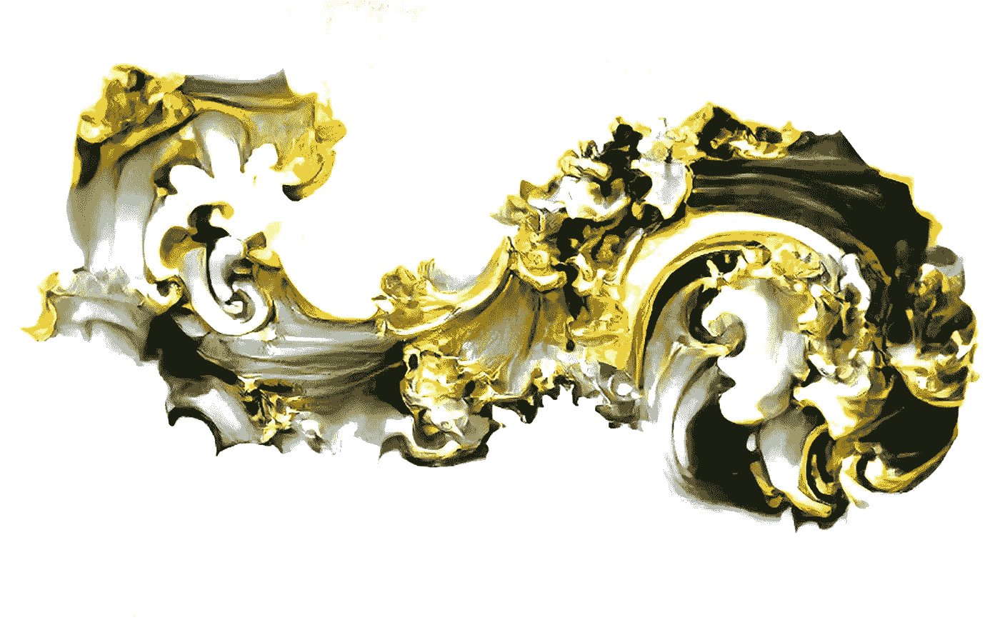

# 机器学习是巴洛克式的

> 原文：<https://medium.com/mlearning-ai/machine-learning-is-baroque-afb83e16bb2d?source=collection_archive---------3----------------------->

## 艾艺术

## 演示视频+代码

“Machine Learning Is Baroque” by [Dariusz Gross #DATAsculptor](https://medium.com/u/6d3244e0bdcd?source=post_page-----afb83e16bb2d--------------------------------)

用玛丽·雪莱的《弗兰肯斯坦》中的话说:

> "我声明我不知道我拥有这样的能力."

这句话抓住了今天[艺术家](/mlearning-ai/are-artists-using-ai-to-change-the-concept-of-art-1e92d8ba1ede)和创作者的情绪，因为我们想象一个[艺术家](/mlearning-ai/are-artists-using-ai-to-change-the-concept-of-art-1e92d8ba1ede)也是一台机器。如果我们用[机器学习](/mlearning-ai/what-is-machine-learning-2ec9cacb986c)创造[艺术](https://towardsdatascience.com/datasculpting-af39f677f4f3)会是什么样？这种新形式将如何…