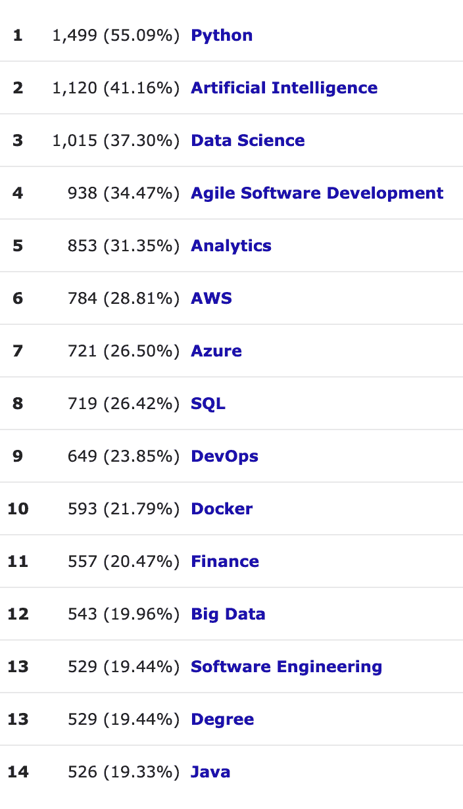
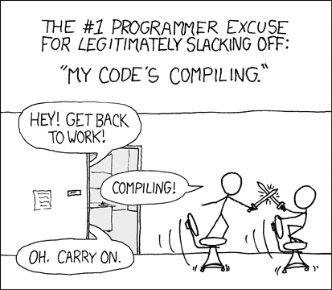

# 机器学习很难。使用 Aero 让它变得更简单

> 原文：<https://medium.com/mlearning-ai/machine-learning-is-hard-make-it-easier-with-aero-976cac8c40cd?source=collection_archive---------4----------------------->

## 无需基础架构管理-在可靠且易于实施的平台中部署、管理和扩展数据科学和机器学习工作流。

Photo by [Kelvin Ang](https://unsplash.com/@kelvin1987?utm_source=medium&utm_medium=referral) on [Unsplash](https://unsplash.com?utm_source=medium&utm_medium=referral)

我们已经发布了 Aero！我们的免费试用现已推出，请访问 [*此处*](https://iianderson.medium.com/from-covid-to-politics-analysing-gdelt-with-aero-a2200f65d610) *跟随。*

构建软件很难。构建可伸缩、可维护且可靠的软件更加困难。据估计，花在软件上的每一美元中有 41 美分被浪费了[1]。这是一个巨大的数量，即使所有的工作都投入到改进软件项目中，它们在交付成果方面仍然是低效的。这是为什么呢？软件是错综复杂的，10 年前的错误可能会在最轻微的变化中浮出水面，对正在运行的系统造成严重破坏。几个月前出现了一个很好的例子，微软 Outlook 出现了一个错误，原因是年份切换到了 2022 年[2]，这个错误多年来一直没有在最常用的公司软件中被发现。

因此，想象一下，将所有的*普通*软件开发的复杂性，然后尝试在这个错综复杂的环境之上构建全新的数据科学和机器学习工作流。简直是噩梦。

**Aero 已经着手改变那个**。但是首先，让我们看看我们是否可以通过机器学习项目来识别一些浪费的钱来自哪里。

**资源大战**

随着数据集按比例增加，提供给作业的资源也必须按比例增加。如果不这样做，开发人员将面临无数个小时调试“内存不足错误”。这是一个很难调试的问题，经常以奇怪的方式表现出来。消除开发人员的这种负担可以让他们随意使用资源，最终节省时间，提高效率。

**身兼数职的开发者**

随着机器学习项目的复杂性增加，从笔记本中的一些分析到生产工作流，对开发人员的要求越来越高。他们被要求承担开发人员、系统管理员和云架构师的角色，每个角色都包含了一个近乎无限的知识库。下表完美地说明了这一点，该表显示了英国机器学习工程师招聘广告中最常见的必备技能。

The skills required for a standard machine learning engineer. This is madness!

AWS + Azure 都在 SQL 之上！这怎么可能呢？！这是因为工程师需要部署、管理和构建他们自己的环境。这就要求他们不仅要完成自己的工作，还要完成他们可能没有资格、没有受过训练或不想做的工作。

**缓慢的开发周期**

A timeless classic, but one that’s getting more and more true for Data Science & Machine Learning workflows [3]

这里还需要我多说吗？电脑很快，让它们来做繁重的工作吧。如果您的工作流每次都要花 10 分钟来部署，那么捕捉每一个小错误就要花更长的时间。这个问题的答案就是使用你的本地机器！开发人员需要一个可以在本地快速启动进行测试，然后在生产中模拟的环境。这种快速的迭代可以让开发人员保持流畅并最大化生产力。

**原型/生产划分**

正如我在上一篇文章中讨论的，机器学习工作负载面临的一个基本挑战是获得一致的测试环境来运行原型。假设您正在构建一个简单的电子邮件推荐系统，它接收一些数据，执行一些简单的统计，并返回一组预测。您可以使用一个小型数据集在本地测试并完善它，但是您如何在生产中按计划运行它呢？好吧，你不能在你的机器上——所以你把它推到别的地方，比如服务器。但是您现在还没有在新环境中进行测试，所以现在需要重新认证。

像这样的开发工作流是很糟糕的。它们要求您为两个平台编写代码，并确保它们以相同的方式运行，没有任何问题。正如我们之前说过的，软件是很难的——不要通过增加更多的复杂性来增加开发者的难度。

**搞定**

所以在文章的开始，我们提到了一项新的服务可以帮助解决这些问题: **Aero** 。Aero 是一个平台，旨在将基础设施、安全性和流程编排的责任从开发人员手中夺走，让他们专注于增加价值，无论是个人项目还是公司。

它建立在开源标准**Metaflow**【4】之上，允许开发人员在本地或通过专有的 **Aero 计算平台**运行工作流。这些 python 工作流可以是任何东西，从大规模 ETL 系统到检查外部风速的脚本，我们一视同仁。不管你有多少云知识，你都可以使用 Aero 平台来利用它的力量。

那么 Aero 是如何解决上述问题的呢？

*   它通过为开发人员提供一个通往云提供商所能提供的强大计算的网关，解决了**资源战争**，并在需要时提供工作流的垂直和水平扩展。
*   Aero 还允许用户专注于通过他们的代码增加价值，**而不是维护和修补现有的基础设施**。就像登录和提交作业一样简单，不需要任何配置。
*   由于 Aero 利用 **Metaflow** 来执行工作流——无论在哪里运行，无论是在本地笔记本电脑上还是在我们提供的最大实例上，所有任务的操作都是相同的。任何作为原型的工作都可以立即运行或安排，立即开始增加价值，不需要任何改动。所有这些都允许原型和生产之间的无缝过渡。

*我们发布了 Aero！我们的免费试用现已推出，请访问* [*此处*](https://iianderson.medium.com/from-covid-to-politics-analysing-gdelt-with-aero-a2200f65d610) *跟随。*

*免责声明:我是 Aero Technology 的董事，虽然我可能有偏见，但我认为这是一个了不起的工具，可以彻底改变我们访问计算的方式！*

参考资料:

[1]—[https://www . project smart . co . uk/risk-management/is-software-development-risk-costing-you-money . PHP](https://www.projectsmart.co.uk/risk-management/is-software-development-risk-costing-you-money.php)

[2]—[https://www . engadget . com/Microsoft-exchange-year-2022-bug-fix-215225070 . html](https://www.engadget.com/microsoft-exchange-year-2022-bug-fix-215225070.html)

[3]—[https://xkcd.com/303/](https://xkcd.com/303/)

[4]—[https://metaflow.org/](https://metaflow.org/)

 [## Mlearning.ai 提交建议

### 如何成为 Mlearning.ai 上的作家

medium.com](/mlearning-ai/mlearning-ai-submission-suggestions-b51e2b130bfb)