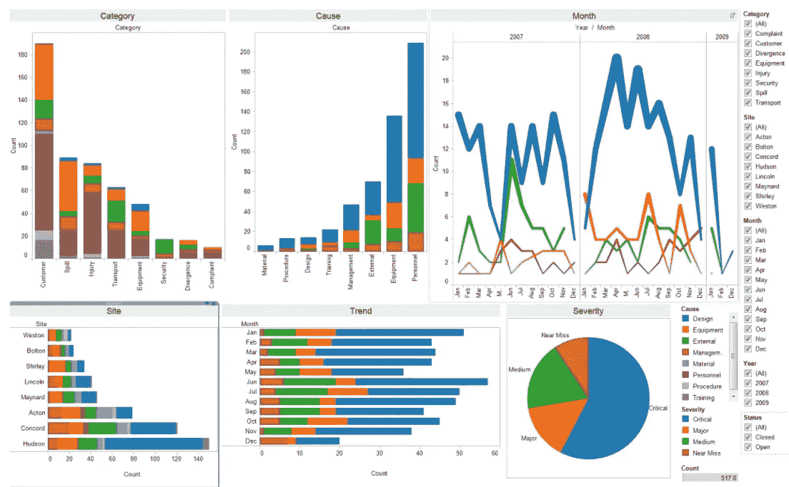
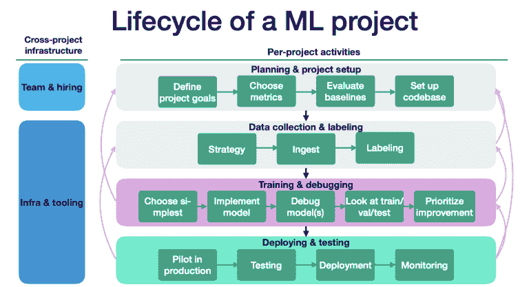

# 机器学习生命周期

> 原文：<https://medium.com/mlearning-ai/machine-learning-life-cycle-49c1495fa2bc?source=collection_archive---------3----------------------->

> 准确地说，机器学习生命周期或机器学习开发生命周期可以说是我们在构建基于机器学习的项目时需要遵循的一套准则。机器学习生命周期是一个构建高效机器学习项目的循环过程。生命周期的主要目的是找到问题或项目的解决方案。

初学者总是认为做一个机器学习项目只是寻找模型的准确性或执行 EDA(探索性数据分析)。但是当涉及到现实生活中的产品时，有许多东西需要考虑，以实现端到端的应用。因此，让我们看看在制作真实世界的机器学习项目中涉及的各个步骤。

# ***1。*取景问题**

这是开发机器学习项目最基本也是最重要的一步。在这一步，我们必须弄清楚我们项目的问题陈述是什么，这样我们才能了解问题的每个参数。

要考虑的事情是我们试图解决的实际问题是什么，团队中的成员，我们如何接近解决方案，涉及的成本，我们如何获得数据，可以使用的算法，要使用的框架，在哪里部署模型，等等。

在所有的事情都想通了之后，我们才可以进行下一步。

# **2。收集数据**

在处理机器学习项目时，数据是必需的。没有数据，我们就无法进行机器学习。对于大学生来说，很容易从不同网站获得数据，很可能是 kaggle，但对于公司来说，情况就不同了。公司收集数据有不同的方式:- ***一、API-****用 python 代码打 API，取 json 格式的数据。*

***二世。Web 报废-*** *有时数据是不公开的，也就是说，它在一些网站上，所以我们需要从那里提取数据。Trivago 使用这种方法从每个网站*收集酒店价格数据

**三。数据仓库-** *数据也存储在数据库中。但是该数据不能直接使用，因为它是运行数据。因此，来自数据库的数据存储在数据仓库中，然后使用。*

**四。集群**-数据有时也以集群的形式存在于 spark 等工具中，基本上是大数据，因此数据通过该集群获取。

# **3。数据预处理**

收集的数据很可能是未清理的，即结构问题、缺失值、异常值、噪声数据等。这些数据我们不能直接用在机器学习模型中。因此，我们需要预处理这些脏数据，以便收集的数据可以是有用的。

预处理包括移除重复值、缺失值、异常值和缩放值。基本上，通过预处理，我们需要对机器学习模型有用的格式的数据。

# **4。探索性数据分析**

从名称可以清楚地看出，我们通过查看输入和输出之间的关系来分析数据。该阶段通过使用图表、图形、异常值检测、单变量分析(即，每列的独立分析(平均值、标准偏差))、双变量分析(即，两列的分析)等来可视化数据，从而给出数据洞察。这个阶段背后的整个想法是获得关于数据的具体想法。我

t 也是一个重要的阶段，因为它提供了关于数据的清晰见解。我们在 EDA 上花费的时间越多，我们对数据的了解就越多，这有助于在实施模型时做出决策。

# **5。特征工程和选择**

特征意味着输入列。整个想法是通过使用现有列在数据中创建新列，或者对现有列进行智能更改以使分析更容易。

特征选择是仅选择实现模型所必需的特定列。有时，数据中可能会有许多列，但我们只需要模型所需的几个基本列。因此，在这种情况下，我们将只选择这几列。

# **6。模特培训**

一旦我们确定了数据，现在我们想使用这些数据来训练我们的模型。需要训练一个模型，以便它能够理解各种模式、规则和特性。我们用不同的算法训练模型，然后用不同的方法评估算法，如准确率、均方误差等。

选择最佳模型并调整参数，从而提高模型的性能。它也被称为超参数调整。

# **7。模型测试**

一旦我们的机器学习模型已经在给定的数据集上训练好，那么我们就测试这个模型。在这一步中，我们通过向模型提供一个测试数据集来检查模型的准确性。

根据项目或问题的要求，测试模型确定模型的百分比准确性。

# **8。模型部署**

在这一步中，我们在现实系统中部署模型。如果上面准备的模型按照我们的要求以可接受的速度产生了准确的结果，那么我们在真实系统中部署该模型。但是在部署这个项目之前，我们将检查它是否使用可用的数据提高了它的性能。

对于部署我们可以使用 Heroku，aws，google 云平台等。现在，我们的模型已经上线，可以满足用户的需求。

对于正在进行个人项目或大学项目的个人来说，这是完整的步骤。

接下来的两个步骤是公司使用的。

***A .测试应用程序/软件:-*** 在这一步中，公司将部署模型的 alpha/beta 版本分发给特定的一组用户或客户，以检查模型是否按照要求工作。从这些用户那里收集反馈，然后进行处理。如果模型工作正常，那么它会推广到每个人。

***B .优化:-*** 在这一阶段，公司使用服务器进行模型备份、数据备份、负载平衡(如果有许多用户请求，则服务于该请求)、腐烂(随着数据随着时间的推移而频繁地重新训练模型)。这个步骤通常是自动的。

至此，我们结束了这篇文章，希望这篇文章能帮助你理解 ML 的生命周期。

欢迎任何建议。

 [## Mlearning.ai 提交建议

### 如何成为 Mlearning.ai 上的作家

medium.com](/mlearning-ai/mlearning-ai-submission-suggestions-b51e2b130bfb)