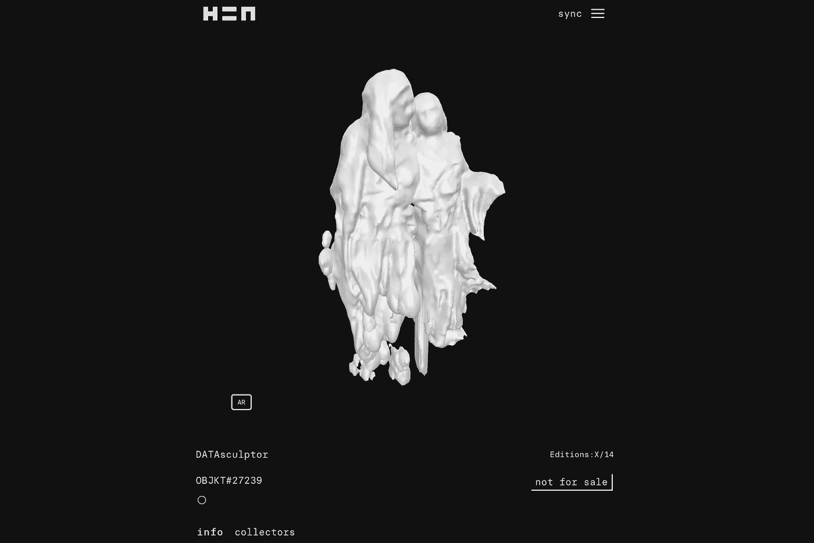

# 机器学习和形而上学

> 原文：<https://medium.com/mlearning-ai/machine-learning-metaphysics-a85a23136b1f?source=collection_archive---------4----------------------->

## 艺术空间是变革的催化剂

[https://www.hicetnunc.xyz/objkt/27239](https://www.hicetnunc.xyz/objkt/27239)

[机器学习](/mlearning-ai/what-is-machine-learning-2ec9cacb986c)和玄学。遥远的话题，但如果你想丰富和挑战你的思维，这两者都值得你关注。本文的目标是描述机器学习的概念框架。一个可以丰富哲学讨论，用艺术例子阐明其意义的框架。