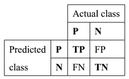
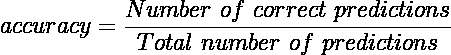
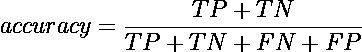
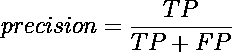
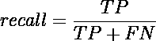
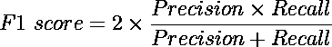

# 机器学习度量:何时使用什么

> 原文：<https://medium.com/mlearning-ai/machine-learning-metrics-when-to-use-what-78366e608481?source=collection_archive---------5----------------------->

## 了解基本的 ML 指标，并找出使用指标评估模型性能的情况。

Measuring — Photo by [Diana Polekhina](https://unsplash.com/@diana_pole?utm_source=medium&utm_medium=referral) on [Unsplash](https://unsplash.com?utm_source=medium&utm_medium=referral)

在整个发展过程中，已经引入了许多度量来评估 ML 算法或模型的性能。有时候，选择正确的度量标准来评估我们的模型是很棘手的。在这篇文章中，我试图讨论一些在与 ML 相关的任务中使用的基本度量标准，以及何时使用哪种度量标准。

在直接进入指标之前，让我们探索一个核心概念——混淆矩阵。这不是一个指标，但了解这个概念很重要，因为有些指标直接使用这个概念。

# 混淆矩阵

混淆矩阵是机器学习分类问题的性能测量，其中输出可以是两个或更多个类别。它也被称为*误差矩阵*，它允许以表格形式可视化模型的性能。混淆矩阵的每一行代表一个预测类的实例，每一列代表一个实际类的实例。下图显示了两类分类问题的混淆矩阵。

Confusion matrix. Here **P** and **N** indicate positive and negative classes respectively.

有了这个图，我们将引入一些新的术语:真阳性(TP)、假阳性(FP)、假阴性(FN)和真阴性(TN)。

## 真阳性(TP)

这个预测阳性是*实际*或者*真正阳性*。这意味着由模型预测的类别是正的，并且实际类别也是正的。例如:让我们试着识别网球的图像。对于一个图像，模型预测它像一个网球，而图像中的球实际上是一个网球。所以这是一个真正的积极因素。

## 假阳性

模型预测实例为阳性，但它为假。这意味着预测类是正的，而实际类是负的。对于前面的场景，让模型预测一个图像是网球，但它不是网球。

## **假阴性(FN)**

模型预测实例为负，这是错误的。这意味着预测类是负的，而实际类是正的。对于同一个例子，让模型预测一个图像不是网球，但它实际上是一个网球。

## 真阴性(TN)

模型预测某个实例为负，而它实际上是负的。像模型预测的那样，图像不是网球，它实际上不是网球。

有了混淆矩阵的基本概念，现在让我们从最常见的——准确性——开始，跳到我们在不同的 ML 任务中使用的矩阵。

# 准确(性)

准确性是最简单也是最常用的指标之一。它被定义为*预测总数*中的校正预测数。通常也用百分位数来表示。在这种情况下，准确性分数乘以 100。所以，

准确度也可以使用混淆矩阵来定义。它可以定义为总 TPs 和 TNs 的总和除以总数据点或实例。所以，

## 什么时候使用准确性？

当数据平衡时，即每个类包含大约相同数量的数据时，这种度量(准确性)可以反映良好的结果或理解。

## 什么时候不使用准确性？

当数据不平衡时，准确性可能不是一个明智的选择。让我们考虑一个场景:对于一个二元分类(*正*和*负*)任务，我们正在处理一个数据集，其中总数据的 75%属于正类。现在，如果每次无论如何，模型都预测数据实例为正，则模型的准确性将在 75%左右。这可能是一个不错的分数，但实际上，这个模型还不够好！

# 精确

精度表示有多少被分类为阳性的样本实际上是阳性的。Precision 试图回答这样一个问题:“多大比例的正面预测实际上是正确的？”。精度定义为:

它是真阳性和所有预测阳性(TP 和 FP)的比率。因此精度也被称为*真正精度*。

## 何时使用 Precision？

当假阴性不太重要时，可以使用精度。让我们来看看以下案例:

*   我们假设你想买几幅好画但对绘画不太了解；所以你用的是机器学习模型。只有当模特预测它是一幅好画时，你才会买它。在这种情况下，使用 precision 是一个不错的选择。因为只有当一幅画是好画的时候，你才会去买它(正确预测真阳性)。不管是预测*、【好画】、*为*、【不好的画】、*都没关系，因为它不会让你付出代价(你不会买这幅画)。但是把一幅'*不好的画'*预测成'*好的画'*会给你造成很大的成本(就像你会买一样)。最后，可以说，当假阳性的*成本高*或假阴性的*成本低*时，可以使用精度。
*   在 YouTube 推荐的情况下，可以使用 precision。因为他们想向你展示你喜欢的内容(真正的肯定)，如果他们错过了你喜欢的任何内容也没什么关系(低成本的假否定)。但是推荐你不喜欢的内容(假阳性)会导致失去你的客户(假阳性的高成本)。

# 回忆

回忆，也称为敏感度，表示需要被分类为阳性的所有数据点被分类为阳性的程度。回忆试图回答这个问题:“有多少比例的实际阳性被正确识别？”。召回可以定义为:

召回率是真阳性和所有实际阳性(TP 和 FN)的比率。召回旨在识别所有真正的阳性病例。回忆也给出了一个模型能够多精确地识别相关数据的度量。

## 何时使用召回？

当假阴性的成本很高或者假阴性更受关注时，可以使用召回。让我们来看看以下案例:

*   你设计了一个模型来预测一个人是否生病。在这种情况下，使用召回是一个明智的决定。因为如果一个人生病了，但模型预测他/她没有生病(假阴性)，这个人可能会在危急情况下遭受痛苦，甚至死亡(高成本)。另一方面，如果模型预测健康人患病(假阳性)，可以进行复查(低成本)。因此，当假阴性的*成本高*或假阳性的*成本低*时，可以使用召回。
*   假设你正在为一个每天有几千用户的产品销售网站工作。该公司希望利用用户提供的信息给每个潜在的买家打电话。你的任务是设计一个模型，可以预测一个用户是否是一个潜在的买家。在这种情况下，要评估模型的性能，您需要使用 recall。因为不能预测一个可能的买家(假阴性)会降低公司的销售额(高成本)。如果模型将一个不可能的购买者预测为可能的购买者(假阳性)，这并不重要。因为不会影响销售(成本低)。但是没有预测到可能的买家会导致巨大的损失。

# 权衡和 F1 分数

根据不同的应用，我们可以选择精度或召回。不幸的是，精确度和召回率经常处于紧张状态。也就是说，提高精确度通常会降低召回率，反之亦然(请看这里的)。这表明，如果我们想提高召回率或精确度，另一个必须是一个折衷，因此，另一个分数将减少。但是，在某些情况下，这两个指标可能都很重要。另一个被称为 *F1-score* 的指标可以同时考虑这两个指标。f1-得分是精确度和召回率的调和平均值，定义为:

F1 分数同时考虑了假阳性和假阴性，因此在这两者之间寻求平衡。

## 何时使用 F1-score？

当精确度和召回率都很重要并且具有几乎相同的成本时，可以使用该度量。让我们考虑以下场景:

让模特检查某人的健康状况，并在必要时使用药物。在这种情况下，使用 F1 分数是一个不错的选择。因为未能预测正确的疾病可能会危及生命(因此需要高召回率)，再次预测错误的疾病并应用药物可能会导致一些副作用和并发症(因此需要高精确度)。在这种情况下，可以测量并考虑 F1 分数。

在本文中，我们已经看到了度量标准如何从不同的角度评估模型。更重要的是，我们已经看到了一些场景，在这些场景中，度量可以用来更有把握地评估模型的性能。

这篇文章是作为我的一个学习过程写的。任何建议或意见都将受到高度赞赏。通过 [LinkedIn](https://www.linkedin.com/in/shahad-mahmud/) 、[脸书](https://www.facebook.com/shahad001)、[邮箱](mailto:shahad9381@gmail.com)联系我或者在 [GitHub](https://github.com/shahad-mahmud) 上找到我。

# 参考

写这篇文章对我来说是一个伟大的旅程。在这段时间里，我读了几篇文章，学到了很多东西。这些文章也帮助了我写这篇文章。我真心感谢作者。给我力量的文章如下:

*   *20 个流行的机器学习指标。第 1 部分:分类&回归评估度量*Shervin Minaee([链接](https://towardsdatascience.com/20-popular-machine-learning-metrics-part-1-classification-regression-evaluation-metrics-1ca3e282a2ce))
*   *理解混乱矩阵*作者 Sarang Narkhede ( [链接](https://towardsdatascience.com/understanding-confusion-matrix-a9ad42dcfd62))
*   *分类:精度和召回率* ( [链接](https://developers.google.com/machine-learning/crash-course/classification/precision-and-recall))
*   什么时候精确度比回忆更重要？Rajat([链接](https://datascience.stackexchange.com/questions/30881/when-is-precision-more-important-over-recall))关于[栈交换](https://datascience.stackexchange.com/)的提问