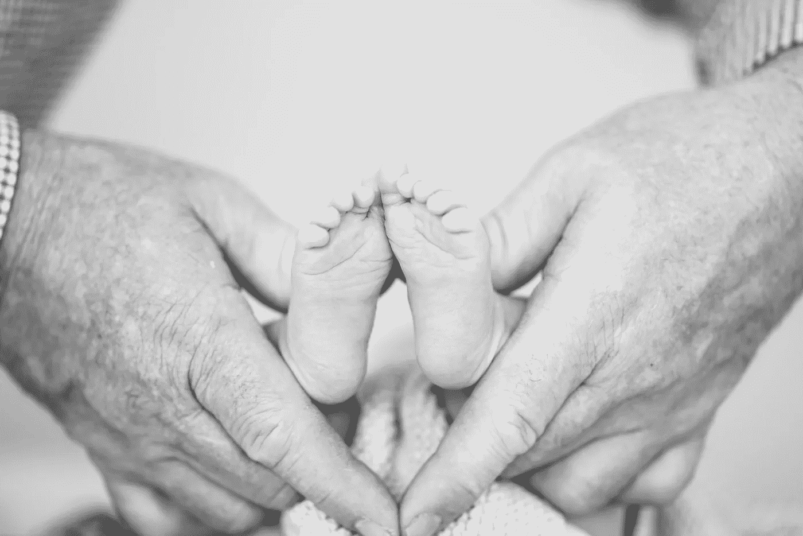
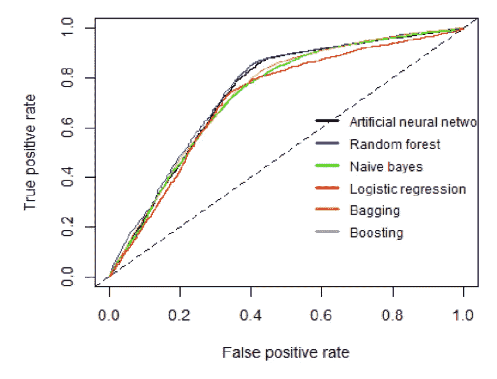
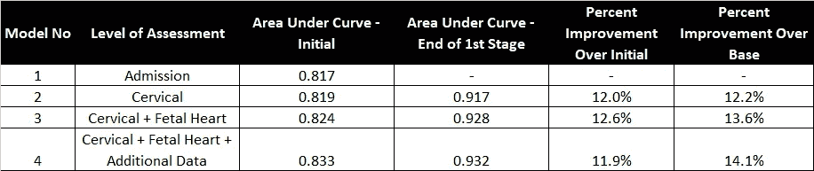
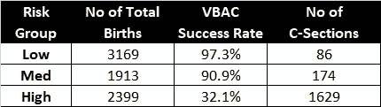

# 改善分娩选择和结果的机器学习模型

> 原文：<https://medium.com/mlearning-ai/machine-learning-models-to-improve-birth-delivery-choices-and-outcomes-d84769b45241?source=collection_archive---------1----------------------->

Photo by [Lisa Cope](https://unsplash.com/@lisa_co?utm_source=unsplash&utm_medium=referral&utm_content=creditCopyText) on [Unsplash](https://unsplash.com/?utm_source=unsplash&utm_medium=referral&utm_content=creditCopyText)

# 问题就在这里

社会在让妇女和家庭为怀孕和生育做好准备方面做得很差。我们生活在一个被审查的干净的视野中，任何了解出生的人都知道，当事情开始变得真实时，这是有问题的。IYKYK。

由于我自己的经历，我有一个目标，那就是确保分娩过程不被污名化，被拥抱，并通过分娩过程为妇女提供适当的支持。由于我们对人类经验的审查观点，看到你身体的能力可能会非常令人震惊(但相反，这是值得庆祝的)。

一个小题外话——我鼓励你研究一下[眼底](https://www.mynovabirth.com/motherbaby-blog/2016/2/1/the-contracting-power-of-the-uterus)。这是一个美丽的机制，当然是谈得不够多。简而言之，它是在分娩过程中增厚的肌肉，用于推动婴儿落地；它的增厚和产道的打开一样都是收缩的结果。在这种情况下，宫缩会让女性感到强大和受控制，而不是屈服于顺从。

> “如果(女性)有一张准确的照片，她们还能有多少力量？”—卡拉·哈特利，生育专家

所以挑战来了——女性的分娩过程与她们的身份感有着非常私人和深刻的联系，尤其是在养育新生儿的头几个月。所以我希望这就像接受这样一个事实一样简单，只要你的孩子出生并且健康，孩子是怎么出生的并不重要。但是如果你认识一个妈妈，尤其是一个新妈妈，你就会知道这不是那么容易忘记的。如果分娩是创伤性的，它会对她们的情绪健康产生深远的影响，尤其是在那些已经有很多不利因素的早期。[的第四个三月](https://www.happiestbaby.com/blogs/baby/fourth-trimester)已经够难的了，尤其是随着公共生活和抚养孩子的破裂，尤其是在 COVID 期间。所以我相信，如果我们能通过现有的方法改善分娩过程，我们就能让这些女性有一个良好的开端，并以任何可能的方式帮助她们走向成功。

 [## 国际产后支持组织

www.postpartum.net](https://www.postpartum.net/) 

> 如果你或你认识的任何人因为怀孕、生育或相关损失而感到不知所措，请查看这个资源，开始寻找支持。

# 机会来了

也许如果我们有正确的工具来确保婴儿和母亲的安全和健康，我们可以给妇女更多的空间来体验她的身体要求的分娩速度，而不是干预。我很好奇如何通过添加额外的 ML/AI 工具来改善医学和生活的这个领域。

ML/AI 可以对什么是正常的或什么可能是分娩过程中可能出错的领先指标提供额外的见解。使用几个特征(妇女的生活和健康史中的因素)，该模型可以根据以前的数据点预测需要干预的概率。该模型将提供对实时患者及其具体特征的量身定制的洞察，而不是使用“硬编码”平均值或个人先前的经验/知识。

这个工具可以让医生和助产士更好地评估他们的病人，从而更长时间地避免干预——或者，同样重要的是，在这个过程中更快地决定干预，而不是继续母亲忍受的创伤。

# 文献评论

仅关注剖宫产/分娩(c-sections)，我很好奇是否有机会避免使用它们或在必要时根据模型预测在过程中更早使用它们。在 ML/AI 和生育领域已经有了一些研究，我的文章试图总结如下。

[让孕妇和他们的医生能够使用人工智能做出知情的药物治疗决定](https://link.springer.com/article/10.1007/s10928-020-09685-1)作者 Lena Davidson&Mary Regina Boland 专注于确定人工智能方法可以用于改善对怀孕药理作用的理解的 3 个领域。这项研究是一个文献综述，但范围的未来研究领域非常好。他们发现人工智能已被应用于解决怀孕期间的药物暴露，这包括整个怀孕过程:孕前、产前、围产期和产后健康问题。他们确定了人工智能应用的未来重点领域，以了解怀孕的药理作用(1。从临床记录中获得可靠的数据，2。设计优化的动物实验来验证特定的假设，3 .实现为决策提供信息的决策支持系统)。他们得出结论，将人工智能应用于怀孕、产妇和胎儿健康的其他方面，可以为必要的研究提供信息，以更深入地研究药理学如何影响怀孕。

[预测引产干预的使用](https://www.researchgate.net/publication/348695826_Predicting_the_Use_Labor_Induction_Intervention_A_Machine_Learning_Approach_for_the_Birth-Cohort_Registry_at_A_Tertiary_Hospital_in_North_Tanzania)Clifford Silver Tarimo 等人研究了一种预测引产使用的机器学习方法。他们研究了 21000 次分娩，其中 41%是引产。他们发现，随机森林在预测孕妇使用引产干预的准确性(0.75)和 AUC-ROC (0.75)方面表现最佳。发现最重要的特征是:胎次(定义为她生下一个胎儿的次数，活的或不活的，年龄 24 周或以上)，母亲年龄，体重指数，胎龄和出生体重作为诱导的预测因素。本研究的发现是，与传统的逻辑回归模型相比，最大似然法在预测诱导的使用方面提供了更好的性能。

RF ML model for predicting intervention during labour, AUC-ROC = 0.75 — Clifford Silver Tarimo et al.

[使用机器学习模型的实时数据分析显著提高了对阴道分娩成功的预测](https://pubmed.ncbi.nlm.nih.gov/32434000/)Joshua gued alia 等人使用 ML 模型中第一产程的实时数据，发现这显著提高了对阴道分娩成功的预测。他们研究了分娩第一阶段的 94，480 例分娩，包括 1.8 亿个数据点，并使用了 4 个不同级别的准确性评估。他们发现，实时评估的使用改善了入院数据基线(平均 12.2%)的模型，这项研究表明，使用生命体征作为模型的一个特征可以在预测阴道分娩的成功方面提供更好的结果。

Results of adding real-time data to model predictions — Joshua Guedalia et al.

[利用机器学习预测剖腹产后阴道分娩](https://pubmed.ncbi.nlm.nih.gov/32007491/)Michal Lipschuetz 等人利用机器学习预测剖腹产后阴道分娩是否会成功( [VBAC](https://www.webmd.com/baby/vaginal-birth-after-c-section#1) )。这项研究的基本原理是应用 ML 算法来分配一个个性化的风险评分，以帮助决策，并有助于降低剖宫产率。该数据集包括 9，888 例分娩，其中 1 例先前剖宫产，其中 7，473 例分娩尝试阴道分娩，成功率为 88%。基于这些数据，开发了一个基于机器学习的模型来预测阴道分娩何时会成功。

建立了一个预测模型，发现当使用第一次产前访视期间可用的特征时，该模型返回的 AUC-ROC 得分为 0.745，当添加分娩过程附近可用的特征时，该得分增加到 0.793。

后来建立了一个分类模型，使用风险分层工具将分娩分为低、中和高风险组，以确定是否需要再次剖宫产。下表中的结果压倒性地表明，对于中低风险的母亲来说，VBAC 是成功的。

Model Predictions — Michal Lipschuetz et al.

> 将该模型应用于选择重复剖宫产的产妇(2，145 例)表明，如果尝试分娩，这些产妇中的 **31% (665 例)将被分配到低风险和中风险组。**

这不是一个详尽的文献综述，但是这些研究表明，当数据可用时，应用 ML/AI 改善母亲结果的能力。要点是我们可以使用 ML 来预测分娩的结果；下一步可能是用人工智能来预测未来的出生。

# 如果我决定去读博士

基于上述文献综述，我认为我们可以继续发展 ML/AI 在怀孕和分娩领域的应用，只要能够访问大型数据集。

在做数据科学项目的白日梦时，如果可以的话，我想建立一个分类模型来预测母亲是否会期望需要剖腹产才能成功分娩孩子，该模型结合了其他特征，如社会经济和情感健康因素，如:

*   母亲在怀孕期间冥想吗？
*   母亲在怀孕期间有哪些感受？
*   她的支持系统是什么样的？
*   她对生育的心态是怎样的？
*   她在分娩支持小组吗？
*   谁是她的护理提供者？(助产士、分娩中心、家庭医生、妇产科医生)
*   怀孕期间的生命体征
*   分娩阶段的生命体征

有趣的是，预测在分娩阶段的什么时候，这些特征预测结果是剖腹产。例如，如果所有变量都导致第一阶段的“是”剖宫产，那么医生和助产士可能会比其他情况下更快地停止阴道分娩的尝试(假设母亲和婴儿已经不在痛苦中，并且是更小的特征开始影响分娩模式)。此外，该模型可能能够延长真正不想剖宫产的母亲的决定，希望边缘特征可以随着更多的时间/不同的方法而改善。

这项研究的结果旨在揭示更大的社会问题，促进自我主张，特别是在怀孕期间。这种模式可以用来增强人们的心态(减轻对出错的恐惧),即女性生来就是为了分娩的，如果她们能够接受这个过程的话。如果我们知道从医学上讲一切都没问题，我们能走出自己的方式，相信他们能做到吗？

# TL；速度三角形定位法(dead reckoning)

*   怀孕和生产是人体的光荣过程。
*   社会让我们对原始的、自然的出生过程视而不见，这是一种耻辱。这让女性猛然醒悟，她们无法忍受这一过程。尤其是第一次做母亲的人不知道她们将要面对什么——也不知道她们能做到这一点。因此，我们认为这些过程是“错误的”,因为 IYKYK it 肯定感觉不“正确”。
*   ML/AI 可以对什么是正常的或什么可能是分娩过程中可能出错的领先指标提供额外的见解。这种工具可以让医生和助产士对实时患者及其具体特征进行量身定制。其结果将是减少对母亲和婴儿的创伤，并在抚养新生儿的早期阶段(即[“第四个三个月”](https://www.happiestbaby.com/blogs/baby/fourth-trimester))更有可能获得良好的情绪健康。

# 结论

我们所能做的任何帮助母亲成功的事情，无论是身体上的康复还是精神上的，都是值得重视的。我们越是能听到女性的声音，尤其是在创造技术方面，我们就越会觉得受到支持，解决方案也应该更好。

像许多医学问题一样，我们被比作平均值，这些可能被视为绝对真理。再加上医生的时间和精力都很紧张，做出的决定可能会有所不同。ML/AI 模型可以成为一种工具，帮助增强妇女在“T2”知情同意旅程中的权能。

> 首先要做的是——更多女性的声音在餐桌上提问。尤其是涉及到女性健康的时候。

你在你的世界里看到了什么问题？你对哪些充满热情？如果这些问题得到改善，世界会变成什么样子？

I am passionate about helping women owning their power and doing great things with it ❤

我承认这并不是每个人的经历，我在描述这里的问题时使用了大的“总括”。本文并不试图代表所有人，也不打算是一个彻底的检查。本文旨在强调当前存在的一些机会，我邀请其他人根据自己的经历撰写文章，为这个领域做出贡献。