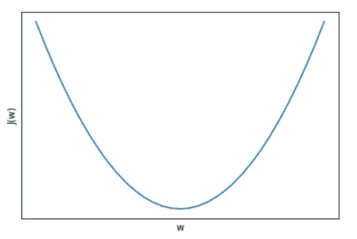
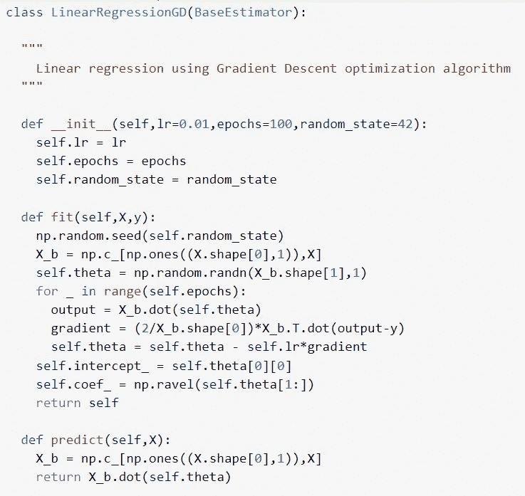
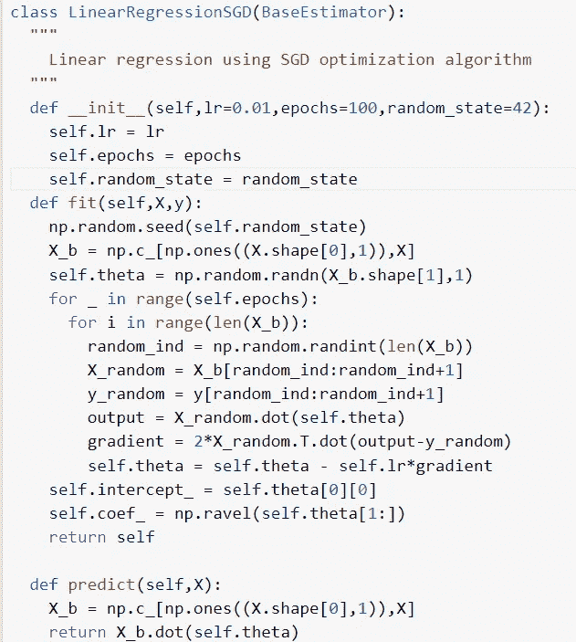
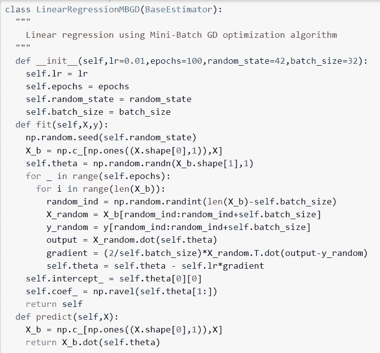
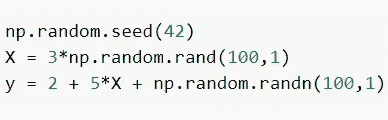
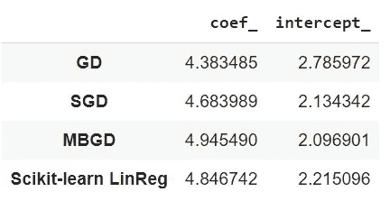
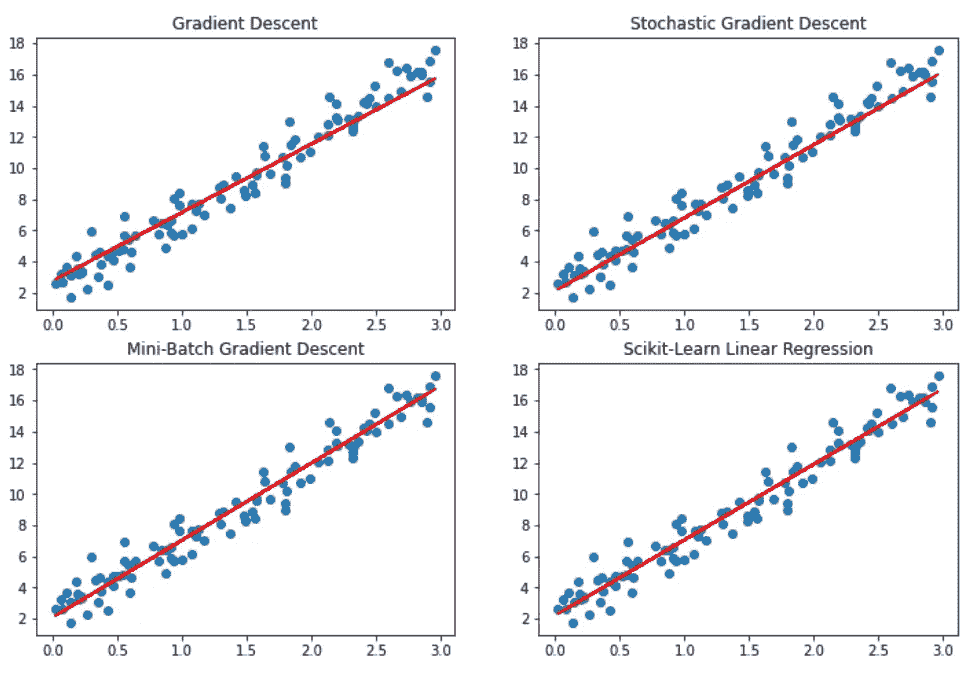

# 机器学习优化算法 1:梯度下降

> 原文：<https://medium.com/mlearning-ai/machine-learning-optimization-algorithms-1-gradient-descent-258dfb5987e1?source=collection_archive---------3----------------------->

[萨提亚·克里希南·苏雷什](https://www.linkedin.com/in/sathya-krishnan-suresh-914763217/)，[顺穆加布里亚 P](/@pshunmugapriya)

**简介:**
优化算法是机器学习算法从数字中学习的过程中不可或缺的一部分。有几种优化算法，但最常用的是梯度下降及其变体。在这篇文章中，让我们看看梯度下降(GD)，随机梯度下降(SGD)，小批量梯度下降(MBGD)。

**梯度下降:**
假设你站在一座山顶上(几乎所有人都用这个例子来解释梯度下降，没有更好的例子了)，你想到达一个山谷或地面。你将试图通过感觉脚下地面的坡度来到达目标，你将开始朝着坡度向下的方向朝目标走去。这正是梯度下降的工作原理。

许多 ML 算法，如线性回归、逻辑回归等，都使用 GD 或它的变体。但我们必须明白的重要一点是，优化算法和成本函数是协同工作的。你甚至可以说，成本函数是基于所使用的优化算法或其他方式来选择的。所以为了让 GD 工作，我们需要一个形状为凸的代价函数。想象一下上面的例子。从山顶到山谷的路径形成一个凸函数。在数学术语中，该谷被称为全局最小值，并且 GD 算法将达到全局最小值。

现在让我们看看 GD 是如何工作的。GD 在每次迭代中计算成本函数的导数。然后将它乘以学习率，学习率是我们希望 GD 算法在试图达到全局最小值时所采取的步长。因为我们想去梯度的相反方向，所以我们把梯度的负值加到权重上并更新它们。这就是 GD 在单次迭代中所做的。通过重复迭代，GD 将能够通过达到全局最小值来计算正确的权重。

学习率和迭代次数是我们应该小心的两个超参数。学习率是一个重要的超参数。如果选择正确，可以在短时间内达到全局最小值，否则 GD 将会超调，它将永远无法达到全局最小值。迭代的次数是我们允许模型看到我们的数据的次数。它与学习速度有相互依赖的关系。如果学习率太小，这意味着 GD 算法仅朝着全局最小值迈出很小的步伐，因此，为了使模型达到全局最小值，历元必须更高。必须尝试学习速率和时期的不同组合，以找到最佳模型。

现在让我们来看看使用梯度下降的线性回归的实现。

fit 方法中的“for loop”构成了该类的主要部分，因为该部分是查找要素权重的部分。那三条线实现了梯度下降。

即使保证 GD 将达到全局最小值，也将花费大量时间，因为在每次迭代期间，计算每个实例的梯度。GD 算法也可能需要很长时间来摆脱局部极小值。

**随机梯度下降:**
顾名思义随机梯度下降(SGD)在梯度下降算法中引入了随机性。这是通过一次只选择一个随机实例进行训练，而不是选择整个训练数据来实现的。SGD 的成本函数不会平滑地降低，因为模型每次都是在随机实例上训练的。对于一个实例，成本函数可能减小，而对于下一个实例，成本函数可能增大。因此，当涉及 SGD 时，成本函数仅平均降低，而在 GD 中平稳降低。

SGD 的主要缺点是它永远无法达到全局最小值。它将达到一个接近全球最小值的点。这是因为它的随机性。通过一次只使用一个实例，减少了到达接近全局最小值的点所需的时间。这种随机性也有助于避免局部极小值。SGD 用的很多，因为它支持在线学习。

让我们来看一个用 SGD 构建的线性回归模型。

在上面的代码中，我使用了一个固定的学习速率，而专业使用的 SGD 算法使用的学习速率随着历元数的增加而降低。这样做是为了减少模型的随机性，因为它变得接近全局最小值。

**小批量梯度下降:**
小批量梯度下降是梯度下降和随机梯度下降的混合。在小批量 GD 中，我们随机选择一组特定大小的实例，称为批量大小，我们在这些实例上训练我们的模型进行一次迭代。在接下来的迭代中，选择相同大小的不同实例集，并在这些实例集上训练我们的模型。迷你批量 GD 两全其美。与 SGD 相比，它的成本函数平滑地降低，它能够达到非常接近全局最小值的点，最终它比 GD 更快。小批量 GD 也在在线学习系统中大量使用。

下面给出了使用小批量 GD 实现线性回归的代码。

**算法比较:**
我们将看看每个算法如何与 [scikit-learn](https://scikit-learn.org/stable/) 实现“线性回归”一起执行。

让我们来看看我们的玩具数据集。

这些是学习率为 0.01 和 100 个时期的算法获得的权重值。你可以看到小批量 GD 表现最好，它的值非常接近玩具数据集中的值。

最后，我们来看看这些算法发展出来的直线。你可以清楚地看到 Mini-Batch GD 和 scikit-learn 的 LinearRegression 比 GD 和 SGD 表现得更好。最终代码可在[这里](https://github.com/SathyaKrishnan1211/Medium-Article-Code)获得。

**结论:**
机器学习中还有很多优化算法，我会试着写一下。希望你喜欢这篇文章。如果你喜欢这篇文章，请订阅并留下评论。

 [## Mlearning.ai 提交建议

### 如何成为 Mlearning.ai 上的作家

medium.com](/mlearning-ai/mlearning-ai-submission-suggestions-b51e2b130bfb)