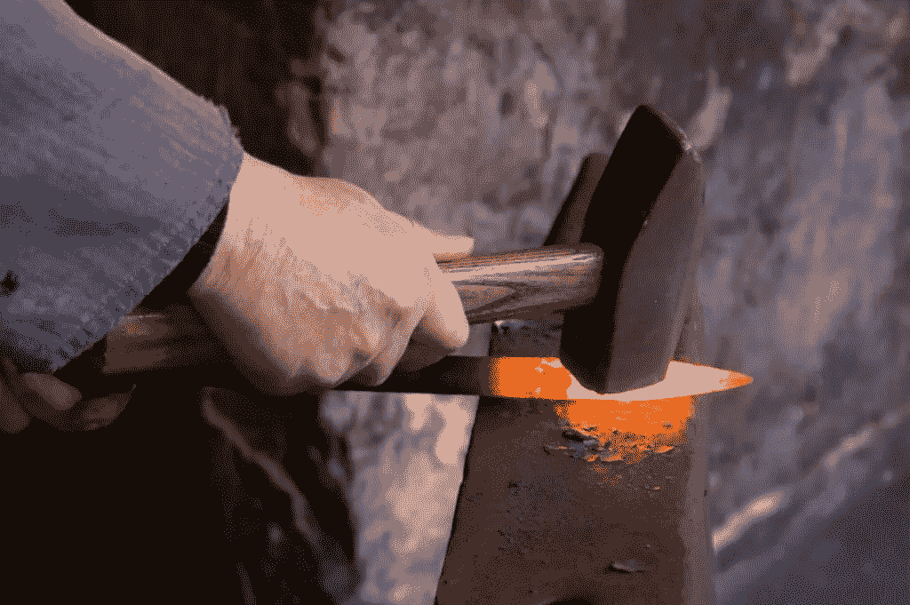

# 【ML 算法交易】第二部分——如何构建你的机器学习样板？

> 原文：<https://medium.com/mlearning-ai/machine-learning-part-ii-how-to-build-your-machine-learning-boilerplate-49a0145d1993?source=collection_archive---------2----------------------->

> ***往期阅读***
> 
> [【机器学习】第一部分——10 分钟学习我所知道的量化交易中的 ML](/@mikelhsia/machine-learning-part-i-10-minutes-to-learn-what-i-know-about-ml-in-quantitative-trading-55a2507b7188)

为了跟进我们在[上一篇文章](/@mikelhsia/machine-learning-part-i-10-minutes-to-learn-what-i-know-about-ml-in-quantitative-trading-55a2507b7188)中学到的内容，这里我们将快速演示如何构建自己的机器学习样板。我们将讲述我们在…中介绍的步骤