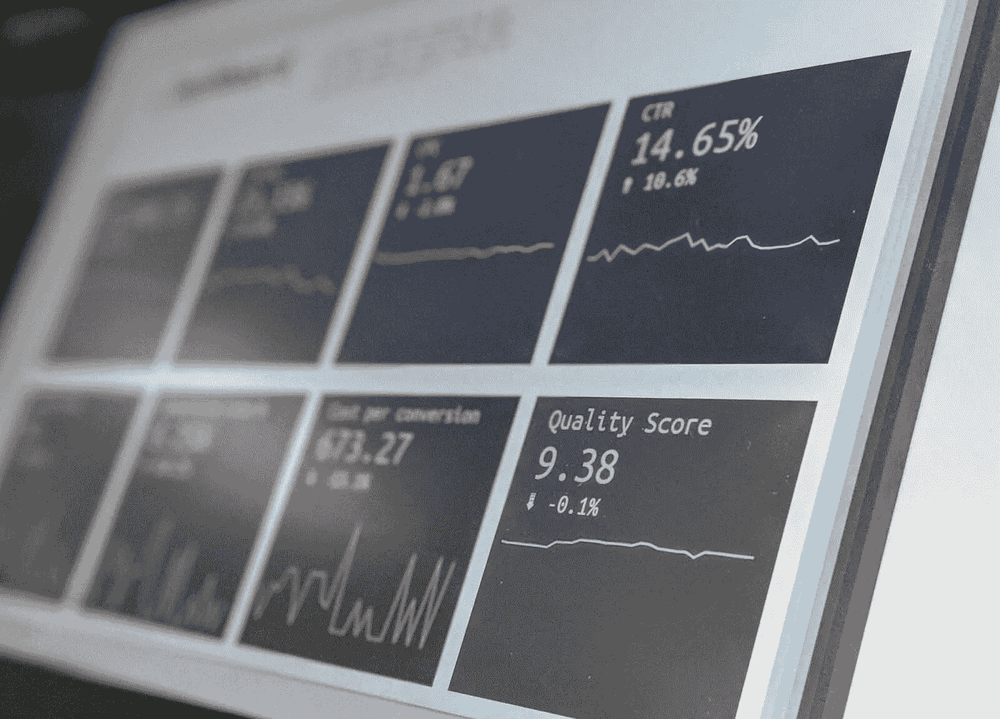

# 【ML Algo trading】第四部分——如何分析我的机器学习策略有多好？

> 原文：<https://medium.com/mlearning-ai/machine-learning-part-iv-how-to-analyze-how-good-my-machine-learning-strategy-is-223d895fca40?source=collection_archive---------6----------------------->

唷！在获取数据、处理因素、分割训练和测试数据集、选择正确的模型进行训练的所有艰苦工作之后，您最终训练了您的机器学习模型，并能够测试它有多强大。你非常兴奋地提供了一堆测试数据，并获得了 100%以上的回报率。多么成功啊！但是要小心…