# 机器学习管道

> 原文：<https://medium.com/mlearning-ai/machine-learning-pipelines-ee5357579cf3?source=collection_archive---------3----------------------->

关于如何使用 Scikit Learn 构建有效的 ML 管道的快速复习。


Photo by [Roger Starnes Sr](https://unsplash.com/@rstar50?utm_source=medium&utm_medium=referral) on [Unsplash](https://unsplash.com?utm_source=medium&utm_medium=referral)

# 介绍

Scikit-Learn 中的流水线是一串**变压器**和一个最终**估计器**。它们一起被称为**管道**。

它被设计成一个的输出是另一个的输入。在下图中，您将看到带有 1，2，3…，n 个**变压器**和一个**估算器**的管道，用于创建管道。

当输入数据时，这个管道根据模型学习给出预测。

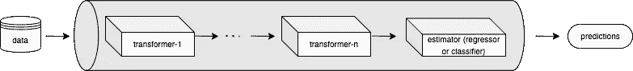

Fig-1: A simple machine learning Pipeline

机器学习管道**有助于标准化开发过程，有助于构建高效准确的模型**。

## 变形金刚(电影名)

转换器用于清理、过滤或修改数据。这是数据预处理的一部分。

Scikit-learn 为不同的活动提供了一个变形库，例如

1.  清理数据(预处理)，
2.  缩小尺寸(维度减少)
3.  扩展大小(内核近似值)
4.  生成要素制图表达(要素提取)

这些转换器类别由以下方法表示:

*   `fit()` *方法*:从训练集中学习模型参数(如标准化的平均值和标准偏差)
*   `transform()` *方法*:将这种转换模型应用于看不见的数据
*   `fit_transform()` *方法*:对于训练数据的建模和转换，同时进行可能更方便、更高效

## 评估者

估计器是从数据中学习的任何对象。它可以是分类、回归、聚类算法或从原始数据中提取/过滤有用特征的转换器。

estimator 类实现了以下方法:

*   `fit()`方法:从数据中学习
*   `predict()`方法:预测结果(回归或分类)

# 示例使用案例

在这个用例中，我们将使用 **Titanic** 数据集。在这个数据集中，我们将在某些列上应用一些常见的转换器，然后我们将使用决策树估计器来对乘客的生死进行分类。

## 计划

这是我们用例的计划大纲。

为了让我们的用例容易理解，让我们看看下面的图表。这将使您在视觉上对管道有一个相当好的了解。

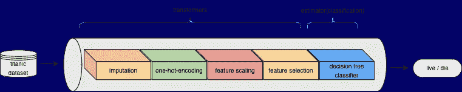

Fig-2: Pipeline with 4 transformers

## 资料组

```
# Importing necessary libraries
import pandas as pd
import numpy as np
from sklearn.datasets import fetch_openml
from sklearn.model_selection import train_test_split
from sklearn.compose import ColumnTransformer
from sklearn.impute import SimpleImputer
from sklearn.preprocessing import OneHotEncoder
from sklearn.preprocessing import MinMaxScaler
from sklearn.pipeline import Pipeline, make_pipeline
from sklearn.feature_selection import SelectKBest, chi2
from sklearn.tree import DecisionTreeClassifier
from sklearn import set_config# config to show pipeline visually
set_config(display='diagram')
```

现在我们已经导入了所有必要的库，让我们从 Titanic 数据集获取数据

```
# fetch the data
dataset = fetch_openml("titanic", version=1)# check the data
dataset['frame'].head()
```

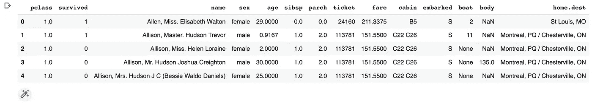

我们不需要这里的所有特性，所以我们可以安全地忽略一些对我们来说不太重要的特性。

```
# features
features = dataset.frame# drop the columns that we don't need
features = features.drop(['name', 'ticket', 'cabin', 'survived', 'boat', 'body', 'home.dest'], axis=1)# check the features
features.head()
```

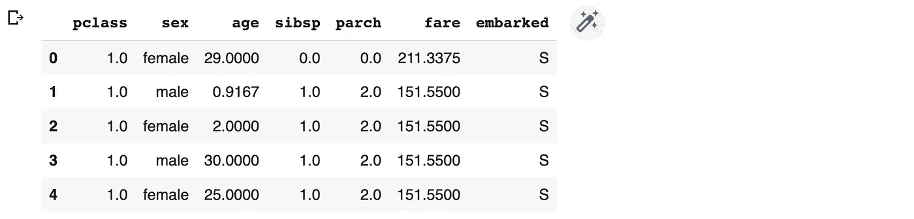

```
# columns description"""
pclass: passenger class
name: name of passenger
sex: male or female
age: age of passenger
sibsp: siblings of other passenger
parch: number of parent-child
fare: ticker fare
embarked: passenger boarded from (There are three possible boarding points: Southampton[S], Cherbourg[C], Queenstown[Q])
"""
```

这个数据集还带有目标列。因此，让我们从它的目标列。

```
# target
target = dataset.target# check the target
target.head()
```

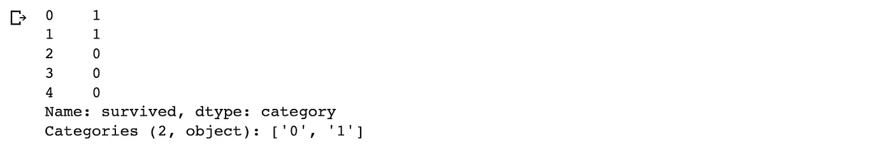

```
# train-test split
X_train, X_test, y_train, y_test = train_test_split(features, target, test_size=0.2, random_state=42)# see the sample training on features
X_train.head()
```

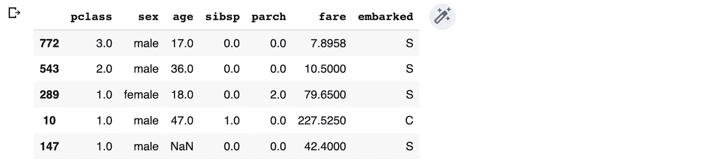

```
# see the training data on target
y_train.head(5)
```

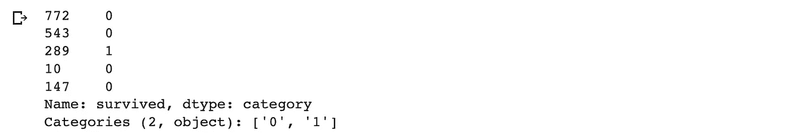

## 变形金刚(电影名)

变压器是管道的重要组成部分。这将把数据转换成各种形式，如清理、缩放或特征工程。这些被称为`ColumnTransformers`。

现在，按照下面的图表，我们将一个接一个地实现变压器。


以下是使用的变压器:

1.  插补:这里我们将使用`SimpleImputer`变压器
2.  一热编码:这里我们将使用`OneHotEncoder`变压器
3.  特征缩放:这里我们将使用`MinMaxScaler`变压器
4.  特性选择:这里我们将使用`SelectKBest`变压器

最后，我们将使用一个分类器来预测我们的结果。这里我们就用`DecisionTreeClassifier`。

## 简单输入变压器

在这个转换器中，我们将检查数据集是否有丢失的值。

对于将有缺失值的列，我们必须应用 SimpleImputer 来处理缺失值。

```
# check for missing values
features.isnull().sum()
```

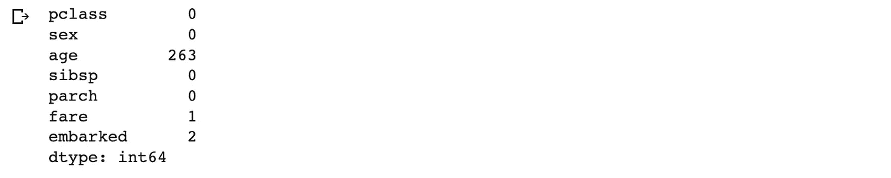

我们可以看到`age`列和`embarked`列缺少值。在`fare`上，只缺少一列，所以我们在这里尽量忽略它。

```
# Imputation tansformer
trfOne = ColumnTransformer(
[('impute_age', SimpleImputer(), [2]),
('impute_embarked', SimpleImputer(strategy='most_frequent'), [6])],
remainder='passthrough')# check if correctly set
trfOne
```

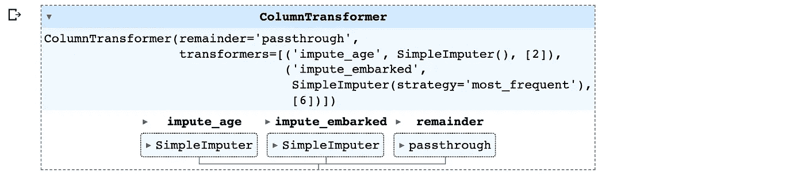

## OneHotEncoder 变压器

将分类特征编码为一个独热数值数组。

在我们的数据集中，我们看到`sex`列有分类数据(男性或女性)，而`embarked`列有分类数据(Q 或 S 或 C)。

如果我们以数值的形式提供所有的列，我们的模型会表现得更好。为此，我们将对`sex`列和`embarked`列应用 OneHotEncoder。

```
# OneHotEncoding transformer
trfTwo = ColumnTransformer(
[('ohe_sex_embarked', OneHotEncoder(sparse=False,
handle_unknown='ignore'), [1,6])],
remainder = 'passthrough')# check if correctly set
trfTwo
```

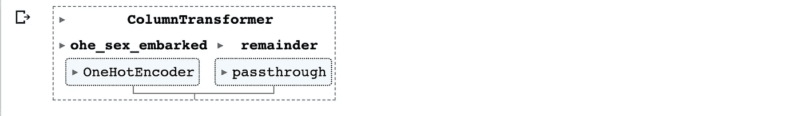

## 缩放变压器

在这个转换器中，我们将使用 Scikit-learn MinMaxScaler 缩放值。这将应用于所有数字列。由于不同的列有不同的值，因此缩放将使它们达到统一的比例。

如果你有兴趣了解更多关于缩放的知识，我有一个专门的博客。点击查看链接[。](/@sc050409/the-modern-rules-of-feature-scaling-in-machine-learning-236b1ce4f818)

```
# Scaling Tranformer
trfThree = ColumnTransformer([('scale', MinMaxScaler(), slice(0,10))])# check the transformer
trfThree
```

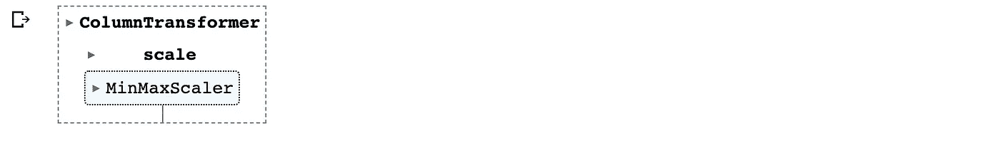

如果您仔细注意，我已经将 MinMaxScaler 应用于从 0 到 10 的所有列。你应该想知道当我们只有 7 列时，为什么我们选择 10 列。

答案很简单，当我们进行 OneHotEncoding 时，我们会删除两个列`sex`和`embarked`，但随后我们还会再添加 2 个与`sex`相关的列和 3 个与`embarked`相关的列。OneHotEncoding 就是这么做的。点击查看详情[。](https://scikit-learn.org/stable/modules/generated/sklearn.preprocessing.OneHotEncoder.html)

## 特征选择转换器

为了选择特性，我们将使用 Scikit-Learn 的 SlectKBest。顾名思义，这将帮助我们从算法将挑选的所有特征列表中选择前 K 个最佳特征。我们还将使用 chi2，这是一种评分算法，用于根据分数选择最佳特性。

```
# feature selection
trfFour = SelectKBest(score_func=chi2, k=5)# see the details
trfFour
```


## 编码器

现在，当我们准备好所有的转换器后，我们将把转换后的数据输入编码器。这些只是机器学习模型，现在将从这些转换的数据中学习并做出预测。

## 决策树分类器

对于这个问题，我们将使用决策树分类器。

```
# Encoder
trfFive = DecisionTreeClassifier()# details
trfFive
```


## 完整管道

有了这个，我们就完成了我们的计划。现在让我们再看一下图表，这样我们就知道我们在做什么了


## 管道

这里，我们将在上述所有转换器和编码器的帮助下创建我们的管道。

```
# pipeline
pipe = Pipeline([('trfOne', trfOne),('trfTwo', trfTwo),('trfThree', trfThree),('trfFour', trfFour),('trfFive', trfFive)])# details
pipe
```

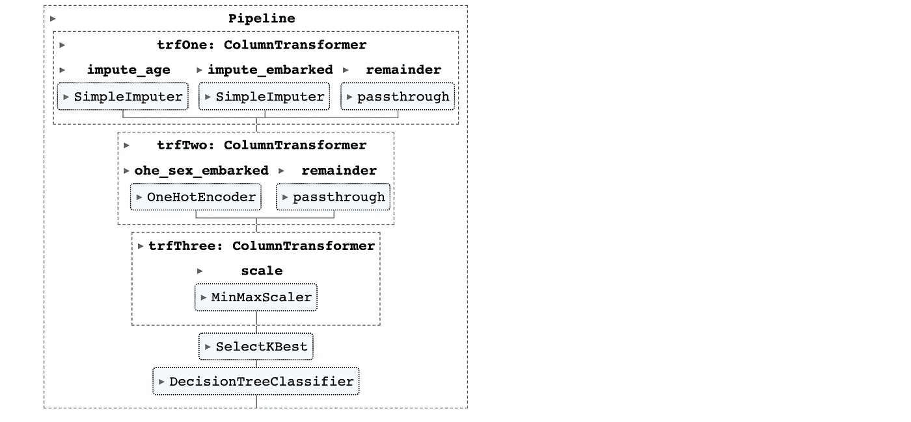

## 制作管道

还有一种创建管道的方法。除了直接使用 Pipeline，我们还可以使用 make_pipeline()。这里我们不必声明每个管道的名称。我们只需要调用这个函数中的所有组件。

```
# make_pipeline
pipe = make_pipeline(trfOne, trfTwo, trfThree, trfFour, trfFive)# check details
pipe
```

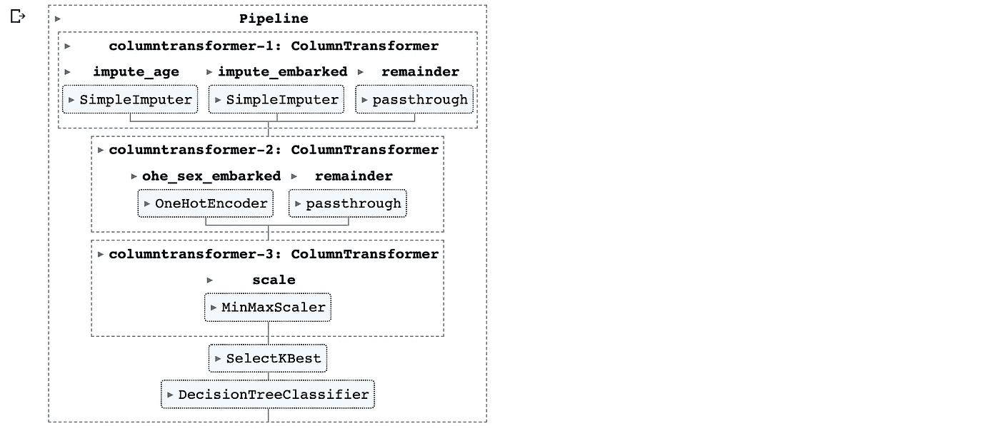

## 培养

现在我们已经准备好了管道，我们现在必须使用这个管道来训练我们的数据，看看它是否能够预测预期的结果。

但在此之前，如果我们调用我们的`pipe.fit()`方法，它也会给我们整个管道的图。获得管道的可视化表示有多种好处。例如，有人可能只知道你对数据做了什么操作。看看这个。

```
# train the pipeline and display the graph
pipe.fit(X_train, y_train)# display the steps
pipe.named_steps
```

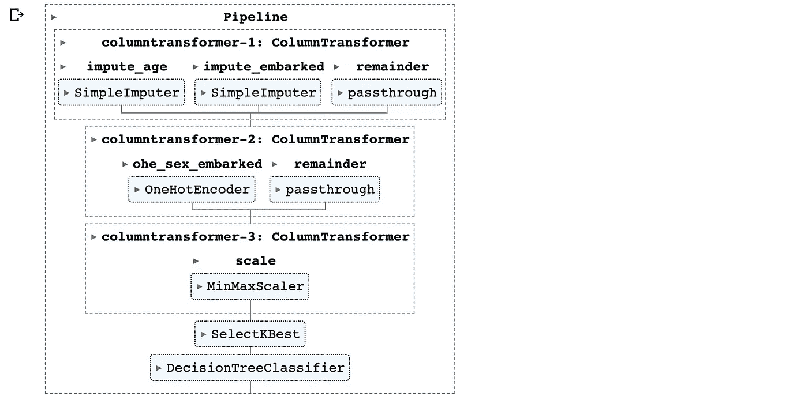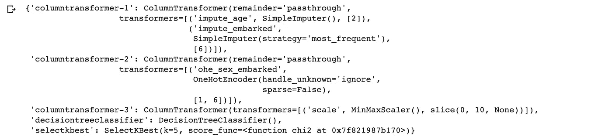

```
# display sigle step
pipe.named_steps['columntransformer-1']
```

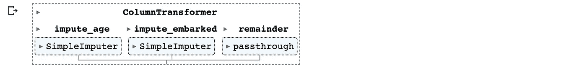

## 预言；预测；预告

既然我们已经在数据上训练了我们的管道，现在是时候进行一些预测，并检查我们的模型是否从数据中学到了一些东西。

```
# predict
y_pred = pipe.predict(X_test)# check the prediction score
from sklearn.metrics import accuracy_score
accuracy_score(y_test, y_pred)
```


因此，我们可以看到，我们的模型对其预测几乎没有 60%的信心。由于我们的重点是了解如何在这里建立一个管道，所以我们不会太关心准确性得分。

# 结论

这篇博客的目标是理解管道的概念以及如何自己构建一个管道。所以我们可以放心地忽略这里的模型分数。

我们试图按照计划一步一步地建立管道，并取得了成功。

这只是向您展示，如果您使用 Pipeline，这可以减少多少工作量。

> 代码看起来整洁干净。它也可以投入生产。您可以在项目代码中部署这个管道，并开始获得预测。

## 在你走之前…

在这篇博客中，我们学到了以下内容:

1.  机器学习中的流水线是什么
2.  什么是变压器和编码器
3.  如何建立管道
4.  如何用实际数据进行训练和测试
5.  如何将其部署到生产中

如果你跟随我到这里，我相信你一定已经对机器学习中的流水线以及如何使用它们有了很好的了解。

[](/mlearning-ai/mlearning-ai-submission-suggestions-b51e2b130bfb) [## Mlearning.ai 提交建议

### 如何成为 Mlearning.ai 上的作家

medium.com](/mlearning-ai/mlearning-ai-submission-suggestions-b51e2b130bfb)