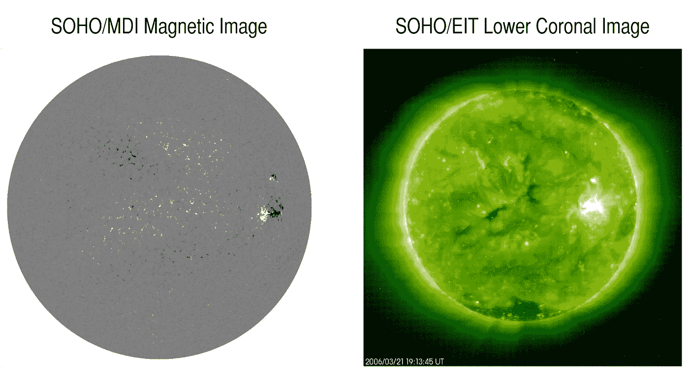

# 机器学习处理太阳天气数据

> 原文：<https://medium.com/mlearning-ai/machine-learning-processes-solar-weather-data-590462f727a2?source=collection_archive---------6----------------------->

## 科学家开发了一种新的机器学习算法，可以处理太阳任务返回的数据，减少事件检测时间。

*IMAGE: Using Solar and Heliospheric Observatory data, SwRI developed a tool to efficiently label large, complex datasets, such as the magnetogram on the left, to allow a machine learning application to identify potentially hazardous solar events. Solar flares, coronal mass ejections, prominences and sunspots are all driven by complex magnetic activity within the Sun’s interior and at its surface, illustrated by the ultraviolet image on the right. CREDIT: SwRI*

所有这些航天器的最大问题之一是接收它们发回地球的所有数据。一旦你得到了这一切…