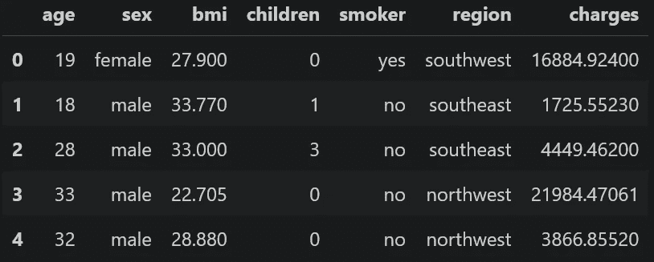
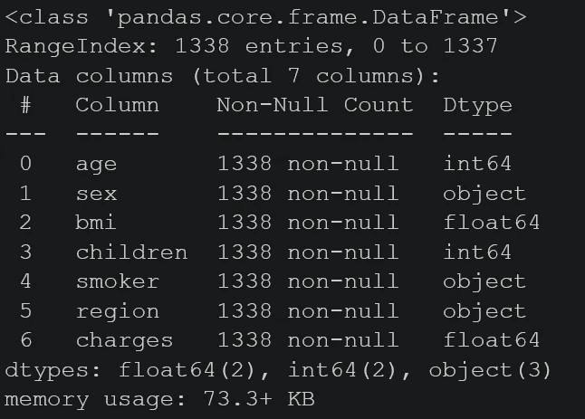
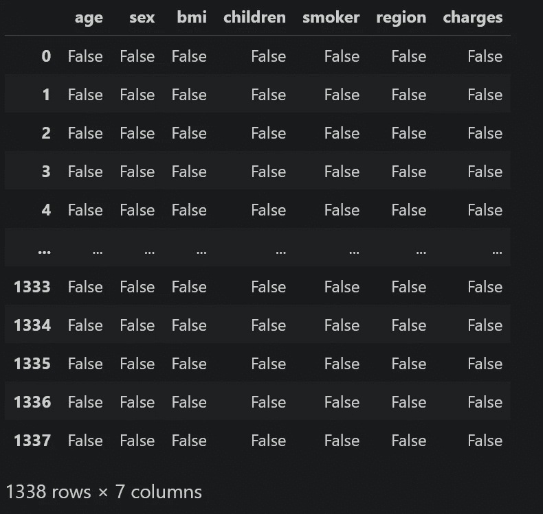
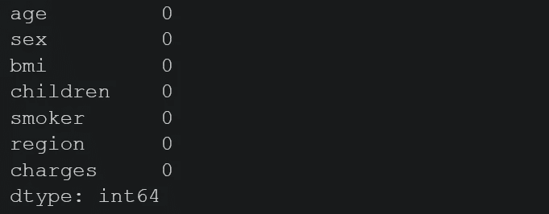
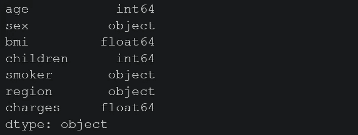
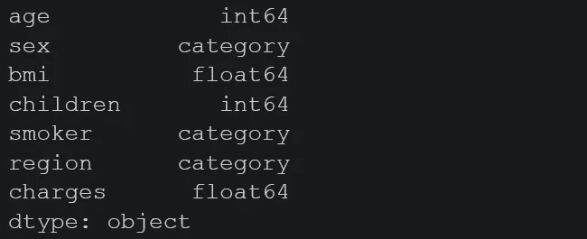
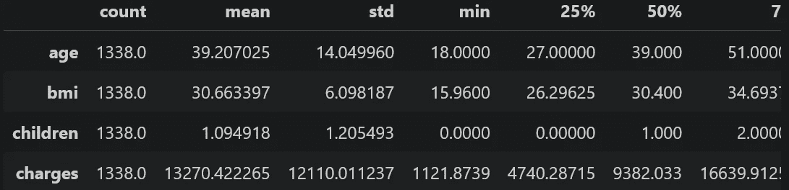
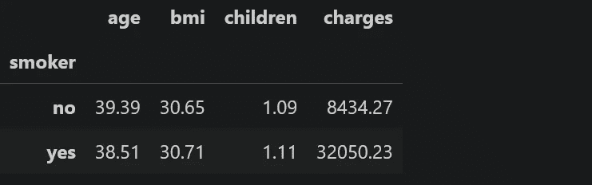
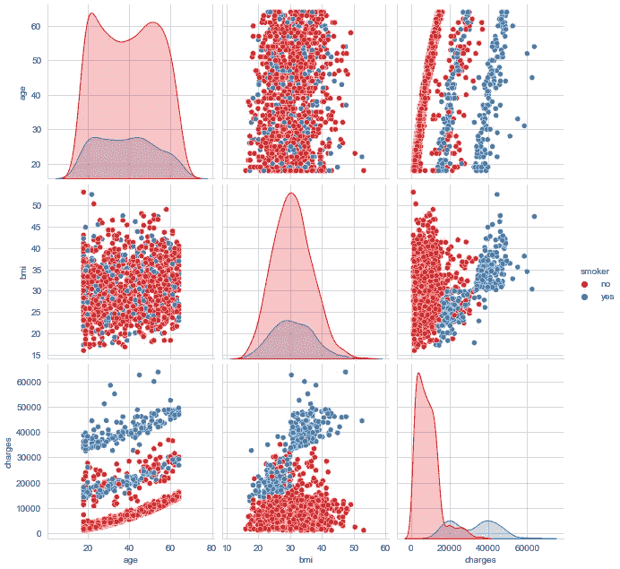
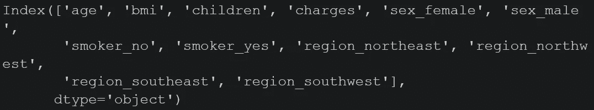

# 用 Python 构建机器学习模型的 7 个步骤

> 原文：<https://medium.com/mlearning-ai/machine-learning-project-with-linear-regression-algorithm-b433d770fefd?source=collection_archive---------0----------------------->

## 机器学习教程

## 使用医疗费用个人数据集构建线性回归模型的指南


Photo by [KOBU Agency](https://unsplash.com/@kobuagency?utm_source=medium&utm_medium=referral) on [Unsplash](https://unsplash.com?utm_source=medium&utm_medium=referral)

机器学习是人工智能的一个子集，它为机器提供了根据经验自动学习的能力，而无需显式编程。机器学习是一个伟大的领域。它在许多领域都有应用。要成为机器学习领域的专家，必须做很多项目。

在这篇文章中，我将逐步展示如何建立一个机器学习模型。我将讨论以下主题:

1.  加载数据集
2.  了解数据集
3.  数据预处理
4.  数据可视化
5.  构建回归模型
6.  模型评估
7.  模型预测法

在开始之前，请不要忘记订阅[我的 youtube 频道](https://youtube.com/c/tirendazacademy)，在那里我创建了关于人工智能、数据科学、机器学习和深度学习的内容。

让我们开始吧！

# 1.加载数据

[我将要使用的数据集](https://www.kaggle.com/mirichoi0218/insurance)包括来自病人的费用。我强烈推荐你下载这个数据集，和我一起写你的代码。你可以从[这里](https://github.com/TirendazAcademy/MACHINE-LEARNING-TUTORIAL/blob/main/29-INTRODUCTION%20MACHINE%20LEARNING.ipynb)获取我的密码。首先，让我们导入数据集。我将使用熊猫加载数据集。我先说进口熊猫。

```
import pandas as pd
```

Pandas 是一个优秀的数据加载和数据预处理库。现在，让我用 read_csv 方法加载数据集。

```
data = pd.read_csv("insurance.csv")
```

现在，让我们看看数据集的前几行。为此，我将使用 head 方法。

```
data.head()
```



正如你所看到的，有 7 列，如年龄，性别，体重指数，子女人数，吸烟，地区和收费。

# 2.了解数据集

在建立机器学习模型之前，理解数据非常重要。例如，让我们看看数据集的行数和列数。我将使用 shape 属性来完成这项工作。

```
data.shape
```


如您所见，数据集有 1338 行和 7 列。现在，我将使用 info 方法来获取有关数据集的更多信息。

```
data.info()
```



数据集中没有缺失的数据。还可以使用 isnull 方法来查看缺失的数据。

```
data.isnull()
```



让我使用 sum 方法来查看缺失数据的总和。

```
data.isnull().sum()
```



如您所见，数据集中没有丢失数据。了解列类型对于构建机器学习模型非常重要。现在，让我们来看看列的类型。为此，我将使用 dtypes 属性。

```
data.dtypes
```



# 3.数据预处理

让我们将对象类型转换为类别类型。

```
data['sex'] = data['sex'].astype('category')
data['region'] = data['region'].astype('category')
data['smoker'] = data['smoker'].astype('category')
```

让我们再来看看数据类型。

```
data.dtypes
```



现在，让我们用 describe 方法来看看数值变量的统计数据。如果我们使用数据集的转置，您可以更好地看到统计数据。

```
data.describe().T
```



现在，让我们看看吸烟者和不吸烟者的平均费用。为此，让我们首先用 groupby 方法进行分组。我将使用 round 方法只看到逗号后面的两个数字。

```
smoke_data = data.groupby("smoker").mean().round(2)
```

让我们看看烟雾数据。

```
smoke_data
```



如你所见，吸烟者比不吸烟者付出更多。

# 4.数据可视化

通过数据可视化，您可以更好地理解数据集。现在，让我们用 seaborn 来看看数字变量之间的关系。首先，让我导入 seaborn。

```
import seaborn as sns
```

Seaborn 是一个基于 matplotlib 构建的库，特别用于统计绘图。现在，我们来选择剧情风格。

```
sns.set_style("whitegrid")
```

我将使用 pairplot 方法来查看数值变量之间的关系。

```
sns.pairplot(
    data[["age", "bmi", "charges", "smoker"]],
    hue = "smoker",
    height = 3,
    palette = "Set1")
```



例如，当年龄变量增加时，吸烟者和不吸烟者都支付更多。现在，让我们看看变量之间的相关性。

```
sns.heatmap(data.corr(), annot= True)
```


请注意，电荷和其他变量之间有关系。

## 一键编码

现在，我将对数据集中的分类变量进行一次性编码。这对熊猫来说很容易做到。您可以使用 Pandas 中的 get_dummies 方法自动将分类数据转换为一键编码。让我们将分类数据转换成一次性编码。

```
data = pd.get_dummies(data)
```

因此，只有分类数据被转换为一次性编码。现在让我们看看数据集的列。

```
data.columns
```



如您所见，已经为每个子类别创建了新列。使用熊猫非常容易。谢谢，熊猫们！因此，数据集已准备好构建模型。让我们继续建立一个回归模型。

# 5.构建回归模型

建立模型时，应该从最简单的模型开始。如果没有得到很好的精度，可以尝试更复杂的模型。我将建立一个线性回归模型，因为输出可变费用是数字类型。

在建立机器学习模型之前，我们需要确定输入和输出变量。输入变量是特征。在统计学中，这些被称为独立变量。输出变量是目标变量。在统计学中，这个变量称为因变量。让我们把目标可变费用赋给变量 y。

```
y = data["charges"]
```

如果我们去掉目标变量，剩下的就是特征。

```
X = data.drop("charges", axis = 1)
```

在建立模型之前，数据集被分为训练和测试两部分。用训练数据建立模型，用测试数据评估模型。您可以使用 scikit-learn 中的 train_test_split 方法将数据集拆分为训练和测试。使用这种方法，您可以轻松地拆分数据集。首先，我们来导入这个方法。

```
from sklearn.model_selection import train_test_split
```

让我们将数据集分成 80%的训练和 20%的测试。

```
X_train,X_test,y_train,y_test=train_test_split(
    X,y, 
    train_size = 0.80, 
    random_state = 1)
```

现在，让我们建立模型。让我从 scikit-learn 导入线性回归类。

```
from sklearn.linear_model import LinearRegression
```

让我创建一个 LinearRegression 类的实例。

```
lr = LinearRegression()
```

我将使用训练数据建立模型。

```
lr.fit(X_train,y_train)
```

太美了。我们的模型建成了。

# 6.模型评估

让我们来看看模型的性能。为此，我将使用决定系数。该值越接近 1，模型越好。首先，我们来看看模型在测试数据上的得分。

```
lr.score(X_test, y_test).round(3)#Output: 
0.762
```

测试数据的决定系数大于 0.7。我们的模型还不错。当然，如果更接近 1 就更好了。现在，我们来看看模型在训练数据上的得分。

```
lr.score(X_train, y_train).round(3)#Output: 
0.748
```

如您所见，模型在训练数据上的性能接近测试数据的性能。如果模型对训练数据的性能很高，则意味着存在过拟合问题。你可能会问怎么解决过拟合问题？要克服过度拟合问题，可以使用正则化。脊或套索模型可用于此。

现在，让我们看看另一个指标，均方差，来评估这个模型。为此，我们先用 predict 方法预测一下测试数据。

```
y_pred = lr.predict(X_test)
```

现在，让我们导入均方误差指标。

```
from sklearn.metrics import mean_squared_error
```

我现在要使用这个指标。首先，让我导入数学模块，因为我要计算这个指标的平方根。

```
import math
```

我们来看看均方误差的平方根。

```
math.sqrt(mean_squared_error(y_test, y_pred))#Output: 
5956.45
```

该值意味着模型预测的标准偏差为 5956.45。

# 7.模型预测法

现在，我将以预测第一行为例。首先，让我们选择训练数据的第一行。

```
data_new = X_train[:1]
```

让我用我们的模型来预测数据。

```
lr.predict(data_new)#Output:
10508\. 42
```

让我们来看看真正的价值。

```
y_train[:1]#Output:
10355.64
```

如你所见，我们的模型预测接近真实值。

# 结束语

我展示了一个使用真实数据集的应用程序。如你所见，用 Python 库建立机器学习模型非常容易。就是这样。我希望你喜欢它。感谢您的阅读。

别忘了在 YouTube 上关注我们

[](/geekculture/8-best-seaborn-visualizations-20143a4b3b2f) [## 8 个最好的 Seaborn 可视化

### 使用企鹅数据集与 Seaborn 一起动手绘制统计图。

medium.com](/geekculture/8-best-seaborn-visualizations-20143a4b3b2f) [](/geekculture/6-steps-to-become-a-machine-learning-expert-5a1f155f7207) [## 成为机器学习专家的 6 个步骤

### 成为机器学习专家需要知道的一切。

medium.com](/geekculture/6-steps-to-become-a-machine-learning-expert-5a1f155f7207) [](/mlearning-ai/mlearning-ai-submission-suggestions-b51e2b130bfb) [## Mlearning.ai 提交建议

### 如何成为 Mlearning.ai 上的作家

medium.com](/mlearning-ai/mlearning-ai-submission-suggestions-b51e2b130bfb) 

如果这篇文章有帮助，请点击拍手👏按钮几下，以示支持👇