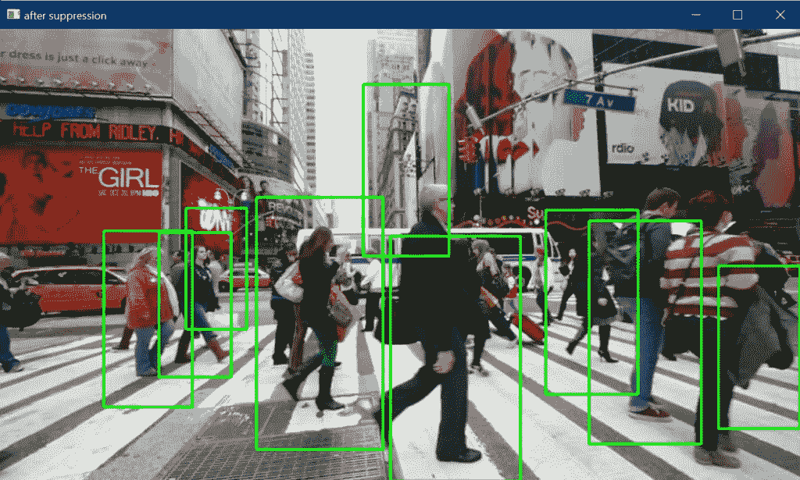
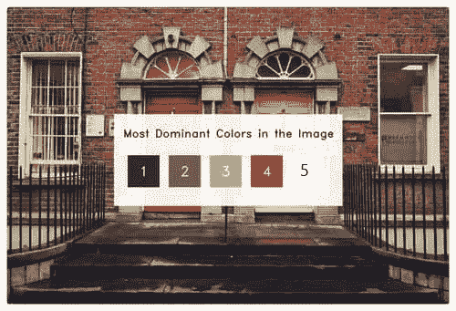

# 30 多个面向 Python 初学者的最佳机器学习项目——简单的项目——带源代码

> 原文：<https://medium.com/mlearning-ai/machine-learning-projects-for-beginners-in-python-easy-projects-with-source-codes-6a62b1f19add?source=collection_archive---------4----------------------->

在今天的博客中，我们会看到一些非常有趣的**针对 Python** 初学者的机器学习项目。这个列表将包括**机器学习项目、深度学习项目、计算机视觉项目**，以及所有其他类型的有趣项目，同时还提供源代码。

*虽然教科书和其他学习材料会为你提供你需要了解的任何技术的所有知识，但你无法真正掌握该技术，除非你从事一些实时项目。*

在本教程中，您将找到针对 Python 初学者的 **30 多个机器学习项目**，供初学者、中间用户和专家获得这一不断发展的技术的真实体验。

**在这里阅读带源代码的整篇文章—**[https://machinelearningprojects . net/data-science-projects-for-初学者-in-python/](https://machinelearningprojects.net/data-science-projects-for-beginners-in-python/)

# 让我们开始吧…

# Python 初学者的机器学习项目

## [1。使用 HOGs 进行行人检测](https://machinelearningprojects.net/pedestrian-detection-using-hog/)

在这个项目中，我们将使用梯度直方图的 HOG 缩写来执行行人检测。HOGs 是很好的特征检测器，也可以用于 SVM 的对象检测，但是由于其他许多先进的对象检测算法，如 YOLO，SSD，我们不太使用 HOGs 进行对象检测。

## [2。基于人脸识别的考勤系统](https://machinelearningprojects.net/face-recognition-based-attendance-system/)

顾名思义，这个项目使用生物识别技术(在这种情况下是人脸)进行考勤，是大学生中最著名的项目之一。

## [3。使用随机森林的权重类别预测](https://machinelearningprojects.net/weight-category-prediction/)

在这个项目中，我在[随机森林算法](https://scikit-learn.org/stable/modules/generated/sklearn.ensemble.RandomForestClassifier.html)的帮助下，对给定身高、体重和性别的人进行了体重类别预测。

## [4。用 Flask app 预测 IPL 分数](https://machinelearningprojects.net/ipl-score-prediction/)

在这个项目中，我使用岭回归建立了一个 IPL 分数预测模型，这只是线性回归的升级形式。我们有 2008 年到 2017 年的 IPL 数据。我们还将建立一个漂亮的交互式烧瓶模型。

## [5。用 Flask app](https://machinelearningprojects.net/flight-price-prediction/) 预测航班价格

伙计们，这是我最喜欢的项目之一。在这篇博客中，我使用不同的技术实现了一个航班价格预测模型，并且我执行了非常频繁的数据可视化以更好地理解我们的数据。

## [6。房价预测—美国住房数据](https://machinelearningprojects.net/house-price-prediction/)

房价预测项目被证明是机器学习世界的 Hello World。这是一个非常简单的项目，简单地使用线性回归来预测房价。这将是一个非常短的项目。

## [7。使用标题进行股票情绪分析](https://machinelearningprojects.net/stock-sentiment-analysis/)

在这个项目中，我们将看到如何使用报纸标题进行股票情绪分析。我们将预测股票市场是上涨还是下跌。由于其预测能力，这是一个简单但非常有趣的项目。

## [8。使用 KMeans 聚类的图像中的大多数主色](https://machinelearningprojects.net/most-dominant-colors-in-an-image/)

在这个博客中，我们将使用 KMeans 聚类算法找到图像中最主要的颜色，这是一个非常有趣的项目，也是我个人最喜欢的项目之一，因为它简单而强大。

## [9。葡萄酒质量预测](https://machinelearningprojects.net/wine-quality-prediction/)

在这篇博客中，我们将使用随机森林算法建立一个简单的葡萄酒质量预测模型。

## [10。使用 Haarcascades 进行面部和眼睛检测](https://machinelearningprojects.net/face-and-eye-detection-in-cv2/)

一个简单的项目，其中我们将看到我们如何使用 Haarcascades 在 cv2 中执行人脸和眼睛检测。这将是一个非常容易和有趣的项目。记住这只是检测而不是识别。

## [11。使用随机森林的钞票认证](https://machinelearningprojects.net/bank-note-authentication/)

在这篇博客中，我们将了解如何执行钞票认证，或者如何根据方差、偏斜度、峰度、熵等数字特征将钞票分为真假类别。

## [12。电影推荐系统](https://machinelearningprojects.net/movie-recommendation-system-1st-way/)

基本上，我用两种不同的方法实现了电影推荐系统。在第一种方式中，我们将使用用户-电影矩阵来寻找相似之处。

第二种方式的简单直觉是，我们将结合演员、导演、流派等主要特征。，并观察他们之间的相似之处，因为大多数时候相似的导演制作相似的电影，相似的演员喜欢在一些相似的特定类型的电影中表演。

## [13。信用卡欺诈检测](https://machinelearningprojects.net/credit-card-fraud-detection/)

在这篇博客中，我们将建立一个简单易懂的信用卡欺诈检测模型。这是一个非常基础的机器学习项目，学生们基本上都是在机器学习的起步阶段做的。

## [14。使用计数矢量器检测垃圾邮件](https://machinelearningprojects.net/spam-detection/)

在这篇博客中，我们将看到如何在计数矢量器和多项式朴素贝叶斯算法的帮助下，以最简单的方式执行垃圾邮件检测。

## 15。使用随机森林-波士顿房屋数据进行房屋税预测

我们将使用随机森林算法来预测房屋税。这是一个简单的项目。我在这个用例中使用了波士顿住房数据。

## [16。使用 Keras 的 MNIST 手写数字识别—带实时预测器](https://machinelearningprojects.net/mnist-handwritten-number-recognition-2/)

当开始机器学习时，MNIST 手写数字识别是每个人脑海中的第一个项目，因为它简单，数据丰富，结果神奇。也可以认为是 ML 世界的‘Hello World’。因此，在这篇博客中，我们将看到如何实现它。

你可能会想，大家都做了关于它的教程，那么这个有什么特别的呢？我的项目的特别之处在于，我还在最后做了一个现场互动预测器，你将从中抽取数字，我们训练好的模型将对其进行预测。

## [17。猫狗分类器](https://machinelearningprojects.net/cats-and-dogs-classifier/)

在本博客中，我们将使用卷积神经网络构建一个猫和狗分类器。我们已经在这个项目中定制了架构。这里我们基本上已经使用了 3 套[、**、**、](https://keras.io/api/layers/convolution_layers/convolution2d/)、 **—** 、[、**批处理化**、](https://keras.io/api/layers/normalization_layers/batch_normalization/)、 **—** 、[、**最大池化**、](https://keras.io/api/layers/pooling_layers/max_pooling2d/)、 **—** 、[和**脱落**、****](https://keras.io/api/layers/regularization_layers/dropout/)层。

## [18。如何使用 cv2](https://machinelearningprojects.net/detect-shapes-using-cv2/) 检测形状

在这个博客中，我们将看到如何使用轮廓和矩在图像中使用 cv2 检测形状。

## [19。使用 OpenCV 的文档扫描仪](https://machinelearningprojects.net/document-scanner-using-opencv/)

所以，伙计们，在这个博客中，我们将看到如何使用 OpenCV 构建一个非常简单但功能强大的文档扫描仪。这是我最喜欢的项目之一，因为它简单又强大。所以没有任何进一步的到期。

## [20。使用 dlib 的人脸界标检测](https://machinelearningprojects.net/face-landmarks-detection-using-dlib/)

在这个博客中，我们将使用 dlib 库实现人脸地标检测项目。我们将执行 68 点和 5 点检测。

## [21。使用 Python 中的 OpenCV 制作您的草图](https://machinelearningprojects.net/sketch-using-opencv/)

在这个非常短的博客中，我们将看到如何使用 OpenCV 以最简单的方式制作草图。对于初学者来说，这将是一个非常有趣的项目。

## [22 .如何使用 KNN 进行人脸识别](https://machinelearningprojects.net/face-recognition-using-knn/)

在这个博客中，我们将看到如何使用 KNN(K-最近邻算法)和哈尔级联来进行人脸识别。与其他人脸检测方法(如 MTCNN)相比，哈尔级联法速度非常快，但在精度上有所权衡。与像 MTCNNs 这样的大公司相比，它的准确性稍逊一筹。

## [23。使用 OpenCV 的 Python 不朽的蛇游戏](https://machinelearningprojects.net/snake-game-in-python/)

到目前为止，我已经在数据科学的几乎每个领域做了大量的项目，从 ML、DL、计算机视觉到 NLP，但是这个用 Python 编写的**不朽的贪吃蛇游戏**仍然是我*最喜欢的项目之一*，因为它的简单性和用户交互。在看了大约 100 行代码的结果后，你会感到非常惊讶。

[https://machine learning projects . net/WP-content/uploads/2021/07/demo-12vj 6 hs 4-4p GX _ biSyPZYU _ ny70 . MP4](https://machinelearningprojects.net/wp-content/uploads/2021/07/demo-12vj6hs4-4pgx_biSyPZYU_nY70.mp4)

**面向 Python 初学者的机器学习项目**

## [24。如何找到图像中最主要的颜色](https://machinelearningprojects.net/most-dominant-colors-in-an-image/)

在这个博客中，我们将使用 KMeans 聚类算法找到图像中最主要的颜色，这是一个非常有趣的项目，也是我个人最喜欢的项目之一，因为它简单而强大。

## [25。如何执行 5 种最著名的阈值技术](https://machinelearningprojects.net/thresholding/)

一个简单的博客，其中我们将执行 5 种最著名的阈值技术。这 5 种技术是 THRESH_BINARY、THRESH_BINARY_INV、THRESH_TOZERO、THRESH_TOZERO_INV 和 THRESH_TRUNC

## [26。哈利的隐身衣——不到 50 行代码](https://machinelearningprojects.net/harrys-invisibility-cloak/)

伙计们，最期待的博客之一来了。今天我们要用不到 50 行代码编写哈利的隐身衣，看完结果你会大吃一惊的。是啊是啊，我知道你不能控制自己的情绪🙂

[https://machine learning projects . net/WP-content/uploads/2021/07/demo . MP4](https://machinelearningprojects.net/wp-content/uploads/2021/07/demo.mp4)

**面向 Python 初学者的机器学习项目**

## 27。如何在 cv2 中拆分和合并频道

这个博客将是一个非常简单和简短的博客，在这里我们将看到我们如何输入图像，并在 cv2 中分割和合并通道。

## 28。在 cv2 中旋转和缩放图像 Python 中一个有趣的应用程序

在这篇博客中，我们将用 Python 制作一个非常有趣的应用程序，我们将在 cv2 中旋转和缩放图像。这将是一个非常简单而有趣的项目

## [29。如何在 Python 中用鼠标点击画圆](https://machinelearningprojects.net/draw-circles/)

在这篇非常短的博客中，我们将看到如何使用 OpenCV 在 Python 中用鼠标点击来画圆。

## [30。cv2 中的模糊—简单模糊、方框模糊、高斯模糊和中值模糊](https://machinelearningprojects.net/blurrings-in-cv2/)

在这篇博客中，我们将看到如何在 cv2 中执行最著名的 4 种模糊(**简单模糊、方框模糊、高斯模糊和中值模糊**)。

## 31。如何使用修复方法修复受损图像

在这篇博客中，我们将看到如何使用 OpenCV 的修复方法在 Python 中修复损坏的图像。这将是一个非常有趣的项目，所以没有任何进一步的原因，让我们投入进去。

**图像修复**是去除图像上的噪声、笔画或文本等损坏的过程。它在修复可能有划痕边缘或墨迹的旧照片时特别有用。这些可以通过这种方法以数字方式消除。

## [32。如何使用 OpenCV](https://machinelearningprojects.net/negative-image/) 在 Python 中生成负像

因此，在这个 OpenCV 系列的博客中，我们将生成一个负面的图像。谈到底片，这是一种非常怀旧的感觉，因为现在我们不习惯看到底片，但在大约 10-15 年前，首先，底片产生了，然后是原始图像。

## [33。如何使用拉普拉斯二阶导数检测边缘](https://machinelearningprojects.net/laplacian-2nd-order-derivative/)

在这个 OpenCV 系列的博客中，我们将为图像实现拉普拉斯高通滤波器或拉普拉斯二阶导数，这是一种非常有用的图像处理，主要用于国防领域(导弹或坦克),以跟踪敌人的坦克和卡车并摧毁它们。

## [34。如何以两种方式绘制灰度图像的直方图](https://machinelearningprojects.net/histogram-of-a-grayscale-image/)

在这篇非常短的博客中，我们将看到如何绘制灰度图像的直方图。第一种方法是使用 NumPy，第二种方法是使用 matplotlib

## 35。如何使用中值模糊对图像降噪

在这个博客中，我们将会看到不亚于魔法的东西。看完《中值模糊的力量》你会惊叹不已。

## [36。如何使用 OpenCV 在 Python 中执行形态学操作，如腐蚀、膨胀和渐变](https://machinelearningprojects.net/morphological-operations/)

因此，在这篇博客中，我们将看到如何对图像执行形态学操作，如腐蚀、膨胀和梯度，以增强图像。

形态学变换是基于图像形状的一些简单操作。它通常在二进制图像上执行。它需要两个输入，一个是我们的原始图像，第二个被称为**结构元素**或决定操作性质的内核。两种基本的形态学算子是腐蚀和膨胀。然后，它的变体形式如开始、结束、渐变等也开始发挥作用。

## 37。如何使用 OpenCV 在 Python 中快速检测图像中的轮廓

在这篇博客中，我们将看到如何使用 cv2 模块检测图像中的轮廓。谈论轮廓绘制当我们的用例涉及地质地形图像或研究天气图等时，它是一个非常有用的操作。

如果对 Python 初学者的机器学习项目有任何疑问，请通过电子邮件或 LinkedIn 联系我。

**还做检查我的其他** [**机器学习项目**](https://machinelearningprojects.net/machine-learning-projects/)**[**深度学习项目**](https://machinelearningprojects.net/deep-learning-projects/)**[**计算机视觉项目**](https://machinelearningprojects.net/opencv-projects/)**[**烧瓶项目**](https://machinelearningprojects.net/flask-projects/)**[**NLP 项目**](https://machinelearningprojects.net/nlp-projects/)********

******这就是我写给这个博客的所有内容，感谢你的阅读，我希望你在阅读完这篇文章后，能有所收获，直到下次👋…******

****** [## Mlearning.ai 提交建议

### 如何成为 Mlearning.ai 上的作家

medium.com](/mlearning-ai/mlearning-ai-submission-suggestions-b51e2b130bfb)******