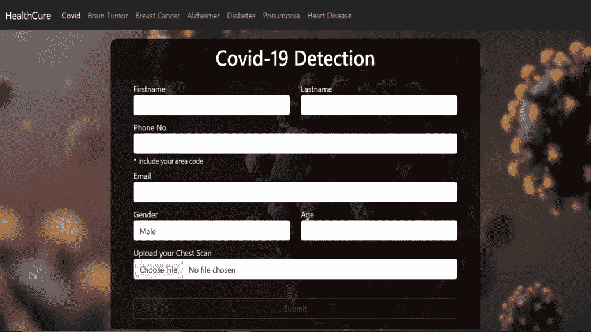
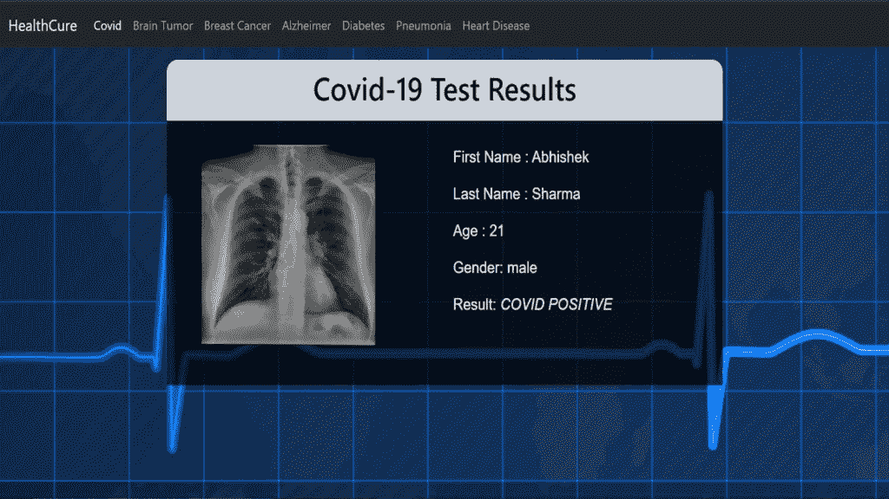
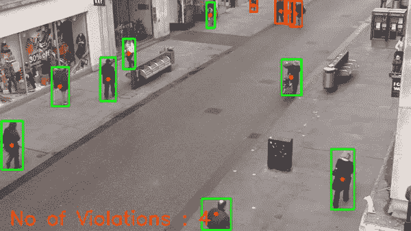
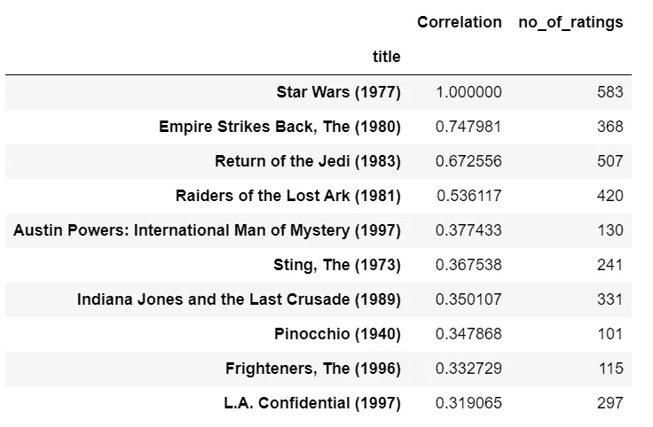
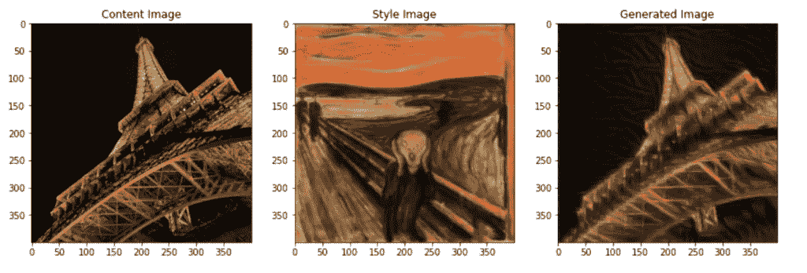
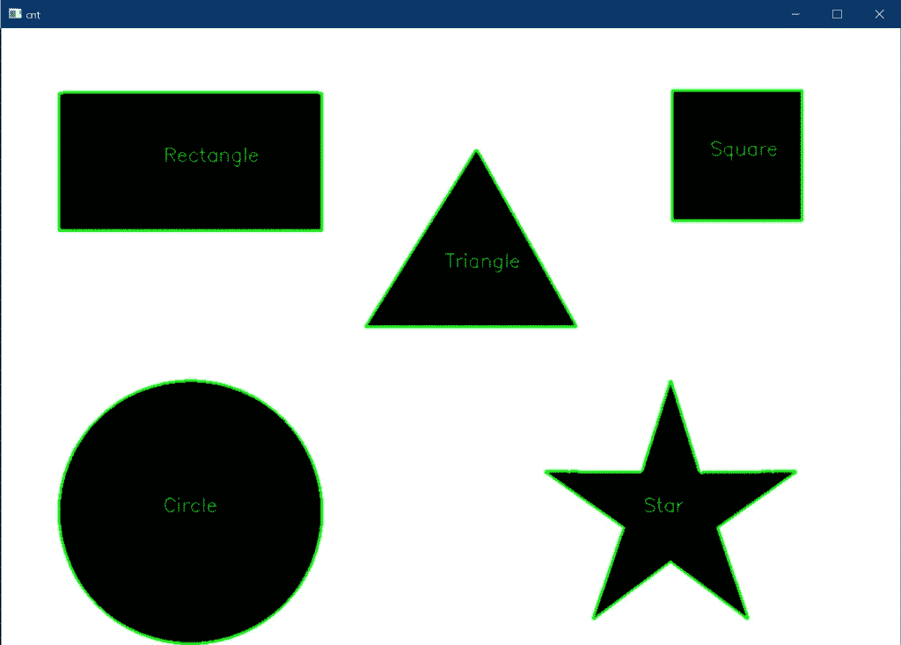
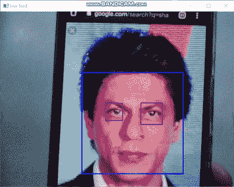

# 60 多个带有 Python 源代码的最佳机器学习项目——创新、独特、先进的项目理念

> 原文：<https://medium.com/mlearning-ai/machine-learning-projects-with-source-code-in-python-easy-projects-intermediate-projects-and-d289f5f1328e?source=collection_archive---------0----------------------->

在今天的博客中，我们会看到一些非常有趣的**机器学习项目，这些项目的源代码都是 Python** 语言的。这个列表将包括**机器学习项目、深度学习项目、计算机视觉项目**，以及所有其他类型的有趣项目，同时还提供源代码。

*虽然教科书和其他学习材料会为你提供你需要了解的任何技术的所有知识，但你无法真正掌握该技术，除非你从事一些实时项目。*

在本教程中，您将找到 60 多个带有 Python 源代码的机器学习项目，供初学者、中间用户和专家获得这一不断发展的技术的真实体验。

**点击此处阅读带源代码的整篇文章—**[https://machine learning projects . net/machine-learning-projects-with-source-code-in-python/](https://machinelearningprojects.net/machine-learning-projects-with-source-code-in-python/)

# 让我们开始吧…

# 带有 Python 源代码的机器学习项目

## [1。HealthCure —医疗项目— 7 种疾病检测](https://machinelearningprojects.net/healthcure-medical-project/)

这是一个我选择作为大学最后一年主要项目的项目，你猜怎么着，它进行得相当顺利。这个项目使用各种先进的技术，如 CNN、VGGs、XGBoost 等，用于执行 7 种疾病检测。这是 Python 中最好的机器学习项目之一。

**主页面**

**结果**

这 7 种检测是 Covid 检测、阿尔茨海默病检测、脑肿瘤检测、乳腺癌检测、肺炎检测、心脏病检测和糖尿病检测。

## [2。使用固态硬盘进行物体检测](https://machinelearningprojects.net/object-detection-using-ssd/)

在这篇博客中，我们将使用单镜头检测，以最简单的方式使用 SSD 执行对象检测。与 R-CNN 或 Fast R-CNN 等大公司相比，固态硬盘在对象检测方面非常快。这将是一个非常有趣的项目，有无尽的用例。

## [3。用猪检测行人](https://machinelearningprojects.net/pedestrian-detection-using-hog/)

在这个项目中，我们将使用梯度直方图的 HOG 缩写来执行行人检测。HOGs 是很好的特征检测器，也可以用于 SVM 的对象检测，但是由于其他许多先进的对象检测算法，如 YOLO，SSD，我们不太使用 HOGs 进行对象检测。

## [4。使用 YOLOv3 的社交距离—物体检测](https://machinelearningprojects.net/social-distancing-using-yolov3/)

这也是一个非常先进的项目，在这个项目中，我使用相机的实时反馈或视频中的对象检测来检查社交距离是否在某个地方被跟踪。这个项目也有无限的未来范围。

## [5。基于人脸识别的考勤系统](https://machinelearningprojects.net/face-recognition-based-attendance-system/)

顾名思义，这个项目使用生物识别技术(在这种情况下是人脸)进行考勤，是大学生中最著名的项目之一。

## [6。使用随机森林的权重类别预测](https://machinelearningprojects.net/weight-category-prediction/)

在这个项目中，我在[随机森林算法](https://scikit-learn.org/stable/modules/generated/sklearn.ensemble.RandomForestClassifier.html)的帮助下，对给定身高、体重和性别的人进行了体重类别预测。

## [7。使用 Flask 应用程序预测 IPL 分数](https://machinelearningprojects.net/ipl-score-prediction/)

在这个项目中，我使用岭回归建立了一个 IPL 分数预测模型，这只是线性回归的升级形式。我们有 2008 年到 2017 年的 IPL 数据。我们还将建立一个漂亮的交互式烧瓶模型。

## [8。用 Flask app](https://machinelearningprojects.net/flight-price-prediction/) 预测航班价格

伙计们，这是我最喜欢的项目之一。在这篇博客中，我使用不同的技术实现了一个航班价格预测模型，并且我执行了非常频繁的数据可视化以更好地理解我们的数据。

## [9。房价预测—美国住房数据](https://machinelearningprojects.net/house-price-prediction/)

房价预测项目被证明是机器学习世界的 Hello World。这是一个非常简单的项目，简单地使用线性回归来预测房价。这将是一个非常短的项目。

## 10。Flipkart 用 Flask app 评论提取和情感分析

这是一个非常有趣的博客，我们将在这里进行 Flipkart 评论提取和情感分析，并且我们将建立一个漂亮的 Flask 应用程序来显示一切。

## [11。使用标题进行股票情绪分析](https://machinelearningprojects.net/stock-sentiment-analysis/)

在这个项目中，我们将看到如何使用报纸标题进行股票情绪分析。我们将预测股票市场是上涨还是下跌。由于其预测能力，这是一个简单但非常有趣的项目。

## [12。使用 KMeans 聚类的图像中的大多数主色](https://machinelearningprojects.net/most-dominant-colors-in-an-image/)

在这个博客中，我们将使用 KMeans 聚类算法找到图像中最主要的颜色，这是一个非常有趣的项目，也是我个人最喜欢的项目之一，因为它简单而强大。

## 13。葡萄酒质量预测

在这篇博客中，我们将使用随机森林算法建立一个简单的葡萄酒质量预测模型。

## [14。使用 Haarcascades 进行人脸和眼睛检测](https://machinelearningprojects.net/face-and-eye-detection-in-cv2/)

一个简单的项目，其中我们将看到我们如何使用 Haarcascades 在 cv2 中执行人脸和眼睛检测。这将是一个非常容易和有趣的项目。记住这只是检测而不是识别。

## [15。使用随机森林的钞票认证](https://machinelearningprojects.net/bank-note-authentication/)

在这篇博客中，我们将了解如何执行钞票认证，或者如何根据方差、偏斜度、峰度、熵等数字特征将钞票分为真假类别。

## [16。电影推荐系统](https://machinelearningprojects.net/movie-recommendation-system-1st-way/)

基本上，我用两种不同的方法实现了电影推荐系统。在第一种方式中，我们将使用用户-电影矩阵来寻找相似之处。

第二种方式的简单直觉是，我们将结合演员、导演、流派等主要特征。，并观察他们之间的相似之处，因为大多数时候相似的导演制作相似的电影，相似的演员喜欢在一些相似的特定类型的电影中表演。

## [17。信用卡欺诈检测](https://machinelearningprojects.net/credit-card-fraud-detection/)

在这篇博客中，我们将建立一个简单易懂的信用卡欺诈检测模型。这是一个非常基础的机器学习项目，学生们基本上都是在机器学习的起步阶段做的。

## [18。使用计数矢量器检测垃圾邮件](https://machinelearningprojects.net/spam-detection/)

在这篇博客中，我们将看到如何在计数矢量器和多项式朴素贝叶斯算法的帮助下，以最简单的方式执行垃圾邮件检测。

## [19。使用随机森林-波士顿房屋数据的房屋税预测](https://machinelearningprojects.net/house-tax-prediction/)

我们将使用随机森林算法来预测房屋税。这是一个简单的项目。我在这个用例中使用了波士顿住房数据。

# 使用 Python 编写源代码的深度学习项目

## 20。使用 LSTM 预测谷歌股价

在这个项目中，我们将看到我们如何使用 Keras 的 LSTMs 模型对过去的股票数据进行训练来执行谷歌的股票价格预测。这个项目只是为了教育目的。请不要用这些模型投资你的钱。

## [21。图像字幕—带源代码](https://machinelearningprojects.net/image-captioning/)

在这个项目中，我们将实施图像字幕项目，这是一个非常先进的项目。对于这个用例，我们将结合使用 LSTMs 和 CNN。

## [22。使用深度卷积生成对抗网络(DCGAN)生成 cifar-10 假图像](https://machinelearningprojects.net/deep-convolutional-generative-adversarial-networks/)

在这个项目中，我们将看到如何使用[深度卷积生成对抗网络或 DCG an](https://arxiv.org/abs/1511.06434)构建一些看起来真实的假图像。gan 基本上以它们的两个网络而闻名，生成网络和鉴别网络。我们以这样一种方式训练我们的辨别模型，它可以告诉我们哪个图像是真的，哪个图像是假的。生成网络试图创造新的图像，甚至可以欺骗鉴别网络，证明自己是真实的。

## [23。使用 YOLOv3](https://machinelearningprojects.net/helmet-and-number-plate-detection-and-recognition/) 检测和识别头盔和车牌

因此，在这个项目中，我们将看到我们如何使用[【YOLO】](https://pjreddie.com/darknet/yolo/)[v](https://pjreddie.com/darknet/yolo/)[3](https://pjreddie.com/darknet/yolo/)和其他一些计算机视觉技术，在 Python 中实现**头盔和车牌检测和识别**。这是一个非常先进的项目，你可以用在你的大学小项目以及大项目。所以不浪费任何时间。

[https://machine learning projects . net/WP-content/uploads/2021/08/output-online-video-cutter . com _ . MP4](https://machinelearningprojects.net/wp-content/uploads/2021/08/output-online-video-cutter.com_.mp4)

**带有 Python 源代码的机器学习项目**

我们在**头盔和车牌检测和识别**背后的主要动机是首先检测某人是否戴着头盔，如果他戴着，没有问题，但如果没有，检测他的车牌并向他发送电子邮件。

## [24。HealthCure —一体化医疗解决方案—医疗项目— 7 种疾病检测](https://machinelearningprojects.net/healthcure-medical-project/) [(重复)](https://machinelearningprojects.net/helmet-and-number-plate-detection-and-recognition/)

这是一个我选择作为大学最后一年主要项目的项目，你猜怎么着，它进行得相当顺利。这个项目使用各种先进的技术，如 CNN、VGGs、XGBoost 等，用于执行 7 种疾病检测。

这 7 种检测是 Covid 检测、阿尔茨海默病检测、脑肿瘤检测、乳腺癌检测、肺炎检测、心脏病检测和糖尿病检测。

## [25。隐形人使用面具 R-CNN](https://machinelearningprojects.net/invisible-man-using-mask-rcnn/)

在这篇博客中，我们将看到如何使用 R-CNN 掩模进行人体分割。这是一个非常先进的项目，许多事情正在发生引擎盖下。请尝试这个项目，只有当你有一个 GPU 可用。

[https://machine learning projects . net/WP-content/uploads/2021/08/bandicam-2021-08-11-11-27-36-925 . MP4](https://machinelearningprojects.net/wp-content/uploads/2021/08/bandicam-2021-08-11-11-27-36-925.mp4)

**带 Python 源代码的机器学习项目**

## 26。神经类型转移

谁说只有人类才能创造出美丽的艺术品。在这篇博客中，我们将看到一种叫做神经风格转移的神经网络应用是如何创造出连人类都想不到的美丽艺术品的。

## [27。数独求解器](https://machinelearningprojects.net/sudoku-solver/)

在这个博客中，我们将看到如何使用计算机视觉和图像处理技术实现数独求解器。数独是一种 9X9 的格子拼图。

## [28。使用 U-Net 进行人体分割](https://machinelearningprojects.net/human-segmentation-using-u-net/)

在这篇博客中，我们将看到我们如何使用 U-Net 进行人体分割。U-Net 是一种非常特殊的 CNN 架构，专门用于医疗领域的分段。它被称为 [U 形网](https://arxiv.org/abs/1505.04597)，因为它特殊的建筑形状像 U 形

## 29。使用 LSTM 预测明年的牛奶产量

在这个博客中，我们将使用之前 13 年的牛奶产量数据实现下一年的牛奶产量预测。我们将在这个项目中使用 LSTM，因为数据是连续的。

## 30。使用 Keras 的情绪检测器

在这篇博客中，我们将使用卷积神经网络在 Keras 中构建一个情绪检测器模型。这是我最喜欢的项目之一。

[https://machine learning projects . net/WP-content/uploads/2021/07/bandicam-2021-07-22-15-57-34-362-join . MP4](https://machinelearningprojects.net/wp-content/uploads/2021/07/bandicam-2021-07-22-15-57-34-362-Join.mp4)

**带 Python 源代码的机器学习项目**

## [31。利用迁移学习进行猴子品种分类](https://machinelearningprojects.net/monkey-breed-classification/)

在这篇博客中，我们将使用迁移学习来实现我们的项目，即猴子品种分类。迁移学习就是我们在当前用例中使用已经训练好的模型。在这种情况下，我们将使用 Mobilenet，在 Imagenet 上进行了预先培训。

## [32。使用 Keras 的 MNIST 手写数字识别—带实时预测器](https://machinelearningprojects.net/mnist-handwritten-number-recognition-2/)

当开始机器学习时，MNIST 手写数字识别是每个人脑海中的第一个项目，因为它简单，数据丰富，结果神奇。也可以认为是 ML 世界的‘Hello World’。因此，在这篇博客中，我们将看到如何实现它。

你可能会想，大家都做了关于它的教程，那么这个有什么特别的呢？我的项目的特别之处在于，我还在最后做了一个现场互动预测器，你将从中抽取数字，我们训练好的模型将对其进行预测。

## 33。AI 学习玩 Flappy Bird 游戏

因此，在这个博客中，我们将实现由人工智能玩的 Flappy Bird 游戏。我们将通过使用代表 [***的**整洁**来实现这一点。*** 每个机器学习工程师的一大幻想就是做出一个可以自己学习玩的游戏。在这篇博客中，我们将看到我们如何做到这一点。](https://neat-python.readthedocs.io/en/latest/)

## [34。使用带 Keras 的 CNN 进行年龄检测](https://machinelearningprojects.net/age-detection-using-cnn-with-keras/)

在这篇博客中，我们将在 Keras 的帮助下使用 CNN 实现年龄检测。这将是一个非常有趣的项目。

[https://machine learning projects . net/WP-content/uploads/2021/07/bandicam-2021-07-21-18-53-19-527 . MP4](https://machinelearningprojects.net/wp-content/uploads/2021/07/bandicam-2021-07-21-18-53-19-527.mp4)

**带 Python 源代码的机器学习项目**

## 35。使用 CNN 和 Keras 进行火灾和烟雾探测

所以伙计们，火灾和烟雾探测项目是深度学习的另一个非常实际的应用案例。我们将使用 CNN 来实现这个项目。我使用数据扩充来增加我的图像数据集的容量，在这样的数据集上，我获得了大约 90%的令人满意的准确性。

你可以进一步扩展这个想法，将它与一个**树莓 Pi、一个热传感器和一个摄像头** **一起用于它的实际实现**。

## 36。猫狗分类器

在这篇博客中，我们将使用卷积神经网络构建一个猫狗分类器。我们在这个项目中定制了建筑。这里我们基本上用了 3 套[**【Conv2D】**](https://keras.io/api/layers/convolution_layers/convolution2d/)**——**[**batch 规格化**](https://keras.io/api/layers/normalization_layers/batch_normalization/)**——**[**max pooling**](https://keras.io/api/layers/pooling_layers/max_pooling2d/)**——**[**Dropout**](https://keras.io/api/layers/regularization_layers/dropout/)图层。

## 37。使用自动编码器减少维数

在这篇非常有趣的博客中，我们将看到如何使用 Tensorflow 以最简单的方式使用自动编码器进行降维。

# 带有 Python 源代码的计算机视觉项目

## 38。头盔和车牌检测和识别使用 YOLOv3(重复)

因此，在这个项目中，我们将看到如何使用 [YOLOv3](https://pjreddie.com/darknet/yolo/) 和其他一些计算机视觉技术，在 Python 中实现**头盔和车牌检测和识别**。这是一个非常先进的项目，你可以用在你的大学小项目以及大项目。所以不浪费任何时间。

我们在**头盔和车牌检测和识别**背后的主要动机是首先检测某人是否戴着头盔，如果他戴着，没有问题，但如果没有，检测他的车牌并向他发送电子 challan。

## 39。HealthCure —一体化医疗解决方案—医疗项目— 7 种疾病检测 [(重复)](https://machinelearningprojects.net/helmet-and-number-plate-detection-and-recognition/)

这是一个我选择作为大学最后一年主要项目的项目，你猜怎么着，它进行得相当顺利。这个项目使用各种先进的技术，如 CNN、VGGs、XGBoost 等，用于执行 7 种疾病检测。

这 7 种检测是 Covid 检测、阿尔茨海默病检测、脑肿瘤检测、乳腺癌检测、肺炎检测、心脏病检测和糖尿病检测。

## 40。隐形人使用面具 R-CNN [(重复)](https://machinelearningprojects.net/helmet-and-number-plate-detection-and-recognition/)

在这篇博客中，我们将看到如何使用 R-CNN 掩模进行人体分割。这是一个非常先进的项目，许多事情正在发生引擎盖下。请尝试这个项目，只有当你有一个 GPU 可用。

## [41。数独求解器](https://machinelearningprojects.net/sudoku-solver/) [(重复)](https://machinelearningprojects.net/helmet-and-number-plate-detection-and-recognition/)

在这个博客中，我们将看到如何使用计算机视觉和图像处理技术实现数独求解器。数独是一种 9X9 的格子拼图。

## [42。使用 SSD 进行对象检测](https://machinelearningprojects.net/object-detection-using-ssd/) [(重复)](https://machinelearningprojects.net/helmet-and-number-plate-detection-and-recognition/)

在这篇博客中，我们将使用单镜头检测，以最简单的方式使用 SSD 执行对象检测。与 R-CNN 或 Fast R-CNN 等大公司相比，固态硬盘在对象检测方面非常快。这将是一个非常有趣的项目，有无尽的用例。

## [43。社交距离使用 YOLOv3](https://machinelearningprojects.net/social-distancing-using-yolov3/) [(重复)](https://machinelearningprojects.net/helmet-and-number-plate-detection-and-recognition/)

这也是一个非常先进的项目，在这个项目中，我使用相机的实时反馈或视频中的对象检测来检查社交距离是否在某个地方被跟踪。这个项目也有无限的未来范围。

## [44。如何使用 cv2 检测形状](https://machinelearningprojects.net/detect-shapes-using-cv2/)

在这篇博客中，我们将看到如何使用轮廓和矩在图像中使用 cv2 检测形状。

## [45。使用 OpenCV 的文档扫描仪](https://machinelearningprojects.net/document-scanner-using-opencv/)

所以，伙计们，在这个博客中，我们将看到如何使用 OpenCV 构建一个非常简单而强大的文档扫描仪。这是我最喜欢的项目之一，因为它简单而强大。所以没有任何进一步的原因。

## [46。使用 dlib](https://machinelearningprojects.net/face-landmarks-detection-using-dlib/) 的面部标志检测

在这篇博客中，我们将使用 dlib 库实现人脸标志检测项目。我们将执行 68 点和 5 点检测。

## [47。使用 Python 中的 OpenCV 制作草图](https://machinelearningprojects.net/sketch-using-opencv/)

在这篇非常短的博客中，我们将看到如何用最简单的方式用 OpenCV 制作草图。对于初学者来说，这将是一个非常有趣的项目。

## [48。基于人脸识别的考勤系统](https://machinelearningprojects.net/face-recognition-based-attendance-system/) [(重复)](https://machinelearningprojects.net/helmet-and-number-plate-detection-and-recognition/)

顾名思义，这个项目使用生物识别技术(在这种情况下是人脸)进行考勤，是大学生中最著名的项目之一。

## [49。如何使用 KNN 进行人脸识别](https://machinelearningprojects.net/face-recognition-using-knn/)

在这篇博客中，我们将看到如何使用 KNN(K-最近邻算法)和哈尔级联进行人脸识别。与其他检测人脸的方法(如 MTCNN)相比，Haar 级联非常快，但精度有所下降。和 MTCNNs 这些大佬比起来，它的准确率就差了一点。

## [50。使用 OpenCV 的 Python 不朽蛇游戏](https://machinelearningprojects.net/snake-game-in-python/)

到目前为止，我已经在数据科学的几乎每个领域做了大量的项目，从 ML、DL、计算机视觉到 NLP，但是这个用 Python 编写的**不朽的贪吃蛇游戏**仍然是我最喜欢的项目之一*因为它的简单性和用户交互。在看了大约 100 行代码的结果后，你会感到非常惊讶。*

[https://machine learning projects . net/WP-content/uploads/2021/07/demo-12vj 6 hs 4-4p GX _ biSyPZYU _ ny70 . MP4](https://machinelearningprojects.net/wp-content/uploads/2021/07/demo-12vj6hs4-4pgx_biSyPZYU_nY70.mp4)

**带 Python 源代码的机器学习项目**

## 51。如何找到图像中最主要的颜色

在这个博客中，我们将使用 KMeans 聚类算法找到图像中最主要的颜色，这是一个非常有趣的项目，也是我个人最喜欢的项目之一，因为它简单而强大。

## [52。如何执行 5 种最著名的阈值技术](https://machinelearningprojects.net/thresholding/)

一个简单的博客，其中我们将执行 5 种最著名的阈值技术。这 5 种技术是 THRESH_BINARY、THRESH_BINARY_INV、THRESH_TOZERO、THRESH_TOZERO_INV 和 THRESH_TRUNC

## [53。使用 Haarcascades 在 cv2 中进行人脸和眼睛检测](https://machinelearningprojects.net/face-and-eye-detection-in-cv2/)

因此，在这个非常有趣的博客中，我们将看到如何使用 Haarcascades 在 cv2 中执行人脸和眼睛检测。这将是一个非常容易和有趣的项目。记住这只是检测而不是识别。

## 54。哈利的隐身衣——不到 50 行代码

伙计们，最期待的博客之一来了。今天我们要用不到 50 行代码编写哈利的隐身衣，看完结果你会大吃一惊的。是啊是啊，我知道你不能控制自己的情绪🙂

[https://machine learning projects . net/WP-content/uploads/2021/07/demo . MP4](https://machinelearningprojects.net/wp-content/uploads/2021/07/demo.mp4)

**带有 Python 源代码的机器学习项目**

## [55。如何在 cv2 中拆分和合并频道](https://machinelearningprojects.net/split-and-merge-channels-in-cv2/)

这个博客将是一个非常简单和简短的博客，在这里我们将看到我们如何输入图像，并在 cv2 中分割和合并通道。

## [56。在 cv2 中旋转和缩放图像 Python 中一个有趣的应用程序](https://machinelearningprojects.net/rotating-and-scaling-images-in-cv2/)

在这篇博客中，我们将用 Python 制作一个非常有趣的应用程序，我们将在 cv2 中旋转和缩放图像。这将是一个非常简单而有趣的项目

## [57。如何在 Python 中用鼠标点击画圆](https://machinelearningprojects.net/draw-circles/)

在这篇非常短的博客中，我们将看到如何使用 OpenCV 在 Python 中用鼠标点击来画圆。

## [58。如何使用修复方法修复受损图像](https://machinelearningprojects.net/repair-damaged-images-using-inpainting/)

在这篇博客中，我们将看到如何使用 OpenCV 的修复方法在 Python 中修复损坏的图像。这将是一个非常有趣的项目，所以没有任何进一步的原因，让我们投入进去。

**图像修复**是去除图像上的噪声、笔画或文本等损坏的过程。它在修复可能有划痕边缘或墨迹的旧照片时特别有用。这些可以通过这种方法以数字方式消除。

## [59。如何使用 OpenCV](https://machinelearningprojects.net/negative-image/) 在 Python 中生成负像

因此，在这个 OpenCV 系列的博客中，我们将生成一个负面的图像。谈到底片，这是一种非常怀旧的感觉，因为现在我们不习惯看到底片，但在大约 10-15 年前，首先，底片产生了，然后是原始图像。

negative images

## 60。如何使用拉普拉斯二阶导数检测边缘

在这个 OpenCV 系列的博客中，我们将为图像实现拉普拉斯高通滤波器或拉普拉斯二阶导数，这是一种非常有用的图像处理，主要用于国防领域(导弹或坦克),以跟踪敌人的坦克和卡车并摧毁它们。

## [61。如何以两种方式绘制灰度图像的直方图](https://machinelearningprojects.net/histogram-of-a-grayscale-image/)

在这篇非常短的博客中，我们将看到如何绘制灰度图像的直方图。第一种方法是使用 NumPy，第二种方法是使用 matplotlib

## [62。如何使用中值模糊消除图像噪声](https://machinelearningprojects.net/median-blur/)

在这个博客中，我们将会看到不亚于魔法的东西。看完《中值模糊的力量》你会惊叹不已。

## [63。如何使用 OpenCV 在 Python 中执行形态学操作，如腐蚀、膨胀和渐变](https://machinelearningprojects.net/morphological-operations/)

因此，在这篇博客中，我们将看到如何对图像执行形态学操作，如腐蚀、膨胀和梯度，以增强图像。

形态学变换是基于图像形状的一些简单操作。它通常在二进制图像上执行。它需要两个输入，一个是我们的原始图像，第二个被称为**结构元素**或决定操作性质的内核。两种基本的形态学算子是腐蚀和膨胀。然后，它的变体形式如开始、结束、渐变等也开始发挥作用。

## [64。如何使用 OpenCV 在 Python 中快速检测图像中的轮廓](https://machinelearningprojects.net/detect-contours/)

在这篇博客中，我们将看到如何使用 cv2 模块检测图像中的轮廓。谈论轮廓绘制当我们的用例涉及地质地形图像或研究天气图等时，它是一个非常有用的操作。

## [65。cv2 中的模糊—简单模糊、方框模糊、高斯模糊和中值模糊](https://machinelearningprojects.net/blurrings-in-cv2/)

在这篇博客中，我们将看到如何在 cv2 中执行最著名的 4 种模糊(**简单模糊、方框模糊、高斯模糊和中值模糊**)。

# 带有 Python 源代码的自然语言处理项目

## [66。使用 Spacy 的单词到矢量—证明国王-男人+女人=王后](https://machinelearningprojects.net/words-to-vectors-using-spacy/)

这个博客将会是一个非常短的博客，在这里我们将会看到使用 Spacy 库的单词到矢量的魔力，并且我们将会证明国王-男人+女人=女王。这将会是一个非常有趣的博客

## [67。使用潜在狄利克雷分配的主题建模](https://machinelearningprojects.net/latent-dirichlet-allocation/)

因此，在这个博客中，我们将看到如何使用[潜在的狄利克雷分配](https://en.wikipedia.org/wiki/Latent_Dirichlet_allocation)来执行主题建模。我们在主题建模中所做的是试图根据一些相似的单词将不同的对象(在本例中是文档)组合在一起。这意味着如果两个文档包含相似的单词，那么它们很有可能属于同一类别。

## 68。使用 LSTM 的假新闻分类器

在这篇博客中，我们将使用 Keras 库的嵌入和 LSTM 层实现一个假新闻分类器。我们在这个项目中定制了建筑。

## 69。奇异值分解

如果有任何关于带有 Python 源代码的机器学习项目的疑问，请通过电子邮件或 LinkedIn 联系我。

**还办退房我的其他** [**机器学习项目**](https://machinelearningprojects.net/machine-learning-projects/)**[**深度学习项目**](https://machinelearningprojects.net/deep-learning-projects/)**[**计算机视觉项目**](https://machinelearningprojects.net/opencv-projects/)**[**烧瓶项目**](https://machinelearningprojects.net/flask-projects/)**[**NLP 项目**](https://machinelearningprojects.net/nlp-projects/) **。**********

****访问我的博客，了解更多精彩的[机器学习项目、深度学习项目、计算机视觉项目，以及更多…](https://machinelearningprojects.net/)****

****这就是我写给这个博客的所有内容，感谢你的阅读，我希望你在阅读完这篇文章后，能有所收获，直到下次👋…****

**** [## Mlearning.ai 提交建议

### 如何成为 Mlearning.ai 上的作家

medium.com](/mlearning-ai/mlearning-ai-submission-suggestions-b51e2b130bfb)****