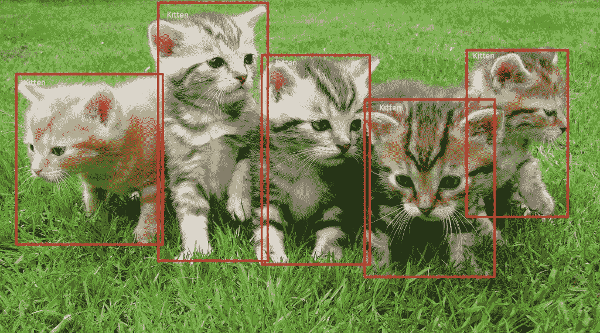
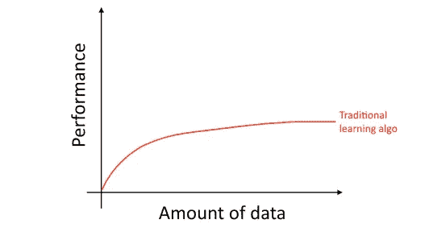
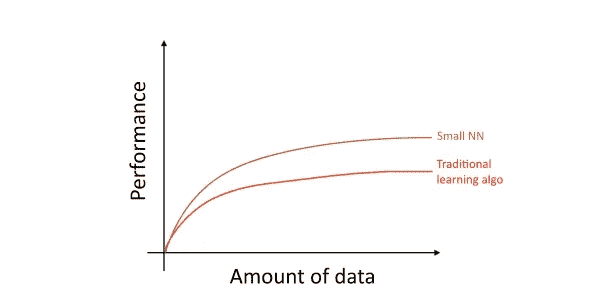
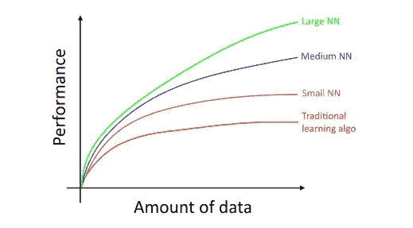

# 机器学习策略第一部分:机器学习

> 原文：<https://medium.com/mlearning-ai/machine-learning-strategies-286d74a0d0bd?source=collection_archive---------3----------------------->

机器学习是许多惊人应用的基础，包括计算机视觉、语音识别、网络搜索、推荐系统等等。如果你正在进行一个机器学习项目，你可能想要快速的进展和想要的结果。因此，在这篇文章和接下来的几篇文章中，我将解释一些有希望尝试的方向。

credit: [2]

让我们假设你正在和你的团队建立一个物体检测模型，你想要检测猫。此外，您希望将模型部署到智能手机上。您训练了您的对象检测模型，然而，当您部署它时，不幸的是，您的算法准确性不够好。发生了什么事？你现在做什么？您的团队可能有很多提高绩效的想法，例如:

*   获得更多的训练数据，获得更多猫和非猫的图片。
*   在不同的条件下收集更多样的数据，例如不同的方向、光线、模糊的图片以及各种相机设置。
*   尝试具有更多隐藏层、隐藏单元和更多参数的更大的神经网络。
*   训练你的学习算法的时间越长，意味着梯度下降迭代次数越多。
*   改变神经网络结构(隐藏层、隐藏单元、激活函数等)
*   尝试更小的神经网络。
*   添加正则化(如 L2 正则化)
*   ….

如果你在这些可能的方向中选择了最好的，你会对你的进步感到高兴，你会得到想要的结果。然而，如果你选择得不好，你就浪费了很多时间。*那么你会如何选择？*

**天平驱动机器学习进度**

你可能会想到的一个问题是，为什么深度学习(神经网络)现在正在兴起？最近进展的两个最大驱动力是:

*   **数据可用性。随着技术的创新，人们现在在笔记本电脑、手机和数码设备上花费更多的时间。这些小工具产生了大量的数据，你可以将这些数据输入到你的学习算法中。**
*   **计算规模**。我们现在能够用大量数据训练更大的神经网络。计算能力的最新进展使这成为可能。

深入来说，如果你用海量数据训练一个传统算法比如逻辑回归。它的性能停滞不前，不会随着数据集大小的增加而增加。

credit: machine learning yearning

这些传统算法不知道如何处理海量数据。

如果你用相同的设置训练一个更小的深度学习模型，你可能会比传统的学习算法获得更好的性能。

Credit: Machine Learning yearning

最后，如果你尝试一个具有更多隐藏层、隐藏单元和参数的更大的神经网络。您可以获得更好的性能。

credit: machine leaning yearning

在这里，您可以看到性能上的显著差异，随着数据量的增加，大型 NN 变得更加准确。因此，您希望有一个更大的模型(在绿色曲线上)和大量的数据来获得更好的性能。

许多其他因素如神经网络结构也很重要。然而，时至今日，最可靠的方法是(I)获取更多的数据和(ii)训练更大的神经网络。

为你找到工作的过程比你想象的要复杂得多。在下一篇文章中，我将解释构建深度学习系统(如对象检测)的一般策略和最现代的策略，以及如何选择最佳选项来提高模型的性能。

# **总结**

神经网络性能在很大程度上受神经网络体系结构和数据量的影响。获取海量数据，训练更大的深度学习算法，是提高你的模型性能的有效方法。

**参考文献**

【我】。【https://github.com/ajaymache/machine-learning-yearning 

[二]。[https://towards data science . com/understanding-SSD-multi box-real-time-object-detection-in-deep-learning-495 ef 744 fab](https://towardsdatascience.com/understanding-ssd-multibox-real-time-object-detection-in-deep-learning-495ef744fab)

 [## Mlearning.ai 提交建议

### 如何成为 Mlearning.ai 上的作家

medium.com](/mlearning-ai/mlearning-ai-submission-suggestions-b51e2b130bfb)