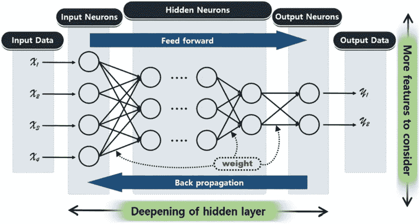

# 机器学习策略第二部分:数据集

> 原文：<https://medium.com/mlearning-ai/machine-learning-strategies-part-2-959eb876b141?source=collection_archive---------10----------------------->

构建商业机器学习应用程序是一项具有挑战性的任务。因此，遵循有希望的方向会节省你很多时间。在上一篇文章中，我提到了推动机器学习进步的尺度。构建合适的模型需要正确的数据集。在本文中，我将讨论数据集选择以及如何为机器学习模型创建数据集。

credit: [3]

**设置开发和测试集**

让我们回到第 1 部分中的 cat 检测应用程序。你的团队想要开发一个猫检测应用程序，人们可以上传许多不同事物的图片。你在从互联网上获取的猫和非猫图像上训练你的对象检测模型；但是，当您部署该模型时，cat 检测应用程序在用户数据集上表现不佳。客户上传的图像分辨率较低，更模糊，光线也不好。因为您从互联网上下载了数据集，这并不能很好地概括您所关心的分布。*那么如何选择合适的数据集呢？*

我们通常定义为:

**训练集。**用于训练学习算法。

**Dev(开发)集。**用于通过调整超参数来选择最佳模型。有时也称为**保留交叉验证集**。

**测试设置。**用于学习算法的无偏性能测量；然而，它不用于做出任何关于特征选择、参数和其他因素的决定。

一旦您有了开发和测试集，您的团队将尝试许多不同的想法，如超参数和各种功能选择，看看什么工作得最好。开发和测试集让你的团队知道你的机器学习模型做得有多好。换句话说，*设置开发和测试的目的是指导你的团队对机器学习系统做出最显著的改变。此外，选择一个开发和测试集，以反映您期望在未来获得的数据，并希望做得更好。*

**开发和测试集应该有相同的分布**

假设您的猫检测应用程序数据集是从四个不同地区分割的，我们假设:(I)美国，(ii)英国，(iii)中国，和(iv)印度。为了得出开发集和集合集，假设我们将美国和中国放在开发集中；测试集中的印度和英国。换句话说，我们在开发集中随机设置两个中的任何一个，在测试集中设置另外两个。

一旦你有了开发和测试集，你将会专注于提高开发集的性能。因此，你希望在所有四个地区都做得很好，而不仅仅是两个地区。因此，您需要提出一个适用于所有地区的模型。例如，您的团队开发了一个在开发环境中运行良好的模型；然而，它在测试集上的性能很差。如果两个集合都来自同一个发行版，那么很明显您过度配置了 dev 集合。解决方法是获取更多样化的开发集数据。

如果这两个集合来自不同的发行版会怎样？然后好像有点玄乎什么地方出了问题？很多事情都可能出错。

*   你给开发组装太多了。
*   测试集比开发集难。
*   测试集不同于开发集。因此，在开发环境中有效的，在测试环境中无效。

开发机器学习应用程序是一项具有挑战性的任务，尤其是当开发和测试集来自不同的发行版时。拥有不同的开发和测试集分布增加了额外的不确定性，您不知道如何解决它。*在这种情况下，推荐的方法是从同一个分布中抽取两个集合。*

**开发/测试集需要多大？**

dev 集应该足够大，以检测您正在尝试的算法之间的差异。例如，您主要训练了两个分类器 A 和 B。分类器 A 的准确率为 80 %，B 的准确率为 80.1 %，具有 100 个样本的 dev 集将无法检测到这种微小的差异。包含 1，000 到 10，000 个样本的 Dev 集很常见。有了 10，000 个样本，你将有很好的机会发现变化。

测试集大小如何？它应该足够大，以便在模型泛化中给出高置信度。一种流行的启发式方法是使用测试集总数据的 30%,当数据集大小适中时，例如，1，000 到 10，000 个样本时，这可能有效。然而，在这个大数据时代，我们现在拥有高达数十亿样本的数据集。分配给开发/测试集的数据部分一直在减少。例如，对于具有 1000 万个样本的数据集大小，您可以将 95%用于训练，5%用于开发/测试集。除了评估机器学习模型性能所需的规模之外，不需要有大的开发/测试规模。

# **总结**

为了提高机器学习模型的性能，开发和测试集应该反映您所关心的分布。此外，开发和测试集应该有相同的分布。最后，您的开发/测试规模取决于您的数据。

**参考文献**

【我】。[https://github.com/ajaymache/machine-learning-yearning](https://github.com/ajaymache/machine-learning-yearning)

[二]。[https://en . Wikipedia . org/wiki/Training，_validation，_and_test_data_sets](https://en.wikipedia.org/wiki/Training,_validation,_and_test_data_sets)

[三]。钟敬永&柳贤贤。(2020).基于 P2P 深度神经网络的边缘计算健康模型。对等网络和应用。13.10.1007/s 12083–019–00738-y

感谢您的阅读。

 [## Mlearning.ai 提交建议

### 如何成为 Mlearning.ai 上的作家

medium.com](/mlearning-ai/mlearning-ai-submission-suggestions-b51e2b130bfb)