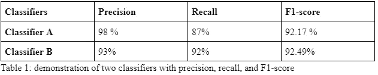
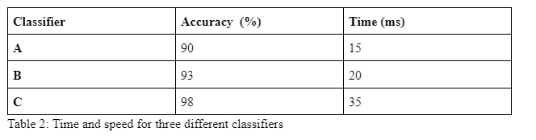

# 机器学习策略第 3 部分:单一数字评估度量。

> 原文：<https://medium.com/mlearning-ai/machine-learning-strategies-part-3-a-single-number-evaluation-metric-dac45ff55c45?source=collection_archive---------9----------------------->

在之前的文章中，我写了机器学习策略，以及如何使用最有效的方法来获得想要的结果。在这篇文章中，我将讨论评估指标，以及单个数字评估指标如何加速您的机器学习朝着有前途的方向发展。

credit: [1]

**单号评价指标**

如果你正在建立一个机器学习系统，你将不得不衡量你的算法性能。单个数字评估度量将给出算法性能的有用指示。比如你在大数据集上训练了一个 cat 分类器，你的测试集准确率是 98%；然后，这个数字告诉您，测试集中 98%的数据被正确分类，错误率为 2%。

例如，精确度和召回率是其他评估度量，然而，两个数字的评估度量在某种程度上很难理解。在这种情况下，您可以取两个数字的平均值或 F1 分数，这有助于组合成一个单一数字的评估。下面举例说明:

在上表中，两个分类器的 F1 分数不同，分类器 B 更优。

举个例子，如果你正在为四个不同的市场开发一个猫检测应用，比如美国、英国、印度和中国。这给出了四个指标。通过取四个不同数字的平均值或加权平均值，最终得到一个数字评估指标。

**优化和满足指标**

这是将多个评估数字合并成一个单一指标的另一种方法。

假设您正在构建一个实时应用程序。在这种情况下，时间和准确性成为关键因素。你需要一个关于时间和准确性的最佳模型。您必须从以下三个分类器中进行选择:

从一个公式中得到一个单一的数字似乎有点不自然，比如:

精确度— 0.5*(时间)

你可以这样做，首先，定义一个跑步时间。比方说，低于 50 毫秒的任何值对于您的应用都是可以接受的。现在，在满足运行时间的前提下，最大化你的分类器的准确性。在这里，在这种情况下，运行时间是“令人满意的度量”——您的模型应该对这个运行时间足够好。准确性是“优化指标”。

**参考文献:**

[1].[https://www . analyticsvidhya . com/blog/2020/11/a-tour-of-evaluation-metrics-for-machine-learning/](https://www.analyticsvidhya.com/blog/2020/11/a-tour-of-evaluation-metrics-for-machine-learning/)

[2].[https://www . goodreads . com/book/show/30741739-机器学习-向往](https://www.goodreads.com/book/show/30741739-machine-learning-yearning)

 [## Mlearning.ai 提交建议

### 如何成为 Mlearning.ai 上的作家

medium.com](/mlearning-ai/mlearning-ai-submission-suggestions-b51e2b130bfb)