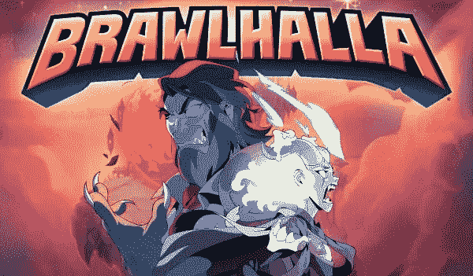
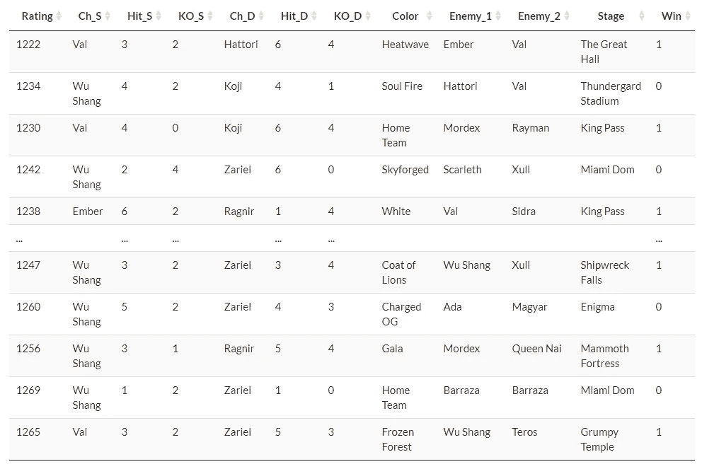
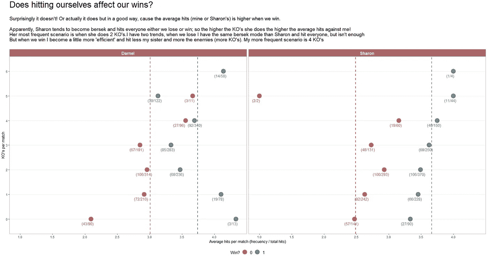
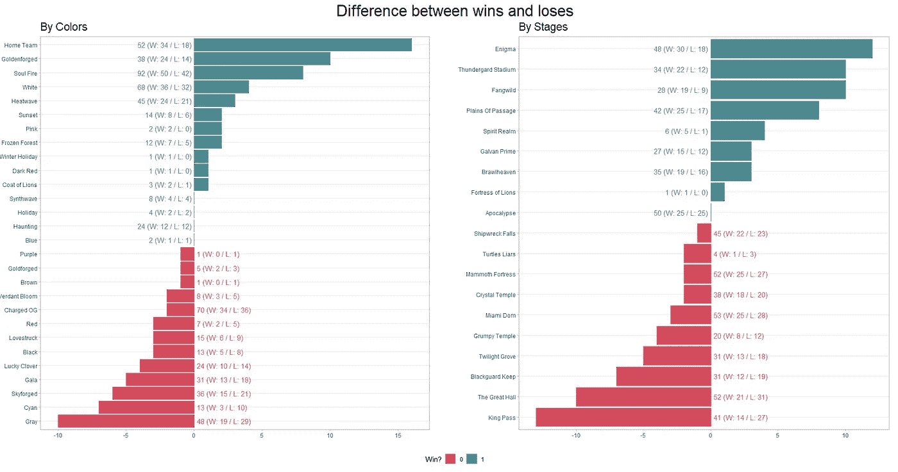
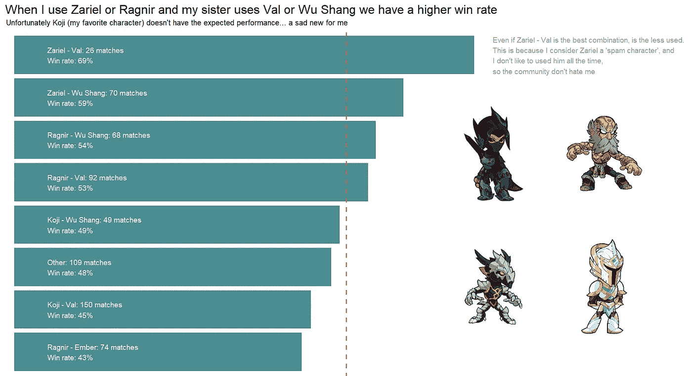
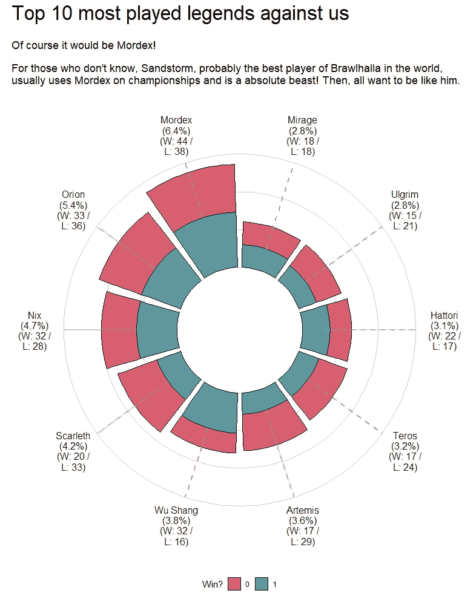

# 机器学习预测我们在争吵大厅的胜利——第一部分:描述性分析

> 原文：<https://medium.com/mlearning-ai/machine-learning-to-predict-our-wins-on-brawlhalla-part-one-descriptive-analysis-with-r-61fdca6635b1?source=collection_archive---------3----------------------->

Brawlhalla’s poster for Season 4.

如果你像我一样是一个数据爱好者，有可能你想知道关于普通情况的问题的答案，所以你在某一天醒来并开始收集数据。这篇文章是关于那些没人问的问题中的一个，但是我想知道。

我姐姐和我从 3 年前开始玩一个叫做“争吵大厅”的电子游戏。坏消息是，即使我们已经玩这个游戏很长时间了，我们强烈地*相信*我们很糟糕！但正如著名的爱德华所说:“没有数据，你只是另一个有观点的人”。因此，我决定去发现，我们到底有多坏？用数据！

文章分为两部分:

1.  描述性分析:我们的目的是通过可视化和一些讨论来描述数据。
2.  预测分析:我们将建立一个模型，在比赛开始前根据变量*预测获胜的概率。*

## **简介**

Brawlhalla 是一款 2D 平台战斗机，几乎可以免费在你能想象到的所有最新平台上玩。在过去的几年里，因其与流行角色的多次[交叉，不断更新，以及……因为它真的很有趣而广受欢迎！](https://www.brawlhalla.com/crossovers/)

我们玩排名 2V2:一个我们对抗另外 2 个玩家的战斗模式；每个角色都有 3 次生命。赢的一方获得 ELO 积分，输的一方失去 ELO 积分。[这里的](https://www.youtube.com/watch?v=Tk8ytQ-ri_A)就是一个例子。这种模式的有趣之处在于，如果你不小心，你可能会撞到你的伴侣并伤害她/他(从上面的视频中 1 分 15 秒)。

## **数据描述**

我和我妹妹经常打对方！然后我们提出了一个假设:

> 我们通常会输，因为命中率越高，对手就越容易干掉我们。

除此之外，我们也相信我们有颜色和阶段给我们‘运气’，哪里更容易让我们赢。我们收集了 5 个月内每场比赛的数据(638 次观察):

Sample of data for Brawlhalla matches.

*   评分:ELO 在比赛开始时得分。
*   Ch_S，Ch_D:我和姐姐用的字符。
*   Hit_S，Hit_D:对另一方的命中计数。
*   KO_S，KO_D:每人杀死一个敌人。注:`sum(KO_S, KO_D) ≤ 6; If sum(KO_S, KO_D) == 6 then Win = 1`原因 6 KOs 意味着我们杀死每个敌人 3 次。
*   颜色:为我们的角色选择的颜色。
*   敌人 _1，敌人 _2:对手使用的角色。
*   阶段:比赛的阶段(由游戏随机选择)
*   赢:0-输，1-赢。数据相当平衡(`mean_win` = 0.5016)，对我们的技能来说很不幸。

## 点击率会影响我们的表现吗？

这是个大问题！个人表现是 KOs 给的，即使`sum(KO_S, KO_D)`和`Win`相关性高(0.709)。这意味着如果我们获得更高的 KOs，那么将获得更多的胜利，按照我们的假设，*更少的命中，*对吗？

嗯……不是。又一次，数据证明我错了，永远错了。正如可视化显示的那样，对于我们两个和所有 KOs 值(除了当我做了 5 次 KOs 时)，我们赢得的比赛的平均命中率增加了。

根据我姐姐的数据，我们的假设更加站不住脚，因为如果她打我更多，她实际上会有更好的表现。当我们获胜时，我的数据遵循预期的行为，因为良好的表现往往会降低平均命中率。

## 有幸运色或者阶段？

我们有自己喜欢的颜色(主队、灵魂之火、带电 OG、灰色)。正如你所看到的，最常见的颜色有一个正平衡，因此数据支持我们这一点！电荷 OG(高频)的负平衡并不太大，但真正令人痛苦的是灰色，因为我们字面上称它为“幸运色”。

相反，最频繁的阶段有负平衡。我们在多平台(除了 Enigma)和小边界的舞台上表现最差。平台经常干扰战斗的进程，如果边界很小，有限的跳跃可能不足以拯救我们。

## 特征分析

最后，谁该为那些惊人的胜利和可怕的失败负责？

Brawlhalla 有一个 [54 个角色(传说)的列表](https://www.brawlhalla.com/legends/)(还在增加)，当然，我们不知道如何使用所有的角色。我们每个人都使用 3 个，有时我们会尝试其他组合。我们如何玩团队模式，分析谁是我们更好的一对会更好。

可视化显示了 7 个最常见的团队的获胜百分比(其余的归入“其他”)。一件有趣的事情，也许是“为什么我们失去了这么多？”，是因为最有效的队伍*扎瑞尔—瓦尔*几乎没人用，而最常用的队伍*浩二—瓦尔*只有 45%的效力。

因此，有可能我们没有为了赢得比赛而优化我们的传奇选举，而是用我们最喜欢的来愚弄自己(在我的例子中，是 *Koji* )。

当然，我们不能忘记敌人。他们也是一个团队，但这是一个不依赖于我们的团队，因此我想知道哪些是被其他人玩得最多的传奇人物，以及我们如何应对他们。

对于这一个，我提取了前 10 个。Mordex 是最多人使用的传说，有 6.4%的场合，个人认为沙尘暴对此有一定影响(在 viz 中我解释了谁是沙尘暴)。

如果你对这个游戏有所耳闻(或者对这个有一些好奇)就会知道 [*火箭长矛*是游戏中最讨厌的武器](https://www.youtube.com/watch?v=vsCBH_6bac4)！我们通常会在与那个武器的传说(乌尔格瑞姆，阿耳忒弥斯，斯卡莱斯和猎户座)和泰罗斯的战斗中损失更多。泰罗斯是游戏中最强的传奇人物之一，所以如果他击中你三到四次，可能会很快杀死你。

所以，总结一下:我和姐姐真的很不擅长这个游戏！但是现在我们知道为什么和什么时候我们是可怕的。

这就是这里的教训:你可以对任何事情进行自己的数据分析，也许你会有一个惊人的时间来发现随机问题的东西。数据分析不仅仅是六位数的薪水(即使我没有)是你应该好好利用的一次冒险。

在下一篇文章中，我们将构建一个 ML 模型来预测实现我们的新知识的获胜概率。

如果你来了，我很感激！希望你喜欢。

 [## Mlearning.ai 提交建议

### 如何成为 Mlearning.ai 上的作家

medium.com](/mlearning-ai/mlearning-ai-submission-suggestions-b51e2b130bfb)