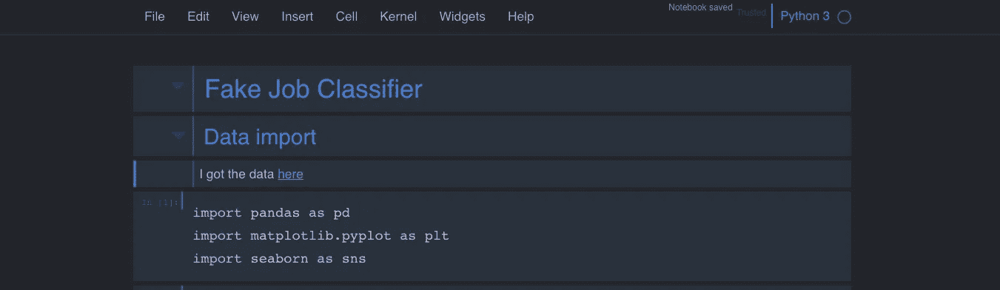
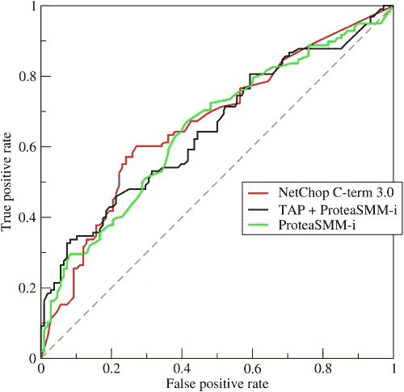
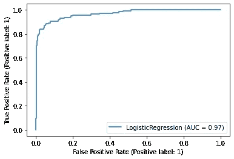

# 通过机器学习检测假工作

> 原文：<https://medium.com/mlearning-ai/machine-learning-tools-for-fraudulent-job-post-classification-69cf52c20bdf?source=collection_archive---------5----------------------->

For more insight into my code, see my [GitHub](https://github.com/pjn51).

大约一年前的一天，我在浏览一些招聘信息时，看到了一个好得令人难以置信的职位。它勾选了所有的方框——薪水、地点、描述、资格。当然，我申请了，很快，我接到了一个突如其来的电话。我被录取了！他们急于开始文书工作。实际上，有点太急切了。我做了一些调查，越来越相信向这些人提供任何类型的个人信息都是错误的决定。

作为我最近完成的 [Metis 数据科学训练营](https://www.thisismetis.com/courses/introduction-data-engineering?&utm_source=google&utm_medium=cpc&utm_campaign=metis_br_si_ext&utm_content=21q2_intro_data_engineering&gclid=Cj0KCQjwnueFBhChARIsAPu3YkSJ3yzEPcR1ft52s4Sh2CD3hdFu529vFupdAVwmvhjoyfchCRuTZmYaAkiBEALw_wcB&gclsrc=aw.ds)的一部分，我想应用我对机器学习和分类的新理解，看看我是否能创造一种工具，能够帮助其他人避免我的命运。我希望能够将招聘信息分类为欺诈性的或真实的，只使用发布信息中容易获得的数据。

我找到了 [EMSCAD](http://emscad.samos.aegean.gr/) 数据集，其中包含了 2012 年至 2014 年间 18000 份被希腊爱琴海大学鉴定为假或真的招聘信息。这将很好地训练我的模型，使其能够区分虚假和真实的帖子。

对于这个数据集中的每个职位发布，我都有大量的信息。我可以访问职位、地点、部门、工资范围、公司简介、描述、资格、福利等等。我计划用这些作为我分析的特征。

收集数据后，任何数据科学项目的第一步都是探索性的数据分析和数据清理。这里的目标是看看我们可以在数据的表面检测到什么模式，并为机器学习工具准备好数据，这些工具可以解开更深层次的模式。

我把数据加载到 Pandas，然后开始工作。我立刻注意到了一些事情。首先，我看到这是一个严重不平衡的数据集。在 18，000 份招聘广告中，只有 866 份是欺诈性的。这意味着只有 4.8%的观察值属于少数类。

对于某些功能，还有大量的空值。我曾想将薪水、部门和其他一些特征纳入我的分类，但现在很明显，我对所有工作的唯一一致的信息是工作描述本身。这意味着我也必须融入我的自然语言处理知识。

# 把...嵌入

随着探索性数据分析的完成，我进入了项目的建模阶段。我使用迭代方法，从最简单的方法和工具开始，根据问题的需要逐渐变得复杂。考虑到这一点，我在工作描述中应用了计数矢量器。

计数矢量器是一种用于自然语言处理的嵌入方法。我们执行嵌入是为了转换文本，以便我们可以应用机器学习工具。计数矢量化是最简单的方法之一。我们为文本中出现的每个单词创建一个新特征，并根据该单词是否出现为每个文档分配一个值。这样，我们可以为我们的语料库(我们的文档集合)中的每个文档创建一个向量，并且我们可以使用各种分类工具来利用这个向量。

在我实现了我的嵌入方法之后，我转向了度量选择。当然，能够对我们的模型进行“分级”是很重要的，以查看它们在对我们的结果进行分类方面做得如何。我们可能会尝试使用准确性作为我们的衡量标准，询问有多少百分比的观察结果被正确分类。然而，在这种情况下使用这个度量标准有一个致命的缺陷。还记得之前我提到只有 4.8%的观察是欺诈性的工作岗位吗？这意味着如果我的模型将所有的观察结果归类为真实的，它的准确率将达到 95.2%。因此，我需要一个更稳健的指标来使用。

# ROC 曲线

我用 ROC 曲线找到了这样一个模型。ROC 代表接收机工作特性，ROC 曲线向我们展示了分类器在各种*分类阈值下的性能。*分类阈值是一个超参数，用于确定何时将观察值放入正类。对我们来说，把一个观察分配到正类，意味着我们认为这个观察是欺诈性的。

由于分类阈值较高，因此在我们将观察结果归类为欺诈性之前，我们要确保模型对其非常有信心。由于阈值较低，我们将模型很有可能是欺诈性的观察结果放入该类。

# 精确度和召回率

ROC 曲线在不同的分类阈值下绘制了两个额外的指标，因此我们需要首先讨论这些额外的指标。这些指标是*精度*和*召回。*精度也叫假阳性率。精确度指标从根本上问，“有多少非欺诈性的工作被模型错误地归类为欺诈性的？”

召回率也叫真阳性率。这从根本上问，“有多少欺诈性的工作逃过了我们的模型，最终被归类为真实的？”

对于某些场景，更重要的是优先考虑查全率或查准率，有些场景要求我们平衡这两个指标。例如，如果我们将活检分为癌性或非癌性，那么对我们来说，检测所有的癌细胞比确保不出现假阳性更重要。

然而，对于我们的用例，我认为这两个指标都很重要。显然，求职者希望确信他们在公告板上看到的工作是真实的，但我们也不想将工作标记为欺诈性的，因为这样雇主可能会更喜欢另一个发布工作没有那么多障碍的平台。

# ROC AUC

既然我们已经讨论了 ROC 曲线的内容，我们可以谈谈如何使用这个指标了。通过绘制不同分类阈值下的召回率和精确度，我们可以看到模型在不同置信水平(不同阈值)下的表现如何。通过找到曲线下的面积，我们可以找到一个度量标准来描述模型对观察值的总体分类情况。完美运行的模型的 ROC AUC 为 1.0，而总猜测值为 0.5。

Figure 1\. ROC curve with a few models for reference ([wikipedia](https://en.wikipedia.org/wiki/Receiver_operating_characteristic)).

# 建模

最后，我现在可以转到模型选择的实际过程。首先，我将浏览我在此阶段尝试过的所有模型，然后我将分解为建模而对数据进行预处理的不同阶段。最后，我将揭示哪个模型执行得最好，以及哪个预处理步骤总体上产生了最好的结果。

## 型号选择

bat 的第一个模型是来自 scikit-learn 的**多项式朴素贝叶斯分类器**。这是一个简单的概率分类器。如果你想了解更多关于朴素贝叶斯以及如何将其应用于分类的知识，我推荐[这篇文章](https://www.analyticsvidhya.com/blog/2017/09/naive-bayes-explained/)。

我选择的下一个模型是一个**逻辑回归**，也是使用 scikit-learn 实现的。逻辑回归算法遵循与线性回归相同的一般思想，但是因为我们试图预测二元类而不是连续变量，所以我们使用链接函数将连续结果转换为类分配的概率。有关该算法如何工作的更多信息，请参见主题为的[这篇文章。](https://towardsdatascience.com/logistic-regression-detailed-overview-46c4da4303bc)

我还试用了一款**推车型号**。CART 代表分类和回归树。基本思想是根据其他特征来预测结果变量(对我们来说，一个职位是否是欺诈性的)。CART 模型实现这一点的方式是创建决策点，在这些决策点上，观察结果被分成组。这些决策点级联成一种可能的路径树，直到数据被分成大致同质的类别。

然而，我没有仅仅使用单一的分类树，我决定使用**随机森林**。随机森林是一种解决决策树缺点的方法。树可以变得*相关，*意味着一个非常有预测性的特征被反复使用。这可能非常接近我们想要的，但理想情况下，我们将从每个特征中提取信息，不管我们能获得的信息有多少。

这个问题的解决方案可以在随机森林体系结构中找到。随机森林使用许多决策树，在每次分裂时随机保留特征。想了解更多关于随机森林的好处，我推荐[这篇文章](https://towardsdatascience.com/random-forest-3a55c3aca46d)。

最后，我使用了一个名为 **XGBoost** 的模型。这个模型使用*梯度提升的*决策树。Boosting 是一种按顺序运行多个模型的技术，试图修补前一个模型中的弱点。当应用于决策树时，这可以产生非常好的结果。有关 XGBoost 及其背后模型的更多信息，请参见本文。

## 预处理

首先，我使用 count 矢量化公司描述作为我的特征来运行上述模型。这表现得相当好，但我知道我可以使用一些技巧来获得更大的预测能力。

为了抵消我之前提到的类不平衡，我使用了一种叫做*过采样的方法。*当阶级不平衡挑战我们的模型时，我们可以尝试增加少数阶级的观察数量，以便为模型提供更多欺诈行为的示例，从而辨别其中的模式。当然，我们只对训练数据集中的观察值进行过采样，而让验证和测试数据集保持原样，这样我们就可以看到我们的模型对新数据的推广效果如何。

我使用这种过采样数据重新运行了模型，我确实看到了改进。在我对结果满意之前，我想尝试最后一个技巧。到目前为止，我只是在嵌入过程中使用公司描述。现在，我决定使用*所有*的文本，看看我是否能改善我的模型的结果。事实上，通过这样做，我能够全面地显著改进模型结果。

# 模型结果

现在是我们期待已久的时刻，我的模型的最终结果。表现最好的模型最终是使用组合文本数据的逻辑回归，其中欺诈性观察被过采样。最终的指标是 ROC AUC 为 0.97，精确度为 0.79，召回率为 0.78。

我的精确分数意味着，在我的模特*认为*是欺诈性的 100 份招聘信息中，有 79 份实际上是欺诈性的。我的回忆分数显示，在 100 个*实际上有欺诈行为的*职位中，有 78 个被这个逻辑回归模型成功检测出来。总的来说，我认为这种精确和回忆的水平会使这个模型成为求职板的有用工具。

Figure 2\. the final ROC curve for my logistic regression model.

# 结论

我希望我已经展示了一些实际的工作，这些工作会在像这样的分类项目中取得进展。在 Metis 提供的密集数据科学训练营期间(当时它只是一个为期 12 周的普通课程)，我了解到，作为一名数据科学家，更重要的是知道“要敲哪根钉子”，而不是“挥舞锤子”，可以这么说。我认为这显然是事实，我很高兴能在这里分享如此有力的结果。

我很想做更多的调查，看看是什么让欺诈性的职位如此容易被发现，是什么特征让欺诈性的职位能够逃避检测。我认为，对这个话题的研究可能是非常有价值的，不仅对经营招聘网站的公司，而且对所有看到一个职位好得不像真的美国求职者都是如此。

如果你想了解我在这个项目中使用的代码的内部工作原理，我鼓励你查看我为这个项目创建的 [GitHub 库。感谢阅读！](https://github.com/pjn51)