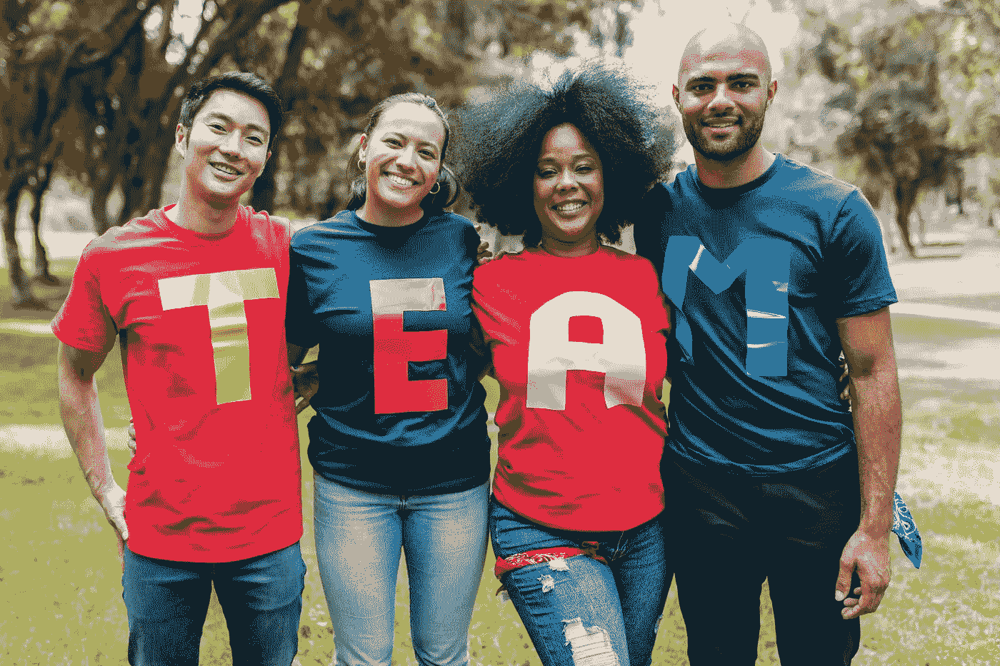

# 机器学习将解放创造力！

> 原文：<https://medium.com/mlearning-ai/machine-learning-will-free-creatives-79f005145e4?source=collection_archive---------4----------------------->

## 与人工智能的人工协作

## 人工智能如何改变创意产业

[MLearning.ai collaborates with over 500 researchers from 6 continents](https://www.linkedin.com/company/mlearning-ai/)

[机器学习](/mlearning-ai/what-is-machine-learning-2ec9cacb986c)时代已经来临。人工智能工具在过去的十年中得到了发展，它将彻底改变我们做任何事情的方式，从教学到营销。其中一个工具叫做[AI _ 门房](https://www.linkedin.com/posts/dariusz-gross_ai-i-look-forward-to-working-with-you-activity-6713391619657265152-ypR3)，由该公司开发…