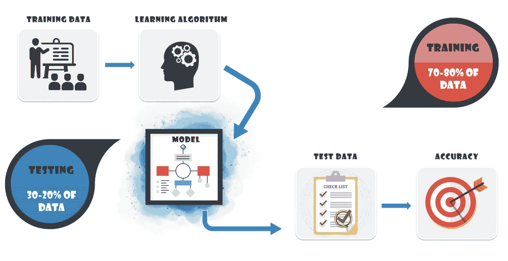

# 使用 PySpark MLlib 进行机器学习

> 原文：<https://medium.com/mlearning-ai/machine-learning-with-pyspark-mllib-6f0feec7f1a3?source=collection_archive---------1----------------------->

[https://www.edureka.co](https://www.edureka.co/blog/pyspark-mllib-tutorial/)

> 在上一篇[文章](https://medium.datadriveninvestor.com/pyspark-sql-and-dataframes-4c821615eafe)中，您了解了 PySpark SQL 以及如何使用 DataFrame API 和 SQL query 与它进行交互。在本文中，您将了解 PySpark MLlib，这是一个用于可伸缩机器学习的内置库。

***导入 PySpark MLlib 库，这在上一篇*** [***文章***](https://medium.datadriveninvestor.com/pyspark-sql-and-dataframes-4c821615eafe) ***中讨论得很透彻。***