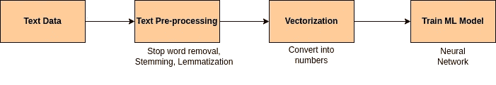

# 使用文本数据的机器学习—文本处理

> 原文：<https://medium.com/mlearning-ai/machine-learning-with-text-data-text-processing-16de9af9a478?source=collection_archive---------8----------------------->

Photo by [Waldemar Brandt](https://unsplash.com/@waldemarbrandt67w?utm_source=medium&utm_medium=referral) on [Unsplash](https://unsplash.com?utm_source=medium&utm_medium=referral)

自然语言处理，简称 NLP，被定义为通过软件自动操作自然语言，如语音和文本。

换句话说，可以描述为用文本数据进行机器学习。

机器学习模型只能处理定义明确的数字数据。因此，处理文本数据的第一步是将其转换成数字格式。如下图所示，使用文本数据进行机器学习涉及几个步骤

## 文本预处理

1.  **标记化**

在这一步中，文本数据被空格和标点符号分割成小部分。

示例-

投入——“我喜欢跳舞。”

标记化输出——“我”、“喜欢”、“要”、“跳舞”

2.**停止字删除**

处理过程中的下一步是停用词删除。

停用词是在文本中频繁出现，但对整体意义贡献不大的词。
常见的停用词:“一”、“该”、“所以”、“是”、“它”、“在”、“在”、“这个”、“那里”、“那个”、“我的”
举例——

输入—“我家附近有一家餐馆”

停止单词删除输出-“房子附近的餐馆”

3.**词干**

词干是指一组规则，将一个字符串分割成通常指更一般意义的子字符串。
目标是移除单词词缀(尤其是后缀)，如“s”、“es”、“ing”、“ed”等。
示例—

“玩”“玩过”“玩”都变成了——“玩”

4.**词汇化**

类似于词干，但更高级。词汇化考虑了语言学，考虑了单词的形态分析。要做到这一点，有必要拥有详细的字典，算法可以通过这些字典将表单链接回其引理。

“am”、“is”、“are”都变成了“be”

这些是处理文本数据时的基本处理步骤。下一步是将干净的处理过的数据转换成数字。请继续关注深入该部分的下一篇文章。前期处理愉快！

 [## Mlearning.ai 提交建议

### 如何成为 Mlearning.ai 上的作家

medium.com](/mlearning-ai/mlearning-ai-submission-suggestions-b51e2b130bfb)