# 葡萄酒质量背后的主要因素——酒精、游离二氧化硫和其他特性的 SHAP 值

> 原文：<https://medium.com/mlearning-ai/main-factors-behind-the-wine-quality-shap-values-for-alcohol-free-sulfur-dioxide-and-other-eac2a8f6ecc1?source=collection_archive---------5----------------------->

在这篇文章中，我研究了影响葡萄酒质量的因素。该分析基于葡萄牙 [Vinho Verde](https://en.wikipedia.org/wiki/Vinho_Verde) 葡萄酒【1】的[公共葡萄酒质量数据集](https://archive.ics.uci.edu/ml/machine-learning-databases/wine-quality/)，包括约 **6500 个红、白葡萄酒样本(合计)**。数据集中可用的特征(输入变量)是基于物理化学测试的那些**:**

*   **固定酸度**；
*   **挥发性酸度**；
*   **柠檬酸**；
*   **残糖**；
*   **氯化物**；
*   **游离二氧化硫**；
*   **二氧化硫总量**；
*   **密度**；
*   **pH 值**；
*   **硫酸盐**；
*   **酒精**。

标签或输出变量是**质量分数**(基于感官数据，在 0 到 10 分之间，**越高越好**)。

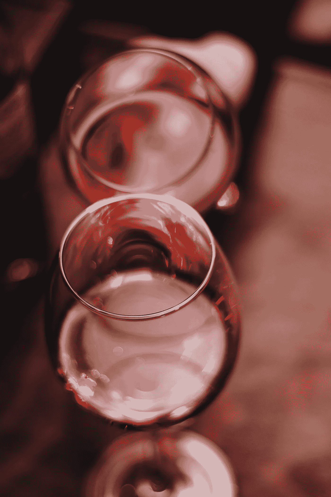

Photo by [Anna Bratiychuk](https://unsplash.com/@skysay?utm_source=unsplash&utm_medium=referral&utm_content=creditCopyText) on [Unsplash](https://unsplash.com/s/photos/wine?utm_source=unsplash&utm_medium=referral&utm_content=creditCopyText)

以下是数据经过初步转换后的样子(将白葡萄酒和红葡萄酒数据集以及宁滨数值特征合并到更大的数据仓中:

```
df_red = pd.read_csv('winequality-red.csv', sep=';')
df_white = pd.read_csv('winequality-white.csv', sep=';')
df_red['wine'] = 'red'
df_white['wine'] = 'white'
df = pd.concat([df_red, df_white])
df['fixed acidity'] = df['fixed acidity'].apply(lambda x: 1/1*round(1*x))
df['volatile acidity'] = df['volatile acidity'].apply(lambda x: 1/5*round(5*x))
df['citric acid'] = df['citric acid'].apply(lambda x: 1/10*round(10*x))
df['residual sugar'] = df['residual sugar'].apply(lambda x: 2*round(1/2*x))
df['chlorides'] = df['chlorides'].apply(lambda x: 1/20*round(20*x))
df['free sulfur dioxide'] = df['free sulfur dioxide'].apply(lambda x: 5*round(1/5*x))
df['total sulfur dioxide'] = df['total sulfur dioxide'].apply(lambda x: 10*round(1/10*x))
df['density'] = df['density'].apply(lambda x: 1/500*round(500*x))
df['pH'] = df['pH'].apply(lambda x: 1/5*round(5*x))
df['sulphates'] = df['sulphates'].apply(lambda x: 1/10*round(10*x))
df['alcohol'] = df['alcohol'].apply(lambda x: 1/1*round(1*x))
df.head(10).T
```

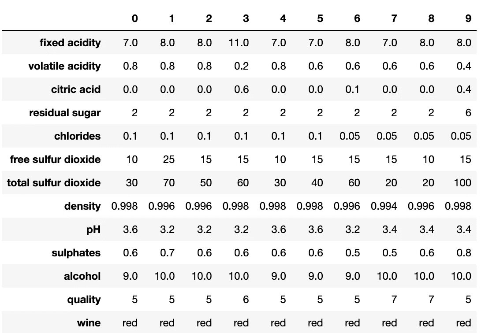

Image source: author

正如我们所见，**大多数葡萄酒样品的得分在 5 到 7 分之间**:

```
plt.hist(df['quality'], bins=10)
plt.xlabel('wine quality')
plt.ylabel('number of records')
plt.show();
```

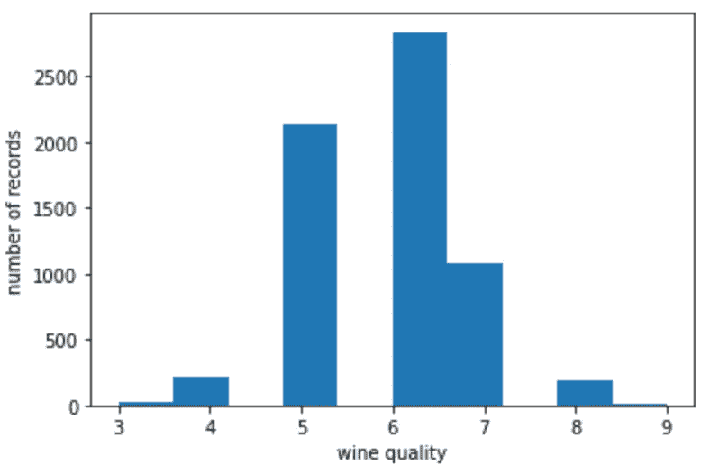

Image source: author

下一步是在训练(暴露于机器学习模型)和测试(搁置)子集之间分割数据:

```
# initialize data
label_col = 'quality'
y = df[label_col].values.reshape(-1,)
X = df.drop([label_col], axis=1)
cat_cols = df.select_dtypes(include=['object']).columns
cat_cols_idx = [list(X.columns).index(c) for c in cat_cols]
X_train,X_test,y_train,y_test = train_test_split(X, y, test_size=0.25, random_state=0)
print(X_train.shape, X_test.shape, y_train.shape, y_test.shape)
```

基线模型从训练数据中获取**平均分数，并将其用作两个子集的预测:**

```
# Baseline scores (assuming the same prediction for all data samples)
rmse_bs_train = mean_squared_error(y_train, [np.mean(y_train)]*len(y_train), squared=False)
rmse_bs_test = mean_squared_error(y_test, [np.mean(y_train)]*len(y_test), squared=False)
print(f"RMSE baseline score for train {round(rmse_bs_train,4)}, and for test {round(rmse_bs_test,4)}")
```

给 RMSE 在**测试中的基线分数 0.89 分**。用更详细的机器学习模型，例如 [CatBoostRegressor](https://catboost.ai/en/docs/concepts/python-reference_catboostregressor) :

```
# initialize Pool
train_pool = Pool(X_train, 
                  y_train, 
                  cat_features=cat_cols_idx)
test_pool = Pool(X_test,
                 y_test,
                 cat_features=cat_cols_idx)
# specify the training parameters 
model = CatBoostRegressor(iterations=1000,
                          depth=10, 
                          learning_rate=0.07,
                          verbose=0,
                          loss_function='RMSE')
#train the model
model.fit(train_pool)
# make the prediction using the resulting model
y_train_pred = model.predict(train_pool)
y_test_pred = model.predict(test_pool)rmse_train = mean_squared_error(y_train, y_train_pred, squared=False)
rmse_test = mean_squared_error(y_test, y_test_pred, squared=False)
print(f"RMSE score for train {round(rmse_train,4)}, and for test {round(rmse_test,4)}")
```

可以将测试数据集的 RMSE 误差提高到 **0.65 点**。

最后，让我们看看 [SHAP 的价值观](https://shap.readthedocs.io/en/latest/):

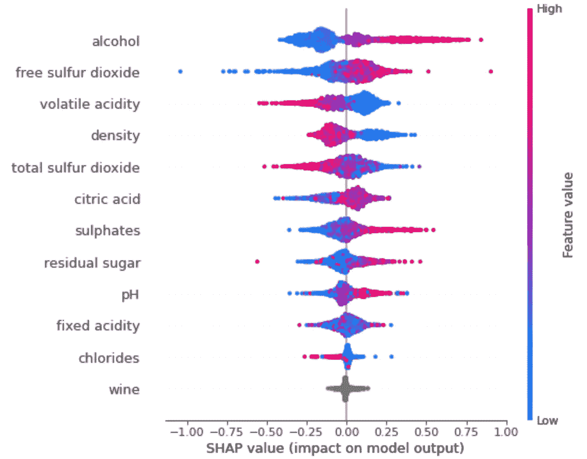

Image source: author

> 正如我们所见，葡萄酒质量最重要的特征是**酒精**和**游离二氧化硫**的水平，以及**挥发性酸度**。

让我们更详细地看看:

```
def show_shap(col):
    df_infl = X_test.copy()
    df_infl['shap_'] = shap_values[:,df_infl.columns.tolist().index(col)]
    gain = round(df_infl.groupby(col).mean()['shap_'],3)
    gain_std = round(df_infl.groupby(col).std()['shap_'],3)
    cnt = df_infl.groupby(col).count()['shap_']
    dd_dict = {'col': list(gain.index), 'gain': list(gain.values), 'gain_std': list(gain_std.values), 'count': cnt}
    df_res = pd.DataFrame.from_dict(dd_dict).sort_values('gain', ascending=False).set_index('col')
    plt.figure(figsize=(6,4))
    plt.errorbar(df_res.index, df_res['gain'], yerr=df_res['gain_std'], fmt="o", color="r")
    plt.title(f'SHAP values for {col}')
    plt.ylabel('points')
    plt.tick_params(axis="x", rotation=90)
    plt.show();
    print(df_res)
    returnfor col in X_test.columns:
    print()
    print()
    print(col)
    show_shap(col)
```

> 值得注意的是，“[Vinho Verde](https://en.wikipedia.org/wiki/Vinho_Verde)”**葡萄酒的质量分数随着酒精浓度的增加而不断增加**，最大和最小酒精浓度的葡萄酒之间的**差异约为 0.85 分(或约 10%)** :

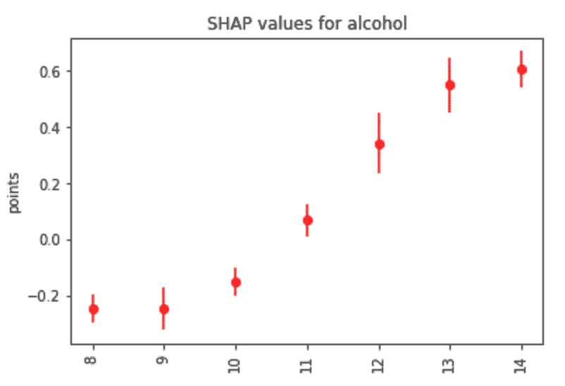

Image source: author

有趣的是，游离二氧化硫的**水平也与葡萄酒质量评分**正相关:

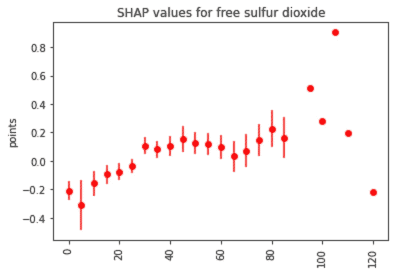

Image source: author

相反，**挥发性酸度最低的葡萄酒样品得分最高**:

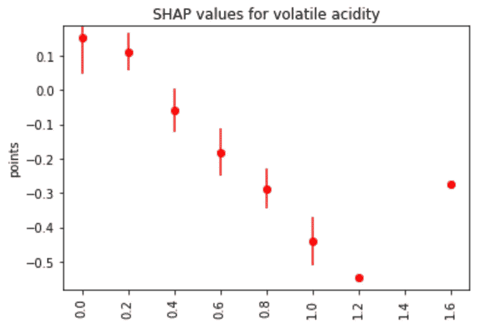

Image source: author

葡萄酒的密度等级也是如此:

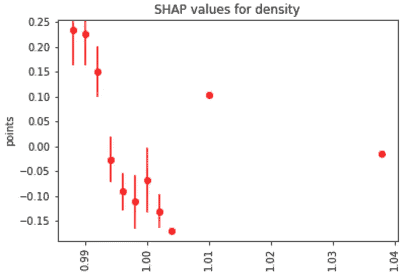

Image source: author

与**总二氧化硫水平**相比:

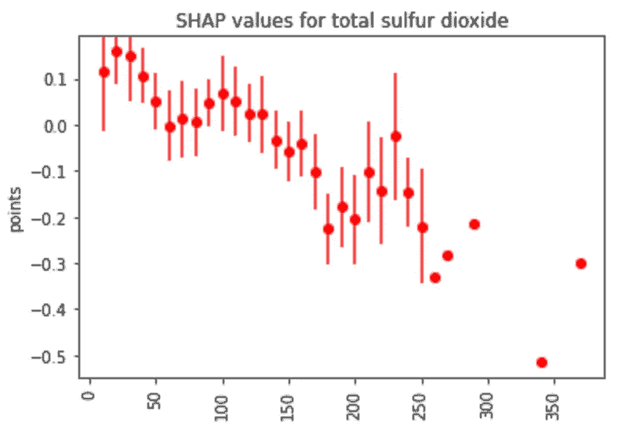

Image source: author

预期的葡萄酒质量分数也随着柠檬酸水平的增加而缓慢增长**:**

**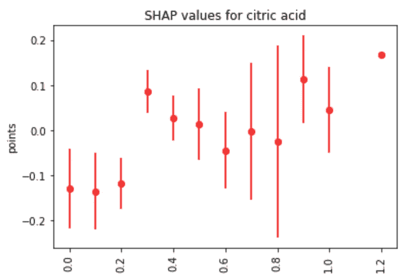**

**Image source: author**

**硫酸盐的**水平(当不超过 1.0 时)**:**

**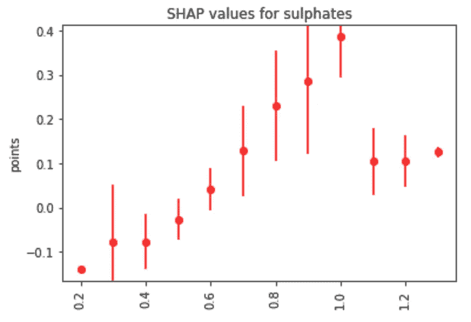**

**Image source: author**

****最高残糖水平约为 14** :**

**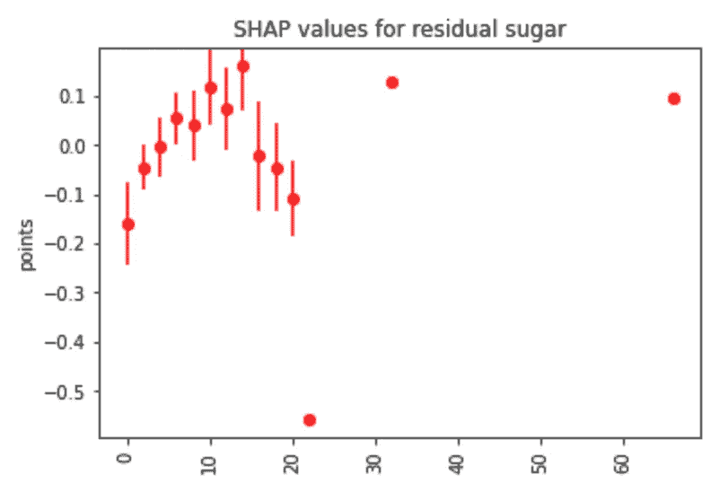**

**Image source: author**

****几乎不随 pH 值变化**(假设其他因素相同):**

**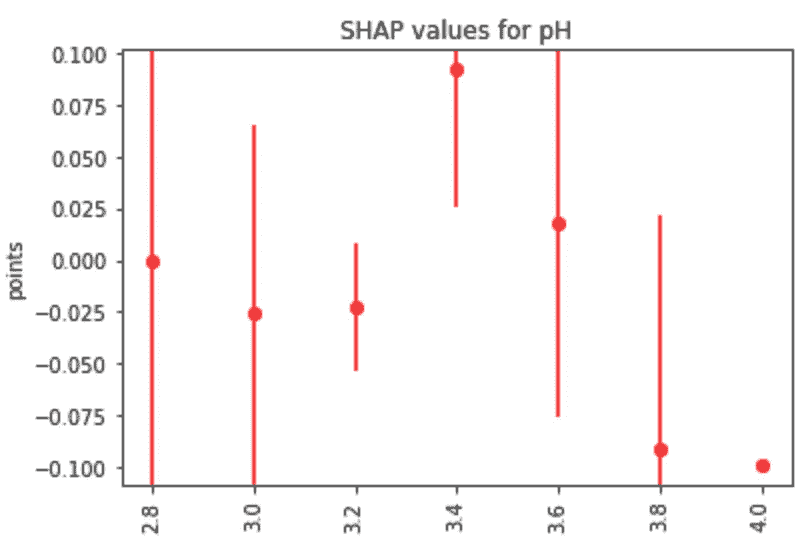**

**Image source: author**

**以及**固定酸度水平**:**

**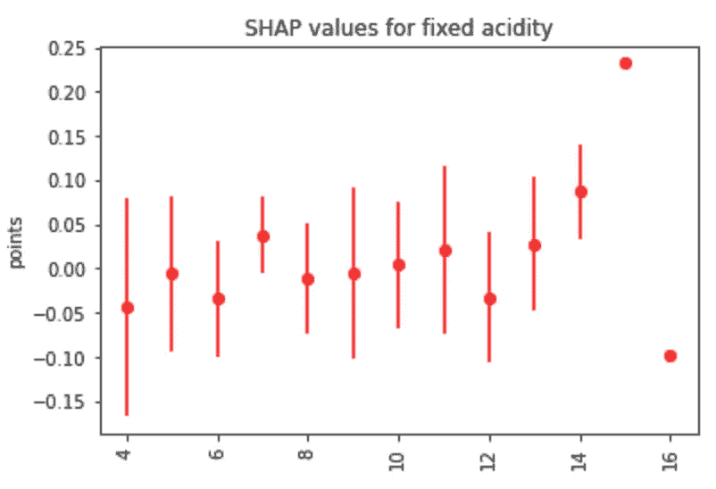**

**Image source: author**

****氯化物等级**(不包括最小的):**

**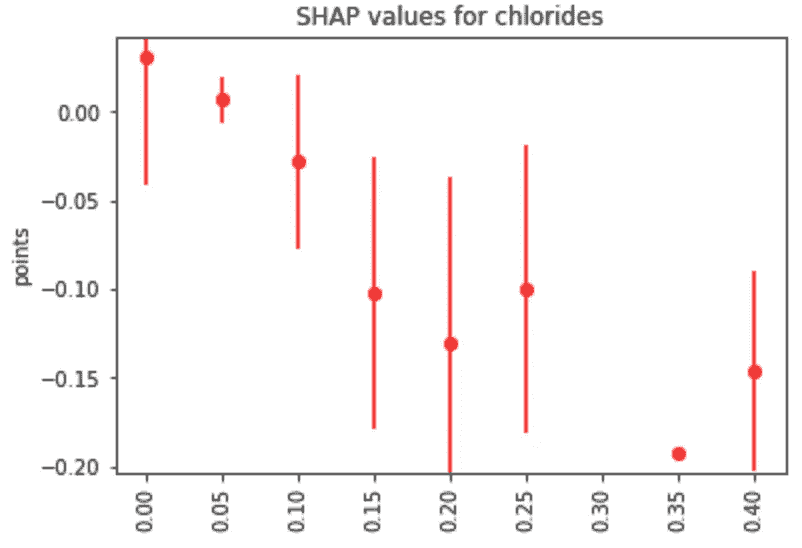**

**Image source: author**

**红葡萄酒的**略高于白葡萄酒的**(其他因素相同):**

**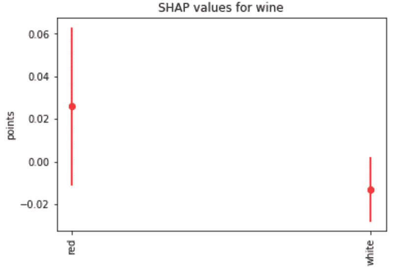**

**Image source: author**

**参考资料:**

**[1] P .科尔特斯、a .塞尔代拉、f .阿尔梅达、t .马托斯和 j .赖斯。
通过物理化学特性的数据挖掘建立葡萄酒偏好模型。决策支持系统，爱思唯尔，47(4):547–553。刊号:0167–9236。**

**可在:[@ Elsevier][http://dx.doi.org/10.1016/j.dss.2009.05.016](http://dx.doi.org/10.1016/j.dss.2009.05.016)
【印前(pdf)】[http://www3.dsi.uminho.pt/pcortez/winequality09.pdf](http://www3.dsi.uminho.pt/pcortez/winequality09.pdf)
【bib】[http://www3.dsi.uminho.pt/pcortez/dss09.bib](http://www3.dsi.uminho.pt/pcortez/dss09.bib)**

**希望这些结果能对你有用。如果有问题/评论，不要犹豫，在下面的评论中写下或**通过 [LinkedIn](https://www.linkedin.com/in/dima806/) 或 [Twitter](https://twitter.com/dima806_dima) 直接联系我**。**

**也可以 [**订阅我的新文章**](/subscribe/@dima806) ，或者 [**成为介员**](/@dima806/membership) 。**

**[](/mlearning-ai/mlearning-ai-submission-suggestions-b51e2b130bfb) [## Mlearning.ai 提交建议

### 如何成为 Mlearning.ai 上的作家

medium.com](/mlearning-ai/mlearning-ai-submission-suggestions-b51e2b130bfb)**