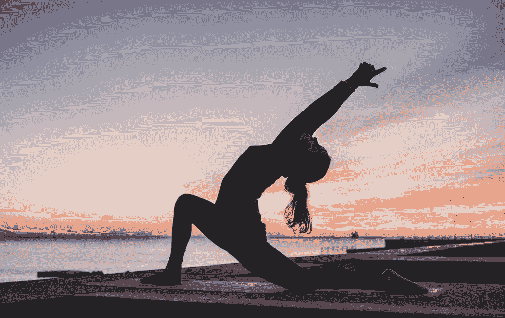
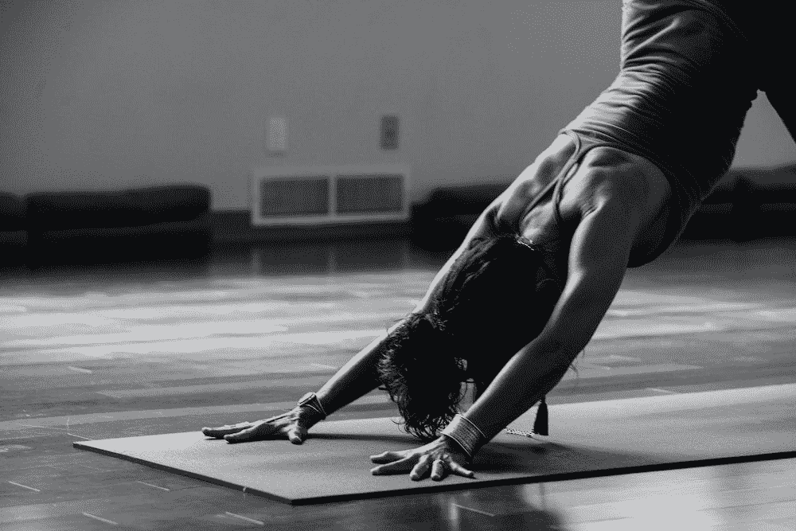
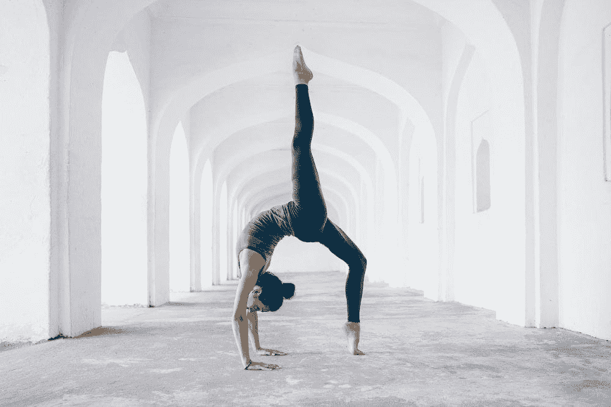
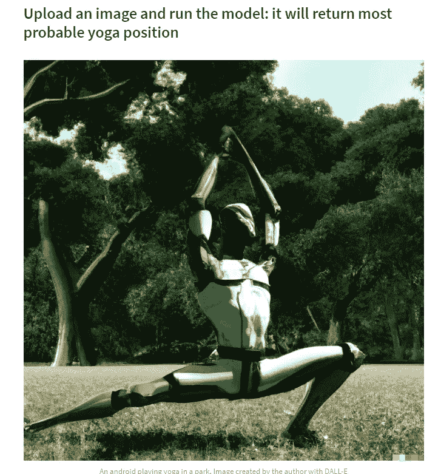
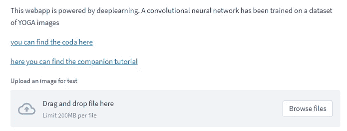
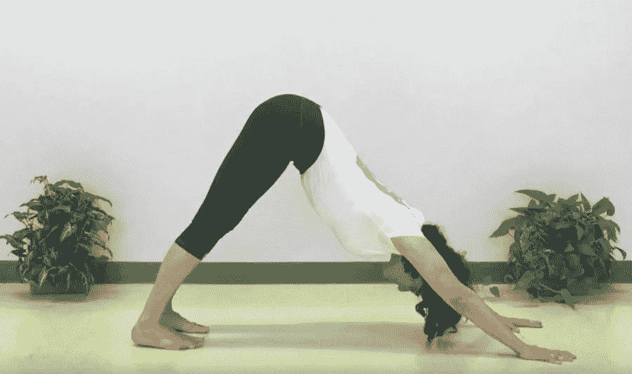
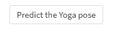
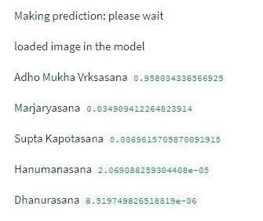
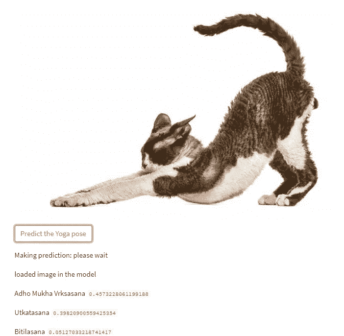

# 用 streamlit 在几分钟内制作一款应用

> 原文：<https://medium.com/mlearning-ai/make-an-app-with-streamlit-in-minutes-bec48ee19d67?source=collection_archive---------1----------------------->

用 Python 建立一个从照片预测瑜伽姿势的应用程序



image by [kike vega](https://unsplash.com/@kikekiks) at unsplash.com

你一定排练过向父母解释你作为数据科学家的工作。结果可能不是最令人兴奋的。毕竟俗话说“秀，不要说。”

对于数据科学，显示影响并不容易。如果你必须向客户解释你要做什么，它可能带来什么好处，你可能会忍不住使用一些科学术语和人工智能。

当然，在 Jupiter 笔记本上显示一个网站或几行代码不是一回事。也许你的模型的数学优雅能为你赢得菲尔兹奖，但是，客户仍然不会高兴。

好吧，我们同意。我该如何向他展示我奇妙的神经网络？我的客户不知道如何编程，我想向他展示我的精彩卷积神经网络，他只是想按下按钮，有结果。我该怎么做？

好吧，这篇文章就是解决办法。



image by [Ginny Rose Stewart](https://unsplash.com/@ginnyrose) at unsplash.com

# 关于 web 应用和部署的两个提示

简而言之，我们要做的是用 [PyTorch](https://pytorch.org/) 一步一步地训练一个神经网络，然后做一个可从手机和电脑访问的 web app 的部署。别担心，我们将从图像数据集开始，直到部署。

为什么这么做？

*   让你的作品更容易理解，更有影响力
*   你的作品终于走出了木星笔记本，变得栩栩如生
*   便于理解模型如何处理真实数据
*   是你作品集的名片
*   连你爸妈都可以玩。

从数据集到神经网络

我们将使用一个数据集，一个瑜伽姿势的数据集(数据集可以从这里下载)。它是 47 个不同的[瑜伽](https://en.wikipedia.org/wiki/Yoga)姿势的数据集(大约 2700 张图片通过网络抓取获得)。

一旦图像被下载，首先要做的是将它们随机分配到两个不同的文件夹中(训练和验证)。

首先，您需要导入库并选择路径

```
import os
from os.path import isfile, join
from os import listdir
import random
from PIL import Image

#use your path
mypath='./archive (2)/'
#onlyfiles = [f for f in listdir(mypath) if isfile(join(mypath, f))]
files =[f for f in listdir(mypath)]
files[:5]
```

然后，您可以使用这个循环(如果需要，可以更改路径的名称)

```
for i in [f for f in listdir(mypath)]:
    path = './data/train/' +i
    os.mkdir(path)
    path = './data/val/' +i
    os.mkdir(path) 
    folder = './archive (2)/' + i +'/'
    files=[f for f in listdir(folder)]
    randomlist = random.sample(range(0, len(files)), int(len(files)*0.2))
    n=0
    for j in range(len(files)):
        if j in randomlist:
            x=  folder +files[j]
            im = Image.open(x)
            dirx= './data/val/'+i +'/'
            fname = dirx + i +'_'+ str(n) +'.png'
            im.save(fname)
        else:
            x=  folder +files[j]
            im = Image.open(x)
            dirx= './data/train/'+i +'/'
            fname = dirx + i +'_'+ str(n) +'.png'
            im.save(fname)
        n+=1
```

应该需要几分钟。然后，我们只需要保存一个不同瑜伽姿势(类别)的文件:

```
with open('model_classes.txt', 'w') as f:
    for line in files:
        f.write(f"{line}\n")
```

正如您可能已经猜到的那样，其目的是创建一个模型，该模型将一个正在做瑜伽的人的图像作为输入，并预测其位置。

第一个问题，我们只有 2000 幅图像用于训练(其余的用于验证集)。那不是很多！此外，如果你看过这些图像，它们是非常异质的，并不是所有的质量(有文字，一些包含其他物体，等等)。或许如果我们从头开始构建一个神经网络，我们可以测试所有我们想要的架构，但是我们将无法逃脱 T2 的过度拟合。解决办法？

[转学](https://cs231n.github.io/transfer-learning/)！我们使用一个已经在一百万张图像(和一千个类别)上训练过的模型作为基础模型。迁移学习的美妙之处在于，在其他图像上训练的模型可以在其他类型的图像上很好地工作，因为它已经学习了可以在其他任务中有用的模式。

简而言之，我们的想法是采用像 [ReNet18](https://www.kaggle.com/datasets/pytorch/resnet18) 这样的高性能模型，并使其适应我们的任务(微调)。为了提高速度，我很快改编了本教程中的代码。当然，它可以改进(增加更多的增强类型，改变超参数)，但这是另一个故事。

神经网络的代码可以在这里找到。一旦训练完毕(取决于你是否有 GPU，这可能需要或多或少的时间)。保存模型，瞧！我们有一个可以预测图像的模型。

```
torch.save(model_ft, 'model.pt')
```

现在你所要做的就是向客户展示你的朱庇特笔记本，然后…

开个玩笑，我们自己建 app！



image by [Oksana Taran](https://unsplash.com/@oksanataran) at unsplash.com

# **带 streamlit 的网络应用**

[Streamlit](https://docs.streamlit.io/) 是一个开源的 Python 库。它的特别之处在于，它不仅允许你在很短的时间内构建一个 web 应用程序，而且如果你有 GitHub 帐户，还允许你能够部署到云上。

除了微调模板，你可以在五分钟内构建一个应用程序(假设没有要修复的错误)。当然，有一些限制，但仍然，做迷你项目，它是完美的。

我们需要什么:

*   一个有需求的文件(我们使用的库)。
*   代表我们的应用程序的 python py 文件。

在我们的例子中，我们另外还有我们的模型和一个包含模型类的文件。这对我们的第一个迷你应用程序来说已经足够了。

如果您还没有这样做，请在 [streamlit](https://docs.streamlit.io/) 上创建一个帐户(我们稍后会用到)。按照第一次推荐的那样注册 GitHub(当然，我假设你在 GitHub 上也有账号)。

之后，在你的电脑上安装 streamlit。

```
pip install streamlit
```

然后，我们开始写 app。我们指定要导入的库:

```
import io
from PIL import Image
import streamlit as st
import torch
from torchvision import transforms
import requests
from io import BytesIO

device = 'cpu'
model_dir = 'models/model.pt'
Yoga_dir = 'models/model_classes.txt'
```

然后，我们定义应用程序的功能:

*   我们正在添加标题和副标题
*   我们正在添加一个图像(st.image ),使用 markdown 我们可以描述我们的应用程序正在做什么
*   然后我们有一个函数加载模型，一个加载标签，一个加载我们想要测试的图像
*   然后，如果用户提供一个图像，并点击按钮，我们提供预测

```
def main():
    st.title('YOGA position prediction')
    st.subheader('Upload an image and run the model: it will return most probable yoga position')
    response = requests.get(img_path)
    img_screen = Image.open(BytesIO(response.content))
    st.image(img_screen, caption=capt, width=None, use_column_width=None, clamp=False, channels="RGB", output_format="auto")
    st.markdown('This webapp is powered by deeplearning. A convolutional neural network has been trained on a dataset of YOGA images')
    st.markdown('[you can find the coda here](https://github.com/SalvatoreRa/Yoga_position)')
    st.markdown('[here you can find the companion tutorial]()')
    model = load_model(model_dir)
    categories = load_yoga_positions(Yoga_dir)
    image = load_test_image()
    predictions = st.button('Predict the Yoga pose')
    if predictions:
        st.write('Making prediction: please wait')
        predict(model, categories, image)
```

现在我们可以定义我们的功能:

```
def load_test_image():
    uploaded_file = st.file_uploader(label='Upload an image for test')
    if uploaded_file is not None:
        image_data = uploaded_file.getvalue()
        st.image(image_data)
        return Image.open(io.BytesIO(image_data))
    else:
        return None

def load_model(model_path):
    model = torch.load(model_path, map_location='cpu')
    model.eval()
    return model

def load_yoga_positions(labels_file):
    with open(labels_file, "r") as f:
        yoga_poses = [s.strip() for s in f.readlines()]
        return yoga_poses
```

现在，人工智能模型应该与 GPU 一起使用，但 streamlit 使 CPU 可用。因此，我们将在 CPU 上进行预测(从函数中也可以看出)。

```
def predict(model, categories, image):
    st.write('loaded image in the model')
    preprocess = transforms.Compose([
        transforms.Resize(256),
        transforms.CenterCrop(224),
        transforms.ToTensor(),
        transforms.Normalize(mean=[0.485, 0.456, 0.406], std=[0.229, 0.224, 0.225]),
    ])
    image=image.convert('RGB')
    input_tensor = preprocess(image)

    input_batch = input_tensor.unsqueeze(0).to(device)

    with torch.no_grad():
        output = model(input_batch).cpu()

    probabilities = torch.nn.functional.softmax(output[0], dim=0)

    probs, yoga_pos = torch.topk(probabilities, len(categories))
    probs, yoga_pos = probs[:5], yoga_pos[:5]
    for i in range(probs.size(0)):
        st.write(categories[yoga_pos[i]], probs[i].item())
```

现在，我们需要做的是在 GitHub 上创建一个存储库。上传我们创建的文件。

一旦创建了存储库，我们需要在云上进行部署(按照这个[教程](https://docs.streamlit.io/streamlit-cloud/get-started)，它超级简单)。一旦完成，我们可以去链接(我们也可以分享)，我们的应用程序就准备好了。

您应该看到这个:



您现在可以上传图像进行测试:



然后你只需要点击运行模型:



它将返回前 5 个预测位置的概率:



当你的猫做伸展运动时，它也同样适用:



瞧啊！现在，你可以尝试几个瑜伽姿势并测试你的照片，或者尝试制作一个应用程序。你只需要一个数据集，稍微重新调整一下代码，训练一下模型。你想做什么应用程序？你怎么想呢?

您可以在此找到该应用程序:

[](https://salvatorera-yoga-position-yoga-model-8um8ih.streamlit.app/) [## yoga_model 简化版

### 上传一张图片并运行模型:它将返回最可能的瑜伽姿势一个在公园里做瑜伽的机器人。图像…

Salvatore ra-yoga-position-yoga-model-8um 8 ih . streamlit . app](https://salvatorera-yoga-position-yoga-model-8um8ih.streamlit.app/) 

所有的代码都在这里:

[](https://github.com/SalvatoreRa/Yoga_position) [## GitHub-Salvatore ra/Yoga _ position:Yoga position:一款识别瑜伽的深度学习模型 app

### 此时您不能执行该操作。您已使用另一个标签页或窗口登录。您已在另一个选项卡中注销，或者…

github.com](https://github.com/SalvatoreRa/Yoga_position) [](/mlearning-ai/mlearning-ai-submission-suggestions-b51e2b130bfb) [## Mlearning.ai 提交建议

### 如何成为 Mlearning.ai 上的作家

medium.com](/mlearning-ai/mlearning-ai-submission-suggestions-b51e2b130bfb)