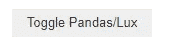
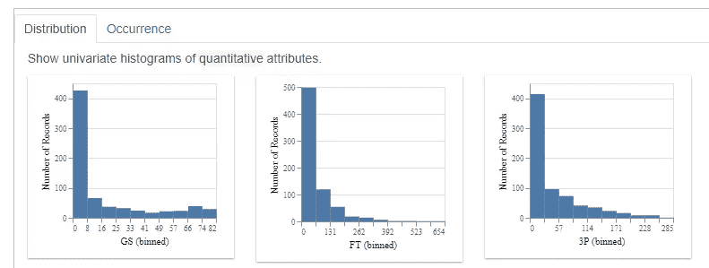
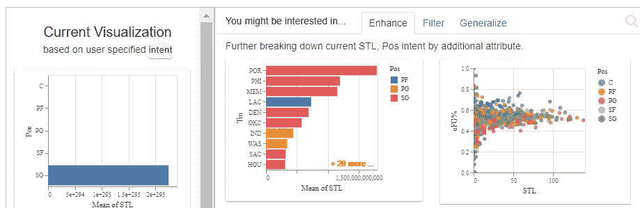
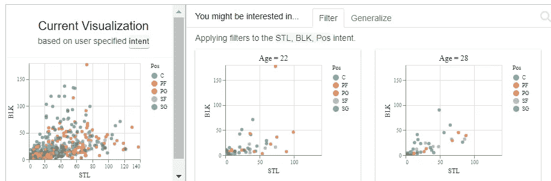
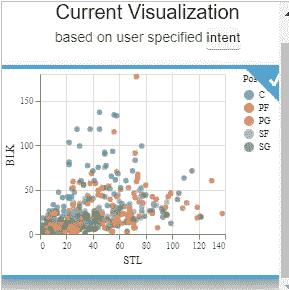
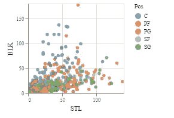

# 使用 Lux 简化 Python 中的数据可视化

> 原文：<https://medium.com/mlearning-ai/make-data-visualization-easier-in-python-with-lux-44df5f0388e5?source=collection_archive---------3----------------------->


任何数据科学/分析项目都需要探索性数据分析(EDA)。这项任务需要创建数据可视化来帮助我们理解数据的特征。在 Python 中，确实有很棒的包可以做到这一点，比如 Matplotlib 和 Seaborn。然而，如果不一次绘制一个可视化图形，或者花更多的时间来思考如何讲述这个故事，这不是很好吗？Lux 帮助我们简化了这一过程。在本文中，我们将讨论 Lux 封装并进行演示。要完成这个例子，请使用下面的 GitLab 或 GitHub 库:

GitLab:[https://gitlab.com/rshowrav/Introduction-to-lux](https://gitlab.com/rshowrav/Introduction-to-lux)

GitHub:【https://github.com/rshowrav/Introduction-to-lux 

## Lux 包装

关于如何使用 Lux 软件包的文档可在以下存储库中找到:

[](https://github.com/lux-org/lux) [## GitHub - lux-org/lux:通过一次打印自动可视化您的熊猫数据框架！📊 💡

### Lux 是一个 Python 库，它通过自动化可视化和数据管理来方便快捷地进行数据探索。

github.com](https://github.com/lux-org/lux) 

Lux 软件包的创建是为了实现项目 EDA 可视化过程的自动化。这有助于节省时间，而不必修改代码来获得这样一个单一的可视化。

## 如何设置 Lux

推荐使用 Lux 的工具是 Jupyter 笔记本。安装的第一步是安装软件包，注意安装 pandas(如果你还没有)也是明智的，因为 Lux 主要处理数据帧。在笔记本中的安装可以使用下面的代码来完成:

```
!pip install pandas
!pip install lux-api
```

接下来，您必须在 Jupyter 笔记本中设置 Lux 的分机。下面的代码将有助于实现这一点。

```
!jupyter nbextension install --py luxwidget
!jupyter nbextension enable --py luxwidget
```

请注意，这仅在首次安装时需要，但是，一旦完成上述步骤，重新启动笔记本电脑，以便能够开始使用 Lux。

## 如何在 Python 中使用 Lux 并举例说明

首先，像 Python 中的任何包一样，我们需要导入包。使用下面的代码这样做，注意熊猫也是需要的。

```
import pandas as pd
import lux
```

接下来，需要一些数据来可视化。在这个例子中，2021-2022 年球员的篮球统计数据将从下面的链接中使用:

[](https://www.basketball-reference.com/leagues/NBA_2022_totals.html) [## 2021-22 赛季 NBA 球员统计:总数| Basketball-Reference.com

### 查看 2021-22 NBA 赛季的球员统计数据和 Basketball-Reference.com 的更多信息

www.basketball-reference.com](https://www.basketball-reference.com/leagues/NBA_2022_totals.html) 

我们将使用 pandas 导出表格，并使用以下代码创建数据框:

```
url='[https://www.basketball-reference.com/leagues/NBA_2022_totals.html'](https://www.basketball-reference.com/leagues/NBA_2022_totals.html')list = pd.read_html(url)
df = pd.DataFrame(list[0])
```

作为任何查看数据的人，在我们开始 EDA 之前，总会有清理工作。幸运的是，这个数据集不需要太多的清理工作。所需的两个清理步骤是删除重复标题的列和从团队列中删除总计行。使用下面的代码可以很容易地做到这一点:

```
df = df[(df['Rk']!='Rk')&(df['Tm']!='TOT')]
df
```

请注意，当运行上述代码时，会出现一个有趣的按钮(见下文)。



继续点击它，你应该看到一些惊人的可视化开始，你可以滚动。



在我们开始这个初始 EDA 过程时，需要注意的一点是，所有数据都被视为分类数据。我们返回到数据清理步骤，在这个例子中，我们感兴趣的两个数值变量是 Steal 和 Blocks。使用下面的代码可以很容易地做到这一点:

```
df['STL'].astype(int)
df['BLK'].astype(int)
```

假设我们最初想从我们的数据集中收集一些偷窃的可视化数据。我们运行以下代码:

```
df.intent = ['STL']
df
```

我们得到了 Lux 的以下视觉建议。


不像我们希望的那样有趣。让我们添加一个分类变量，比如位置。使用下面的代码获得可视化建议。

```
df.intent = ['STL', 'Pos']
df
```



好了，现在开始看到一些有趣的图像。然而，让我们更进一步，向这个可视化添加块。您可以使用下面的代码做到这一点。

```
df.intent = ['STL', 'BLK', 'Pos']
df
```

下面惊人的可视化开始显示。



到目前为止，我们看到 Lux 显示了大量很酷的可视化效果，然而，在一个项目中，我们不想显示所有这些。Lux 提供了选择一个或多个推荐可视化的选项。如果从上面我们选择了第一个视觉化图像，我们应该会看到类似下面的东西:



要导出此可视化效果，我们可以单击右上方的以下按钮:


一旦导出看到您的视觉选择使用以下代码:

```
vis = df.exported[0]
vis
```

这将为我们返回被选中的下图。



请注意，如果我们选择了许多视觉效果，那么请注意，在 vis = df.exported[0]中，我们可以用一系列视觉效果中的其他视觉效果替换 0。

## 结论

Lux 是 Python 中一个很棒的包，可以缩短 EDA 所需的数据可视化。我希望你能在自己的项目中找到一个很好的用例。

请注意，我仍然是一个新的媒体作者。我感谢你能提供的任何建议和支持。反馈越多，我就越能改进要讨论的主题和各种方法，以确保我的文章真正提供有意义的见解。

[](/mlearning-ai/mlearning-ai-submission-suggestions-b51e2b130bfb) [## Mlearning.ai 提交建议

### 如何成为 Mlearning.ai 上的作家

medium.com](/mlearning-ai/mlearning-ai-submission-suggestions-b51e2b130bfb)