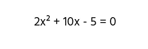
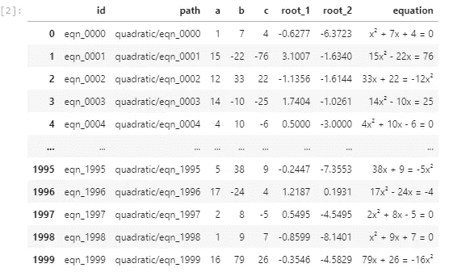
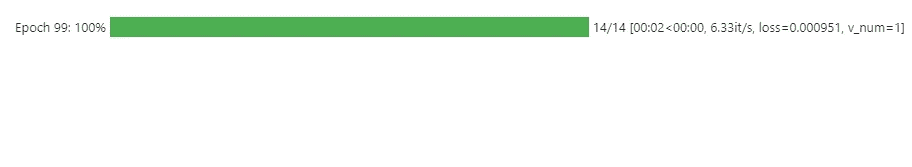
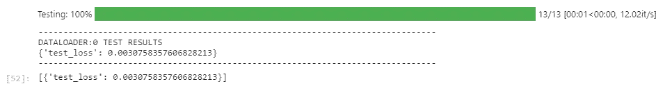
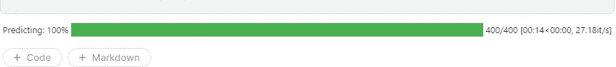

# 使用 Pytorch Lightning 快速制作强大的深度学习模型

> 原文：<https://medium.com/mlearning-ai/make-powerful-deep-learning-models-quickly-using-pytorch-lightning-29f040158ef3?source=collection_archive---------0----------------------->


Photo by [Antoine Dautry](https://unsplash.com/@antoine1003?utm_source=medium&utm_medium=referral) on [Unsplash](https://unsplash.com?utm_source=medium&utm_medium=referral)

Pytorch 深度学习模型很难调试，代码行太多，降低了笔记本的可读性。Pytorch Lightning 通过减少您必须编写的代码行来解决这些问题，增加了有用的功能，使其更容易调试并与其他模型进行比较。

# 数据

我将为这个笔记本使用二次图像数据集。该数据集可以在 Archanghosh 提供的 [Kaggle](https://www.kaggle.com/archanghosh/images-of-randomly-generated-quadratic-equations) 上找到。数据集由两个 CSV 文件和一个图像文件夹组成。CSV 文件包含有关图像的信息，如 id、每个系数的值和方程的根。系数以随机顺序排列。



An example of the image for quadratic equations

# 工作

我们的任务是找出每个方程的系数。为了加快训练时间，我们将使用预训练的神经网络 Resnet-50。由于这是一个回归问题，我将改变模型，以更好地适应我们的数据。

# 安装 Pytorch 闪电

在您的环境中安装 Pytorch-Lightning。如果您已经安装了 PyTorch，那么您应该已经安装了大部分模块

```
pip install pytorch-lightning
```

# 笔记本

这款笔记本使用 GPU 在 Kaggle 上运行。你可以在 [Kaggle](https://www.kaggle.com/aristotle609/random-quadratic-equations-coefficent) 、 [collab](https://colab.research.google.com/drive/17oszrotnPpsD3-sqyu3ZNqEsaeesxMMn?usp=sharing) 或者 [Github](https://github.com/Aristotle609/Quadratic_Equations) 上查看完整的笔记本。

## 属国

运行下面的单元格，以确保您的环境中安装了所有必需的软件包。如果您没有安装所有的软件包，它将抛出一个错误。

```
import pandas as pd
import numpy as np
from torch.utils.data import DataLoader,Dataset
from torchvision import transforms
from torch import nn
import cv2
import pytorch_lightning as pl
import torch
from sklearn.model_selection import train_test_split
import torchvision
from pytorch_lightning.callbacks import ModelCheckpoint
from pytorch_lightning import Trainer
```

## 数据预处理

```
input_df = "../input/images-of-randomly-generated-quadratic-equations/Quadratic Equation Full Details.csv"
df = pd.read_csv(input_df)
display(df)def normalize(df_values,min_,max_):
    df_list = df_values
    return [(x-min_)/(max_ - min_) for x in df_values]def denormalize(df_values,min_,max_):
    df_list = df_values
    return [(x*(max_ - min_) + min_) for x in df_values]df['a_'] = normalize(df["a"].values , 1 , 20)
df['b_'] = normalize(df["b"].values,-48,96)
df['c_'] = normalize(df["c"].values,-792,600)train_df , test_df = train_test_split(df,test_size = 0.2 , random_state= 42)
train_df , val_df = train_test_split(test_df,test_size = 0.33 , random_state= 42) 
```



## Pytorch 数据集

接下来，我将构建一个标准 PyTorch 数据集

```
class Quadratic_Dataset(Dataset):
    def __init__(self,path,targets = None):
        self.path =  path
        self.targets = targets
        self.dir_path = "../input/images-of-randomly-generated-quadratic-equations/Images of Equations/"

    def __len__(self):
        return len(self.path)

    def __getitem__(self, index):
        image_path = self.dir_path + self.path[index] + ".png"
        image = cv2.imread(image_path)
        image = cv2.resize(image,(100,100))
        if self.targets is None:
            return 1.0 - torch.tensor(image).float().reshape(3,100,100)/256
        else:
            return 1.0 - torch.tensor(image).float().reshape(3,100,100)/256 , torch.tensor(self.targets[index]).float().reshape(3)
```

## 闪电数据模块

Lightning 允许用户在他们的代码中使用数据模块进行重用，您可以选择用于训练、测试和验证集的数据。确保使用我使用过的准确的函数名，Lightning 知道为训练测试、验证和预测数据寻找这些特定的函数。

```
class Quadratic_Module(pl.LightningDataModule):
    def __init__(self):
        super().__init__()
        self.train_dataset = Quadratic_Dataset(path = train_df["id"].values , targets = train_df[["a_","b_", "c_"]].values)
        self.test_dataset = Quadratic_Dataset(path = test_df["id"].values , targets = test_df[["a_","b_" , "c_"]].values)
        self.val_dataset = Quadratic_Dataset(path = val_df["id"].values , targets = val_df[["a_","b_" , "c_"]].values)
        self.predictions = Quadratic_Dataset(path = test_df["id"].values , targets = None)def prepare_data(self) :
        pass

    def train_dataloader(self):
        return DataLoader(self.train_dataset , batch_size = 32  , shuffle = True)def test_dataloader(self):
        return DataLoader(self.test_dataset , batch_size = 32  , shuffle = False)def val_dataloader(self):
        return DataLoader(self.val_dataset , batch_size = 32  , shuffle = False)

    def predict_dataloader(self):
        return DataLoader(self.predictions , batch_size = 1 , shuffle  = False)
```

## 模型

正如我所说，我们将使用 torchvision 提供的名为 resnet-50 的预训练模型，并改变最终输出，以便我们可以使用回归技术。

```
neural_network = torchvision.models.resnet50(pretrained = True)
neural_network.fc = nn.Sequential(
    nn.Linear(2048,1024),
    nn.LeakyReLU(0.2),
    nn.Linear(1024,512),
    nn.LeakyReLU(0.2),
    nn.Linear(512,256),
    nn.LeakyReLU(0.2),
    nn.Linear(256,100),
    nn.LeakyReLU(0.2),
    nn.Linear(100,10),
    nn.Linear(10,3),
)
```

## 闪电模块

Lightning 的 LightningModule 类与 PyTorch 的模块几乎相同。您可以在 configure _ optimizers 函数通知监视器中声明优化器和学习率调度程序设置为“train_loss”。如果训练损失在十个小批中没有改善，它将降低学习率。没有必要进行循环来训练数据。一旦您将批处理传递给模型并返回确定的损失，它将被传递给 training_step 函数。如果您想监控损失，您可以选择记录损失。

```
class Quadratic_Model(pl.LightningModule):
    def __init__(self):
        super().__init__()
        self.loss_func = nn.MSELoss()
        self.net = neural_network

    def forward(self,x):
        out = self.net(x)
        return out

    def configure_optimizers(self):
        optimizer = torch.optim.Adam(self.parameters(), lr = 1e-3)
        sch = torch.optim.lr_scheduler.StepLR(
        optimizer, step_size  = 10 , gamma = 0.5)
 #learning rate scheduler
        return {
            "optimizer":optimizer,
            "lr_scheduler" : {
                "scheduler" : sch,
                "monitor" : "train_loss",

            }
        } def training_step(self,batch,batch_idx):
        x , y_true = batch
        y_pred = self(x)
        loss = self.loss_func(y_true, y_pred)
        self.log("train_loss" , loss)
        return loss

    def test_step(self,batch,batch_idx):
        x , y_true = batch
        y_pred = self(x)
        loss = self.loss_func(y_true, y_pred)
        self.log("test_loss" , loss)
        return loss

    def validation_step(self,batch,batch_idx):
        x , y_true = batch
        y_pred = self(x)
        loss = self.loss_func(y_true, y_pred)
        self.log("val_loss" , loss)
        return loss
```

## 培养

Lightning 具有可用于模型的内置回调。下面我们使用了 ModelCheckpoint 一个回调函数来监控“val_loss”并返回具有最低“val_loss”的模型。Lightning 的最佳功能之一是 GPU 跟踪功能，您只需输入您想要使用的 GPU 数量，Lightning 就会处理其余部分，或者，如果您不想使用 GPU，可以忽略这一点。max_epochs 确定您希望模型运行的时期数。“训练者适应”功能接受您想要训练的模型和您之前制作的数据模块。

```
checkpoint = ModelCheckpoint(monitor= "val_loss" ,mode = "min")model = Quadratic_Model()
module = Quadratic_Module()
trainer = Trainer(max_epochs = 100,callbacks=[checkpoint] , gpus= 1)
trainer.fit(model,module)
```



## 测试和预测

我们将在数据模块中声明的测试集上进行测试和预测。为了找到“test_loss ”,我们只需调用训练器的测试函数。它返回所有批次的平均损失。

```
trainer.test()
```



predict 函数返回我们在测试集中声明的测试集的预测。

```
trainer.predict()
```



## 保存模型

通常可以使用 torch.save()保存模型权重

```
torch.save(model.state_dict(),"./save.pth")
```

# 尾注

访问官方 [Pytorch Lightning](https://pytorch-lightning.readthedocs.io/en/latest/) 查看完整文档。为了尝试改进模型，你可以尝试添加渐变剪辑和权重衰减。你也可以尝试使用 tensorboard。到目前为止，它还不具备在 jupyter 笔记本上显示的功能。