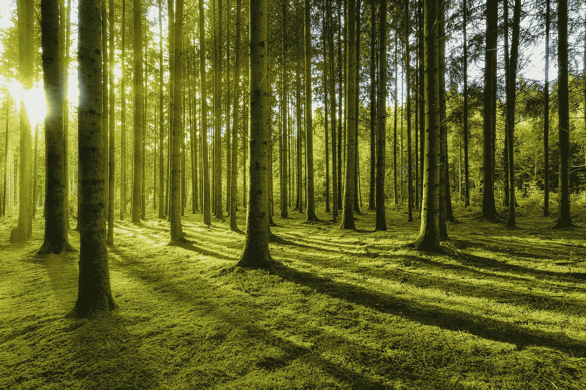
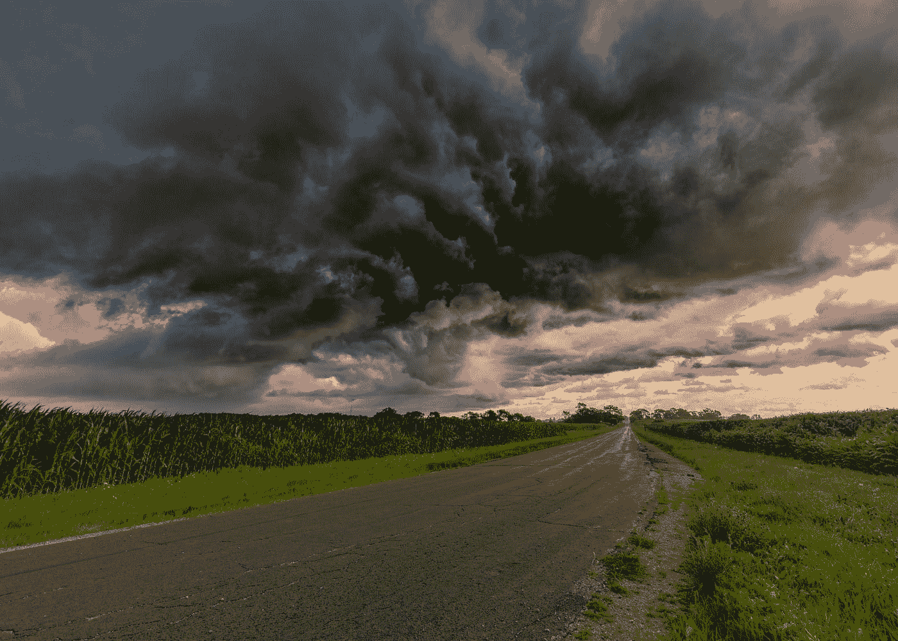
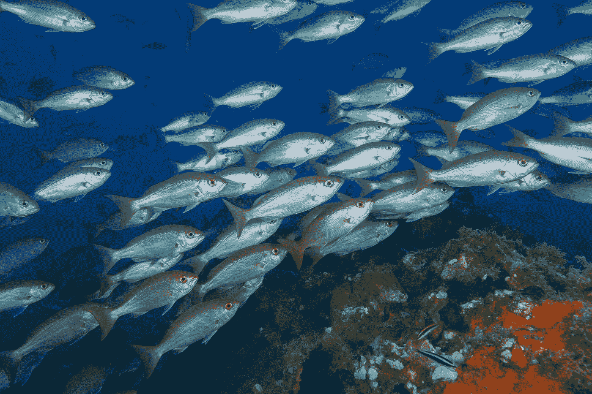
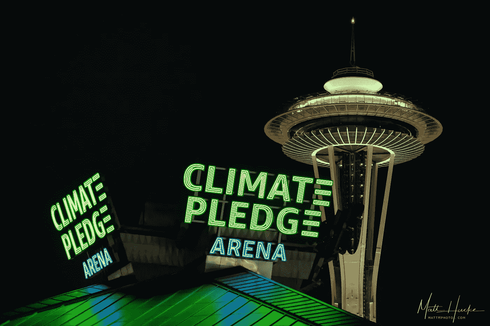

# 在 re:Invent 2021 上用机器学习让地球变得更美好

> 原文：<https://medium.com/mlearning-ai/make-the-earth-a-better-place-with-machine-learning-at-re-invent-2021-7d85fb1015f4?source=collection_archive---------2----------------------->

## 在最大的技术会议之一学习如何用机器学习技能对抗气候变化

Photo by [Johannes Plenio](https://unsplash.com/@jplenio?utm_source=medium&utm_medium=referral) on [Unsplash](https://unsplash.com?utm_source=medium&utm_medium=referral)

时不时地，我会想，做一份我真正喜欢的工作是多么幸运。我想大多数机器学习从业者都同意我的观点:我们热爱我们的工作，因为它有趣、有挑战性，并且不断变化。尽管如此，有时我会停下来思考:除了智力上的满足，我还能为我在道德意义上所做的事情感到骄傲吗？我的工作让世界变得更美好了吗？

毫无疑问，我们和下一代面临的最大问题之一是气候变化。我们在公共厕所写告示说，“请保持这个地方至少和你发现时一样整洁！”但是我们无法跟上这个关于我们星球的简单信息。那么，如果你能利用你的机器学习技能让地球变得更美好，会怎么样呢？好消息是，如果你想了解如何做到这一点，你应该收听 AWS re:Invent 上的以下课程。

顺便问一下，AWS re:Invent 是什么？这是云领域最具影响力的年度学习会议之一。由亚马逊网络服务于 2021 年组织的这场活动将于 11 月 29 日至 12 月 3 日在拉斯维加斯举行。如果不能亲自参加，大部分学习资料会在网上免费提供。我将提供每个会话的标识符，以便您可以在会话目录中轻松搜索它们。

## 获取数据并开始预测气候变化

所有数据科学家都知道，任何机器学习项目最难的部分是获得高质量的数据。如果你想开始分析气候和天气相关的数据，你很幸运:你可以在他们的[开放数据注册中心](https://registry.opendata.aws/)找到 50 多个已经收集、组织和发布的数据集，任何人都可以免费访问。

Photo by [Dave Hoefler](https://unsplash.com/@davehoefler?utm_source=medium&utm_medium=referral) on [Unsplash](https://unsplash.com?utm_source=medium&utm_medium=referral)

但是怎么入门呢？在题为“分析气候和天气数据的方法”的粉笔演讲中，向地球科学家[扎克·弗拉米尼](https://www.linkedin.com/in/zflamig/)学习。他向你承诺解决实际问题，比如明天会有多热，你的建筑在未来 100 年里会不会更频繁地被洪水淹没，或者在接下来的一个小时里你会产生多少太阳能。

## 再见，谢谢你的鱼

下一次当你吃你的金枪鱼寿司或扑克碗时，想想那些勇敢的家伙们，他们奉献出他们的载体让你吃鱼，即使是明天和后天。事实上，大规模渔业严重威胁着金枪鱼物种的灭绝。

Photo by [NOAA](https://unsplash.com/@noaa?utm_source=medium&utm_medium=referral) on [Unsplash](https://unsplash.com?utm_source=medium&utm_medium=referral)

为了应对这个问题，像自然保护协会这样的非营利组织创造了一个可持续的金枪鱼供应链模式。你猜怎么着，他们也用机器学习来做这件事。在由 AWS 全球影响计算负责人 [Nelson Gonzalez](https://www.linkedin.com/in/nelsonricardogonzalez/) 和大自然保护协会大规模渔业项目主任 [Mark Zimring](https://www.linkedin.com/in/mark-zimring-6892b911/) 举办的“AI/ML 促进可持续创新:洞察在边缘”分组会议(AIM207)上找出答案。

## 小屋或你的舞台，建造它的零碳排放

在美国，住房排放了三分之一的二氧化碳，所以建造可持续建筑可以带来很大的不同。亚马逊想告诉你他们是怎么做的。像往常一样，他们想得很大:他们刚刚完成了西雅图气候承诺竞技场的重建工作，将它变成了世界上第一个零碳竞技场。

Photo by [Matt Hucke](https://www.flickr.com/photos/matthucke/) on [Flickr](https://www.flickr.com/)

机器学习在这一领域也有重要作用:准确分析能源、水和空气质量数据并建立预测模型可以帮助优化这些资源的分配。查看他们的分组会议“在亚马逊和气候承诺竞技场推动可持续运营”(amz 202)；也许你可以得到一些如何以更环保的方式建造小屋的提示。

## 了解全局

我们的星球在不断变化。我们每秒钟有数千颗卫星监控它，每天产生数百万亿字节的数据。如何处理这些数据？以及如何以最快的速度注意到一个相对较小的变化，例如，一场森林火灾，或者一条输油管道泄漏？

Photo by [NASA](https://unsplash.com/@nasa?utm_source=medium&utm_medium=referral) on [Unsplash](https://unsplash.com?utm_source=medium&utm_medium=referral)

你猜对了:利用机器学习。[大熊太空系统](https://ursaspace.com)正是这样做的，他们将在粉笔对话“用太空洞察力描绘地球的变化”(WPS209)中告诉你他们是如何做到的。如果你想了解全局，这个会议是为你准备的。

## 奖金轨道

所以，你今天也拯救了地球。你应该放松一下:让我们来一杯新鲜的手拉啤酒。你今天想尝试一些新的东西，但是去哪里找呢？

Photo by [Patrick Fore](https://unsplash.com/@patrickian4?utm_source=medium&utm_medium=referral) on [Unsplash](https://unsplash.com?utm_source=medium&utm_medium=referral)

不要惊慌，re:Invent 对这个问题也有回应:用精酿啤酒手机应用程序找到你的新甜菜。机器学习模型生成的个性化推荐！考虑实时反馈以改进未来的建议！你还能希望什么？参加分组讨论“开发一个应用程序，找到你下一个最喜欢的啤酒”(BOA302)，至少获得一些啤酒建议。

我是 Janos Tolgyesi，机器学习解决方案架构师，也是 [Neosperience](https://www.neosperience.com/) 的 ML 团队负责人。我在 ML technologies 工作了五年，在 AWS 基础设施工作了八年。我喜欢构建东西，让它成为边缘的[视频分析应用](https://www.neosperience.com/solutions/people-analytics/)或基于点击流事件的[用户剖析器](https://www.neosperience.com/solutions/user-insight/)。有任何问题，你可以在 [Medium](/@janos.tolgyesi) 或 Twitter 上找到我，我的名字是 [@jtolgyesi](https://twitter.com/jtolgyesi)