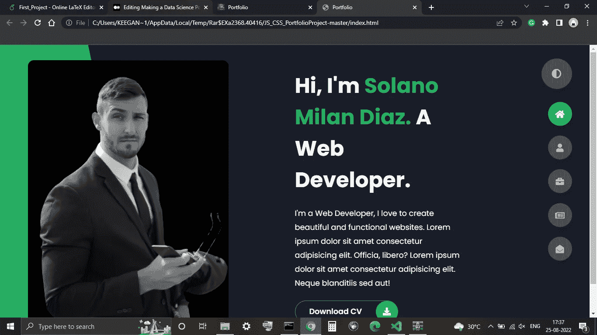
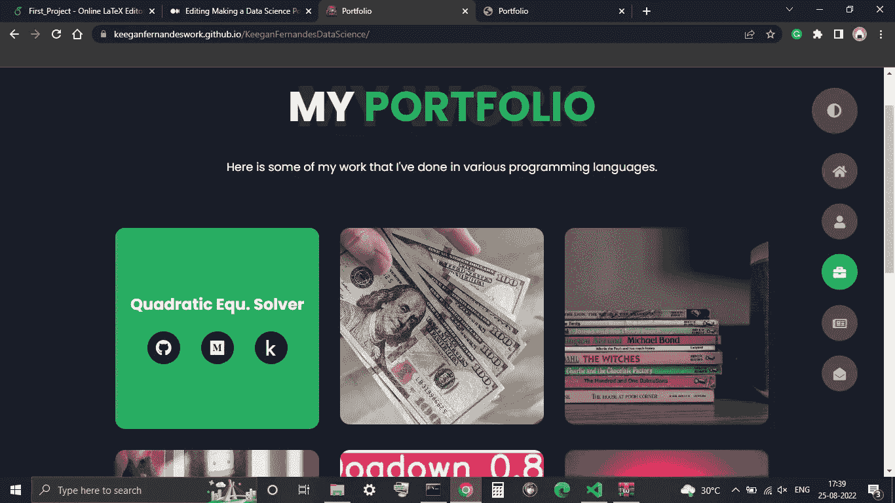

# 免费使用 Github 页面制作数据科学作品集

> 原文：<https://medium.com/mlearning-ai/making-a-data-science-portfolio-using-github-pages-for-free-ee831d4dec68?source=collection_archive---------0----------------------->

在本文中，我将免费向您展示如何使用 GitHub 页面构建数据科学投资组合。要完成这个项目，你需要对 git 和 HTML 有一个基本的了解。你可以通过下面的链接找到我的作品集。

 [## 投资组合

### 创新和科学严谨的研究生追求硕士。以团队为导向的态度和有竞争力的编码…

keeganfernandeswork.github.io](https://keeganfernandeswork.github.io/KeeganFernandesDataScience/) 

首先，您需要在 [Github](https://github.com/) 上创建一个存储库。将这个库命名为 *<你的用户名> .github.io，*，然后将这个库克隆到你的本地文件夹中。克隆到本地文件夹后，搜索使用 HTML 和 CSS 制作的文件夹项目并复制它们。网上有很多这样的项目。避免使用使用 Vue、React 等框架的项目。因为这会使您的项目过于复杂。我在我的项目中使用了这个由 [Maclinz](https://github.com/Maclinz) 制作的[库](https://github.com/Maclinz/JS_CSS_PortfolioProject)。它还附带了一个 [youtube 视频](https://www.youtube.com/watch?v=xV7S8BhIeBo)，如果你有什么不明白的地方，可以参考一下。将文件克隆到本地 git 文件夹，添加、提交并推送到您的远程存储库。然后转到你的存储库设置，打开 GitHub 页面，按照他们的指示操作。

一旦你有了最初的投资组合，你可以编辑这些部分并添加你的信息。例如，添加你是关于我的部分，你的博客，以前的经历和你做过的项目。确保你的选择突出了你的优势，并表明这些项目与你潜在的雇主在同一领域。例如，如果你正在计划一份业务分析师的工作，确保你的首要任务在同一个领域。你已经完成了，你的项目应该是这样的。

不要指望你的投资组合马上变得好看。一个月来，我每天花几分钟做这个项目，但对结果仍然不满意。你也可以添加图标和个人项目来建立个人品牌。提交也会提高你的 GitHub 出勤率，你的网站会随着你积累更多的经验而改变。

 [## Mlearning.ai 提交建议

### 如何成为 Mlearning.ai 上的作家

medium.com](/mlearning-ai/mlearning-ai-submission-suggestions-b51e2b130bfb)