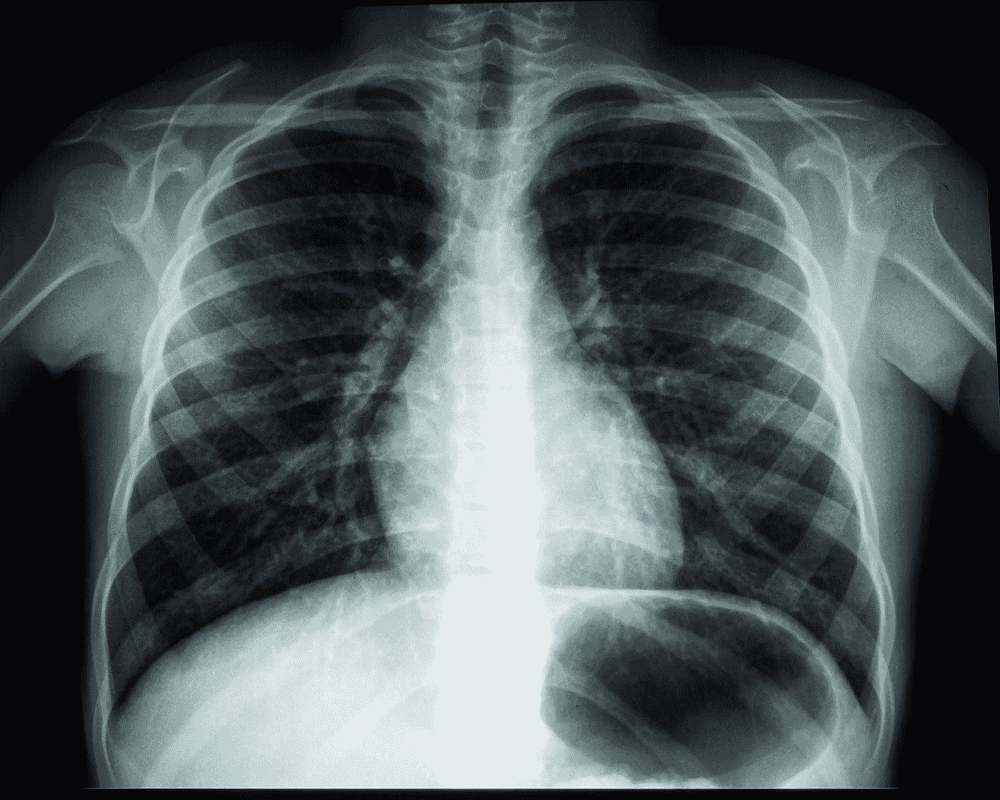
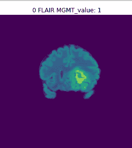

# 在医学图像上制作 EDA

> 原文：<https://medium.com/mlearning-ai/making-an-eda-on-medical-images-b823693a517a?source=collection_archive---------3----------------------->



Photo by [Umanoide](https://unsplash.com/@umanoide?utm_source=medium&utm_medium=referral) on [Unsplash](https://unsplash.com?utm_source=medium&utm_medium=referral)

## 介绍

使用医学图像会带来许多挑战。阅读、理解和使用医学数据制作模型是相当具有挑战性的。在本文中，我将尝试为第一次处理医疗数据的人制作一个初学者友好的 EDA。

我们将处理[RSNA-密歇根脑瘤放射基因组分类](https://www.kaggle.com/c/rsna-miccai-brain-tumor-radiogenomic-classification)数据。该数据包含一个 train.csv 文件以及一个 train 文件夹和 test 文件夹，其中包含每个患者大脑的磁共振成像。这是我从一个 Kaggle 比赛中得到的。比赛的目标是预测哪些病人有 MGMT 启动子甲基化的基因序列，这是一种致癌基因。在这里阅读我的官方 Kaggle 笔记本。

[](https://www.kaggle.com/aristotle609/basic-eda-rsna) [## 基本 EDA RSNA

### 使用 Kaggle 笔记本探索和运行机器学习代码|使用来自 RSNA-密歇根大学脑肿瘤放射基因组学的数据…

www.kaggle.com](https://www.kaggle.com/aristotle609/basic-eda-rsna) 

## 启动笔记本

让我们从导入我们将使用的所有依赖项开始。如果您继续操作，但无法运行下面的单元，这意味着您的环境缺少一个或多个模块。

```
import seaborn as sns
import pandas as pd
import matplotlib.pyplot as plt
import pydicom *# A library that loads dicom(dcm) files*
import numpy as np
import os
import glob
from IPython.display import Markdown *# we will require this to print Markdown in the console*
input_df = "../input/rsna-miccai-brain-tumor-radiogenomic-classification/train_labels.csv"
sample = "../input/rsna-miccai-brain-tumor-radiogenomic-classification/sample_submission.csv"
```

接下来，我们将在笔记本中安装赛璐珞(如果您希望每次在您的环境而不是笔记本上安装 pip 时运行相同的代码而不安装赛璐珞)

```
!pip install celluloid
```

现在我们来看看 CSV 文件。

```
train_df = pd.read_csv(input_df)
train_dfsample_df = pd.read_csv(sample)
sample_df
```

## 可视化数据

我们将使用 pydicom 库来读取 *dcm* 数据

```
def load_dicom(path):
    dicom = pydicom.read_file(path) *# pydicom is a library made to process dicom files*
    data = dicom.pixel_array *# pixel_array shows the value of each pixel in the array*
    data = data - np.min(data) *#helps in normalizing the image (not really required in this case)*
    if np.max(data) != 0:
        data = data/np.max(data)
    data = (data*255).astype(np.uint8)
    return data
```

我们将使用 matplotlib 来绘制图像

```
def visualize_sample(ID,path,type_ = "flair"):
    plt.figure(figsize = (16,5))
    data = load_dicom(path)
    plt.imshow(data)*#*
    label = train_df[train_df['BraTS21ID'] == ID]["MGMT_value"].item()*#this will assign the MGMT_value of the Patient to label*
    plt.title(str(ID)+" " + type_ + " MGMT_value: " +str(label))
    plt.axis("off"
```

让我们来看看剧情

```
visualize_sample(0 , "../input/rsna-miccai-brain-tumor-radiogenomic-classification/train/00000/FLAIR/Image-250.dcm", "FLAIR")
```



这很好，但是，他们通常需要核磁共振成像来绘制身体的三维模型。在下一节中，我们将为 dicom 文件制作动画，以便更好地理解。我们将使用赛璐珞库来制作数据动画。dicom_animation 函数将发送一个要制作动画的图像列表。

```
from celluloid import Camera

def create_animation(ims):
    fig = plt.figure(figsize=(16, 5))
    plt.axis('off')
    im = plt.imshow(ims[0])
    camera = Camera(fig)

    for i **in** range(len(ims)):
        plt.imshow(ims[i])
        camera.snap() *#Each instance of the plot is saved*

    animation = camera.animate() *# And is then animated*
    display(animation)def dicom_animation(path):
    t_path = sorted(
                    glob.glob(os.path.join(path,'*'))
    )
    images = []
    for name **in** t_path:
        data = load_dicom(name)
        images.append(data)
    return create_animation(images)
```

下一个函数将以更好的形式显示数据，您可以随意忽略它

```
types = ["FLAIR", "T1w" , "T1wCE" , "T2w"]def show_anim(Id):
    display(Markdown("<div align = 'center'  style = 'color : lightblue'>"+"ID : "+Id+"</div>"))
    display(Markdown("<div align = 'center'  style = 'color :lightblue'>"+"MGMT methylation promoter : "+str(train_df[train_df['BraTS21ID'] == int(Id)]["MGMT_value"].item())+"</div>"))
    *#print("\tMGMT methylation promoter : " ,train_df[train_df['BraTS21ID'] == int(Id)]["MGMT_value"].item())*
    path = os.path.join("../input/rsna-miccai-brain-tumor-radiogenomic-classification/train",Id)
    for x **in** types:
        display(Markdown("<div align = 'center' style = 'color : violet'>"+"Type of MRI : "+x+"</div>"))
        dicom_animation(os.path.join(path,x))show_anim("00000")
```


我的 EDA 到此结束。