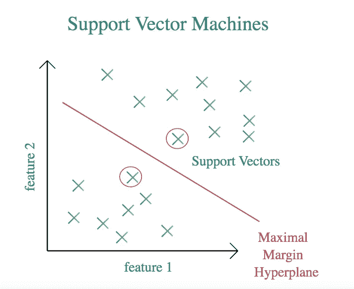

# 理解支持向量机(SVM):数学解释

> 原文：<https://medium.com/mlearning-ai/making-sense-of-support-vector-machines-svm-mathematical-explanation-560eb87a7b8?source=collection_archive---------1----------------------->

## 这是 SVM 背后的数学原理，尽可能简单

当我第一次试图理解 SVM 背后的数学时，我经历了一段非常艰难的时间。找到简单而完整的信息并不容易，同时对我来说也是有意义的。仅仅经过了差不多一个月的研究和学习(可能我不是一个很聪明的…