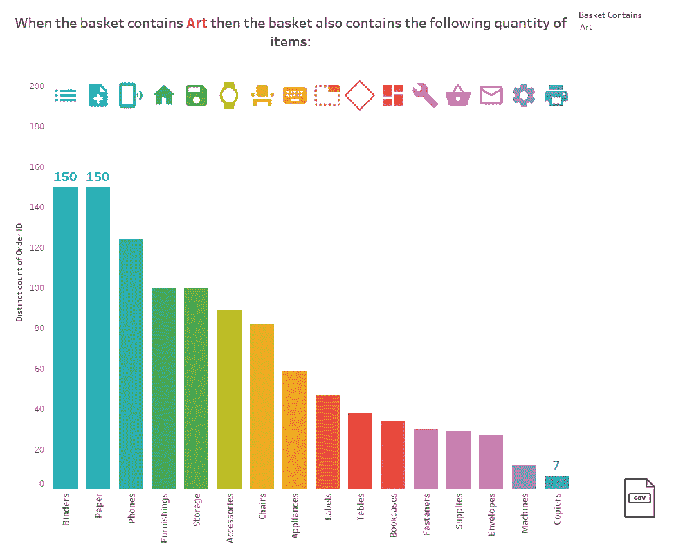

# 市场篮子分析

> 原文：<https://medium.com/mlearning-ai/market-basket-analysis-36d502374b94?source=collection_archive---------0----------------------->

了解顾客购买行为

[Source by Author](https://public.tableau.com/views/MarketBasketAnalysis_16141574759070/Dashboard1?:language=en&:display_count=y&publish=yes&:origin=viz_share_link)

回答消费者的问题会让你比竞争对手更接近准确地提供他们的需求并填补需求缺口。但是，从哪里开始解读人们会买什么呢？你从分析购买习惯开始，寻找各种商品之间的相互关系。这有助于微调您的营销策略，并做出更好的…