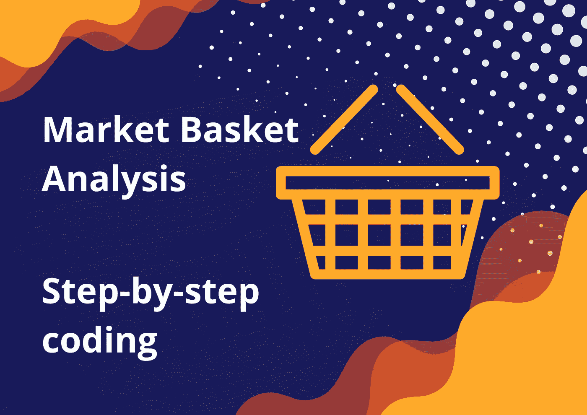
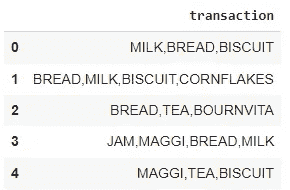
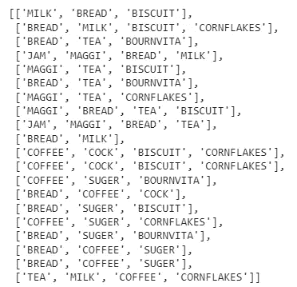
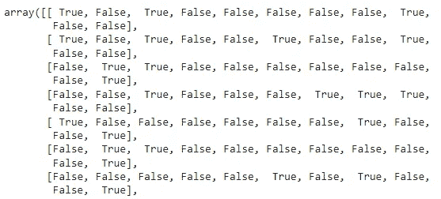
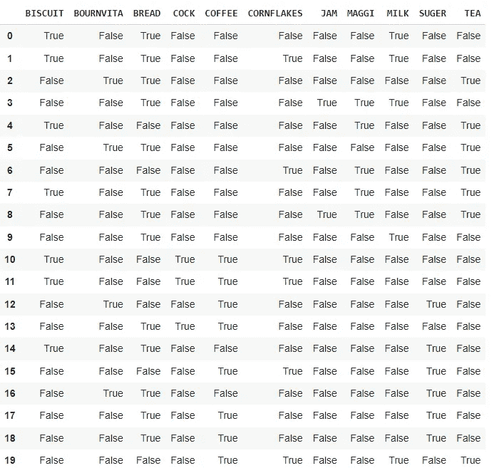
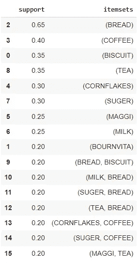
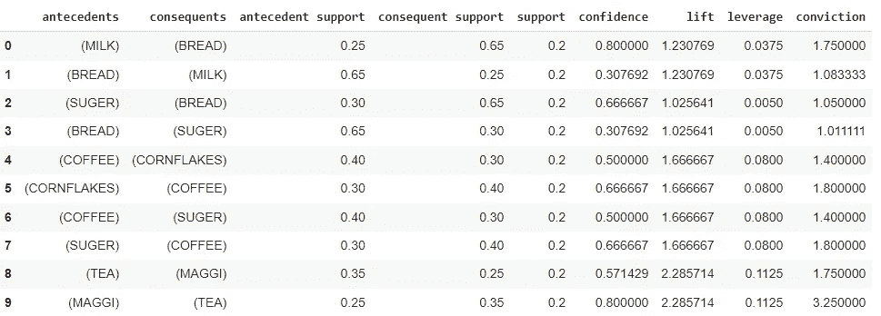

# 购物篮分析:逐步编码

> 原文：<https://medium.com/mlearning-ai/market-basket-analysis-step-by-step-coding-cd13ce1f8de9?source=collection_archive---------0----------------------->



在上一篇文章中，我写了购物篮分析和 apriori 算法，但没有编写代码。

[https://medium . com/mlearning-ai/what-is-market-basket-analysis-and-the-apriori-algorithm-Fe 0 e 8 e 6 e 34d](/mlearning-ai/what-are-market-basket-analysis-and-the-apriori-algorithm-fe0e8e6e34d)

在本文中，我将一步步向您展示如何使用 Python 实现购物篮分析。建议先了解理论再看这篇文章。

# 指标概述

*   **支持:**项目在所有交易中出现的概率
*   **置信度:**在给定某些项目的情况下，下列项目在同一交易中出现的概率
*   **Lift:** 给定 A 存在的 B 发生的概率与不知道 A 存在的 B 发生的概率之比。
*   **杠杆:**A 和 B 一起发生的概率与 A 和 B 各自独立的概率之差。
*   **确信:**如果规则碰巧在那里或者不在

> 开始编码吧！！

# 资料组

数据集可以从[https://www.kaggle.com/datasets/shazadudwadia/supermarket](https://www.kaggle.com/datasets/shazadudwadia/supermarket)下载

该数据集包含 11 个项目:果酱、MAGGI、糖、咖啡、奶酪、茶、BOURNVITA、玉米片、面包、饼干和牛奶。

有 19 个事务，1 行代表 1 个事务。


Dataset sample

# 步骤摘要

1.  导入库并加载数据
2.  一键编码
3.  利用 Apriori 寻找频繁项集
4.  关联规则

## 1.导入库

```
import pandas as pd
from mlxtend.preprocessing import TransactionEncoder
from mlxtend.frequent_patterns import apriori, association_rulesdf = pd.read_csv("GroceryStoreDataSet.csv", names = ['transaction'], sep = ',')
```

*   用于数据帧管理的熊猫
*   [mlxtend](http://rasbt.github.io/mlxtend/) (机器学习扩展)是一个 Python 库，提供了用于日常数据科学任务的有用工具。
*   mlxtend.preprocessing 用于执行任务前的数据预处理。
*   关联规则任务的 mlxtend.frequent _ patterns。
*   将数据作为变量 df 加载



dataframe sample

## 2.一键编码

在将数据输入 Apriori 算法之前，我们必须将数据转换为适当的格式。目标是一个**独热数据帧**。

*   将数据框架更改为列表列表。

```
df = list(df["transaction"].apply(lambda x:x.split(",")))
```



list of list

*   使用 mlxtend 库中的 TransactionEncoder 将事务列表更改为独热数组。

```
one_hot_transformer = TransactionEncoder()df_transform = one_hot_transformer.fit_transform(df)
```



one-hot array

它仍然很难阅读，所以我们将把它改为带有列名的 dataframe。

*   将独热阵列更改为数据帧。

```
df = pd.DataFrame(df_transform,columns=one_hot_transformer.columns_)
```



one-hot dataframe

这是我们想要的格式，一热。列是商店中的商品，每行代表一笔交易。如果值为 True，则该商品在该交易中售出。现在，数据已经准备好输入算法。

## 3.利用 Apriori 寻找频繁项集

我们将使用 Apriori 从一次性事务数据帧中找出频繁项集。这一步的目的是减少关联规则的计算量。

频繁项集的支持度高于最小支持度。您可以调整 min_support 以适应您的数据集。

```
df = apriori(df, min_support = 0.2, use_colnames = True)
df.sort_values(['support'],ascending=False, inplace = True)
```



The itemsets whose support is higher than 0.2

在本例中，我将最小支持度设置为 0.2，因此它将只过滤一组支持度大于 0.2(或大于 19 个事务的 20%)的项目。

只有这些被认为重要的项目集才会进入关联规则。

## 4.关联规则

是时候迈出主要的一步了！！

association_rules 函数将自动计算我们交易数据的关键指标，包括支持、信心、提升、杠杆和信念。

```
df_ar = association_rules(df, metric="lift", min_threshold=1)
```

结果如下所示。



其结果需要进一步的业务操作解释。

**解读示例**

*   从指数 0 的最高置信度开始，置信度为 0.8。意思是买牛奶的顾客八成会买面包。然而，你必须记住，自信不是一切。这一行的高信心是由于面包的高支持(后果支持 0.65)，这意味着面包在许多交易中发生，所以如果我们试图出售带牛奶的面包，它不会产生商业影响。
*   更好的衡量标准是提升或杠杆。指数 8 的升力和杠杆最高，分别为 2.28 和 0.1125。这意味着购买茶叶的顾客很可能也会购买 Maggi。

**知道这些后我们能做什么？**

1.  改变货架布局，销售靠近茶叶的 Maggi。
2.  把玛吉和茶一起推广。

# 结论

在本文中，您将学习如何使用 Python 中的 mlxtend 库执行购物篮分析。在做出业务决策之前，您必须从关键指标(如置信度和 lift)中解释关联规则的结果。

[](/mlearning-ai/mlearning-ai-submission-suggestions-b51e2b130bfb) [## Mlearning.ai 提交建议

### 如何成为 Mlearning.ai 上的作家

medium.com](/mlearning-ai/mlearning-ai-submission-suggestions-b51e2b130bfb)