# 使用检测器 2 进行掩模检测

> 原文：<https://medium.com/mlearning-ai/mask-detection-using-detectron2-225383c7d069?source=collection_archive---------6----------------------->

使用检测器 2 进行掩模检测。这篇文章是上一篇文章的继续——OpenCV-dlib 的[面具叠加](/@xictus77/facial-mask-overlay-with-opencv-dlib-4d948964cc4d)和 Keras 的[使用 VGGFace2 的叠加面具的人脸识别](/mlearning-ai/face-recognition-for-superimposed-facemasks-using-vggface2-in-keras-c13e610acd56)

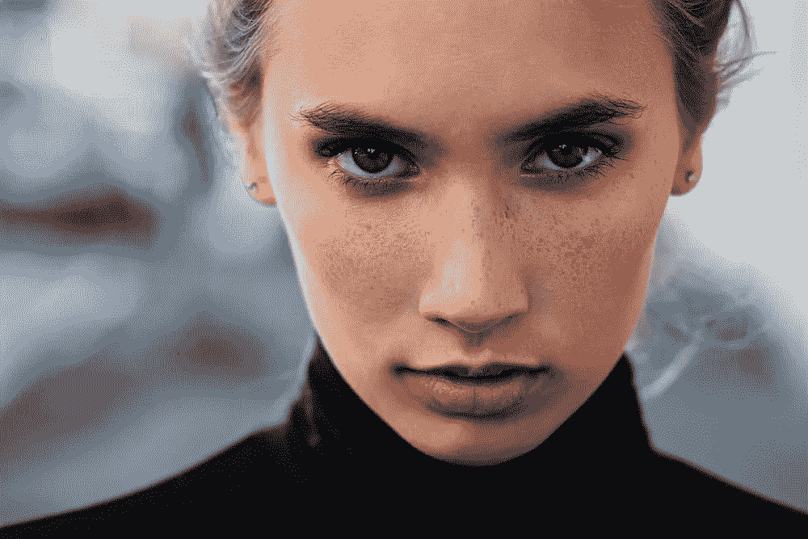

Photo by [Andrey Zvyagintsev](https://unsplash.com/@zvandrei?utm_source=unsplash&utm_medium=referral&utm_content=creditCopyText) on [Unsplash](https://unsplash.com/s/photos/masked-face?utm_source=unsplash&utm_medium=referral&utm_content=creditCopyText) (Original image (left)) and edited image (right) using [face mask overlay](/mlearning-ai/facial-mask-overlay-with-opencv-dlib-4d948964cc4d) and author)

我们将通过 facebook 实现新的 [Detectron2 库](https://ai.facebook.com/blog/-detectron2-a-pytorch-based-modular-object-detection-library-/)，在我们的“蒙面人脸”数据集上进行对象检测训练。此后，我们将在我们的测试图像上运行我们的 Detectron2 推理，其中使用 openCV 和 dlib 库合成叠加了人脸遮罩。

我们将在 *Google Colab* 上运行，因为我们将利用它的免费 GPU 资源来训练我们的对象检测器。我们正在使用的数据集可以从 [Kaggle](https://www.kaggle.com/andrewmvd/face-mask-detection/notebooks) 下载。我们选择该数据集，因为在该数据集中有 3 个类别，即戴口罩、口罩佩戴不当、未戴口罩。你可以在这篇文章的末尾找到 *colab 笔记本*。

# 检测器 2 概述

D[*etectron 2*](https://github.com/facebookresearch/detectron2)是一个高级模型动物园，提供最先进的检测和分割算法。由脸书人工智能研究(FAIR)集团于 2020 年 2 月首次发布，是 [Detectron](https://github.com/facebookresearch/Detectron/) 和 [maskrcnn-benchmark](https://github.com/facebookresearch/maskrcnn-benchmark/) 的继任者。它包括:

*   对象检测、实例分割、全景分割、语义分割和关键点检测的训练配方。
*   80 多个预训练模型用于微调(或重新训练)。
*   数据集支持流行的视觉数据集，如 COCO、Cityscapes、LVIS、PASCAL VOC、ADE20k。

Detectron2 以 COCO JSON 格式注册数据集。

# 我们的数据集概述

我们将在 Kaggle 的面罩数据集上训练我们的 custom Detectron2 探测器。该数据集由 853 幅图像组成，分为 3 类——戴面具的人、面具佩戴不当的人、未戴面具的人。

由于 Detectron2 没有接受过检测面罩的训练，我们需要训练底层网络来适应我们的定制任务。在此之前，让我们对数据集执行探索性数据分析。[ [源代码](https://github.com/xictus77/Facial-mask-overlay-with-OpenCV-Dlib/blob/master/EDAwithxml_mask_detection_dataset.ipynb)

数据的分布可以在图 1 中显示，其中明显存在跨 3 个类的类类型的不平衡。这个比例是 80%戴口罩的人，17%不戴口罩的人和 3%戴口罩的人。我们深入检查图像中边界框的分布。图 2 使用直方图描述了分布，很明显，大约 70%(接近 600 个图像)的图像具有少于 5 个边界框。

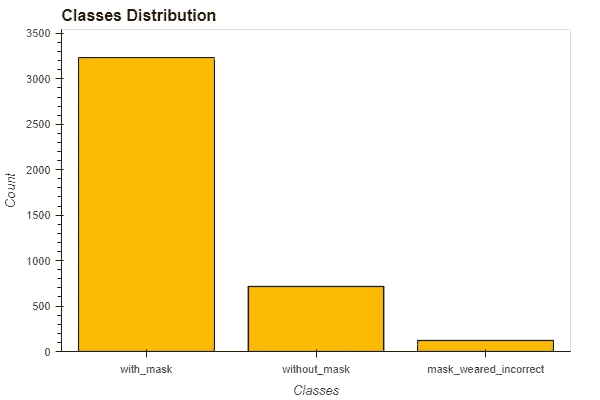

Figure 1 — Imbalance distribution across 3 classes

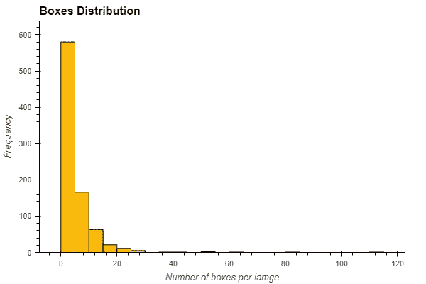

Figure 2— Most images have less than 5 bounding boxes per image

有几种方法可以处理这种类型的不平衡数据集—合成少数过采样技术(SMOTE)、过采样少数类、欠采样多数类等。然而，出于本文的目的，我们将继续用我们的数据集训练我们的对象检测器，并记住我们的数据集是有偏差的。

# 入门指南

当我们使用 Google Colab 时，安装 Detectron2 会相对简单。它可以用以下几行安装:

此时，我们需要重启笔记本运行时来继续。

接下来我们将继续导入必要的**检测器 2** 依赖项。

# 注册数据集

要使用带有 Detectron2 的数据集，我们需要注册它，以便我们可以使用预定义的数据加载器。由于我们的数据集不是 COCO 格式，我们将需要编写一个函数，以列表的形式返回所有需要的数据信息，并将结果传递给 DatasetCatalog.register。

Reformat detectron2_dataset from xml2coco json format

Detectron2 在一个`registry`中跟踪可用数据集的列表，因此我们必须向 Detectron2 注册我们的自定义数据，以便可以调用它进行训练。我们注册我们的元数据，它告诉 Detectron2 哪个类 id 对应于哪个类，这有助于以后的可视化。

# 可视化探测器 2 训练数据

这一步是可选的，因为我们已经在探索性数据分析阶段查看了我们的训练数据集。但是，我们可以利用 Detectron2 中的 visualizer 库轻松查看我们的训练数据，以确保数据已正确导入。

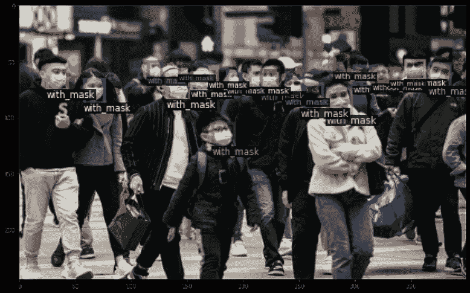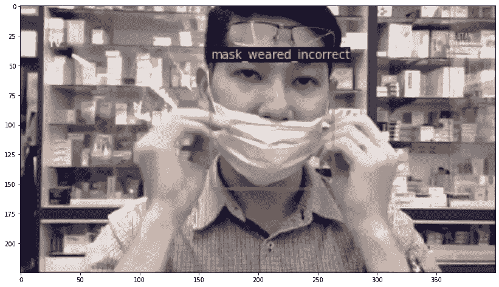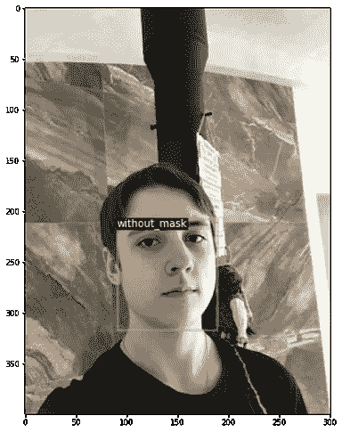

Visualization on training dataset

# 使用迁移学习微调预训练模型

注册数据集后，我们可以使用 [DefaultTrainer 类](https://github.com/facebookresearch/detectron2/blob/master/detectron2/engine/defaults.py#L181)在预训练模型上简单地执行迁移学习。Detectron2 允许你在确定你的模型架构时有很多选择，你可以参考使用 [Detectron2 模型动物园](https://github.com/facebookresearch/detectron2/blob/master/MODEL_ZOO.md)。

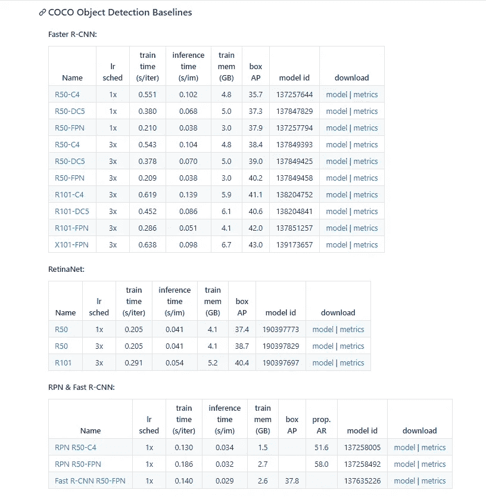

Object detection models available in the [Detectron2 model zoo](https://github.com/facebookresearch/detectron2/blob/master/MODEL_ZOO.md).

在我们的例子中，我们使用下面的脚本来微调我们选择的预训练模型。这可能不是理想的配置，我们可以修改某些参数，如学习速率、最大迭代次数、批量大小，以获得更好的结果。然而，对于这篇文章，我们将使用这些值作为默认值，因为测试结果将显示训练模型的良好性能。

现在我们可以开始训练我们的模型了。训练过程将持续近一个小时，我们可以使用 tensorboard 可视化训练和损失图。

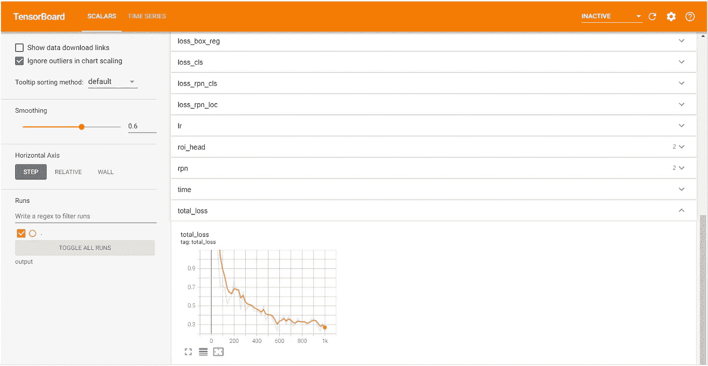

这里有许多感兴趣的指标——最值得注意的是`total_loss`我们可以看到，总损耗在 999 次迭代后收敛到一个合理的低值。我们当然可以通过将最大迭代次数增加到 1500 次或更多来提高模型性能和微调模型。

# 对测试图像运行 Detectron2 推理

随着模型被训练，我们可以使用我们的自定义检测器 2 对测试集进行推断，这些测试集是我们使用 [mask-overlay-opencv-Dlib](/mlearning-ai/facial-mask-overlay-with-opencv-dlib-4d948964cc4d) 创建的图像。

现在，我们可以通过创建一个预测器对象来对我们的测试集进行推断。

测试图像的结果如下图 1 和图 2 所示。我们可以观察到，定制训练的检测器 2 在检测是否佩戴了所绘制的面罩方面表现良好。它不能正确地检测和分类不正确地佩戴绘制的面罩的人。主要原因是由于训练数据集具有非常少量的带有不正确佩戴面具的人的图像。

我们还可以考虑使用`SCORE_THRESH_TEST`来改变模型进行预测所需的置信度阈值。

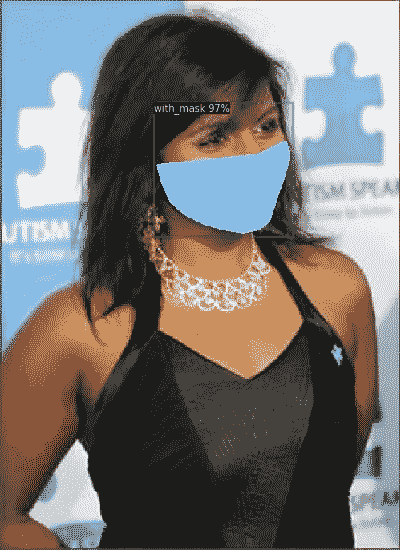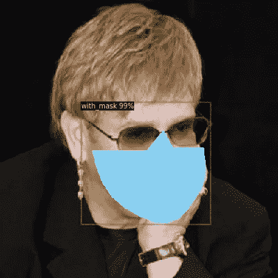

Figure 1 —Face mask drawn on the image on the right cannot be detected

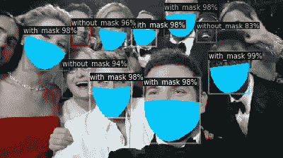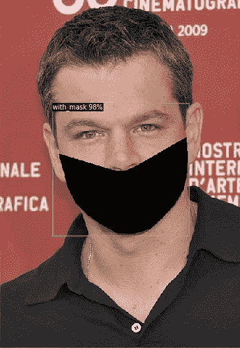

Figure 2— Face mask drawn on the image on the right incorrectly labelled

# 保存您的模型和配置

我们现在可以将权重保存在`os.path.join(cfg.OUTPUT_DIR, "model_final.pth")`中，以便将来通过导出到 Google Drive 进行推断。

要使用模型进行推理，您需要模型权重和配置。要保存配置，请使用:

# 结论

在这篇文章中，我们已经成功地使用一个自定义的人脸遮罩数据集训练了一个 Detectron2 对象检测模型，并使用它在我们使用 OpenCV 和 dlib 库生成的“遮罩”人脸上进行测试。结果表明，预先训练的模型能很好地检测出被戴上的面具，但不能检测出面具是否被正确戴上。如果我们能够用具有更平衡的类的数据集进行训练，结果应该会改善，特别是在类上——面具佩戴不正确。

结果还表明，我的文章中的脚本— [使用 OpenCV-dlib](/@xictus77/facial-mask-overlay-with-opencv-dlib-4d948964cc4d) 的面部面具覆盖可以提供另一种替代解决方案来创建具有面部面具的人的图像数据集，这些图像数据集可以用于 ***训练*** 和 ***评估*** 面部识别系统。

参考

 [## 检测器 2 训练实例分割模型

### 在本文中，您将学习如何创建自己的实例分割数据集，以及如何训练 Detectron2 模型…

gilberttanner.com](https://gilberttanner.com/blog/detectron2-train-a-instance-segmentation-model)  [## 探测器 2 -使用 PyTorch 进行物体探测

### 2020 年 2 月更新:脸书研究所发布了预建的 Detectron2 版本，这使得本地安装变得更加容易…

gilberttanner.com](https://gilberttanner.com/blog/detectron-2-object-detection-with-pytorch)  [## 掩码检测——从 XML 数据集开始

### 使用 Kaggle 笔记本探索和运行机器学习代码|使用来自面罩检测的数据

www.kaggle.com](https://www.kaggle.com/gozyssj4/mask-detection-starting-with-the-xml-dataset) 

图像来源

 [## 面罩检测

### 属于 3 类的 853 个图像。

www.kaggle.com](https://www.kaggle.com/andrewmvd/face-mask-detection) 

你可以在这里下载我的完整代码

[https://github . com/xictus 77/face-mask-overlay-with-OpenCV-dlib . git](https://github.com/xictus77/Facial-mask-overlay-with-OpenCV-Dlib.git)