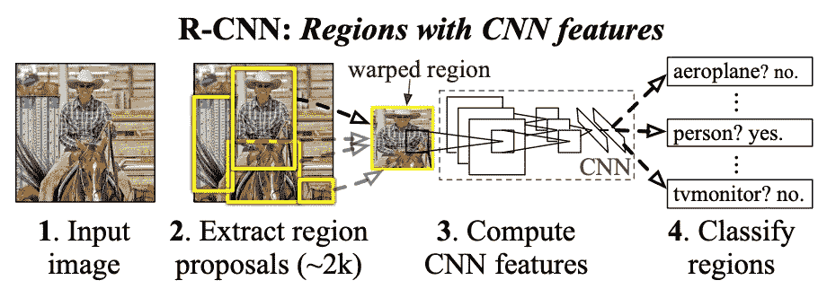
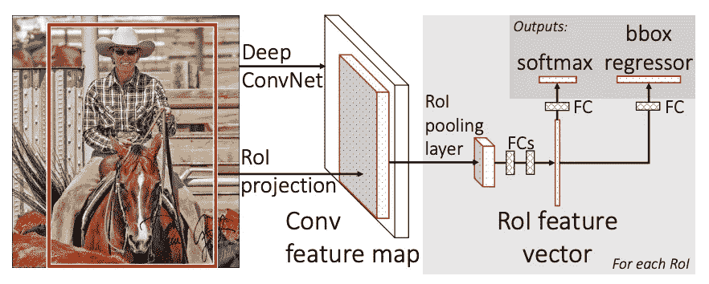
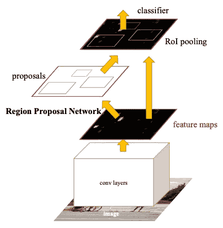
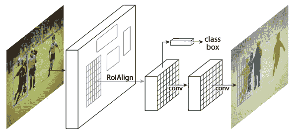
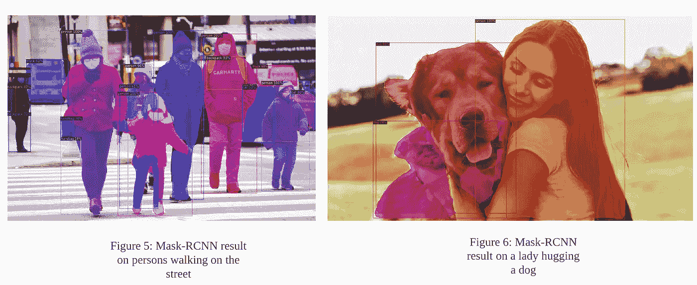
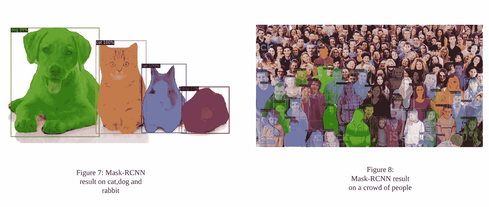

# 用探测器 2 进行目标探测的掩模-RCNN

> 原文：<https://medium.com/mlearning-ai/mask-rcnn-for-object-detection-with-dectectron2-46f62f6b7826?source=collection_archive---------3----------------------->

在我们之前的文章中，我们给出了物体检测背后的直觉。可以在这里 阅读 [**进行刷新。**](/@pmegne/introduction-to-object-detection-8be574b82d5c)

当考虑图像中具有多于一个对象的情况时，当前的最新模型已经被证明在识别和定位图像中的多个对象方面非常强大和有力。其中有 R-CNN，快速 R-CNN，更快 R-CNN，屏蔽 R-CNN。在这篇文章中，我们将提供一个简单的理解**屏蔽 R-CNN** 以及如何使用 PyTorch 中的 Detectron2 框架来检测对象。

为了理解 Mask R-CNN，我们将首先回顾 R-CNN 的变体，从 R-CNN 架构开始。

## **1。R-CNN**

R-CNN 代表基于区域的卷积神经网络，由 *Ross Girshick 等人*【1】开发。它使用选择性搜索[2]从一幅图像中提出一堆盒子(~ 2k)；这些方框被称为区域提案。R-CNN 架构由三个主要模块组成(图 1)。第一个生成区域建议，第二个使用大 CNN 从每个候选区域(感兴趣区域/ ROI)中提取固定长度的特征。第三个模块是分类器(线性 SVM)，用于将对象分类到建议的类别中。

Figure1: [R-CNN architecture](https://arxiv.org/pdf/1311.2524.pdf)

然而，在特征提取步骤期间，CNN 将独立地通过每个 ROI，使得算法非常慢。

## **2。快速 R-CNN**

快速 R-CNN 通过一次提取特征来修复 R-CNN 的缺点，而不是对每个图像运行 CNN 2k 次。在快速 R-CNN 架构中，CNN 处理整个输入图像并生成特征图。此后，应用感兴趣区域池层从特征图中为每个对象提议提取一个小的固定长度特征向量。最后，每个特征向量被输入到一系列完全连接的层中，这些层将输出类别标签和边界框(图 2)。回想一下，这里的提议是使用启发式选择性搜索算法完成的。

Figure2: [Fast R-CNN architecture](https://arxiv.org/pdf/1504.08083.pdf)

## **3。更快的 R-CNN**

该架构由两个阶段组成:

*   **区域提议网络** (RPN):在像以前一样在 CNN 中传递输入图像之后，RPN 是用于生成区域提议的深度网络；
*   **快速 R-CNN 检测器**:使用建议区域，输出包围盒和类别标签。

Figure3: [Faster R-CNN architecture](https://arxiv.org/pdf/1506.01497.pdf)

与更快的 R-CNN 架构相比，快速 R-CNN 忽略了花费在区域提议上的时间，因此称为更快 R-CNN。

注意，边界框没有给出关于属于对象前景/背景的像素的信息。为了正确地分割对象，可以生成掩模。

## **4。屏蔽 R-CNN**

由何等人【3】创建的 Mask R-CNN 是更快的 R-CNN 的扩展。它采用相同的两阶段过程，但是在第二阶段，除了输出类别标签和边界框之外，它还输出对象遮罩。这种额外掩模输出需要提取对象的更精细的空间布局。

此外，作者认识到，尽管 RoI 池中的量化不影响标签分类，但它在提取的特征和 RoI 之间引入了不对准。为了避免这种情况，他们通过使用 **RoI 对齐**层(图 4)来将提取的特征与输入正确对齐，从而实现了像素到像素的对齐。

Figure4: [Mask R-CNN architecture](https://arxiv.org/pdf/1703.06870.pdf)

## **5。使用 detector 2**实现屏蔽 R-CNN

Detectron2 是由脸书人工智能研究所构建的框架，并在 Pytroch 中实现。它包括实现一些目标检测模型，即快速 R-CNN，快速 R-CNN，掩模 R-CNN 等。

这里我们使用 [**Mask R-CNN (R-101)**](https://github.com/facebookresearch/detectron2/blob/main/MODEL_ZOO.md) 以 ResNet 为骨干架构。这个主干架构在 [**COCO 数据集**](https://arxiv.org/abs/1405.0312) 上进行了预训练。

## **6。结果**

我们在此提出一些我们在各种图像(人、动物)上测试的实验结果和评论。

以下是获得的一些观察结果:

*   在图 5 中，该模型能够检测图像中的人以及周围的物体。同样，在图 6 中，它检测到图像中的人和狗。
*   另一方面，在图 7 中，图像中有一只狗、一只猫和两只兔子，但是模型检测到所有的对象都是猫或狗。这可能是由于兔子与猫和狗有相似的形态，所以在预测兔子时似乎很混乱。
*   在图 8 中，有一群人，模型只成功检测到其中的一些人。原因可能是人群中更远的个体看起来模糊不清，因此模型不能清楚地识别他们。另一方面，在第一线的个体表现出明显的形态特征，因此容易识别。

在这里找到****代码关联的链接。****

# ****结论****

****在这篇文章的最后，我们使用了一个 R-CNN 遮罩，通过 Detectron2 框架来检测图像中的对象。该模型执行惊人的预测，但在某些情况下似乎是混乱的。****

****感谢你的时间，希望这篇文章是有帮助的。****

## ****参考****

****[1]: Girshick，r .，Donahue，j .，Darrell，t .和 Malik，j .，用于精确对象检测和语义分割的丰富特征层次。arXiv 2013。 *arXiv 预印本 arXiv:1311.2524* 。****

****[2]: Uijlings，J.R .，Van De Sande，K.E .，Gevers，t .和 Smeulders，A.W .，2013 年。物体识别的选择性搜索。*国际计算机视觉杂志*，*第 104 期* (2)，第 154–171 页。****

****[3]: He，k .，Gkioxari，g .，Dollár，p .和 Girshick，r .，2017 年。屏蔽 r-cnn。IEEE 计算机视觉国际会议记录(第 2961-2969 页)。****

**** [## Mlearning.ai 提交建议

### 如何成为 Mlearning.ai 上的作家

medium.com](/mlearning-ai/mlearning-ai-submission-suggestions-b51e2b130bfb)****