# 熟练操作正则表达式

> 原文：<https://medium.com/mlearning-ai/master-regex-hands-on-81a2ea964e80?source=collection_archive---------5----------------------->

最后，通过自己尝试来掌握这项技能

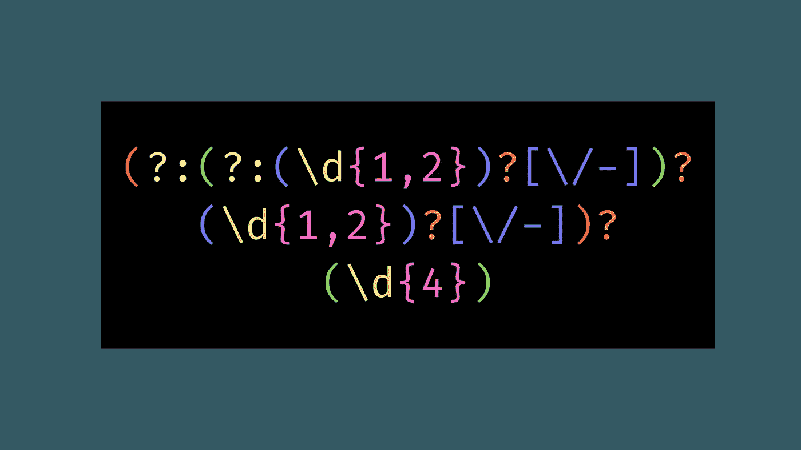

Image by author

免责声明:本教程是基于实验的，因此它不是很直接，所以你可以发现正则表达式如何反应。不要犹豫，在教程中修改一下表达

# 内容表

*   什么是正则表达式？
*   基础
*   范围
*   量词
*   选择组
*   课外活动

# 什么是正则表达式？

当你处理数据时，正则表达式是一个非常强大的工具。你需要过滤文本来验证网站上的邮件吗？使用 Regex。NLP 项目需要清理文本吗？Regex 是你的朋友！可能性是无限的。

但你很快就会明白，事情不会那么琐碎，因为这些成堆的怪异符号没有多大意义，这很正常。我们将通过实验一步一步地解开这个谜团。

为此，我们将使用 [Regex101](https://regex101.com/) 在沙盒中测试我们的正则表达式。

 [## regex101:构建、测试和调试 regex

### 正则表达式测试器，语法高亮，解释，PHP/PCRE，Python，GO，JavaScript 的备忘单…

regex101.com](https://regex101.com/) 

为了简单起见，regex 允许您过滤掉复杂的字符串模式，因此当您请求日期时，可以接受各种格式。它使得保存每个组(月组、日组、年组，但是我们将在后面讨论)来操作它变得很容易。

# 它是如何工作的？

## 基础

对于此零件，将以下文本粘贴到文本字符串框中:

> 很容易，我将学习正则表达式。

从基础开始，如果你放入任何字符串，如果它按照指定的顺序找到它们，它会过滤掉它们。例如，如果您在正则表达式框中添加 **ea** ，您会得到两个匹配项:

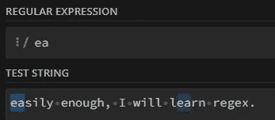

ea is both in easy and learn

注意这个表达可以在单词的中间

但是，如果您只想在字符串开始时选择 **ea** 呢？嗯， **^** 符号允许你只选择开头的内容。你只需要把它放在你想过滤的表达式的前面

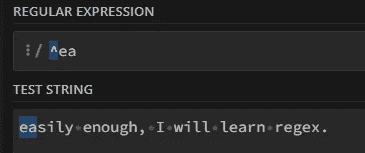

only the ea in easy was filtered, as it begins the string

如果您想过滤字符串末尾的内容，可以使用符号 **$** 做同样的事情。在这种情况下，如果我要过滤 **ex。我必须输入 **$ex。**。让我们试试这个:**

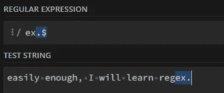

成功了！但不是因为你想的原因。作为证明，将测试字符串中的句点更改为您想要的任何值，无论如何它都会工作。

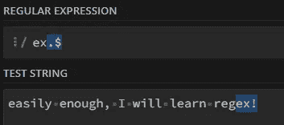

notice the . became a !

啊？？如果我们的测试字符串中没有句点，那会怎样呢？？这只是因为 regex 中的句点有它自己的含义:它是一个通配符。这意味着它可以匹配任何字符(除了换行符)。在这种情况下，我们的表达式不会过滤 **ex。**在一个字符串的末尾，而**ex+任何字符**在该字符串的末尾。如果您想搜索一个句点，只需在句点前添加一个转义字符(反斜杠 **\** )即可。

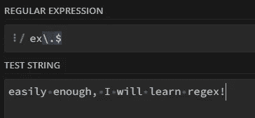

the ! is no longer filtered as we use \.

## 范围

对于这一部分，我们将使用的文本是

> 学习数据科学不需要一天的时间

好了，你学会了如何过滤一段简单的文本。但是如果我要求你显示每个不是数字的字符呢？

在正则表达式中，这其实很简单。方括号 **[]** 允许您过滤这些方括号之间的任何内容。只输入我们想过滤掉的字母有什么区别？嗯， **abc** 将过滤任何匹配 abc 的字符串，而**【ABC】**将匹配任何 a、b 或 c 字符。

回到我们的问题，如果我们想要过滤任何小写字母，我们必须键入**【abcdefghijklmnopqrstuvwxyz】**。幸运的是，有些捷径是存在的。对于小写字母，其**【a-z】**。让我们用我们的句子来试试这个:

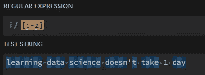

only spaces and the 1 are not selected

同样，还有其他捷径:

*   **【A-Z】**适用于所有瓶盖
*   **【a-q】**从 a 到 q 的所有字母
*   **【a-zA-Z0–9】**或 **\w** 用于每个字母数字字符
*   **【^a-z】**选择不是小写字母的所有内容(方括号内的 **^** 表示否定)
*   …您可以定制大量产品

## **量词**

对于这一部分，句子将是

> 在 2022 年，我想确定我的睡眠时间表

量词在这里基本上是帮助你过滤一个字符发生的具体时间，这取决于你的需要。它们都可以用在字符和范围之后。

*   ***** 允许您在 0 到无限次数之间选择一个字符

用 **s[le]*** ，我们表示我们至少想要一个 s，后面跟一个 *l* ，一个 *e，*或 *None* 一次或多次:sl，s，se，seel，seele，slee…..

*   **？**匹配前一个字符的 0 或 1 倍。当您试图过滤一些不必要的内容时，这很有用(例如日期中的某一天，您可以说 2022 年 1 月，但不指定日期)

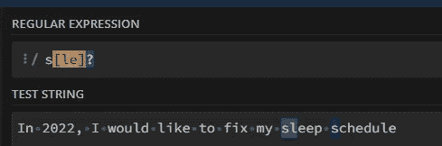

同**年代【乐】？**，我们表明我们想要的是 s，也许是括号中的一个字符(只有一个！).然后你可以有:s，see，或者 sl。

*   **+** 至少匹配一次前面的字符

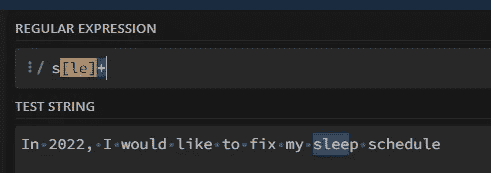

用**s[了]+** ，我们表示我们想要 s，以及至少一个 l 和一个 e，不管顺序如何。然后它可能是 sle，sel，seel，slee…

*   **{x}** 表示您希望一个字符重复 x 次，而 **{x，y}** 表示您希望它重复 x 到 y 次

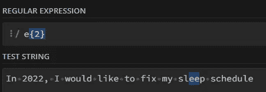

e{2}表示我们希望 e 出现两次(e e)。如果我们想出现 1 到 2 次，我们应该写 e{1，2}。你自己试试！

**注意:**使用带两个参数的花括号( **{x，y}** )时，需要记住两件事:

*   如果你没有指定 **x** ( **{，y}** )，这意味着你要寻找你的角色多达 **y** 次
*   如果你没有指定 **y** ( **{x，}** )，这意味着你至少要寻找你的角色 **x** 次

## 选择组

对于这一部分，我们将使用这个日期作为测试字符串:

> 27/01/2022

好了，我们学会了如何过滤我们想要的东西，但是我们如何分组检索呢？例如，如果我们处理日期，我们如何分离日、月和年？

在 Regex 中，我们捕获括号()之间的字符串。让我们键入以下正则表达式代码:

> **(\ d { 2 })\/(\ d { 2 })\/(\ d { 4 })**

但在我告诉你是什么之前，你自己试着分析一下(提示: **\d** 代表任意数字)。这可能看起来很可怕，但如果你分解它，它实际上很容易。

所以 **(\d{2})** 的意思是我们想要两位数，把他们放入一组。我们用斜杠/(前面的反斜杠只是为了转义它)来分隔它们，因为在正则表达式代码中不能只使用斜杠。这样做是告诉 regex“不要把下一个字符当作特殊字符来读”。)，它们必须是日和月。我们再次做最后一件事，但是用 4 代替 **(\d{4})** 。意思是我们取 4 位数，代表一年。

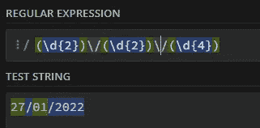

但是在你页面的右边，你可以看到比赛信息。正如我们所希望的，数字是分开的。

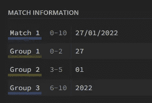

但是想象一下，我们想要添加一天作为日期的可选组成部分？做群的时候，如果放**？:**在你的括号开头像这样(？:…)，它会创建一个“非捕获组”(也就是说它不会出现在比赛信息选项卡中)。

为什么会有意思呢？因为你现在可以把量词放在这个组上，我们在这个场合一直在说哪一个？没错，审讯痕迹。

然后，这段代码允许您添加当天的条件:

> **(？:(\d{2})\/)？(\d{2})\/(\d{4})**

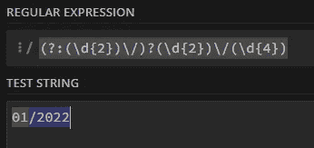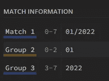

我们取消了这一天

它不再出现，没有崩溃！

# 课外活动

Why not try to apply all of this knowledge to a short project to test your skills? In [this article](/@brice.vergnou/test-your-regex-skills-c867dfd6538f), I give you one problem to solve with a detailed solution in case you get stuck. You should give it a try, it’s by practicing that we retain things ;)

 [## Are you proficient in Regex? If not, you may want to try this

### A good exercise to test your skills in regex, linked to a detailed lesson and an extra-curriculum to gain proficiency…

medium.com](/@brice.vergnou/test-your-regex-skills-c867dfd6538f) 

# Conclusion

And with this, you’ll make 90% of the work needed with regex. For more precise scenarios, Google and the sandbox we’ve been using are your friends.

If you don’t remember some syntax or want to find something more specific, have a look at this [cheat sheet](https://www.keycdn.com/support/regex-cheatsheet).

 [## Ultimate Regex Cheat Sheet - KeyCDN Support

### Regex, also commonly called regular expression, is a combination of characters that define a particular search pattern…

www.keycdn.com](https://www.keycdn.com/support/regex-cheatsheet) 

Thanks for reading this article, I hope you found the information you were looking for. I wish you good luck with your data science or programming journey ❤

 [## Mlearning.ai Submission Suggestions

### How to become a writer on Mlearning.ai

medium.com](/mlearning-ai/mlearning-ai-submission-suggestions-b51e2b130bfb)