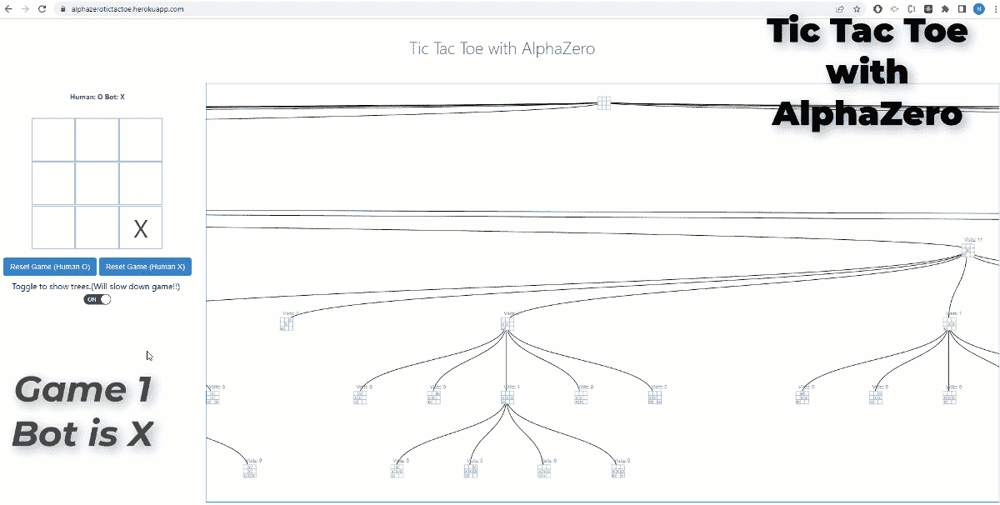
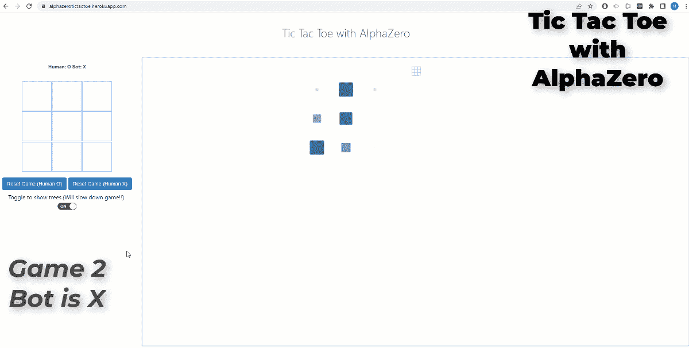
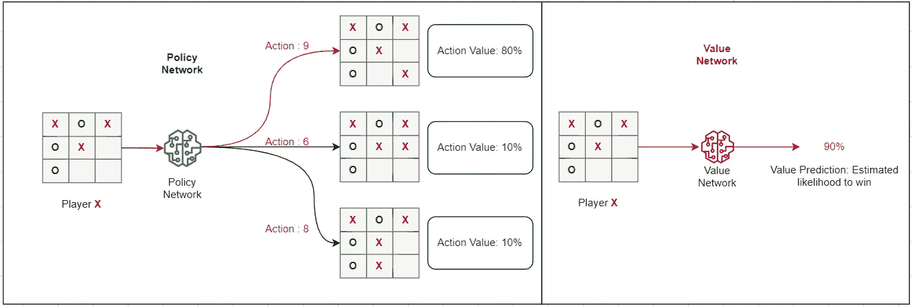
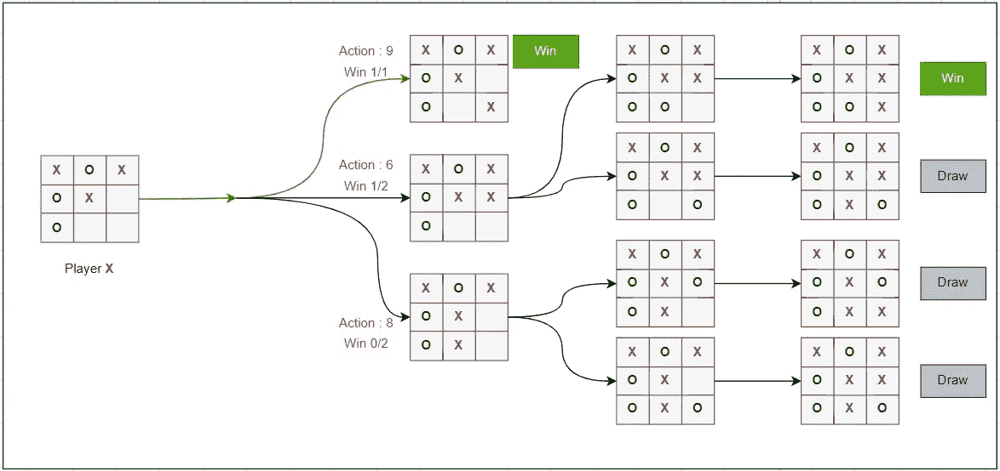
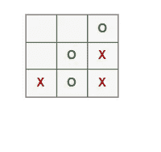
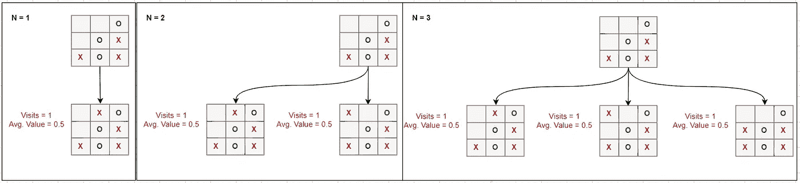
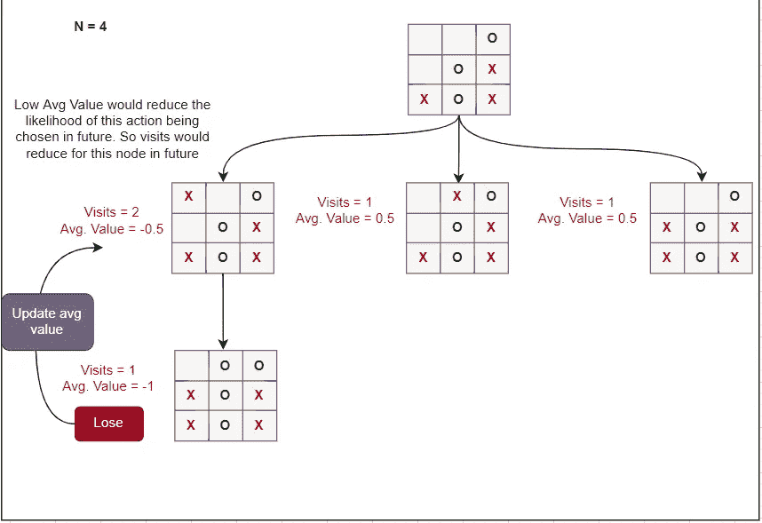
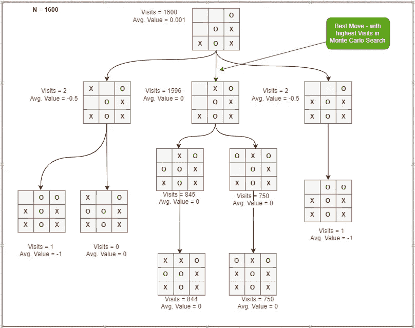

# 用 AlphaZero 掌握 TicTacToe

> 原文：<https://medium.com/mlearning-ai/mastering-tictactoe-with-alphazero-cc28998bf36c?source=collection_archive---------3----------------------->

从头开始编写 AlphaZero 算法来玩 TicTacToe 的游戏，它从来没有输过！！

AlphaZero(或者它更著名的前身 AlphaGo)在人工智能领域取得了最著名的突破之一。能够在国际象棋、日本兵棋和围棋比赛中取得超人的表现，让网飞的电影讲述其成就(alpha go——这部电影),都是不小的成就。

AlphaZero 是由谷歌的人工智能研究部门 DeepMind 在 2017 年开发的。它能够完全通过自我游戏在各种*完美信息游戏*中达到超人的表现……这意味着它没有通过观察人类来学习玩游戏，而是通过与自己对抗来制定游戏策略。此外，没有硬编码的规则或启发来指导游戏。这意味着同样的算法可以推广到玩任何游戏(*)的完美信息游戏。这非常非常令人印象深刻。*

*在本文中，我将讨论 AlphaZero 背后的一般直觉，并解释算法中的各种组件和过程。我修改了论文里的算法来玩 TicTacToe。我在这里放了一个你可以用[玩的网络演示。你可以在我的](https://alphazerotictactoe.herokuapp.com/) [*Github*](https://github.com/kvsnoufal/alphazeroTicTacToe) 上找到实现的完整代码。*

****

> *机器人永远不会输！！它每场比赛都会赢或平。自己试试:[https://alphazerotictactoe.herokuapp.com/](https://alphazerotictactoe.herokuapp.com/)*

# *它是如何工作的？*

*AlphaZero 的主要吸引力之一是它非常简单。算法简单易懂，直观。AlphaZero 由两个主要部分组成:*

1.  ***本能:***

*这包括**值**和**策略神经网络**。给定游戏的当前状态，价值网络给出玩家赢得游戏的偏好。策略网络为给定的状态建议下一步的动作。这两个函数都在模拟人类本能的算法等价物——人类本能是从我们过去的经验中发展出来的。我们将在后面讨论如何训练这两个网络。*

**

*Value & Policy Networks*

***2。向前看:***

*这是一个利用你的直觉考虑几个假设场景，然后根据你考虑的场景的结果决定下一步的最佳行动的过程。这是通过蒙特卡罗树搜索算法实现的。我们将在下一节更详细地讨论这一点。*

**

*Looking Ahead -example*

## *下一步怎么走？*

*选择下一步有两个步骤:*

1.  *知情前瞻(使用价值和政策网络的蒙特卡洛树搜索)*
2.  *移动选择(选择在 MCTS 访问次数最多的活动)*

*让我们试着用一个例子来解释这个。比方说游戏的当前状态如下:*

**

*Current Game State*

***第一步:知情前瞻***

*对所有可能的未来可能性进行彻底搜索在计算上通常是不可行的。所以我们决定进行有限次数的模拟(向前看)，比如 N=5。*

**

*3 simulations — look ahead*

*当决定进一步研究哪些未来可能性时，我们依靠预先训练的价值网络(本能)来指导我们。选择能产生最高价值的前瞻性举措将是开发方法。有时我们会做一个探索性的前瞻，选择一个非最大价值的行动。在每次模拟结束时，我们回滚结果，以分配每次移动/状态的平均获胜可能性。未来的模拟由这个分数决定。*

**

*这将确保在前瞻模拟期间更频繁地选择具有更高平均获胜可能性的移动。因此，良好举措产生的州对 MCTS 的访问次数会更多。*

***第二步:移动选择***

*在 MCTS 之后(向前看)，我们将会有这样一个州树:*

**

****访问量越高，移动越好。然后，我们选择访问量最高的移动。****

*AlphaZero 就是这样决定下一步该怎么走的。很直观吧？！！！*

## *本能是如何建立的？*

*本能成分是价值网络和政策网络。这些本质上是需要数据来训练的神经网络。数据是通过自我游戏(self play)收集的，这是一种与自己对抗的算法。*

> *需要指出的是，通过自我游戏收集的数据并不详尽，因此不会涵盖所有可能的游戏状态和动作。因此，在此基础上训练的模型只会包含部分游戏知识。这就是为什么通过 MCTS 试探性打法在上一节详述移动选择阶段很重要*

*价值网络将棋盘的状态作为输入，并预测玩家赢得游戏的可能性。这个数据集可以从收集的数据中设计出来。*

*策略网络将博弈的状态作为输入，并预测每一步棋的平均获胜概率。该网络旨在预测 MCTS 的结果——每次允许移动的归一化访问次数。这个值在自播放期间被记录，然后用于训练网络。*

*这篇文章的目的是给 AlphaZero 一个高层次的直觉。我不得不省略几个实现细节。请检查我的 [Github](https://github.com/kvsnoufal/alphazeroTicTacToe) 上的代码。*

*Github 回购:[https://github.com/kvsnoufal/alphazeroTicTacToe](https://github.com/kvsnoufal/alphazeroTicTacToe)*

*演示:[https://alphazerotictactoe.herokuapp.com/](https://alphazerotictactoe.herokuapp.com/)*

***巨人之肩***

1.  *在没有人类知识的情况下掌握 Go 游戏:[https://www.nature.com/articles/nature24270](https://www.nature.com/articles/nature24270)*
2.  *[http://joshvarty.github.io/AlphaZero/](http://joshvarty.github.io/AlphaZero/)*
3.  *alpha zero cheat sheet:[https://media . com/applied-data-science/alpha go-zero-解释性一元图-365f5abf67e0](/applied-data-science/alphago-zero-explained-in-one-diagram-365f5abf67e0)*
4.  *一个简单的阿尔法(Go)零教程:[https://web.stanford.edu/~surag/posts/alphazero.html](https://web.stanford.edu/~surag/posts/alphazero.html)*
5.  *[https://en.wikipedia.org/wiki/Monte_Carlo_tree_search](https://en.wikipedia.org/wiki/Monte_Carlo_tree_search)*
6.  *[https://www.youtube.com/watch?v=MPXGiowUr0o&ab _ channel = skowster geek](https://www.youtube.com/watch?v=MPXGiowUr0o&ab_channel=SkowstertheGeek)*

> ***关于作者***
> 
> *我在阿联酋迪拜控股公司担任首席数据科学家。你可以联系我在 kvsnoufal@gmail.com 或[https://www.linkedin.com/in/kvsnoufal/](https://www.linkedin.com/in/kvsnoufal/)*

* [## Mlearning.ai 提交建议

### 如何成为 Mlearning.ai 的作者

medium.com](/mlearning-ai/mlearning-ai-submission-suggestions-b51e2b130bfb)*