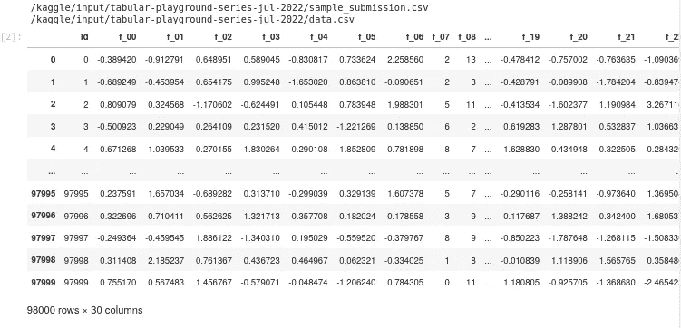
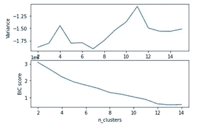
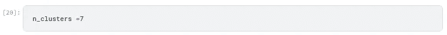
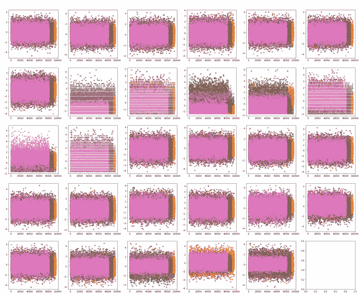
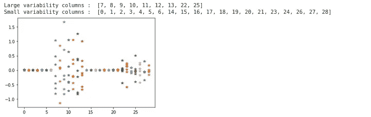
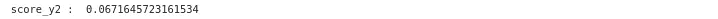

# 无人监督的掌握

> 原文：<https://medium.com/mlearning-ai/mastering-unsupervised-9df6adc35555?source=collection_archive---------11----------------------->

Kaggle 上 2022 年 7 月的新表格游乐场系列正在为 98000 x 29 大小的 X 特征矩阵估计 y_label。乍一看，我认为 kmeans 可以解决这个问题，因为根据我的经验，kmeans 是在一个大的 X 矩阵中寻找特征之间的相似性的最佳聚类方法之一。然而，这个问题更具挑战性，仅仅对 X 矩阵执行 kmeans 或高斯混合估计不会产生可靠的 y_label 来正确地对每一行进行分类。

下面是我学会的一些步骤，来尝试解决一个困难的无监督分类问题。

# 子功能

随便看看我在 Kaggle 笔记本里做的一些子功能:[https://www . ka ggle . com/code/jamilahfoucher/tabular-playground-series-July-2022/](https://www.kaggle.com/code/jamilahfoucher/tabular-playground-series-july-2022/edit/run/100273114)。

# 加载和缩放数据

# 确定集群的最佳数量

在我们对数据进行聚类之前，确定多少个聚类对于数据集的可变性是理想的是一个好主意。为了确定理想的聚类数，我们对一系列聚类值运行聚类模型(kmeans、高斯混合等)。

使用每个聚类模型的标签，我们可以根据每个数据点到其各自聚类的质心的距离，计算出几个度量来告诉我们标签是否描述了数据。这些指标包括 BIC、剪影得分或同质性得分，以及更多信息，请访问[https://sci kit-learn . org/stable/modules/clustering . html # clustering-performance-evaluation](https://scikit-learn.org/stable/modules/clustering.html#clustering-performance-evaluation)。下面我用 BIC:

理想的聚类数是方差较低或 BIC 斜率发生变化时的最大聚类数。因此，在这个例子中，对于高斯混合模型，聚类的理想数量看起来是 7。理想的群集数量可能会根据您使用的群集模型而变化。

# 确定如何选择 X 的列进行聚类

每种聚类方法都可以比其他列更好地区分/标记某些列。确定哪些列被聚类方法描述得好或不好的一种方法是绘制与每个类相关的数据。

上面，我使用高斯混合模型来创建一个使用所有数据的初始标签。在上图中，我们根据数据点的数量绘制了每列 X 数据，因此类标签用颜色表示。这是聚类数据的一个非典型的可视化，但是我们可以只在 30 个子图中可视化所有数据，而不是一列接一列地绘制来为所有 30 列创建一个 30×30 的特征图子图。检查函数 plotting_data_featurespace，查看特征空间的可视化。

如果聚类方法能够区分相似的列数据，它也应该能够区分相同的列数据，这在将 k 均值应用于时间序列信号时是常见的；因此，如果聚类是 100%完美的，每个柱形图应该有不重叠的颜色块(即:类分配)。在这个简化的图中，我们可以看到没有多少列具有分离的颜色块，因此这意味着标签没有很好地区分具有重叠颜色的列的数据。

我们可以从上面的小图中进一步看到相同的结果，它显示了每个类(y 轴)和每个列(y 轴)的 X 平均值。我们可以看到，高斯混合模型创建的 y 标签不能很好地区分列[0，1，2，3，4，5，6，14，15，16，17，18，19，20，21，23，24，26，27，28]的数据。

因此，我们需要另一个聚类模型来为这些列创建标签，或者单独对每一列进行聚类，以获得每一列的 y 标签。

同时，让我们使用高斯混合模型可以很好地区分的列([7，8，9，10，11，12，13，22，25])，看看这个标签对于这些列来说到底有多好。让我们只为这些列获取一个 ylabel，然后使用 silhoutte_score 来看看高斯混合模型在识别最容易识别的列方面有多好。

轮廓分数是从-1 到 1 的值，其中接近 1 的正分数表示密集且分离良好的聚类，负分数表示不正确的聚类；接近 0 的分数表示重叠的聚类。因此，我们的分数 0.067 意味着高斯混合模型导致重叠的聚类，即使对于最明显的列也是如此。kmeans 表现稍好，得分 0.11。

这意味着这个问题真的很难。我们可以用更多的聚类方法重新运行相同的过程，但结果可能是相似的。那么，你会怎么做？

我尝试了两个选项，稍微修改了 X 的值，使得每个类都有更明显的均值和总体聚类。使用第一个选项，我确实获得了 0.253 的改进侧影分数。

然后我开始探索集成聚类，这是一种将两个 y 标签合并成一个 y 标签的技术。不幸的是，不存在能够很好地区分困难数据的聚类方法。很多人会为相似的数据列或单个列创建标签，然后使用 2D 平均法将这些标签组合在一起。我是在下面的笔记本里找到这个方法的:[https://www . ka ggle . com/code/the desavestator/how-to-ensemble-clustering-algorithms-updated/notebook](https://www.kaggle.com/code/thedevastator/how-to-ensemble-clustering-algorithms-updated/notebook)。

2D 平均法需要大量的内存，所以我做了一个初始的批处理方法，我正在研究这个方法。

当我让它运行起来，我会让你知道我是如何解决这个问题的，或者至少发生了什么。

练习愉快！👋

 [## Mlearning.ai 提交建议

### 如何成为 Mlearning.ai 上的作家

medium.com](/mlearning-ai/mlearning-ai-submission-suggestions-b51e2b130bfb)